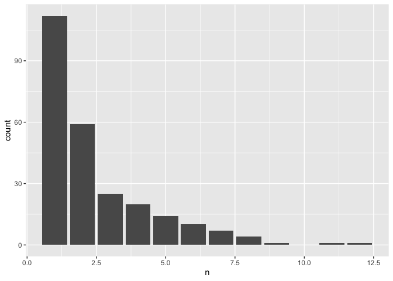
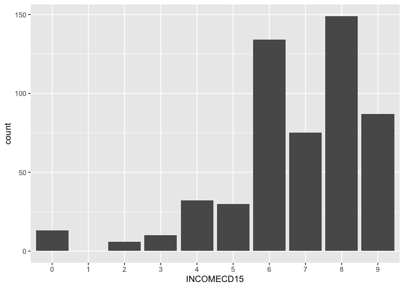
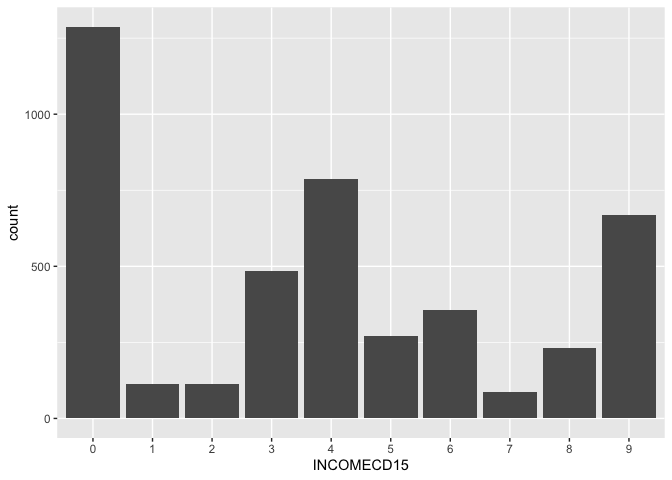

<br>

# A Clever Title About Museum Grants

#### And a descriptive subtitle

<br>

------------------------------------------------------------------------

The Institute of Museum and Library Services (IMLS) is an independent agency of the federal government on a mission to, "advance, support, and empower America's museums libraries, and related organizations through grantmaking, research, and policy development."

The IMLS maintains a list of museums in the US in a set of files called the Museum Data Files (MDF). The MDF contain basic institutional identifying information for about 30,000 museums and related organizations in the US. They are split into three files using the following categories. The MDF was last updated in 2018.

The IMLS also makes available data regarding the grants they award to these institutions for various initiatives.

Here is a summary.

-   Placeholder

-   Placeholder

-   Placeholder

------------------------------------------------------------------------

<br>

### Where the grants went over the last 10 years


<br>

How many grants did the IMLS award over the last 10 years and what was the total and average value?


```r
data %>%
  summarize(grants = n(),
            total_funds = sum(funds),
            mean_award = mean(funds)
            )
```

```
## # A tibble: 1 × 3
##   grants total_funds mean_award
##    <int>       <dbl>      <dbl>
## 1    628   101674483    161902.
```

<br>

How many different institutions won grants?


```r
data %>%
  count(institution, sort = TRUE) %>%
  summarize(institutions = n())
```

```
## # A tibble: 1 × 1
##   institutions
##          <int>
## 1          254
```

<br>

Did any institutions win multiple grants?


```r
# plot of number of grants
data %>%
  count(institution) %>%
  ggplot(aes(x = n)) +
  geom_bar()
```

<!-- -->

<br>

By IMLS program.


```r
data %>%
  group_by(program) %>%
  summarize(count = n(),
            funds = sum(funds)
            ) %>%
  arrange(-funds)
```

```
## # A tibble: 10 × 3
##    program                                                          count  funds
##    <chr>                                                            <int>  <dbl>
##  1 Museums for America                                                465 7.06e7
##  2 National Leadership Grants - Museums                                37 1.63e7
##  3 Museums Empowered: Professional Development Opportunities for M…    53 7.97e6
##  4 Inspire! Grants for Small Museums                                   46 2.14e6
##  5 Maker/STEM Education Support for 21st Century Community Learnin…     1 1.84e6
##  6 Save America's Treasures                                             8 1.19e6
##  7 Museum Grants for African American History and Culture               7 6.87e5
##  8 National Leadership Grants - Libraries                               7 3.82e5
##  9 Building a National Network of Museums and Libraries for School…     1 3.5 e5
## 10 Native American/Native Hawaiian Museum Services                      3 2.39e5
```

<br>

Total value of grants by discipline.


```r
# plot of absolute funds
data %>%
  group_by(DISCIPL) %>%
  summarize(funds = sum(funds)) %>%
  ggplot(aes(x = reorder(DISCIPL, -funds),
             y = funds,
             fill = DISCIPL
             )
         ) +
  geom_col()
```

<!-- -->

<br>

Breakdown by state.


```r
# number of grants
data %>%
  group_by(state) %>%
  summarize(grants = n(),
            total_funds = sum(funds),
            mean_award = mean(funds)
            ) %>%
  arrange(-total_funds)
```

```
## # A tibble: 49 × 4
##    state grants total_funds mean_award
##    <chr>  <int>       <dbl>      <dbl>
##  1 NY        88    19358231    219980.
##  2 IL        54    10902802    201904.
##  3 CA        51     8054269    157927.
##  4 WA        38     6640223    174743.
##  5 PA        22     4061968    184635.
##  6 TN        19     3700216    194748.
##  7 MD        26     3489221    134201.
##  8 MA        18     3366356    187020.
##  9 OH        24     3154915    131455.
## 10 CO        18     3059116    169951.
## # ℹ 39 more rows
```

<br>

Total value of grants by IRS income category. 92 (15%) awarded institutions are missing values for this variable. Those institutions are not included in the graph below.


<!-- -->


```r
# plot of count
data %>%
  filter(!is.na(INCOMECD15)) %>%
  group_by(INCOMECD15) %>%
  summarize(count = n()) %>%
  add_row(INCOMECD15 = as.factor(1),
          count = 0
          ) %>%
  ggplot(aes(x = INCOMECD15,
             y = count
             )
         ) +
  geom_col()
```

<!-- -->

<br>

------------------------------------------------------------------------

<br>

### Unpack findings from above for no grants

<br>


```r
data_not_awarded <- data_museums %>%
  full_join(data_grants, 
            by = c("COMMONNAME" = "institution"), 
            keep = TRUE,
            relationship = "many-to-many"
            ) %>%
  filter(!is.na(COMMONNAME)) %>%    # remove awarded institutions not in the museum list
  replace_na(list(year = 9999,      # replace NAs with values for analysis
                  funds = 0
                  )
             ) %>%
  mutate(awarded = if_else(funds > 0, TRUE, FALSE)) %>%
  filter(year >= 2013) %>%
  filter(awarded == FALSE)
```

<br>

How many institutions did not win an award over the last 10 years?


```r
data_not_awarded %>%
  summarize(count = n())
```

```
## # A tibble: 1 × 1
##   count
##   <int>
## 1  6726
```

<br>

By income. 2,330 (35%) institutions are missing values for this variable. Those institutions are not included in the graph below.

<!-- -->

<br>

------------------------------------------------------------------------

<br>

### Correlation to other socio-economic criteria

-   Use zip codes to compare to low-income areas (census bureau?)

<br>

------------------------------------------------------------------------

<br>

### Call to action

-   Access to museums improve outcomes

-   IMLS should direct more funding to areas that need it

-   People can donate to the least likely museums

<br>

------------------------------------------------------------------------

<br>

### Footnotes

1.  I don't know why the institutions did not receive a grant.
2.  INCOMECD15 used as benchmark for income even though it could be different before or after.

<br>

### Methodology

Placeholder.

<br>

### Sources

Placeholder.

<br>


