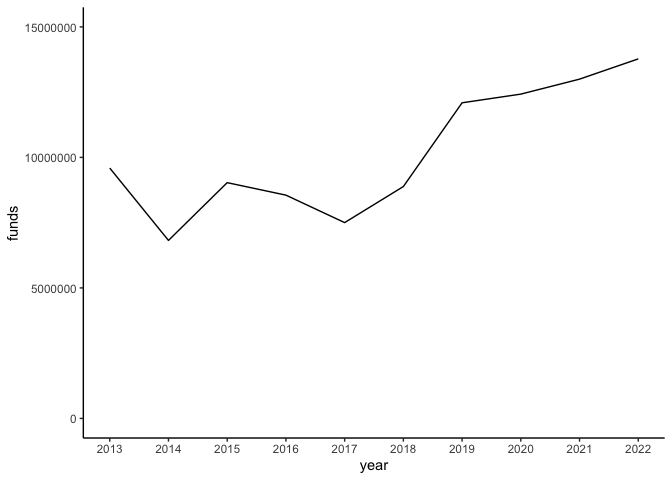
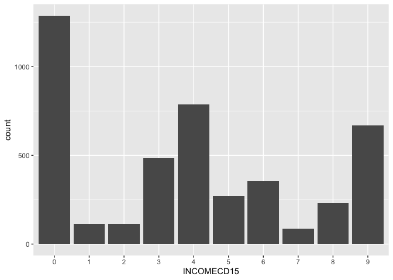

<br>

# A Clever Title About Museum Grants

#### And a descriptive subtitle

------------------------------------------------------------------------

This project was completed during a course called "Design Lab: The Industry Challenge" as part of [MICA's Data Analytics and Visualization program](https://online.mica.edu/dav/). The goal of the project is to take students through the design process from start to finish, which not only includes working with data and creating visualizations, but also iterating on the design by incorporating feedback from peers and instructors. Students were required to use data from the Urban Institute, but the topic itself was open-ended.

I chose to explore federal grants made to museums and similar institutions in the US. Partly because the data runs the gamut in terms of numerical, categorical, geospatial, etc., but mostly because I am a museum nerd. I have always enjoyed exploring new museums in new places and used this project as an opportunity to explore them from a different perspective.

Here is a quick summary of what I learned:

-   Placeholder

-   Placeholder

-   Placeholder

<br>

*Note - I'll be using the term "museum" as a catch-all for museums, art galleries, botanical gardens, arboretums, nature centers, zoos, aquariums, and the like.*

------------------------------------------------------------------------

<br>

### Museum grants over the last 10 years

The Urban Institute led me to data from the Institute of Museum and Library Services (IMLS), an independent agency of the federal government on a mission to, "advance, support, and empower America's museums, libraries, and related organizations through grantmaking, research, and policy development." The IMLS maintains a list of museums and associated information, last updated in 2018. The IMLS also makes available data regarding the grants they award to museums through various programs.

Although the grant data goes as far back as 1996 I decided to bound the time frame to the last 10 years (2013 - 2022). Over that time period the IMLS **awarded \$101,674,483 through 628 grants** to museums in the US. The amount awarded each year see-sawed from 2013 to 2018 before **rising sharply in 2019**. It continues to increase through 2022, though at a slower rate.

I'll unpack this further in the next section.

<br>


<!-- -->

------------------------------------------------------------------------

<br>

### Where did all that funding go?

The 628 grants were awarded to 254 different museums. Of those 254, 44% received one grant and the remaining 56% received multiple grants. The American Museum of Natural History in New York tops the list both in terms of number of grants received (12) and the total funding received (\$3,411,368).


<!-- -->

<br>

At the state level, museums in New York, Illinois, and California received the most funding. There weren't any museums in South Dakota or Oklahoma that were awarded grants from the IMLS.


<!-- -->

<br>

There's a clear leader when comparing funding by museum discipline. Nearly \$30 million was awarded to art museums, almost 50% more than the runner up, children's museums. Botanical gardens, zoos/aquariums, and science museums received similar amounts. History museums received the least amount of funds with \$6,201,416.


<!-- -->

<br>

------------------------------------------------------------------------

<br>

### What about in terms of income?

<br>

Total value of grants by IRS income category. 92 (15%) awarded institutions are missing values for this variable. Those institutions are not included in the graph below.


<!-- -->

<br>

------------------------------------------------------------------------

<br>

### Why did more grants go to institutions with higher incomes?

<br>


```r
data_not_awarded <- data_museums %>%
  full_join(data_grants, 
            by = c("COMMONNAME" = "institution"), 
            keep = TRUE,
            relationship = "many-to-many"
            ) %>%
  filter(!is.na(COMMONNAME)) %>%    # remove awarded institutions not in the museum list
  replace_na(list(year = 9999,      # replace NAs with values for analysis
                  funds = 0
                  )
             ) %>%
  mutate(awarded = if_else(funds > 0, TRUE, FALSE)) %>%
  filter(year >= 2013) %>%
  filter(awarded == FALSE)
```

<br>

How many institutions did not win an award over the last 10 years?


```r
data_not_awarded %>%
  summarize(count = n())
```

```
## # A tibble: 1 × 1
##   count
##   <int>
## 1  6726
```

<br>

By income. 2,330 (35%) institutions are missing values for this variable. Those institutions are not included in the graph below.


```
## # A tibble: 10 × 3
##    INCOMECD15 count awarded
##    <fct>      <int> <lgl>  
##  1 0           1287 FALSE  
##  2 1            112 FALSE  
##  3 2            113 FALSE  
##  4 3            483 FALSE  
##  5 4            787 FALSE  
##  6 5            272 FALSE  
##  7 6            356 FALSE  
##  8 7             87 FALSE  
##  9 8            230 FALSE  
## 10 9            669 FALSE
```


```r
# plot of count not awarded
data_not_awarded_count %>%
  ggplot(aes(x = INCOMECD15,
             y = count
             )
         ) +
  geom_col()
```

<!-- -->

<br>


```r
# count awarded
data_awarded_count <- data %>%
  filter(!is.na(INCOMECD15)) %>%
  group_by(institution) %>%
  slice_head() %>%
  ungroup() %>%
  group_by(INCOMECD15) %>%
  summarize(count = n()) %>%
  add_row(INCOMECD15 = as.factor(1),
          count = 0
          ) %>%
  mutate(awarded = TRUE) %>%
  arrange(INCOMECD15)

# print
data_awarded_count
```

```
## # A tibble: 10 × 3
##    INCOMECD15 count awarded
##    <fct>      <dbl> <lgl>  
##  1 0              7 TRUE   
##  2 1              0 TRUE   
##  3 2              2 TRUE   
##  4 3              3 TRUE   
##  5 4             18 TRUE   
##  6 5             22 TRUE   
##  7 6             64 TRUE   
##  8 7             30 TRUE   
##  9 8             52 TRUE   
## 10 9             20 TRUE
```


```r
# plot of count awarded
data_awarded_count %>%
  ggplot(aes(x = INCOMECD15,
             y = count
             )
         ) +
  geom_col()
```

<!-- -->

<br>

Combine awarded and not awarded in one chart.


```r
data_count <- data_awarded_count %>%
  bind_rows(data_not_awarded_count)
```


```r
data_count %>%
  ggplot(aes(x = INCOMECD15,
             y = count,
             fill = awarded
             )
         ) +
  geom_col(position = "dodge")
```

<!-- -->

```r
data_count %>%
  filter(INCOMECD15 != 0) %>%
  ggplot(aes(x = INCOMECD15,
             y = count,
             fill = awarded
             )
         ) +
  geom_col(position = "dodge")
```

<!-- -->

<br>

------------------------------------------------------------------------

<br>

### Burden of matching funds

<br>

Grants by program.


```r
data %>%
  group_by(program) %>%
  summarize(count = n(),
            total_funds = sum(funds)
            ) %>%
  arrange(-total_funds) %>%
  mutate(proportion = (total_funds / sum(total_funds))*100)
```

```
## # A tibble: 10 × 4
##    program                                          count total_funds proportion
##    <chr>                                            <int>       <dbl>      <dbl>
##  1 Museums for America                                465    70578719     69.4  
##  2 National Leadership Grants - Museums                37    16292260     16.0  
##  3 Museums Empowered: Professional Development Opp…    53     7966050      7.83 
##  4 Inspire! Grants for Small Museums                   46     2141872      2.11 
##  5 Maker/STEM Education Support for 21st Century C…     1     1843000      1.81 
##  6 Save America's Treasures                             8     1193892      1.17 
##  7 Museum Grants for African American History and …     7      687040      0.676
##  8 National Leadership Grants - Libraries               7      382216      0.376
##  9 Building a National Network of Museums and Libr…     1      350000      0.344
## 10 Native American/Native Hawaiian Museum Services      3      239434      0.235
```

<br>

-   Top 3 programs by funding represent 93% of total funds over the last 10 years

-   They require matching funds from non-federal sources

<br>

Median award by program by year, as percentage of that income category.


```r
# test with Museums for America only to start
# median grant value through Museums for America
data %>%
  filter(program == "Museums for America") %>%
  summarize(median_grant = median(funds)) 
```

```
## # A tibble: 1 × 1
##   median_grant
##          <dbl>
## 1       149967
```


```r
# create plot of income codes
income_codes <- tibble(
  code = as.factor(c(0:9)),
  low = c(0, 1, 10000, 25000, 100000, 500000, 1000000, 5000000, 10000000, 50000000),
  high = c(0, 9999, 24999, 99999, 499999, 999999, 4999999, 9999999, 49999999, 50000000)
) %>%
  mutate(mid = ((high - low)/2) + low,
         median_grant = 149967,
         ratio = mid/median_grant,
         percent = (median_grant/mid) * 100
         )

income_codes
```

```
## # A tibble: 10 × 7
##    code       low     high       mid median_grant    ratio  percent
##    <fct>    <dbl>    <dbl>     <dbl>        <dbl>    <dbl>    <dbl>
##  1 0            0        0        0        149967   0       Inf    
##  2 1            1     9999     5000        149967   0.0333 2999.   
##  3 2        10000    24999    17500.       149967   0.117   857.   
##  4 3        25000    99999    62500.       149967   0.417   240.   
##  5 4       100000   499999   300000.       149967   2.00     50.0  
##  6 5       500000   999999   750000.       149967   5.00     20.0  
##  7 6      1000000  4999999  3000000.       149967  20.0       5.00 
##  8 7      5000000  9999999  7500000.       149967  50.0       2.00 
##  9 8     10000000 49999999 30000000.       149967 200.        0.500
## 10 9     50000000 50000000 50000000        149967 333.        0.300
```


```r
income_codes %>%
  filter(code == c(0, 1, 2, 3, 4)) %>%
  ggplot(aes(x = code,
             y = mid
             )
         ) +
  geom_col() +
  geom_point(aes(x = code,
                 y = median_grant
                 )
             )
```

<!-- -->

```r
income_codes %>%
  filter(code == c(0, 1, 2, 3, 4, 5)) %>%
  ggplot(aes(x = code,
             y = mid
             )
         ) +
  geom_col() +
  geom_point(aes(x = code,
                 y = median_grant
                 )
             )
```

```
## Warning: There were 2 warnings in `filter()`.
## The first warning was:
## ℹ In argument: `code == c(0, 1, 2, 3, 4, 5)`.
## Caused by warning in `==.default`:
## ! longer object length is not a multiple of shorter object length
## ℹ Run `dplyr::last_dplyr_warnings()` to see the 1 remaining warning.
```

<!-- -->

```r
income_codes %>%
  filter(code == c(0, 1, 2, 3, 4, 5, 6)) %>%
  ggplot(aes(x = code,
             y = mid
             )
         ) +
  geom_col() +
  geom_point(aes(x = code,
                 y = median_grant
                 )
             )
```

```
## Warning: There were 2 warnings in `filter()`.
## The first warning was:
## ℹ In argument: `code == c(0, 1, 2, 3, 4, 5, 6)`.
## Caused by warning in `==.default`:
## ! longer object length is not a multiple of shorter object length
## ℹ Run `dplyr::last_dplyr_warnings()` to see the 1 remaining warning.
```

<!-- -->

```r
income_codes %>%
  ggplot(aes(x = code,
             y = mid
             )
         ) +
  geom_col() +
  geom_point(aes(x = code,
                 y = median_grant
                 )
             )
```

<!-- -->


```r
# ration of income (mid) to median grant
income_codes %>%
  ggplot(aes(x = code,
             y = ratio
             )
         ) +
  geom_col()
```

<!-- -->

<br>

------------------------------------------------------------------------

<br>

### Correlation to other socio-economic criteria

-   Use zip codes to compare to low-income areas (census bureau?)

<br>

------------------------------------------------------------------------

<br>

### Call to action

-   Access to museums improve outcomes

-   IMLS should direct more funding to areas that need it

-   People can donate to the least likely museums

<br>

------------------------------------------------------------------------

<br>

### Footnotes

1.  I don't know why the institutions did not receive a grant.
2.  INCOMECD15 used as benchmark for income even though it could be different before or after.
3.  Institutions may have received a grant in a different year than when their INCOMECD15 year

<br>

### Methodology

Placeholder.

The IMLS maintains a list of museums in the US in a set of files called the Museum Data Files (MDF). The MDF contain basic institutional identifying information for about 30,000 museums and related organizations in the US. They are split into three files using the following categories. The MDF was last updated in 2018.

The IMLS also makes available data regarding the grants they award to these institutions for various initiatives.

<br>

### Sources

Placeholder.

<br>

### To Do

-   CSS to set width of html output?
-   Link to GitHub repository
-   AK and HI in map
-   Color scale in map
-   Account for number of museums in state, discipline?


