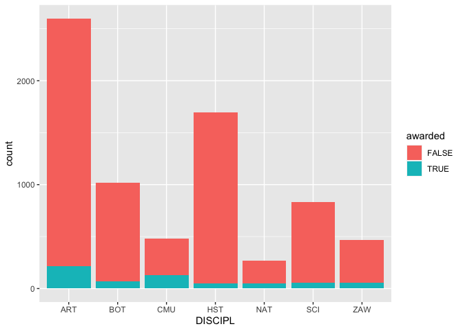
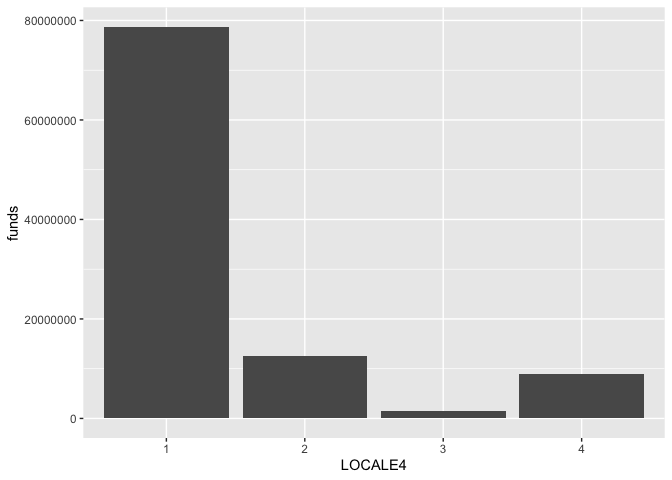
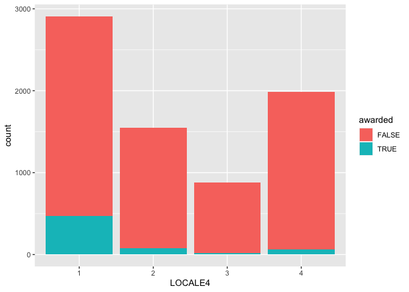
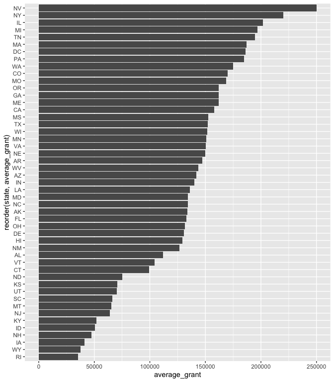
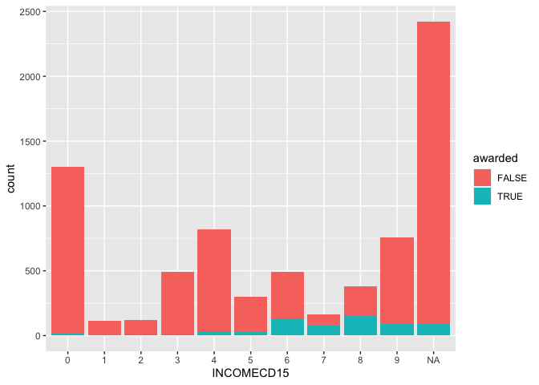
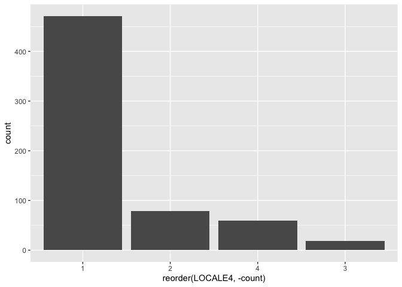
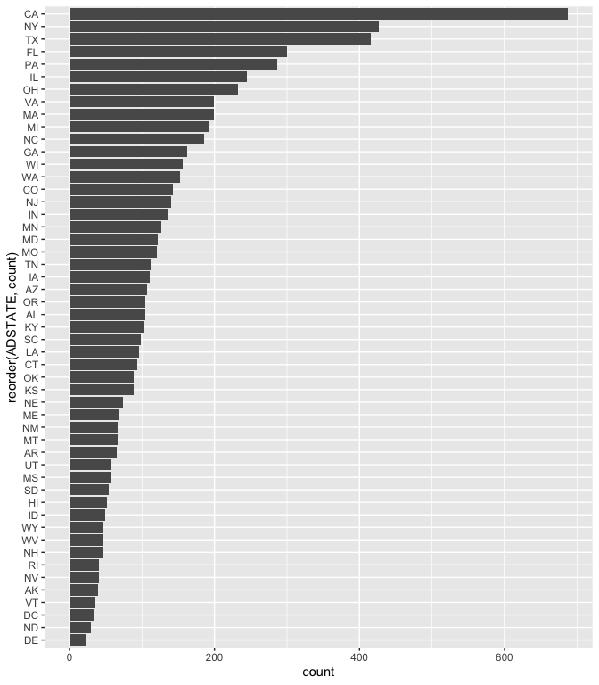
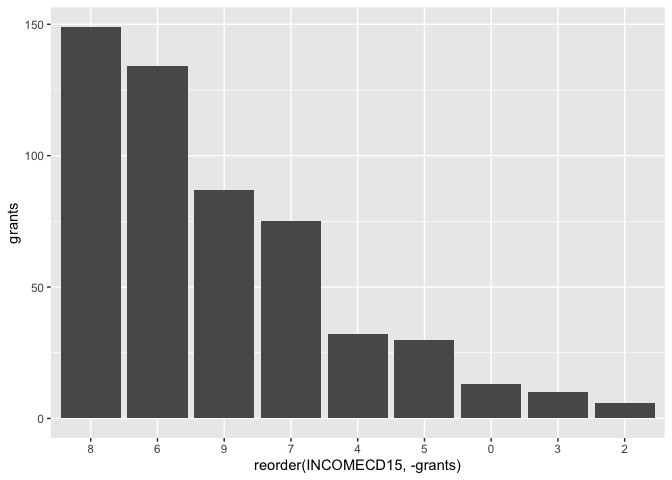

<br>

# A Clever Title About Museum Grants

#### And a descriptive subtitle

<br>

------------------------------------------------------------------------

The Institute of Museum and Library Services (IMLS) is an independent agency of the federal government on a mission to, "advance, support, and empower America's museums libraries, and related organizations through grantmaking, research, and policy development."

The IMLS maintains a list of museums in the US in a set of files called the Museum Data Files (MDF). The MDF contain basic institutional identifying information for about 30,000 museums and related organizations in the US. They are split into three files using the following categories. The MDF was last updated in 2018.

The IMLS also makes available data regarding the grants they award to these institutions for various initiatives.

Here is a summary.

-   Placeholder

-   Placeholder

-   Placeholder

------------------------------------------------------------------------

<br>

### Setup

For this project I'm going to use the following packages.


<br>

The next step is to import the data into RStudio. The first file is File 1 from the MDF that I downloaded from the IMLS website. I'm only going to use File 1 because all of the institutions are categorized as one of seven disciplines:

1.  Art Museums

2.  Arboretums, Botanical Gardens, & Nature Centers

3.  Children's Museums

4.  History Museums

5.  Natural History & Natural Science Museums

6.  Science & Technology Museums & Planetariums

7.  Zoos, Aquariums, & Wildlife Conservation

File 2 contains "uncategorized or general museums" and File 3 is "historical societies, historic preservation". The discipline variable will be another way to analyze the grant data.


<br>

The second file contains data on all grants awarded to museums by the IMLS.


<br>

In order to breakdown the grant data by multiple criteria I need to join the two files together into one dataset.


<br>

What matched?

-   Number of grants = 2,354

-   Value of grants = \$266M


<br>

What didn't match?

-   Number of grants = 8,213

-   Value of grants = \$701M


<br>

A grant may not match with an institution for several reasons:

1.  The awarded institution is not in File 1 because it's in File 2 or File 3

2.  Character strings are different (extra "the", & or and, spelling, etc)

3.  The awarded institution is not in the MDF because it was established after 2015

<br>

I suspect that #1 is the largest contributing factor. File 1 contains 7,429 entries while File 2 and 3 contain 22,742 together.

------------------------------------------------------------------------

<br>

### Where the grants went over the last 10 years


```r
# filter for institutions that received grants (includes multiples)
data_awarded <- data %>%
  filter(awarded == TRUE)
```

<br>

How many grants did the IMLS award over the last 10 years and what was the total and average value?


```r
data_awarded %>%
  summarize(grants = n(),
            total_funds = sum(funds),
            mean_award = mean(funds)
            )
```

```
## # A tibble: 1 × 3
##   grants total_funds mean_award
##    <int>       <dbl>      <dbl>
## 1    628   101674483    161902.
```

<br>

How many different institutions won grants?


```r
data_awarded %>%
  count(institution, sort = TRUE) %>%
  summarize(institutions = n())
```

```
## # A tibble: 1 × 1
##   institutions
##          <int>
## 1          254
```

<br>

Did any institutions win multiple grants?


```r
# plot of number of grants
data_awarded %>%
  count(institution) %>%
  ggplot(aes(x = n)) +
  geom_bar()
```

<!-- -->

<br>

Total value of grants by discipline.


```r
# plot of absolute funds
data_awarded %>%
  group_by(DISCIPL) %>%
  summarize(funds = sum(funds)) %>%
  ggplot(aes(x = reorder(DISCIPL, -funds),
             y = funds,
             fill = DISCIPL
             )
         ) +
  geom_col()
```

<!-- -->

<br>

Awarded vs not awarded by discipline.


```r
# plot of number of grants
data %>%
  ggplot(aes(x = DISCIPL,
             fill = awarded
             )
         ) +
  geom_bar()
```

<!-- -->

<br>

Breakdown by state.


```r
# number of grants
data_awarded %>%
  group_by(state) %>%
  summarize(grants = n(),
            total_funds = sum(funds),
            mean_award = mean(funds)
            ) %>%
  arrange(-total_funds)
```

```
## # A tibble: 49 × 4
##    state grants total_funds mean_award
##    <chr>  <int>       <dbl>      <dbl>
##  1 NY        88    19358231    219980.
##  2 IL        54    10902802    201904.
##  3 CA        51     8054269    157927.
##  4 WA        38     6640223    174743.
##  5 PA        22     4061968    184635.
##  6 TN        19     3700216    194748.
##  7 MD        26     3489221    134201.
##  8 MA        18     3366356    187020.
##  9 OH        24     3154915    131455.
## 10 CO        18     3059116    169951.
## # ℹ 39 more rows
```


<br>

Total value of grants by locale category (city, suburb, town, rural).


<!-- -->

<br>

Awarded vs not awarded by locale. 30 (0.4%) institutions are missing values for this variable. Those institutions are not included in the graph below.


```r
# plot of number of grants
data %>%
  filter(!is.na(LOCALE4)) %>%
  ggplot(aes(x = LOCALE4,
             fill = awarded
             )
         ) +
  geom_bar()
```

<!-- -->

<br>

Total value of grants by IRS income category. 92 (15%) awarded institutions are missing values for this variable. Those institutions are not included in the graph below.


<!-- -->

<br>

Awarded vs not awarded by income.


```r
# plot of number of grants
data %>%
  ggplot(aes(x = INCOMECD15,
             fill = awarded
             )
         ) +
  geom_bar()
```

<!-- -->

<br>

------------------------------------------------------------------------

<br>

### Unpack findings from above for no grants

Institutions that did not receive any grants.


```r
data_not_awarded <- data %>%
  filter(awarded == FALSE)
```

<br>

How many institutions did not win an award over the last 10 years?


```r
data_not_awarded %>%
  nrow()
```

```
## [1] 6726
```

<br>

By discipline.


<!-- -->

<br>

By state.


<!-- -->

<br>

By locale category. 30 (0.4%) institutions are missing values for this variable. Those institutions are not included in the graph below.


<!-- -->

<br>

By income. 2,330 (35%) institutions are missing values for this variable. Those institutions are not included in the graph below.


<!-- -->

<br>

------------------------------------------------------------------------

<br>

### Correlation to other socio-economic criteria

-   Use zip codes to compare to low-income areas (census bureau?)

<br>

------------------------------------------------------------------------

<br>

### Call to action

-   Access to museums improve outcomes

-   IMLS should direct more funding to areas that need it

-   People can donate to the least likely museums

<br>

------------------------------------------------------------------------

<br>

### Footnotes

1.  I don't know why the institutions did not receive a grant.

<br>

### Methodology

Placeholder.

<br>

### Sources

Placeholder.

<br>


