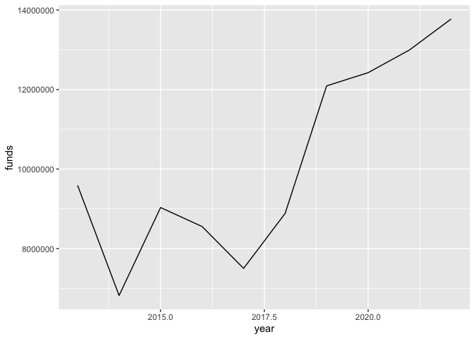
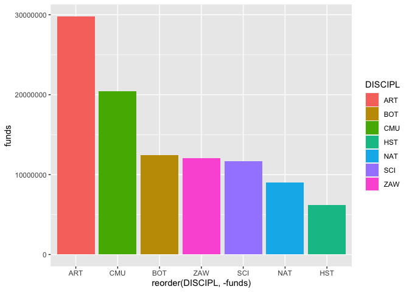
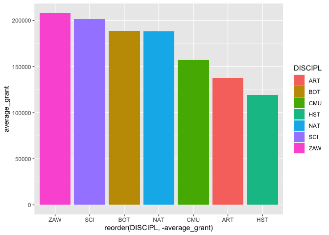
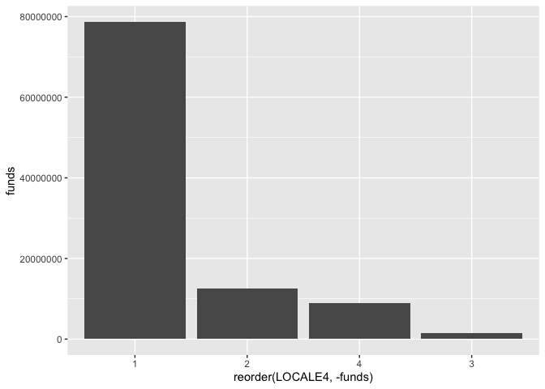
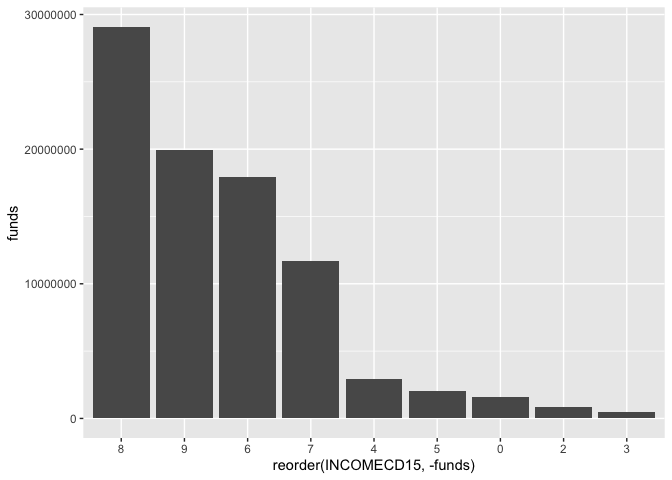
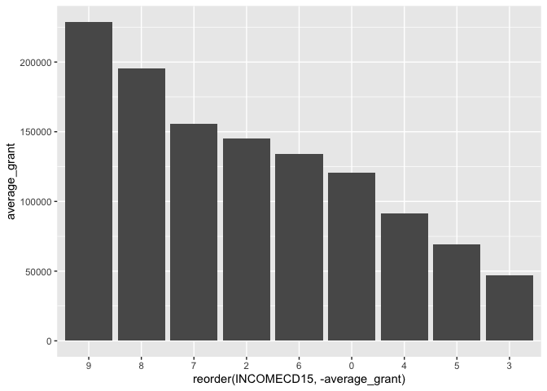
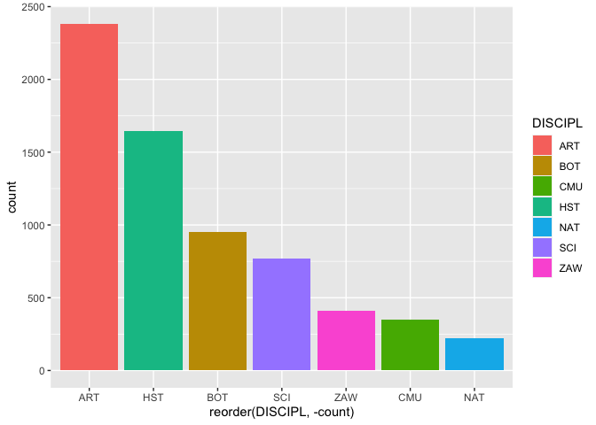
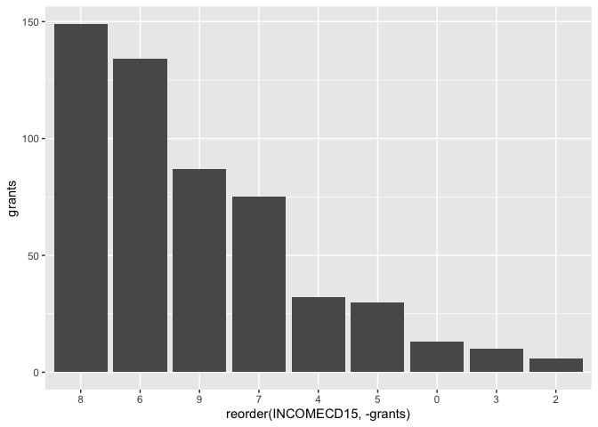

<br>

# A Clever Title About Museum Grants

#### And a descriptive subtitle

<br>

### Intro

The Institute of Museum and Library Services (IMLS) is an independent agency of the federal government on a mission to, "advance, support, and empower America's museums libraries, and related organizations through grantmaking, research, and policy development."

The IMLS maintains a list of museums in the US in a set of files called the Museum Data Files (MDF). The MDF contain basic institutional identifying information for about 30,000 museums and related organizations in the US. They are split into three files using the following categories. The MDF was last updated in 2018.

The IMLS also makes available data regarding the grants they award to these institutions for various initiatives.

### Summary

-   Placeholder

-   Placeholder

-   Placeholder

<br>

### Setup

For this project I'm going to use the following packages.


```r
library(tidyverse)
```

<br>

The next step is to import the data into RStudio. The first file is File 1 from the MDF that I downloaded from the IMLS website. I'm only going to use File 1 because all of the institutions are categorized as one of seven disciplines:

1.  Art Museums

2.  Arboretums, Botanical Gardens, & Nature Centers

3.  Children's Museums

4.  History Museums

5.  Natural History & Natural Science Museums

6.  Science & Technology Museums & Planetariums

7.  Zoos, Aquariums, & Wildlife Conservation

File 2 contains "uncategorized or general museums" and File 3 is "historical societies, historic preservation". The discipline variable will be another way to analyze the grant data.


```r
# import MDF File 1 (v2), format select columns
data_museums_raw <- read_csv("MuseumFile2018_File1_Nulls v2.csv", 
                             col_types = cols(DISCIPL = col_factor(levels = c("ART", "BOT", 
                                                                              "CMU", "HST", 
                                                                              "NAT", "SCI", 
                                                                              "ZAW")), 
                                              TAXPER15 = col_date(format = "%Y%m"),
                                              INCOMECD15 = col_factor(levels = c("0", "1", 
                                                                                 "2", "3", 
                                                                                 "4", "5", 
                                                                                 "6", "7",
                                                                                 "8", "9")),
                                              AAMREG = col_factor(levels = c("1", "2", "3",
                                                                             "4", "5", "6")),
                                              BEAREG = col_factor(levels = c("1", "2", "3",
                                                                             "4", "5", "6",
                                                                             "7", "8")),
                                              LOCALE4 = col_factor(levels = c("1", "2", "3", 
                                                                              "4"))
                                              )
                             )

# select columns to work with
data_museums <- data_museums_raw %>%
  select(COMMONNAME,
         LEGALNAME,
         ADCITY,
         ADSTATE,
         LONGITUDE,
         LATITUDE,
         DISCIPL,
         AAMREG,
         BEAREG,
         LOCALE4,
         TAXPER15,
         INCOMECD15,
         INCOME15,
         REVENUE15,
         MID
         )
```

<br>

The second file contains data on all grants awarded to museums by the IMLS.


```r
# import grant data (v2)
data_grants_raw <- read_csv("awarded-grants-2023-04-01 v2.csv")

# select columns to work with
data_grants <- data_grants_raw %>%
  select(institution,
         city,
         state,
         year,
         funds,
         `log number`
         )
```

<br>

In order to breakdown the grant data by multiple criteria I need to join the two files together into one dataset.


```r
# join requires the same case for character strings
data_museums$COMMONNAME <- tolower(data_museums$COMMONNAME)
data_grants$institution <- tolower(data_grants$institution)

# join by name
data_joined <- data_museums %>%
  full_join(data_grants, 
            by = c("COMMONNAME" = "institution"), 
            keep = TRUE,
            relationship = "many-to-many"
            )
```

<br>

What matched?


```r
data_joined %>%
  filter(!is.na(COMMONNAME),
         !is.na(funds)
         ) %>%
  group_by(institution) %>%
  summarize(grants = n(),
            funds = sum(funds)
            ) %>%
  summarise(total_grants = sum(grants),
            total_funds = sum(funds)
            )
```

```
## # A tibble: 1 × 2
##   total_grants total_funds
##          <int>       <dbl>
## 1         2354   266302369
```

<br>

-   Number of grants = 2,354

-   Value of grants = \$266M

<br>

What didn't match?


```r
data_joined %>%
  filter(is.na(COMMONNAME)) %>%
  group_by(institution) %>%
  summarize(grants = n(),
            funds = sum(funds)
            ) %>%
  summarise(total_grants = sum(grants),
            total_funds = sum(funds)
            )
```

```
## # A tibble: 1 × 2
##   total_grants total_funds
##          <int>       <dbl>
## 1         8213   700932592
```

<br>

-   Number of grants = 8,213

-   Value of grants = \$701M

<br>

A grant may not match with an institution for several reasons:

1.  The awarded institution is not in File 1 because it's in File 2 or File 3

2.  Character strings are different (extra "the", & or and, spelling, etc)

3.  The awarded institution is not in the MDF because it was established after 2015

<br>

I suspect that #1 is the largest contributing factor. File 1 contains 7,429 entries while File 2 and 3 contain 22,742 together.

<br>

### Where the grants went over the last 10 years

<br>

Institutions that received grants.


```r
data <- data_joined %>%
  filter(!is.na(COMMONNAME)) %>%    # remove awarded institutions not in the museum list
  replace_na(list(year = 9999,      # replace NAs with values for analysis
                  funds = 0
                  )
             ) %>%
  filter(year >= 2013)              # filter for last 10 years (2013-2022)

# filter for institutions that received grants
data_awarded <- data %>%
  filter(funds != 0)
```

<br>

How many grants did the IMLS award over the last 10 years?


```r
# count
data_awarded %>%
  summarize(total_count = n())
```

```
## # A tibble: 1 × 1
##   total_count
##         <int>
## 1         628
```

```r
# plot of count each year
data_awarded %>%
  group_by(year) %>%
  count() %>%
  ggplot(aes(x = year,
             y = n
             )
         ) +
  geom_line()
```

<!-- -->

<br>

What's the total value of those grants?


```r
# total
data_awarded %>%
  summarize(total = sum(funds))
```

```
## # A tibble: 1 × 1
##       total
##       <dbl>
## 1 101674483
```

```r
# plot of total by year
data_awarded %>%
  group_by(year) %>%
  summarize(funds = sum(funds)) %>%
  ggplot(aes(x = year,
             y = funds
             )
         ) +
  geom_line()
```

<!-- -->

<br>

What was the average grant amount?


```r
data_awarded %>%
  summarize(average = mean(funds))
```

```
## # A tibble: 1 × 1
##   average
##     <dbl>
## 1 161902.
```

<br>

How many different institutions won grants?


```r
data_awarded %>%
  count(institution, sort = TRUE) %>%
  summarize(institutions = n())
```

```
## # A tibble: 1 × 1
##   institutions
##          <int>
## 1          254
```

<br>

Did any institutions win multiple grants?


```r
# filter for institutions that received more than 1 grant
data_awarded %>%
  count(institution, sort = TRUE) %>%
  filter(n > 1)
```

```
## # A tibble: 142 × 2
##    institution                            n
##    <chr>                              <int>
##  1 american museum of natural history    12
##  2 denver art museum                     11
##  3 long island children's museum          9
##  4 boston children's museum               8
##  5 children's museum of indianapolis      8
##  6 morton arboretum                       8
##  7 yerba buena center for the arts        8
##  8 baltimore museum of art                7
##  9 children's museum of pittsburgh        7
## 10 lincoln park zoo                       7
## # ℹ 132 more rows
```

```r
# plot of number of grants
data_awarded %>%
  count(institution) %>%
  ggplot(aes(x = n)) +
  geom_bar()
```

<!-- -->

<br>

By discipline (total value of grants).


<!-- -->

<br>


<br>

By discipline (average grant value).


<!-- -->

<br>

By state (total value of grants).


<!-- -->

<br>


<br>

By state (average grant value).


<!-- -->

<br>

By locale category, i.e. city, suburb, town, rural (total value of grants).


<!-- -->

<br>


<br>

By locale category (average grant value).


<!-- -->

<br>

By IRS income category (total value of grants). 92 (15%) awarded institutions are missing values for this variable. Those institutions are not included in the graph below.


<!-- -->

<br>


<br>

By IRS income category (average grant value).


<!-- -->

<br>

### Unpack findings from above for no grants

Institutions that did not receive any grants.


```r
data_not_awarded <- data %>%
  filter(funds == 0)
```

<br>

How many institutions did not win an award over the last 10 years?


```r
data_not_awarded %>%
  nrow()
```

```
## [1] 6726
```

<br>

By discipline.


<!-- -->

<br>

By state.


<!-- -->

<br>

By locale category. 30 (0.4%) institutions are missing values for this variable. Those institutions are not included in the graph below.


<!-- -->

<br>

By income. 2,330 (35%) institutions are missing values for this variable. Those institutions are not included in the graph below.


<!-- -->

<br>

### Correlation to other socio-economic criteria

-   Use zip codes to compare to low-income areas (census bureau?)

<br>

### Call to action

-   Access to museums improve outcomes

-   IMLS should direct more funding to areas that need it

-   People can donate to the least likely museums

<br>

### Footnotes

1.  Placeholder

<br>

### Methodology

Placeholder.

<br>

### Sources

Placeholder.

<br>


