<br>

TESTING CONNECTION TO NEW GITHUB USERNAMER

## Intro

#### Background

The Institute of Museum and Library Services (IMLS) is an independent agency of the federal government on a mission to, "advance, support, and empower America's museums libraries, and related organizations through grantmaking, research, and policy development."

The IMLS maintains a list of museums in the US in a set of files called the Museum Data Files (MDF). The MDF contain basic institutional identifying information for about 30,000 museums and related organizations in the US. They are split into three files using the following categories. The MDF was last updated in 2018.

The IMLS also makes available data regarding the grants they award to these institutions for various initiatives.

#### Project Goal

Use data from the IMLS to explore how grants are distributed across disciplines, areas, and time.

<br>

## Analysis

For this project I'm going to use the following packages.


```r
library(tidyverse)
library(leaflet)
```

<br>

The next step is to import the data into RStudio. The first file is File 1 from the MDF that I downloaded from the IMLS website. I'm only going to use File 1 because all of the institutions are categorized as one of seven disciplines:

1.  Art Museums

2.  Arboretums, Botanical Gardens, & Nature Centers

3.  Children's Museums

4.  History Museums

5.  Natural History & Natural Science Museums

6.  Science & Technology Museums & Planetariums

7.  Zoos, Aquariums, & Wildlife Conservation

File 2 contains "uncategorized or general museums" and File 3 is "historical societies, historic preservation". The discipline variable will be another way to analyze the grant data.


```r
# import MDF File 1 (v2), format select columns
data_museums_raw <- read_csv("MuseumFile2018_File1_Nulls v2.csv", 
                             col_types = cols(DISCIPL = col_factor(levels = c("ART", "BOT", 
                                                                              "CMU", "HST", 
                                                                              "NAT", "SCI", 
                                                                              "ZAW")), 
                                              TAXPER15 = col_date(format = "%Y%m"),
                                              INCOMECD15 = col_factor(levels = c("0", "1", 
                                                                                 "2", "3", 
                                                                                 "4", "5", 
                                                                                 "6", "7",
                                                                                 "8", "9")),
                                              AAMREG = col_factor(levels = c("1", "2", "3",
                                                                             "4", "5", "6")),
                                              BEAREG = col_factor(levels = c("1", "2", "3",
                                                                             "4", "5", "6",
                                                                             "7", "8")),
                                              LOCALE4 = col_factor(levels = c("1", "2", "3", 
                                                                              "4"))
                                              )
                             )

# select columns to work with
data_museums <- data_museums_raw %>%
  select(COMMONNAME,
         LEGALNAME,
         ADCITY,
         ADSTATE,
         LONGITUDE,
         LATITUDE,
         DISCIPL,
         AAMREG,
         BEAREG,
         LOCALE4,
         TAXPER15,
         INCOMECD15,
         INCOME15,
         REVENUE15,
         MID
         )
```

<br>

The second file contains data on all grants awarded to museums by the IMLS.


```r
# import grant data (v2)
data_grants_raw <- read_csv("awarded-grants-2023-04-01 v2.csv")

# select columns to work with
data_grants <- data_grants_raw %>%
  select(institution,
         city,
         state,
         year,
         funds,
         `log number`
         )
```

<br>

In order to breakdown the grant data by multiple criteria I need to join the two files together into one dataset.


```r
# join requires the same case for character strings
data_museums$COMMONNAME <- tolower(data_museums$COMMONNAME)
data_grants$institution <- tolower(data_grants$institution)

# join by name
data_joined <- data_museums %>%
  full_join(data_grants, 
            by = c("COMMONNAME" = "institution"), 
            keep = TRUE,
            relationship = "many-to-many"
            )
```

<br>

What matched?


```r
data_joined %>%
  filter(!is.na(COMMONNAME),
         !is.na(funds)
         ) %>%
  group_by(institution) %>%
  summarize(grants = n(),
            funds = sum(funds)
            ) %>%
  summarise(total_grants = sum(grants),
            total_funds = sum(funds)
            )
```

```
## # A tibble: 1 × 2
##   total_grants total_funds
##          <int>       <dbl>
## 1         2354   266302369
```

<br>

-   Number of grants = 2,354

-   Value of grants = \$266M

<br>

What didn't match?


```r
data_joined %>%
  filter(is.na(COMMONNAME)) %>%
  group_by(institution) %>%
  summarize(grants = n(),
            funds = sum(funds)
            ) %>%
  summarise(total_grants = sum(grants),
            total_funds = sum(funds)
            )
```

```
## # A tibble: 1 × 2
##   total_grants total_funds
##          <int>       <dbl>
## 1         8213   700932592
```

<br>

-   Number of grants = 8,213

-   Value of grants = \$701M

<br>

A grant may not match with an institution for several reasons:

1.  The awarded institution is not in File 1 because it's in File 2 or File 3

2.  Character strings are different (extra "the", & or and, spelling, etc)

3.  The awarded institution is not in the MDF because it was established after 2015

<br>

I suspect that #1 is the largest contributing factor. File 1 contains 7,429 entries while File 2 and 3 contain 22,742 together.

<br>

### Part 1

Overview of institutions.


```r
# create a palette that maps museum discipline to colors
pal1 <- colorFactor(c("red", "orange", "yellow", "green3", "deepskyblue2", "blue4", "purple4"),
                   domain = c("ART", "BOT", "CMU", "HST", "NAT", "SCI", "ZAW")
                   )

# create map with common name as label and colored by discipline
leaflet(data_museums) %>%
  addProviderTiles(providers$Stamen.TonerLite, group = "Lite") %>%
  #addProviderTiles(providers$Stamen.Terrain, group = "Terrain") %>%
  #addProviderTiles(providers$Esri.WorldImagery, group = "World Imagery") %>%
  #addLayersControl(baseGroups = c("Lite", "Terrain")) %>%
  addCircleMarkers(label = ~COMMONNAME,
                   fillColor = ~pal1(DISCIPL),
                   fillOpacity = 0.6,
                   stroke = TRUE,
                   color = "black",
                   weight = 1,
                   radius = 2) #%>%
```

```{=html}
<div class="leaflet html-widget html-fill-item-overflow-hidden html-fill-item" id="htmlwidget-df82435fa71cdac8ed3f" style="width:672px;height:480px;"></div>
<script type="application/json" data-for="htmlwidget-df82435fa71cdac8ed3f">{"x":{"options":{"crs":{"crsClass":"L.CRS.EPSG3857","code":null,"proj4def":null,"projectedBounds":null,"options":{}}},"calls":[{"method":"addProviderTiles","args":["Stamen.TonerLite",null,"Lite",{"errorTileUrl":"","noWrap":false,"detectRetina":false}]},{"method":"addCircleMarkers","args":[[30.70401,32.3526,30.69234,32.49562,32.61408,34.71282,31.65737,33.68726,33.51275,33.51496,33.51634,30.4637,34.44257,31.85412,33.52206,33.40094,34.59053,34.01135,30.52517,34.7146,32.59985,34.80672,33.67461,32.38083,32.40797,34.53612,34.58039,33.57656,34.40105,33.65842,32.42108,34.75149,30.82633,33.48437,30.52659,32.41279,34.01391,30.6708,33.32452,33.73169,32.40885,32.48383,34.72003,34.67179,33.21045,33.21904,31.22382,32.11194,30.52388,31.28818,33.20964,34.02262,31.51158,33.16453,33.12964,34.89494,34.53421,34.75987,33.38533,30.69651,33.49037,31.80862,33.65842,34.20111,33.1092,34.78365,34.84045,34.66655,33.52109,34.00155,57.05064,61.58414,57.79856,61.58245,61.17925,61.21406,57.04983,61.11024,61.13325,64.84217,58.48383,58.36674,60.77,64.85079,59.24675,61.12476,64.83685,61.17925,56.80634,61.1689,61.21824,59.24675,64.84231,61.18495,61.10482,57.79263,60.56149,55.35076,60.96435,59.64585,61.23644,59.6447,33.60642,34.47137,34.61475,33.81923,32.23458,35.03033,33.44954,33.3969,31.94611,33.59475,33.39445,32.87885,32.14063,33.67597,33.52232,33.30463,32.74996,33.44847,32.26689,33.24326,34.3214,32.24872,33.57097,33.38031,35.35,33.4576,33.63833,32.13943,33.52363,35.30352,33.45768,36.90357,32.39747,33.50482,33.45481,33.46697,35.19935,35.23431,32.24472,33.46385,33.44954,34.86226,33.54994,33.45894,33.41665,32.68796,33.66642,33.446,32.32956,32.19934,34.45536,32.21839,42.6583,33.68534,33.49852,35.2153,33.52066,33.4504,34.72331,32.2277,33.47239,34.72305,33.39646,33.60679,32.22332,33.48801,33.36551,32.20889,33.83384,33.57722,33.5996,36.05442,35.06816,32.24472,36.18645,34.74343,34.51894,35.84933,35.38116,36.05874,36.38053,34.97681,36.3914,36.37252,36.36119,34.49924,34.74343,36.06396,36.11614,35.3689,35.92751,36.05613,34.74858,36.01731,35.83104,33.13675,33.95166,33.81207,34.22274,36.01667,34.70142,35.95004,35.77291,35.59093,36.43483,34.73877,34.78382,34.55149,35.43734,36.25823,33.22186,35.38803,33.66454,36.33302,35.07389,35.31944,36.25678,39.84976,34.147,37.39676,37.86917,32.73884,34.46747,39.47579,39.05024,37.32922,38.49666,37.76619,37.80232,36.96436,33.49286,38.29336,34.0193,40.5803,38.28868,37.75708,34.0053,38.53353,37.93673,38.10607,38.58468,34.12575,33.55466,32.72963,37.78897,36.61885,32.74961,38.03375,34.27915,37.93673,39.93569,37.80529,39.40855,34.19892,34.83805,38.75672,37.78602,40.59606,33.67324,32.72546,38.7975,34.04358,32.71851,37.8147,33.73502,33.98527,36.57289,34.2493,32.73842,39.25249,34.03724,38.35475,38.89358,33.79393,33.54417,36.33027,34.63705,34.10104,37.78694,34.12039,34.1693,34.17661,37.91467,32.88324,37.4686,33.87254,32.63871,33.64063,37.77025,34.27793,33.9404,34.10263,34.10672,33.16175,34.0625,39.05024,34.28093,37.42185,37.76439,34.19879,35.27968,33.78909,35.37678,34.0845,33.76105,34.03581,39.09558,37.78052,34.06221,34.63705,33.71058,34.07893,37.42546,40.8661,33.24836,40.25918,37.91655,34.14591,37.57581,33.76871,37.56667,37.59454,34.3783,38.95935,34.06402,37.85075,34.03603,34.12837,38.58872,37.6861,34.03357,38.13408,38.45793,38.93507,36.73905,34.02762,39.12866,35.35367,35.78847,34.04613,34.27176,34.09827,37.33169,37.67023,34.42304,38.40412,37.31849,34.63754,35.63546,40.79418,34.19149,33.12414,32.73706,35.13314,37.13988,38.10244,34.06217,36.32761,36.59024,32.64929,34.61673,33.79771,40.57357,33.87056,37.52349,37.78098,37.78166,38.154,33.73271,34.07605,37.80754,34.71881,37.83948,40.82447,37.99509,37.59247,33.51461,38.66072,34.09029,37.90449,35.1412,37.66225,33.02401,37.71028,37.34192,34.17728,35.62041,34.00584,33.75542,33.83443,33.53451,34.1015,33.49681,32.66043,33.23007,32.74229,33.92915,33.05722,34.04047,33.12424,33.76322,33.04871,34.15002,33.83301,34.16121,33.68353,33.19775,32.74852,33.79423,33.54508,34.27869,33.13091,32.79577,33.02851,32.73155,33.70374,33.88969,33.19852,34.01384,33.09223,33.87985,36.81226,38.54995,33.69984,34.16765,34.03988,35.35367,34.06114,32.73222,33.52751,35.62791,34.42219,33.83157,33.77594,34.15512,36.80827,39.73261,33.51168,37.04536,37.80669,40.60215,37.86346,32.97115,41.20832,34.10447,33.77105,34.05055,41.73205,33.8588,37.86264,33.66483,33.74811,37.56033,34.0017,34.01184,34.13066,38.97348,37.52782,39.79672,37.7602,34.22229,37.78133,35.13219,38.54673,37.86264,37.7869,37.82044,38.67563,38.66265,38.03375,38.73152,37.95203,39.26165,39.78748,38.22813,38.50901,37.95248,40.79418,38.36807,39.43047,37.97163,37.97677,37.92349,38.64163,40.18592,39.74535,39.5621,41.45632,38.57833,40.79658,38.75057,38.41946,37.98996,38.29099,38.63533,38.38925,37.57706,37.86264,34.68114,37.76694,37.44013,37.44461,37.34128,36.07003,37.08474,34.50695,32.79107,35.54985,36.33129,35.27883,36.33021,35.66339,35.15758,36.819,34.16096,34.40411,36.59874,35.37744,36.24394,34.9484,36.87746,37.41039,34.26633,37.65654,36.53934,34.63054,34.59612,37.7664,34.97235,37.47878,34.28596,34.198,36.72706,34.94535,37.39407,37.20793,33.70329,41.46571,37.67454,34.19444,33.85505,38.29341,38.39452,38.55575,37.08854,34.22229,34.16516,35.03226,36.85412,37.55569,34.07615,32.73889,34.17245,34.04783,34.05706,34.35259,37.7592,37.96905,37.78647,36.80791,37.58631,36.77075,37.80358,36.76785,36.59728,36.1386,37.97446,37.77959,37.96346,38.13791,38.24731,38.15648,40.78357,36.61784,36.20477,37.35885,37.71917,36.85908,38.13365,36.97421,38.05322,37.37074,38.68071,39.22028,38.93507,37.33117,37.32674,37.78617,37.80679,39.3248,37.89114,37.51236,37.53033,38.6863,37.58492,37.71391,37.68499,38.25646,38.53353,38.54673,37.78516,37.92394,37.89361,38.22471,40.17379,37.35598,39.75328,37.89822,34.14777,34.44036,34.12692,34.14581,34.45916,34.11601,34.42258,32.73152,32.84463,33.34283,33.98188,32.84681,33.9443,34.41919,34.4456,32.71851,34.40111,34.02078,34.42166,33.70092,34.05287,34.15266,32.72963,33.02302,32.71049,35.4981,33.72033,34.18178,34.08575,34.14914,34.06119,33.60312,34.28494,34.14999,34.14752,34.05392,34.02698,33.67026,34.05888,34.69819,34.20514,33.71086,34.02602,34.0616,34.08223,38.67483,34.11179,33.89,34.23395,34.14593,34.10052,33.33733,34.06907,34.13547,33.96454,34.09411,34.2011,33.98505,33.78456,34.15725,37.57643,38.62565,null,null,33.62761,37.78799,38.05782,33.7701,41.75292,36.42564,36.44243,34.12941,39.05529,40.48223,37.16935,40.71339,38.27992,40.3965,39.59876,39.2473,39.75226,39.60621,38.41728,38.74216,40.5922,40.2534,39.74588,38.26704,38.47276,39.74588,39.73968,39.71204,39.73735,38.53166,39.04926,38.48729,38.85759,39.54162,40.58606,40.48625,40.58763,39.67006,40.61858,37.27262,38.83079,38.23885,38.82981,39.00573,39.71497,39.69928,38.83241,39.77099,39.70666,39.74437,39.69703,39.50498,40.39267,38.15626,39.07831,37.986,39.63516,38.43887,39.74122,38.85256,37.57631,39.15153,38.84539,38.78306,38.79763,39.73082,37.29711,39.74739,39.08399,39.0809,39.02745,39.74899,38.26035,38.44768,40.01478,37.16858,39.5929,39.66889,37.24695,39.73149,39.72096,38.28094,37.93857,38.84406,40.02254,39.63941,38.70501,39.72325,39.20773,37.47833,39.58232,37.27596,38.84952,38.46721,39.73715,39.74233,39.84336,38.2633,38.13949,39.99832,40.51521,39.71455,38.44545,39.75692,38.79763,39.18833,38.90294,39.73566,39.79931,39.20773,38.55138,39.73616,40.58529,38.82691,39.65024,40.41146,39.72879,38.07,38.27085,39.70984,39.63606,37.47287,40.36381,41.31748,41.38054,42.57524,41.76549,41.66994,41.53782,41.36106,39.95966,41.71975,41.76333,41.76744,41.7557,41.21432,41.37209,41.76198,41.38827,41.28207,41.10084,41.58298,41.71095,41.38063,41.34408,41.8144,41.398,41.66497,41.56803,41.25991,41.22304,41.63578,41.57512,41.92113,41.76443,41.7545,41.35167,41.35384,41.27647,41.13262,41.32219,41.26376,41.02895,41.53873,41.62385,41.2071,41.83967,41.10954,41.20738,41.30845,41.02879,41.73001,41.9094,41.1986,41.95533,41.96515,41.86742,41.38327,41.69444,41.13569,41.37209,41.11051,41.14617,41.64916,41.31232,41.12361,41.78332,39.73644,39.20946,39.75044,39.05966,38.75443,38.91273,39.765,39.80972,39.79635,39.17966,39.75201,39.66025,38.70799,38.73362,39.57422,38.72441,38.90105,38.90747,38.90212,38.91517,38.90477,38.91286,38.89007,38.89616,38.88862,38.89923,38.89803,38.90647,38.8921,38.90038,38.88879,38.92154,33.75703,38.92551,38.89294,38.91199,38.90807,38.81183,28.58519,25.78344,30.15533,26.14096,26.14198,27.52012,42.52395,25.66559,26.84516,29.28958,28.42466,28.5722,26.42779,25.74723,30.20687,30.43901,25.80933,27.38624,29.63774,26.89165,34.00607,29.03773,30.39655,27.95541,27.77116,28.59954,27.19251,25.83103,28.38444,28.59628,30.51745,26.11346,30.43344,24.55793,30.34642,25.64838,26.21907,30.29281,26.16754,30.32484,26.71423,28.74335,25.66061,26.83825,24.55616,30.34513,26.03146,27.90391,28.34178,26.11867,30.28579,25.65755,26.02713,26.62178,26.06061,30.33327,27.83883,28.33047,27.30383,28.54184,26.31108,26.04092,30.33503,26.93717,27.35564,30.24339,28.69,26.37838,25.75063,27.24476,28.35995,26.13242,27.63925,28.35781,29.88685,30.33263,26.52718,30.4564,27.26984,25.75975,26.9263,28.9152,30.28711,30.41596,28.93971,30.16209,27.33406,25.76071,29.99483,27.85765,26.70047,30.31953,25.67294,30.32899,27.3443,30.40831,30.41008,27.79237,28.57269,26.67044,27.7743,24.55924,28.40695,29.20347,28.03695,30.40223,30.50506,28.59954,26.12004,29.60962,27.98781,25.662,28.06469,27.32837,27.64969,30.66756,26.69758,27.94976,27.77189,26.36736,25.79641,28.55577,25.76846,25.88882,27.97964,30.31544,24.55817,27.54684,28.81038,26.70586,25.78334,30.19496,27.41795,30.32484,27.94976,28.01763,29.56225,29.14076,29.61297,27.94344,26.69856,25.61324,29.65161,27.77344,28.38447,30.43344,27.77071,28.04421,28.85268,28.06223,27.45306,29.19423,27.56983,29.18606,28.85292,30.41653,27.97517,27.98731,29.66477,29.59125,29.88685,30.28694,30.54505,28.24639,30.18222,29.88551,27.94344,27.84521,28.57048,30.40113,27.86429,27.91822,28.99849,28.12283,26.10973,24.5587,26.35116,26.11961,25.75138,25.62127,26.35487,33.39181,25.76497,27.04073,27.63526,24.57469,25.76801,25.66964,26.6333,26.51835,26.44796,26.75978,25.71118,26.65587,26.80841,26.318,26.10833,26.69644,25.44842,27.32478,26.26488,26.68363,25.75574,25.94352,25.79312,27.4849,26.03438,27.19407,25.81227,28.67994,30.18475,29.88999,29.47232,30.43911,30.37946,27.18311,27.75569,28.9301,25.70145,28.29169,26.91944,26.2687,32.00537,32.07544,32.02212,34.17333,32.49251,32.42455,33.80997,33.94467,31.87331,32.84129,33.94761,33.77846,33.77441,33.75217,32.46632,31.6172,32.45908,34.11881,31.34823,34.16706,34.20187,31.17245,33.64003,33.48033,33.43827,33.95031,33.22482,33.54922,33.02124,33.5912,34.01148,33.94189,34.45636,34.88371,34.07224,34.50803,33.76238,33.78586,33.47687,33.40825,32.07021,33.87716,33.0513,33.80328,33.59763,34.77026,33.67489,32.07849,33.7897,32.07544,32.86531,33.94195,33.08233,31.95826,33.77253,31.23495,null,33.78354,31.79823,32.21127,33.96395,34.30259,33.77005,33.9508,32.07242,34.25217,33.73967,33.901,33.76265,34.01518,33.78998,34.0191,33.60233,30.83391,33.59377,33.46606,31.46579,31.57219,30.83888,30.72218,33.92577,32.48402,33.80997,33.04533,31.45013,34.0235,33.52562,33.73144,32.072,33.74796,33.95529,32.53973,34.02096,33.52373,33.47514,33.03864,31.58572,33.47873,33.91806,33.61095,34.28951,null,33.85166,34.3809,34.00237,33.98975,21.25683,19.64957,21.30855,21.31314,21.29468,21.34362,21.27157,20.88735,21.38633,21.33176,20.90564,21.31607,19.51256,22.19746,21.90815,20.80474,19.96542,21.29414,21.97065,21.30476,19.81229,20.77161,20.86921,21.30516,21.29361,19.61633,21.99504,19.72664,20.89242,20.02157,21.44466,21.34364,19.45632,22.20519,21.3824,20.01923,20.86977,21.31272,21.33324,20.02251,19.44303,20.84189,46.37643,42.61165,43.55746,47.97153,46.36771,43.73656,47.67405,43.6056,43.63148,43.48919,43.82185,43.61027,42.61165,47.50633,43.60236,42.32251,42.83565,43.72566,43.6893,43.60972,47.50633,47.50633,43.63203,47.77481,43.60847,43.58486,43.6893,43.60215,45.15527,42.05452,39.79038,41.24556,42.38621,40.73274,39.48679,39.80178,38.12034,42.49113,41.83885,41.9312,42.2441,38.32551,39.1088,42.0602,41.79969,41.49902,41.88456,41.58842,42.03341,41.90955,38.56912,41.32908,41.88869,41.85791,41.89199,41.88438,37.73094,41.85158,41.47317,42.41725,41.52732,41.78877,41.63302,37.62397,39.83075,42.41179,39.75547,40.85526,38.90344,41.89586,41.82453,42.143,41.5068,38.51354,41.74496,41.89685,41.82796,38.09466,41.9087,39.12146,37.72977,42.30735,40.8796,41.85203,42.33019,37.97218,39.00267,41.79395,41.85487,41.50066,41.89756,41.80239,41.86475,41.78279,42.27686,41.85158,41.71759,41.86113,41.80406,41.95666,41.95469,42.04134,42.27749,41.44578,41.47432,41.50887,41.77859,42.04747,41.65706,42.10032,41.51114,41.89575,41.90904,41.99875,41.75913,42.0587,41.72598,41.92175,42.31793,41.93109,42.2848,42.27958,41.89762,41.79267,42.30976,38.95094,42.32543,39.78887,41.90711,38.34084,42.28888,41.52899,41.88819,42.34563,41.64042,42.04559,41.70669,41.88416,41.85103,42.26319,42.24955,41.89685,41.86488,40.02977,40.74136,40.48119,39.82843,40.44686,39.84152,40.11868,40.50939,37.72856,37.76233,38.96753,38.073,39.698,37.96995,40.12982,40.94677,38.84464,40.72148,41.90382,38.8039,38.35592,39.85262,38.29405,38.89405,41.84341,39.80924,39.93015,40.1273,40.05427,41.88188,41.87928,38.95747,39.61098,40.47089,41.96326,42.29742,38.66863,41.50384,41.98917,38.96091,38.89405,39.54853,41.67684,41.92365,40.07623,39.49177,41.81391,40.75382,41.39276,41.878,42.16446,42.03481,41.88335,41.53614,39.82297,42.02609,40.35872,40.12666,38.81692,42.14194,41.60681,39.16435,36.36119,39.97831,37.97198,41.34953,40.4172,41.07619,40.88498,39.77369,41.33501,41.6945,41.52651,37.95949,39.98359,40.75749,39.45565,40.41242,41.67201,40.45474,41.72757,39.77209,41.7001,40.41577,37.9416,38.44349,39.95376,41.68355,40.76741,39.46639,40.75053,39.90687,41.71833,41.67548,39.82828,39.81017,37.96585,41.08084,39.83885,39.76705,39.46615,41.67136,40.19012,40.66695,40.03383,38.67154,41.21868,40.78497,38.2865,40.13947,41.62733,38.97982,40.10878,39.77369,41.4314,41.43501,39.20269,38.35216,41.59129,40.11547,39.3641,41.43901,39.20162,38.22755,38.413,38.72315,37.94484,39.48582,41.67268,41.60651,40.78869,38.02636,39.65307,40.43654,41.49002,39.75335,39.31761,39.16855,39.82746,37.99215,39.6401,41.10484,39.82545,39.17137,41.33873,38.07355,41.38042,41.46098,39.12991,39.80216,37.98359,41.70825,42.49835,41.53097,41.00741,41.82048,42.52887,42.50242,40.98911,42.56528,42.03688,41.86795,41.60892,41.96744,42.49277,43.4718,41.36306,43.3382,41.54821,43.1366,41.01717,41.08456,41.69592,43.24745,41.62021,42.47419,41.58602,41.97845,42.51534,42.78858,43.39011,41.84087,42.5094,40.39729,42.46721,42.50034,42.08057,41.59106,42.31812,43.40272,42.41643,41.5809,41.57751,41.69974,42.42861,41.41852,42.76688,41.69101,41.72987,42.53038,40.85256,42.35718,42.10637,42.79885,43.00848,43.06613,42.50594,43.1499,42.71902,41.95041,41.52006,42.49638,41.48202,41.55261,41.58668,41.41447,39.37818,37.67478,37.93936,37.71558,38.3669,37.7377,39.12776,37.69454,39.57499,37.83923,39.46412,37.64089,38.88382,37.34041,38.53559,39.0513,38.58517,39.17654,37.52417,38.63545,39.29695,37.68491,37.75279,37.22549,37.68274,38.56795,37.17315,39.19094,37.97696,38.83822,38.94013,37.04449,39.11661,38.36954,37.70625,38.93896,39.81831,39.31728,38.97774,37.68201,37.63252,39.17922,39.07354,39.07007,38.8262,38.00158,37.69417,39.13175,38.61431,38.06501,37.68787,37.067,37.71558,37.6927,39.82348,39.24953,38.08655,38.8807,38.3669,37.0872,38.60218,37.76251,37.04146,37.1262,37.68545,38.04782,36.86519,38.18242,37.98788,37.80069,38.4292,38.88887,37.91552,38.15265,38.48821,37.1294,37.64611,37.47769,38.97479,37.98593,36.71141,38.04747,38.01935,37.08671,37.16359,38.21628,37.95135,36.87296,36.60711,37.77639,37.23316,39.04403,37.7674,38.20355,38.25727,38.02764,38.47843,37.69514,36.94517,38.25727,38.21792,37.89219,38.04905,38.09837,38.04726,37.70473,39.0821,37.16646,37.57406,38.04571,37.24854,37.78755,36.92346,37.77379,38.20989,37.08769,38.04747,36.90749,38.41728,38.25747,38.34163,38.20852,37.33406,38.40255,36.95356,36.62433,36.64596,32.147,31.76118,29.97627,30.22631,30.55797,29.44371,29.92716,32.51877,30.23708,29.93631,29.69484,31.31239,32.79009,30.22631,30.78778,29.61938,30.45094,30.29209,29.94073,30.46635,30.375,30.93301,30.55779,32.55579,30.2253,43.36387,30.10102,30.44706,30.21313,31.31203,32.49023,39.10264,29.94845,32.77937,32.46644,30.34989,31.13536,30.22994,30.82205,30.02581,29.94359,31.00872,29.69064,32.5295,29.95179,32.50507,32.68124,32.48144,30.86286,29.94383,30.53625,29.8322,31.30925,30.99672,29.90843,29.76235,29.96647,30.21325,29.96485,30.4395,30.0199,30.22143,30.42544,32.25729,null,30.23732,30.24397,43.72487,43.66294,44.3924,43.38684,43.36023,44.65151,44.52091,44.17673,46.12558,43.65418,44.96411,44.10305,44.28417,43.90994,43.65256,44.29418,44.29846,44.09328,44.47613,44.31005,43.89818,43.44949,46.68335,44.41439,43.82667,43.98559,44.9837,43.23336,43.15514,44.49866,46.86824,44.54022,43.76873,44.06949,44.80583,43.65408,44.42123,44.29738,44.39878,44.00837,45.71606,43.90378,44.21529,43.66057,44.4254,43.6555,44.82979,43.6527,39.29588,38.78897,39.41397,39.33105,39.68224,39.05959,38.84575,39.30543,39.28029,39.20784,39.49689,40.01565,39.4955,38.20583,38.70799,39.48526,39.59336,38.24872,39.34951,39.08496,39.30753,38.58454,39.69567,39.6475,39.64067,39.28042,39.33245,38.88552,38.81455,38.36412,39.45422,38.33873,38.9519,39.27278,39.15759,39.15172,39.59429,39.55143,38.93192,38.68444,39.53969,39.28577,39.70431,38.82277,39.29126,39.34028,39.28861,38.96812,38.96882,39.37022,39.48681,39.64339,38.06852,39.00062,39.517,39.27193,39.01729,39.33282,39.49666,39.30787,39.28883,39.28754,39.32637,39.30699,38.77229,39.09425,38.91074,39.05952,38.98681,39.32949,39.43318,39.34842,39.2866,39.49651,39.29214,38.71811,42.64506,42.61443,42.52141,42.24103,41.74524,42.16367,42.35665,42.0564,42.36138,42.33819,42.30417,42.29299,42.0673,42.28099,42.37631,42.15139,39.04963,42.6874,42.2731,42.42857,42.33832,42.35561,42.37315,42.58606,42.35236,42.33809,42.34339,42.26483,42.50244,42.12788,41.75368,42.4596,42.64161,42.10162,42.43456,42.33809,42.45044,42.31646,41.73359,41.68483,42.46386,41.62694,42.30836,41.63036,42.85085,42.26176,41.54252,42.70469,42.3029,41.58974,42.59349,41.63523,42.4818,42.04629,41.78224,42.59067,42.53753,42.11175,41.63518,42.44705,41.74537,42.55801,42.11013,42.18715,41.99696,42.64526,41.65128,42.72877,42.4187,42.21262,42.0501,42.20079,42.46669,42.321,41.70264,42.23904,42.12048,42.58613,41.94439,42.35844,41.70615,42.58709,41.63409,42.08482,42.28934,41.93053,42.37387,42.64074,41.39602,41.65169,42.80613,42.41551,42.80434,41.65176,41.96733,42.21799,42.07667,42.33485,41.93495,42.18071,42.47105,42.3575,42.35839,42.37727,41.70401,41.52063,41.62774,42.37043,42.35806,42.41513,41.92138,42.35361,42.27358,41.943,42.24336,41.83939,42.78318,42.43958,42.65102,42.18412,41.29218,42.15396,42.12418,42.23172,42.8126,46.42107,42.9297,42.27476,42.36145,42.63782,39.88292,43.23032,43.59908,42.36478,42.10248,42.99334,43.02548,43.20184,42.24589,41.82726,43.0639,42.59111,27.92612,42.10675,42.35792,42.29465,42.7326,42.2795,45.31717,42.29185,43.59726,42.34863,42.56796,45.11994,43.25039,42.18298,43.01416,45.70376,41.93106,43.95568,45.06238,43.42418,42.35861,42.30016,43.23328,42.96611,42.28958,47.16045,43.60019,42.97184,42.73386,42.93177,42.33721,43.0202,43.31942,42.71928,45.23182,42.73246,42.96163,42.28222,42.36139,46.5408,43.014,42.98074,42.5051,44.61929,42.07016,42.33528,43.02101,42.91083,42.37575,42.31924,45.16279,42.29984,42.10903,43.22787,46.49713,43.21134,46.54082,44.02383,42.35207,45.14699,47.0029,42.69169,42.96332,42.51271,44.2505,42.27276,43.40561,42.51068,42.33433,43.66436,43.23417,47.11535,44.77569,42.24589,43.62518,42.38979,43.41961,42.74872,44.77023,43.17862,42.81979,42.43002,42.69571,42.59418,42.3388,42.88791,42.34685,42.33013,42.4754,42.97046,43.01754,41.94821,42.41663,43.835,42.59244,42.2853,41.90352,42.24644,41.93596,44.8314,42.49713,45.74258,42.77554,43.02902,42.69169,42.48542,42.71182,41.86972,43.03817,44.76394,44.96746,42.52434,42.58059,42.3006,42.94292,42.72629,42.53706,42.9771,42.15239,42.84905,42.71435,44.15686,44.9715,44.76247,45.27295,47.47172,44.16147,44.97603,47.71874,46.14475,44.96673,43.5609,46.12603,43.64514,44.9123,43.56531,45.14183,45.27295,44.81296,45.57073,45.00991,44.96693,44.94343,46.75876,44.94645,43.9968,44.96002,46.36036,46.91897,44.94798,43.76743,44.68817,44.52044,44.2246,44.31342,45.00705,44.98334,46.78005,44.57938,43.65522,43.8278,45.97723,46.3468,44.61414,44.22323,45.0176,47.23038,46.53326,44.92858,46.59538,45.07467,43.72058,44.89584,44.94772,45.9769,45.50863,44.99789,43.78386,46.87717,44.0492,45.55214,44.87549,44.94511,44.9623,44.04946,44.90245,44.90348,44.95292,47.92081,46.8736,46.12603,44.97687,44.89093,43.7599,45.16854,44.43549,44.28799,46.83711,45.19098,47.37972,44.97603,31.33018,32.84377,34.93315,32.33127,32.36349,32.30356,31.33437,34.73101,32.36505,34.92833,33.58674,30.3932,31.07431,32.36765,32.29781,30.40254,33.38697,31.25586,33.50576,30.4113,32.35319,34.77153,31.6954,31.30627,32.32334,32.32954,31.31353,30.38279,31.32456,30.39294,32.33448,32.32866,31.45414,34.76324,30.33763,31.33018,38.63354,39.114,38.02888,37.1055,36.76024,38.65006,37.10459,38.51472,38.63968,37.5006,36.61435,38.98541,37.13777,38.85143,39.7724,37.25182,37.64374,37.61638,37.92174,39.03593,38.59734,39.10009,38.6453,37.30759,38.6354,38.91121,38.64603,38.61666,38.62894,38.52119,38.63485,38.81472,39.70158,36.58631,38.53902,38.64046,39.08292,38.64281,37.18898,38.86283,36.75566,38.6876,37.20851,39.08666,39.4495,39.23511,38.63885,38.57872,38.62268,37.69748,36.61239,39.08345,38.59366,37.19374,39.03662,37.08859,39.38613,39.1008,37.71262,29.72635,37.07077,39.0838,37.20952,37.30844,38.51483,39.23648,38.55159,38.49695,39.71236,47.50425,46.86938,45.32059,48.45301,48.0542,48.3226,48.0542,45.67669,45.19877,48.50548,47.66168,47.10499,45.21849,45.47109,46.12497,46.64311,46.88769,46.87129,46.41742,48.06262,45.20871,45.20871,45.66182,46.88107,45.70115,48.19535,47.0652,48.63881,46.85935,45.73198,46.88769,48.50622,45.85103,47.68005,46.85649,45.67362,45.68591,46.27894,46.59755,46.59085,48.50613,46.92362,46.87254,45.47109,47.45238,48.55633,46.75412,47.50996,46.01153,45.78532,47.50442,47.9215,45.74178,40.81652,42.1295,40.71339,41.13469,40.90223,41.25708,41.54254,40.57874,41.25383,41.14915,40.67623,40.86534,40.76735,41.25328,40.69922,41.25263,41.26074,41.2247,40.80113,41.25483,41.01541,41.11713,40.79194,41.25263,41.78281,40.81505,41.82166,41.83033,42.29282,41.13561,41.34343,40.86702,41.12976,41.45569,42.8248,42.46619,40.58542,41.17881,41.19531,40.79903,40.58542,40.66956,39.54822,40.55061,36.15369,36.14215,36.12299,36.03021,36.04804,39.52446,36.16949,36.04712,39.57274,39.49692,39.46488,36.14541,35.97801,39.26506,39.52801,35.47005,39.16911,36.17992,36.19122,39.62545,36.22246,36.09066,36.16933,39.52088,39.25251,36.15115,39.53517,39.24321,39.52247,43.20387,42.88091,43.65441,42.19036,42.99179,43.19505,43.59716,43.27119,43.2246,43.03438,42.8776,43.07876,43.5475,42.97722,43.34952,43.36756,42.98112,44.04403,42.93237,43.07913,43.21463,42.98971,43.28404,43.12528,44.22046,43.53284,42.99229,42.71574,43.95041,40.11442,40.8394,40.96264,40.49887,40.96397,40.34675,39.35879,40.56128,39.94336,40.67999,40.3187,40.65089,40.86523,40.62928,40.11867,40.85594,40.68587,40.3904,40.15838,40.92203,40.81798,40.63651,40.87046,40.26259,40.81462,40.70271,40.93488,39.36131,40.49581,40.78188,40.57617,40.37972,40.74042,40.75209,39.46479,40.93149,41.0802,39.4962,40.58932,40.97428,39.37279,40.56187,40.20961,40.93405,39.91194,40.5681,40.88485,40.62177,39.36336,39.63723,40.83455,40.9603,40.08091,40.5535,40.85211,40.7162,40.723,41.11728,40.15838,39.2714,40.75997,40.72648,40.36655,40.73687,40.41024,40.05842,38.96579,39.05553,40.20323,40.73963,41.05808,39.48611,40.68952,39.383,39.94336,41.0929,39.70775,39.5658,40.74295,39.94477,39.88785,40.71176,39.82017,40.8727,40.74296,40.34989,36.41081,33.39705,35.50566,35.08289,35.68806,32.31215,32.41926,35.88086,35.05286,35.68724,32.72562,36.40702,35.10709,35.08473,36.70627,36.82291,36.727,32.42158,35.47031,35.08465,35.1414,35.25569,32.95299,35.87916,36.40603,35.6887,35.08481,32.83992,36.74523,35.67394,32.90342,35.66393,32.31151,35.16557,33.39392,35.68166,33.40826,34.9768,32.31735,35.68906,35.09745,32.94283,36.74523,35.69049,35.08514,33.34867,35.09717,31.86537,35.68089,36.8973,35.87916,43.02204,40.88371,42.84779,40.6782,40.76752,40.71818,43.2096,40.87212,42.90745,40.73756,40.66148,40.86615,40.71254,40.64468,40.77316,43.04512,43.44585,41.92692,42.99396,40.97794,40.7756,40.74605,40.7344,42.73034,40.5965,47.67977,40.78309,42.72633,43.22633,42.79218,40.72885,41.33302,41.92727,40.87013,41.19285,40.97352,42.69936,40.86579,42.85712,43.13168,40.7226,42.59349,42.7001,40.61451,43.3558,42.908,42.87756,40.65585,40.762,40.70868,40.97534,42.44114,40.58776,40.72851,40.75965,44.6828,40.94521,40.61577,40.75142,40.91335,40.67158,40.99822,40.9019,40.76853,40.74716,40.76861,40.74669,40.93492,43.08462,40.58343,40.7041,40.67442,40.86538,40.83491,40.66674,40.80967,40.93947,40.7283,40.73047,40.9205,40.71177,40.72547,40.98111,41.04462,40.6311,40.91847,40.62424,40.94538,40.75274,40.86317,40.72833,40.67622,40.77781,40.67686,40.63271,40.87541,40.81155,41.9208,42.14044,40.77121,40.77862,40.74661,40.86306,40.73946,41.18314,40.95001,40.83101,40.72204,44.69861,40.76275,41.2188,40.70671,40.71491,40.71878,40.72743,41.44039,40.76092,40.74926,41.10116,40.93231,41.11283,40.80991,40.66886,40.71944,41.04106,40.61022,40.70571,40.7062,40.78144,40.64105,40.74735,40.73466,41.29361,40.62576,42.70411,41.2628,40.79224,40.77949,40.85944,40.9002,40.74871,42.65686,41.34429,42.67829,41.43132,41.46024,42.82802,41.85131,41.44261,43.08181,43.0831,41.52831,43.31,41.5255,42.94383,42.81529,41.85592,42.83207,42.63865,43.40767,42.78038,42.77927,43.09727,42.46633,42.70031,43.04437,43.24683,43.153,42.09068,43.19812,43.08852,42.99396,43.10425,44.23987,43.28799,43.91754,44.24056,42.52395,42.48557,42.96999,42.92016,42.3004,42.75989,43.09422,42.07899,43.24894,42.93521,43.15325,42.73936,42.8859,43.04855,42.7669,42.87896,42.89938,43.328,42.88551,42.91038,43.21823,42.04186,42.37286,42.11385,44.15542,42.93322,44.93012,42.06026,42.95164,42.07547,42.44607,42.66183,40.85619,44.10444,42.70252,44.75712,43.02409,42.2604,40.85001,40.74282,41.93059,40.72833,42.32795,40.7525,42.59349,40.71184,40.759,42.66083,40.51453,42.10044,42.19748,42.94501,44.23805,42.15253,42.44989,42.86037,42.6993,42.07865,42.6547,41.98751,41.70604,40.69712,42.98025,42.91721,40.7317,43.04133,42.89675,41.16571,40.72774,40.76968,41.44458,42.40684,40.74496,40.64468,40.74731,40.75602,42.8908,43.06392,40.98804,40.82454,42.63431,43.04868,41.07057,42.92932,40.89118,43.09933,42.83586,42.60596,44.01342,43.03334,41.67122,40.67306,42.73297,42.16072,42.07829,41.61449,42.88982,42.32703,43.05307,41.23943,40.86769,40.63274,40.73765,42.07786,42.96918,40.71441,42.09637,41.42113,44.69694,43.0056,43.44585,40.78011,40.94447,40.88919,42.44986,40.73858,41.03456,40.59961,40.95421,40.76713,41.26985,40.63062,43.46168,40.72317,43.04714,40.64468,40.67919,43.12044,40.86114,40.72795,44.69524,42.72667,42.96479,43.1788,42.89399,42.69695,41.43263,42.56772,40.82145,42.14044,40.97462,42.93196,35.14685,35.59838,36.29955,35.6814,36.18725,35.95663,35.66512,35.78221,35.93003,35.36478,35.58577,36.21728,35.79118,35.05305,36.49649,35.35444,35.61216,35.40634,34.81205,35.74285,36.14064,35.96073,35.56545,35.36228,34.24111,35.67064,35.91121,35.58577,36.05709,35.7882,34.65736,35.3699,35.50758,36.13062,34.76162,36.1735,36.06627,35.51894,35.80416,35.07607,36.08043,35.94921,35.08808,35.69191,36.07113,35.40162,35.22885,35.66837,36.07522,35.60715,36.07725,34.18336,36.13141,36.02867,35.82223,35.07596,36.15963,35.73561,35.3187,35.73561,35.78031,36.2146,35.777,35.59388,35.80993,35.9033,35.23913,34.24161,35.59493,35.69191,36.1736,35.71871,35.30627,35.055,35.17028,35.58034,35.54598,35.47536,35.22816,35.53162,36.39689,35.77672,35.61625,35.22981,36.07497,35.31743,35.36319,34.23275,34.99587,35.15874,35.95369,35.83134,35.62198,36.09255,35.50113,35.22475,35.99029,35.66883,35.59493,35.22444,35.48387,35.69024,35.38347,34.31869,34.31905,35.69729,35.5988,36.11693,35.23077,36.50167,35.77766,35.65029,35.08704,35.09059,35.70485,36.33847,35.88267,35.53744,35.3645,47.26498,46.26415,48.24517,39.95112,46.80868,48.2118,46.89428,46.84438,46.87868,48.2357,48.23271,46.90509,46.80616,48.77057,47.8975,46.91556,47.89207,46.82521,46.87868,46.28169,48.23733,46.37462,46.264,41.69253,41.50736,39.75637,39.76217,41.66919,40.57157,39.95872,41.48352,41.10077,39.12146,40.64999,40.74687,40.87645,39.96089,40.90506,41.8738,38.76721,40.90086,41.10485,39.93173,41.09895,39.95672,41.66128,41.08168,39.33747,39.20839,39.10207,41.03016,39.71114,41.03712,38.81672,41.18085,39.32436,40.12906,40.06649,41.66919,40.61847,41.11149,41.90118,41.89768,40.04048,40.76117,41.45496,39.87523,39.76302,39.7658,39.1088,39.78851,39.10264,39.65526,40.00875,39.97889,38.74847,39.48424,41.51354,39.45094,38.73431,39.51405,39.85712,40.64987,40.16385,40.10119,38.73697,40.17669,39.86076,41.50736,39.41724,39.09532,39.74283,39.76154,41.65409,40.03631,39.96326,39.75049,39.09765,39.37719,40.1,40.03976,39.33419,39.08485,39.71406,39.14338,38.81375,39.1379,39.63638,39.55893,39.28318,39.93063,39.96435,39.97826,40.16385,39.98544,39.92949,39.51777,40.09307,39.71524,39.13086,39.7134,41.50964,41.51274,40.80723,41.61551,41.08477,41.29619,40.65145,41.23687,41.50905,41.50305,40.55859,40.7033,41.64807,41.036,40.91742,40.67784,41.25315,41.48523,40.91425,40.18118,41.12555,41.46416,41.50375,40.7998,40.78224,40.15836,41.6153,41.3282,41.38045,41.33457,41.02885,41.65876,41.60394,40.75841,41.88767,41.43597,41.34846,41.29674,41.50521,41.65457,40.8125,40.80723,40.79752,39.12854,39.188,41.42059,41.05308,41.75547,39.80213,39.90479,39.93038,39.76036,39.62348,40.3755,41.39091,41.2161,39.4959,39.80597,39.2481,39.72136,39.87137,36.7517,36.58285,36.11373,36.16105,36.10592,35.12183,36.09302,35.75091,35.23321,36.07285,36.15006,35.84747,42.77399,35.87712,38.88862,35.19427,34.95277,35.65349,36.38712,41.93052,35.48749,36.10314,36.10874,34.73174,33.13848,36.16718,36.11879,36.15931,35.52497,null,35.61401,36.89707,35.43999,35.87217,34.51894,35.46952,35.8485,36.42605,35.60916,36.79912,35.41179,36.74764,35.48681,36.82932,36.1299,33.93646,35.76139,36.08218,36.18636,36.73202,36.74892,35.31855,35.54666,36.58284,35.73672,35.46675,34.61613,35.52592,36.85193,34.27152,36.20611,35.49839,36.1317,35.62331,34.17559,null,40.06871,null,36.12495,43.82618,42.19481,45.52667,45.50699,44.78659,44.0432,44.93409,42.19844,42.75373,45.52436,45.88985,42.21935,45.42473,45.42397,42.14246,43.80909,42.09631,45.44823,44.00879,42.19036,45.52738,45.39245,45.48571,45.04966,45.52738,45.52501,44.78133,44.62084,44.93692,45.52667,43.21349,44.76281,45.44201,45.59954,43.37427,42.43952,44.6369,45.52181,45.70966,44.04627,45.47446,44.92424,45.51426,44.61825,42.37668,44.05065,45.55931,44.94526,45.04966,44.52231,44.42318,45.21118,44.93768,45.91456,44.56116,44.98908,45.20876,45.67038,42.23448,45.57333,42.22229,45.29776,42.22957,42.3275,45.52738,45.51426,45.32871,45.5278,44.59337,44.0074,44.93409,45.52577,45.51413,43.36713,45.45716,44.92881,45.5293,45.51951,43.9869,44.9452,40.11312,40.66895,40.60337,40.44427,41.93018,40.48485,41.85156,39.95267,41.9058,40.54356,40.34209,40.32776,40.18837,40.44454,40.04718,40.03788,40.04221,41.65669,40.21951,40.44482,39.81205,40.05178,40.24084,40.186,40.45258,43.04749,40.91278,40.21173,40.33368,39.81205,40.98378,40.28028,40.81404,40.36458,40.65868,40.44846,40.02628,41.52592,41.68385,41.40914,40.46971,40.13717,40.35387,40.2832,39.73904,40.43186,41.62749,40.20937,40.04854,40.12639,40.20291,39.96472,39.95775,40.64039,39.93344,40.604,39.90953,40.08485,40.08066,40.04125,40.21361,41.04192,40.70474,40.25782,39.97953,40.26122,40.03972,40.99351,39.91885,40.38003,40.02335,39.97162,40.99782,40.56819,41.24896,40.09384,39.95271,40.30824,40.83145,40.35704,40.33359,40.06208,40.49628,39.99168,40.60653,39.97821,40.05088,41.13369,40.58044,40.33766,41.20144,40.86361,40.48604,42.12692,40.23417,40.30388,40.63699,40.02004,40.67375,40.86772,40.33726,40.12383,40.13949,41.63688,41.32908,39.95035,39.86859,40.31601,39.89534,40.06778,41.95005,40.62271,41.40064,40.30586,42.1313,41.43328,40.45686,40.4827,40.77558,40.46611,40.44446,40.73872,40.90794,40.9061,41.84967,40.50847,40.44659,40.26519,42.13174,41.39776,40.86221,40.62307,40.53841,40.28446,39.78545,40.34054,40.4429,40.45623,40.27138,40.54546,40.94446,40.45247,42.09619,41.70591,40.86867,41.51704,40.34483,40.79221,39.96729,40.44371,41.77318,40.20203,40.62372,40.20744,40.36451,41.90287,40.03868,40.02327,39.94726,40.1709,40.31109,41.80924,40.03135,41.7296,39.85647,40.50004,40.37048,39.98031,39.91775,40.03947,40.97629,40.41553,40.99963,39.95065,42.05972,40.33554,40.12257,40.81918,40.25392,40.64137,41.39284,40.6503,41.78636,41.48493,41.60041,41.77481,41.48579,41.43862,41.48964,41.69886,41.81683,41.51812,41.47459,41.83134,41.67119,41.48362,41.78636,41.67151,41.37971,41.45049,41.36233,41.59012,41.66346,41.51706,41.69122,41.80903,41.49924,33.01603,32.82076,34.85029,34.18714,35.06719,34.00607,34.31353,32.12741,32.15061,36.08442,34.20708,33.92852,32.23903,34.18423,32.37761,34.00288,35.01204,35.02531,34.76459,34.16257,34.04994,33.55027,34.97201,33.45378,32.8897,32.77633,34.8426,33.92354,33.70882,33.01971,32.79578,34.01113,33.70717,32.14562,34.22027,34.37522,34.99489,34.00607,32.78965,34.85523,33.3662,34.92965,33.55707,32.78945,34.00586,34.19249,33.38378,33.84167,33.19316,34.76467,34.87231,34.34577,33.56641,34.76443,33.2215,44.34766,33.592,44.34766,44.28261,44.31048,44.90497,44.30912,43.54443,43.51473,43.87614,44.37462,44.37257,44.07937,45.34302,44.37185,42.78263,44.41207,43.42518,43.71349,45.01149,45.66005,43.93275,43.4038,44.88692,43.53912,43.50647,43.96485,35.68856,35.97689,36.01082,36.50845,36.29656,36.5263,36.38592,36.02512,35.12365,36.18109,36.15732,35.04289,35.07231,36.16334,35.99683,35.10751,36.13398,35.15132,36.49203,35.91721,35.13927,35.6148,36.11983,36.16061,36.06285,35.04768,36.03569,35.7593,35.83605,36.16601,35.05407,36.29962,35.03499,35.09263,35.13441,35.05586,35.94361,35.3612,35.73565,36.1424,35.05554,36.08609,35.96169,35.0547,35.10679,36.00225,35.12363,35.19067,35.8382,36.31629,35.6723,35.12565,35.05258,36.09227,36.02512,36.07988,35.05323,35.81987,35.15419,36.3067,36.37463,36.00889,35.1161,35.61594,36.22032,36.02887,34.99544,35.67836,36.27168,35.98172,35.14238,35.0999,35.65299,35.95593,35.08793,36.02171,36.06086,32.75469,30.09302,40.75102,28.02462,29.68873,30.31254,33.75555,32.77874,32.75571,32.78534,28.05359,31.84791,33.16739,29.75547,34.97991,32.54601,33.58554,33.90925,32.46532,29.19995,32.7682,27.55112,30.28527,30.31302,29.73191,29.61773,32.33056,29.70184,32.25009,35.56545,32.73411,30.07369,29.58057,29.21553,29.73547,29.71991,32.78079,30.32098,32.7794,31.10255,32.78773,31.46137,32.72579,28.41303,29.42457,30.31302,29.48161,32.87186,31.79593,30.26993,32.78782,29.73346,29.02523,32.72333,29.69581,32.44941,26.21664,26.07797,31.45019,32.91206,31.75912,29.34466,30.91863,27.69348,32.73854,32.75427,29.22026,29.75531,29.72802,28.81614,33.21671,31.33933,31.15696,35.18921,26.30262,33.98564,32.49478,29.72762,27.80856,27.80951,32.82404,31.77576,32.73697,31.34285,33.86952,33.8903,32.79596,28.02462,30.12924,33.1824,33.6605,29.45235,35.91079,31.55322,32.79123,29.6509,35.19591,32.49488,29.52845,30.64304,25.91489,30.48834,33.69556,29.72465,32.4504,30.55165,29.72934,31.32537,32.4895,32.91108,32.99806,30.08278,33.35272,32.7938,32.70414,29.68007,29.72762,30.01426,29.75288,32.22905,32.93162,32.44325,32.51557,30.25601,34.36793,29.72298,28.26927,29.34466,32.92464,35.6383,32.45531,32.69422,29.41111,32.7677,32.7581,32.72877,30.72464,29.72682,29.72605,29.48454,31.56874,30.92129,30.29224,31.4175,25.91169,29.76795,29.71037,31.59409,29.04296,31.43485,30.09007,29.42377,29.69738,29.45163,30.03902,31.75691,29.85204,30.03063,30.64486,30.2709,29.72313,29.45772,26.16993,27.65216,30.26507,29.34702,30.26955,26.15797,29.40994,30.29623,28.81638,29.65941,31.93443,29.64464,29.68794,30.16747,30.26328,29.70387,30.9499,29.45258,29.42722,31.7526,30.298,26.10975,29.4383,30.64619,29.87895,30.63689,31.99529,30.04575,28.8197,30.40088,29.54014,29.88227,30.22393,29.87988,31.75942,32.78286,30.9505,28.83824,30.59706,29.9056,31.81684,30.15656,26.21462,30.74053,26.09484,29.09213,31.67853,30.51821,30.07141,28.80608,30.71968,31.13135,30.08359,29.54703,30.66467,29.5807,29.72152,33.4522,32.78733,32.74531,35.19746,32.72524,32.74834,32.74951,32.4402,32.38449,32.75846,33.15618,32.25821,35.84352,32.84822,32.80036,33.63462,32.78988,31.88159,32.77926,31.45701,36.2258,32.3597,35.91321,31.58234,33.57343,32.7798,32.91872,33.52834,31.37565,32.84169,32.77919,32.22905,32.787,32.99443,35.10748,32.36781,32.2136,32.34769,32.72886,35.23512,32.23802,32.57756,32.84152,33.65074,32.94764,33.10579,32.93969,32.18168,35.19636,31.84715,33.19665,32.4434,32.44329,32.77883,32.44992,33.03191,32.22849,32.80945,32.78912,31.72319,32.87794,32.37886,33.58623,31.99879,29.78459,30.92193,32.74177,32.97471,33.01007,32.86618,33.65394,35.32051,32.33435,32.78963,31.97085,29.75544,30.31908,29.29928,29.26904,30.08314,29.16946,29.70505,29.75716,29.71147,29.64801,30.3538,29.77288,29.7459,29.70549,29.59294,30.16755,30.17673,29.77125,30.39728,35.23594,29.58979,29.43363,32.96184,33.14914,28.06296,31.12559,29.62547,30.60669,29.78459,26.19985,33.21915,27.8039,32.58978,26.30132,29.77122,32.60643,30.18639,29.30963,33.91185,30.05076,29.88397,30.10399,32.03486,32.71278,30.38504,30.31258,30.27969,40.74803,39.15172,37.12165,41.24459,37.07658,40.51152,40.49983,40.26032,37.17648,37.68841,38.57923,40.45574,40.26903,37.1068,40.76547,41.16138,39.00172,39.3563,40.42447,40.23379,40.75182,40.77009,39.6276,40.16098,41.18927,41.22649,39.3589,37.61353,40.70474,40.53151,40.75888,37.10109,40.76725,40.98568,40.38851,38.55332,43.63108,44.25686,42.84189,42.84896,44.41884,44.42053,42.88239,43.4761,44.50028,44.3596,43.649,44.47672,42.88716,43.17123,44.37218,42.84979,44.19703,44.81097,43.70412,43.42303,44.80401,42.9491,44.43443,44.00526,44.28483,42.88601,38.07302,37.58108,37.56222,37.11805,39.18442,38.45516,37.25842,36.90704,39.13902,37.23181,38.29928,38.45195,38.80913,36.8353,37.14625,38.81209,37.93123,38.32634,38.80587,37.31611,37.40424,38.83809,38.83082,37.83002,36.62237,37.15692,36.58423,36.58137,37.56143,38.03019,38.88212,37.29542,38.01935,36.55108,37.21312,37.59807,38.92015,38.7586,38.90326,38.15032,38.91637,37.54559,39.04571,37.92708,38.17254,38.19966,38.85017,37.27008,38.63122,36.72391,38.14959,38.7586,38.96752,38.47222,36.85635,38.80587,38.77216,37.0556,38.94717,36.82088,36.75437,37.12863,38.48406,37.3339,36.80227,37.54732,36.68542,37.53228,37.54184,38.80503,37.76995,37.27721,38.7999,37.58508,37.33057,37.10108,36.92394,36.70544,38.03084,39.11434,37.81883,37.03288,37.23873,38.30335,38.80393,37.02448,37.02243,36.68837,38.95774,39.18715,36.72538,37.77401,38.4465,37.46184,39.182,37.41606,37.54364,37.6045,37.41945,36.58515,38.81278,38.74558,39.18378,37.5309,37.29058,38.78004,39.16419,38.12423,37.36692,39.01561,38.86142,37.05337,37.15758,37.53441,38.07279,38.04306,37.93528,37.62133,36.83541,36.59705,37.02647,37.55547,37.27252,39.16419,37.27467,37.07273,37.71518,37.03211,36.87425,38.75305,38.76463,38.96366,38.04091,37.77811,37.93334,38.82889,37.49775,38.92807,47.60689,47.65701,47.74346,47.12243,46.67308,47.70248,47.27465,47.57596,47.8144,47.09865,47.33817,46.26521,47.24929,46.27473,48.97315,47.77143,47.55467,46.23505,47.70341,47.65497,48.10529,47.54079,47.59835,47.47804,47.62496,47.63558,45.71769,47.63918,48.70315,45.86226,45.83622,47.76403,45.90298,48.08412,48.75055,46.05252,45.937,46.7518,46.29277,45.67897,47.60689,47.60682,47.24721,47.62007,47.44727,48.53453,47.42992,47.67739,47.62199,47.61008,47.97581,47.10093,48.94349,48.39122,47.60755,48.1058,47.6547,48.70181,47.93835,47.62002,48.53181,47.04774,46.99481,46.99563,47.82348,48.17164,46.37637,48.08326,47.64956,47.24229,47.54784,45.60942,47.53256,46.65057,48.53801,48.75125,47.01284,46.56903,46.8288,47.85964,46.68358,48.46125,47.55116,48.2423,48.05728,48.15606,47.65652,47.6847,47.6148,47.97932,47.67977,47.67164,46.5867,47.1727,47.70805,45.68898,48.74951,45.91031,47.55361,47.97775,48.0803,47.60692,46.84397,48.51056,47.42393,47.79856,47.24268,47.55881,47.65897,38.9249,38.39236,40.05958,33.18505,40.0775,39.62767,40.51764,38.92351,37.67391,38.77129,39.45848,38.39675,39.26707,39.26963,39.46144,38.35766,38.40135,39.03084,39.20968,39.62991,39.2919,40.05978,40.0685,37.97397,39.28154,39.31627,37.42415,38.23105,45.69154,44.14984,43.53964,45.91705,44.17053,44.099,43.30298,43.07464,42.87816,43.32059,43.03557,42.50384,43.49644,45.72041,43.0328,42.74099,44.26414,43.74439,44.558,44.91031,42.98659,43.38758,44.96227,45.88342,43.03877,43.87824,46.83859,45.82445,43.0524,43.6413,42.5447,44.49639,42.55646,42.19869,42.59626,44.03455,43.04109,44.18223,43.42257,44.01518,45.39612,43.30076,44.38778,43.57455,44.86489,46.83859,43.04074,43.07705,44.01518,43.46884,44.53132,44.80661,44.65595,43.29424,42.49113,45.87071,43.31235,43.01533,44.51641,43.39185,43.05803,44.93715,44.2619,46.67223,43.75449,44.27632,42.67012,42.94381,43.03461,43.70145,44.52349,42.93017,43.81096,45.46516,44.6654,42.71107,44.9974,44.65976,44.81147,43.08727,44.27632,43.06187,44.80661,46.21971,46.5656,44.08075,43.31235,44.67585,43.79158,43.13633,44.95828,44.36348,43.03493,44.52917,44.7631,43.2202,44.50154,42.58716,43.19263,44.39073,42.76442,43.43139,45.06986,45.50044,45.91705,42.5406,42.83541,41.32062,44.90526,41.59456,42.87706,44.36955,41.15247,44.54756,42.85998,42.84649,44.51498,43.48108,43.60374,43.03274,41.3155,41.3155,43.47019,41.24838,44.52602,43.76437,41.79114,42.84739,41.15938,44.01673,44.51975,42.58763,41.1301,42.83552,43.03511,41.1335,41.15247,42.83464,42.84121,43.76437,43.89575,41.20686,41.31161,43.51389,null,39.77675,null,34.0657,34.65448,34.05814,34.24765,37.24983,38.98299,36.34224,35.70203,null,34.60241,43.82945,null,38.88588,24.55639,29.27632,null,31.96012,43.05403,45.0683,30.19973,34.25741,34.08909,21.34929,20.76367,36.73732,21.30403,41.85131,25.81389,45.63068,null,28.61168,19.6999,38.75376,19.72749,37.04079,36.9664,32.73533,34.60386,37.41289,39.00827,37.92534,36.06662,null,41.38276,48.12071,33.66694,34.24765,38.41822,26.05139,null,46.33183,40.76148,43.36387,42.19953,25.96058,40.82118,32.57564,33.23207,36.84897,41.627,43.34062,44.60577,44.05566,38.58819,40.70949,38.2691,37.81972,33.78703,39.60785,42.41224,40.07645,31.75643,42.20571,40.78584,32.21985,37.37937,39.1088,38.30615,32.06764,35.41039,34.93934,35.20018,34.72861,42.26176,40.82319,41.38507,34.61721,38.90341,33.19573,33.74677,29.29916,27.94976,34.19892,35.31604,34.25809,33.41696,39.02338,41.56153,39.28805,41.80173,33.72607,30.50446,48.23239,35.01072,41.67511,47.65911,34.41968,31.99321,34.12184,44.66975,45.51611,41.39915,30.40918,40.73968,32.34246,38.98769,39.11312,33.12421,36.96815,34.94507,42.5419,34.13906,41.14764,41.31473,34.55139,26.1122,34.73402,34.06372,39.94852,39.94323,41.51966,60.20885,35.07827,31.28675,29.28751,37.80032,32.24639,29.95018,30.55779,28.22969,39.88698,41.6277,39.09195,43.693,33.50945,28.82221,40.76707,35.48153,41.83258,43.4471,39.14387,41.44318,41.13275,41.8776,39.75134,37.15917,28.38311,31.7675,31.37259,40.13178,42.09799,25.91462,39.80505,34.84592,44.7537,39.72943,29.76457,38.04708,43.49365,31.33018,32.31899,40.09421,41.86668,39.00557,39.19585,29.64282,40.29709,39.75245,41.015,41.92271,26.70803,34.7473,32.44993,34.15075,44.62343,37.99567,27.3337,38.55537,41.37369,40.57715,39.09066,33.96286,34.69692,35.91945,35.63555,37.75329,26.666,39.97509,33.44922,40.74317,42.77553,33.71618,35.71282,41.86202,43.03404,null,32.73784,37.73122,35.61361,39.82843,32.96617,39.08279,28.40739,29.46206,32.76104,40.77712,36.11031,38.92913,43.74336,29.88362,32.87306,28.01083,27.81475,32.78322,38.38679,39.30699,28.38311,39.825,39.05564,41.78467,40.7697,36.8789,42.7356,21.26559,42.47039,39.74526,40.87237,43.11461,43.60914,25.59718,40.28775,42.7356,42.59638,36.14487,27.98207,42.2301,31.27931,33.50142,38.89755,43.62601,29.64282,36.37326,36.00845,39.41172,41.70818,33.42431,37.74298,33.61787,28.38393,28.38444,37.97135,31.44196,40.19774,42.34683,36.50128,34.08957,43.03902,32.84349,40.84983,43.60363,42.35195,42.59349,41.37656,35.87916,33.76984,43.81682,44.02617,26.0769,42.27709,37.77025,34.23609,41.81669,40.0395,43.24818,30.21571,33.69121,30.44072,37.72093,36.71597,43.01831,33.46435,39.10907,38.35766,34.68163,37.99536,32.89634,32.45908,35.59646,39.60867,41.68973,42.13464,39.03333,42.82051,36.05725,40.35298,33.808,40.19015,33.77367,39.74739,42.25286,40.05747,33.99681,42.27686,36.18474,33.77105,34.26004,34.19625,33.44833,36.82247,28.5722,34.01916,41.2578,36.14896,43.98213,40.4435,37.67822,37.67822,41.71566,44.47672,36.27142,39.70775,40.85923,41.87125,42.09369,33.79637,42.24689,42.25286,36.30446,37.96548,37.68903,46.59755,36.16908,32.27707,35.07205,39.74526,40.36031,32.23796,32.24969,47.87711,32.74382,37.87019,42.2966,46.64636,42.36977,40.79792,41.50401,39.65347,37.32268,39.73428,41.42252,43.3146,40.5253,46.7244,39.75202,38.41646,43.07094,39.93674,33.08097,32.42818,34.16787,36.85329,27.79004,37.66053,36.1312,42.47419,30.69034,30.6959,48.55634,39.78629,42.32575,37.32384,27.48209,33.60997,37.46944,42.36977,42.36977,44.62345,39.5103,32.71851,42.73289,37.2714,38.99159,34.86943,40.95408,40.87257,40.87257,34.1261,33.50339,38.8808,40.50989,26.64082,35.72371,19.70849,39.76713,33.89388,44.02888,40.73012,30.44706,33.26851,39.63105,40.59943,39.83944,33.79791,30.35905,39.19029,46.7244,42.20247,38.42535,41.50401,38.22043,40.05441,38.06501,42.26692,39.5103,41.1536,29.67445,43.54468,31.91459,42.0053,39.95298,37.39046,43.07298,41.82923,46.72607,32.30705,37.87426,37.86701,38.94356,38.03595,41.30957,37.36891,36.97755,30.5237,26.8869,40.91749,36.97755,29.97449,32.5298,41.43739,35.11788,38.47148,44.80072,41.2578,43.07473,41.28036,38.8964,41.80094,43.24616,46.80808,34.01391,35.62984,31.10381,44.8022,43.224,30.67674,30.67674,40.80456,40.997,33.51539,40.80975,36.13413,35.09022,42.7356,34.10841,43.04769,39.67635,42.8128,47.65893,38.05323,40.26546,35.92893,40.79678,28.05434,44.05466,34.04304,42.27491,29.19732,37.34945,37.13846,33.69121,44.0764,37.23237,38.95699,35.09022,42.46814,37.87426,42.25286,39.74027,40.03751,34.01811,36.84737,35.26008,34.06498,35.0977,43.14547,36.84976,34.532,40.04391,39.03231,44.8022,36.88605,40.00336,44.03317,41.18815,37.77481,34.14745,25.74745,43.85601,40.79792,40.68945,44.4745,38.42444,40.36031,46.86313,35.12365,33.88697,34.07336,41.58098,42.75022,39.08412,30.13665,39.64309,40.68267,40.22001,43.17128,40.57157,39.94998,38.90293,33.23889,43.07477,44.52357,39.93674,40.57557,33.63071,41.53193,37.13846,40.81652,34.12561,32.92191,41.66303,33.40455,39.97995,33.97149,43.02226,43.15293,42.96647,34.95768,34.84603,38.76739,37.32407,null,40.26032,45.71595,38.62817,30.69339,36.77025,44.48518,34.01916,38.45518,35.25421,30.17918,41.58269,42.48694,44.05645,44.94343,37.25844,40.39102,32.51368,34.75149,43.97444,41.75623,29.44555,33.50945,45.55258,28.76359,35.01072,42.10325,35.12351,43.7008,38.7314,40.76601,44.76447,45.07942,33.21142,40.05977,44.45779,38.95699,27.49824,26.66962,33.51394,33.56294,32.64292,39.81017,48.73731,46.86973,39.90634,30.36287,33.50339,31.63099,48.01768,41.15388,27.57143,32.21853,45.66016,34.24155,39.52183,40.94857,33.75996,40.75857,47.53363,40.74321,35.94694,37.73094,40.26519,30.29864,44.21174,44.82728,40.05669,47.65172,61.21608,34.92933,39.39048,41.36387,37.86347,64.81712,34.05799,34.05799,41.80608,33.97561,32.24969,34.7269,35.07833,39.13111,33.95529,38.99233,40.70176,34.8195,47.92189,41.48463,44.8022,47.6563,33.57071,43.07477,43.81288,41.42252,41.42252,26.28827,43.07457,30.81303,40.90427,34.4711,40.03514,31.79828,40.61197,41.08126,42.36977,42.35499,44.22984,40.12477,44.08544,38.41646,39.64011,48.73731,42.31978,31.58144,42.93322,39.84979,42.34683,33.74444,40.12752,35.4108,35.31039,42.25539,34.95658,39.16569,41.52425,42.24018,36.67846,39.95789,33.20939,35.19215,41.93071,40.19774,47.66213,37.65885,43.61374,41.80364,38.47148,39.6488,36.38592,45.55258,37.67691,29.64282,42.36368,41.82923,42.36977,43.3146,42.86222,44.97489,47.262,33.20939,39.82555,37.4089,42.25286,42.50302,37.71558,40.79792,null,35.95324,37.79235,33.20939,33.69121,null,32.84313,36.76688,39.03231,39.68047,38.95699,38.03919,42.25286,38.94946,36.13612,46.7244,40.90982,37.87426,40.11685,32.52815,44.5271,42.36368,30.40801,41.18815,40.25571,37.87426,40.23129,42.18696,33.87791,44.3924,34.17482,33.08097,40.05834,36.13413,43.65468,41.30957,37.87426,37.39046,42.34683,40.36031,38.42444,44.53428,35.19668,40.997,33.20939,44.45779,33.98809,39.14845,38.89266,36.79759,41.5163,37.72093,39.74526,33.9477,41.65807,38.95922,42.25286,41.42252,39.95298,40.76556,41.75223,33.91557,32.40461,42.34683,42.38087,30.69402,32.46643,43.52724,40.86842,39.05615,42.43431,33.21404,30.28406,39.16807,43.3146,42.12647,41.30957,39.19585,43.07151,41.48296,32.97819,35.99398,32.23796,41.60533,46.87868,39.33722,40.81551,32.78686,39.94689,32.33816,42.78263,36.59234,40.35298,40.00336,34.97991,41.75529,31.54632,44.13753,34.92933,32.53004,32.78686,39.97592,30.05512,35.05711,30.63977,42.93824,39.1088,47.30119,40.42458,37.87426,39.2873,38.64275,38.7167,36.08439,39.24894,34.40145,38.03595,35.09243,34.21655,42.29586,40.83878,42.57489,38.93694,19.35445,42.01883,41.94859,38.33727,43.0224,40.72833,33.69121,36.82391,36.12345,40.79792,42.11843,40.03514,42.36977,37.4089,36.92346,42.02302,34.30256,37.39268,39.90561,40.70731,40.72341,43.09589,31.09668,42.30069,41.58338,40.20135,33.48904,37.22421,41.65752,25.70192,42.93201,37.09912,27.93612,43.77768,44.76223,42.30139,36.0924,32.93179,26.59743,35.61646,43.73582,33.28859,38.9314,39.85801,40.66574,40.69407,40.02166,32.86348,33.82411,31.51164,44.46118,44.09816,38.03595,34.43474,39.07465,31.7701,40.00336,40.80653,40.45352,36.08584,39.68047,41.15409,null,32.80794,40.27515,31.9961,44.53428,33.79945,40.02916,38.87248,44.97416,36.37578,42.61847,41.37293,40.59666,39.64011,47.75403,33.45652,35.50542,38.55537,38.75443,40.87237,34.2036,40.6243,42.28248,32.6056,43.62064,41.23281,38.91465,41.21205,38.13015,33.78234,36.30446,38.42535,47.74631,36.17367,40.85028,28.46734,42.43431,33.77322,44.8022,40.50989,41.09971,40.78904,35.95324,40.76017,34.05799,39.95618,40.99408,33.8903,34.92933,38.10433,38.12838,40.11685,39.88076,37.91795,40.53821,40.42107,37.72856,32.4764,39.73052,34.43171,64.81712,33.69365,32.44404,36.17429,25.73508,33.57821,39.06069,41.87433,38.3669,47.71817,38.82492,44.45779,37.22413,37.22413,41.30502,21.33176,28.56822,42.36977,40.01202,35.52585,40.30006,41.75491,36.91346,42.7356,39.45811,47.50627,21.64108,39.16807,38.9438,42.45056,40.70568,39.83944,21.31519,29.08124,45.51453,40.44454,40.89878,42.86222,35.79479,43.24616,59.45637,34.10841,40.77648,30.0446,35.62648,34.37635,39.19585,21.27058,38.56397,40.75924,47.77112,34.05624,37.79235,35.43188,41.84943,26.59357,35.93884,39.024,41.26643,41.23426,35.29887,40.59653,44.32201,40.81064,41.67309,37.60641,32.52372,30.40801,30.40801,41.88419,40.71904,29.76545,40.19868,32.85207,41.30957,44.93719,41.43385,31.63099,42.25286,40.82591,37.03669,44.29766,44.21924,28.59954,40.26572,40.11843,41.23585,38.93817,42.7356,34.05799,41.44828,44.86532,39.94082,40.35298,43.02428,38.94604,45.66016,38.01168,33.86305,38.03595,39.95298,40.76896,26.68569,39.78712,26.16628,39.78855,34.21027,30.0199,41.48795,35.92893,36.67411,34.275,41.87159,41.23393,36.13413,35.52455,43.09188,47.5272,37.4137,40.00335,38.80352,47.30262,30.29123,36.11798,38.03595,44.58942,44.5419,25.66819,47.33629,40.4185,41.69253,40.75833,35.01805,39.82156,42.01883,36.13612,47.3074,33.50746,40.5253,38.34977,29.46342,33.0513,35.3186,35.22121,35.99398,41.25012,39.90634,36.08811,40.81254,33.60187,43.64849,41.37801,40.09851,41.09489,38.88598,33.21172,32.64292,34.68507,35.13579,37.17152,37.4089,46.86313,38.03595,33.89806,38.14647,47.63511,39.46754,32.77412,35.15751,38.019,25.07733,40.56231,39.60401,38.89313,46.43596,40.74566,33.74805,38.91288,36.15113,38.91685,38.53353,36.97755,38.88687,37.87426,33.20939,32.23796,35.38525,37.87426,33.97561,28.60412,41.78279,39.67635,33.95529,19.81229,46.72833,40.11685,40.11685,38.019,38.99233,39.55106,35.09022,35.32741,34.22461,30.28232,42.51589,41.4819,43.12381,28.05462,35.95324,null,47.65846,33.57071,43.03842,39.55106,41.75223,31.7701,40.82471,41.54579,36.14896,41.69416,25.74733,47.62831,33.99414,42.7356,32.81174,47.63285,32.74229,42.24018,39.66854,42.24386,39.54464,40.58905,35.92893,42.79216,35.17883,19.89785,40.48223,45.52871,36.14684,30.18098,35.92893,47.66712,40.72833,38.25834,44.95828,41.71566,39.25569,30.35905,45.32302,32.08424,41.29401,44.02617,38.21938,32.15787,40.72954,39.74213,34.17119,29.78911,40.78059,44.93567,42.99282,32.43294,42.11077,41.92505,41.60182,37.54904,37.27188,25.87884,31.28569,28.55312,37.76925,38.20767,34.68548,44.0764,37.09195,null,64.81712,40.10857,38.15242,45.63694,30.28615,33.42431,37.2294,31.98158,41.92505,37.02378,42.33597,42.12913,null,41.77536,43.003,30.18098,33.66888,42.32699,46.18319,39.18607,39.21562,43.0464,34.26004,41.68933,33.90781,36.73905,36.88069,27.42554,39.16807,36.18922,40.69937,28.85479,35.73252,46.13852,41.24705,41.72279,40.59653,45.64757,30.47492,34.66261,35.91935,48.12416,36.0496,33.97149,42.73862,41.82317,32.0248,47.74702,37.75044,33.2889,41.04966,21.30754,44.8022,33.10622,33.56318,29.5758,43.26161,42.11622,40.23507,34.36897,40.60744,39.16807,40.75565,34.18044,40.17324,38.99233,40.63201,41.50127,45.1394,45.3957,43.07477,32.50429,40.81064,40.81064,37.13846,41.87809,42.09521,35.12227,25.75914,33.69121,39.64011,34.39466,41.77882,29.96011,34.41738,37.47232,39.95298,37.95706,43.02982,46.49178,33.15161,36.04255,41.47803,42.25182,37.86224,39.14845,40.8623,34.40835,39.45837,39.94712,38.34977,41.07778,41.50401,32.78062,32.66186,41.02488,35.94427,42.33597,41.84256,40.9344,42.02302,41.70654,37.22049,36.88201,38.90621,35.69994,44.09816,35.07833,43.65597,32.50429,41.8674,35.20618,32.84426,42.87616,33.87791,41.15098,38.64275,33.95767,40.9469,45.55963,36.06787,42.79492,45.67289,41.88069,35.12759,40.4185,39.93341,40.00336,42.83176,38.57997,38.41646,42.49848,35.07833,33.08097,39.78757,29.72635,44.8022,40.79465,34.87431,42.24386,33.14714,38.55537,42.14271,34.22461,42.35198,47.67716,43.85601,38.19102,35.82917,43.75004,37.68446,33.91557,41.71663,42.33597,41.48222,38.2894,34.30214,41.60533,40.76058,40.05747,40.91506,42.32665,32.82916,42.01883,47.75106,40.02166,42.64244,42.93322,41.74068,44.49652,44.44544,39.64518,34.22461,36.99044,43.85045,34.71426,33.97561,40.69318,39.22004,43.08148,47.64912,37.44737,40.56857,38.30445,36.14684,44.46118,40.43829,41.16464,44.52636,42.35993,35.97415,null,61.18889,46.60073,29.93544,39.06954,42.33731,43.13435,36.16908,41.53909,36.22066,40.85769,34.37635,43.3146,42.92701,46.41233,32.23592,32.72898,39.39048,41.07161,43.3146,39.73096,41.65807,42.36097,25.77758,45.51078,40.02732,33.88747,37.64121,42.98757,42.92996,46.2871,36.13612,43.07334,34.04233,40.71153,39.7084,44.96737,44.01474,42.01883,43.60959,41.52787,34.74054,37.72432,36.61748,33.74827,38.18239,44.66017,35.15162,37.47287,32.22592,33.6457,27.71897,38.84634,43.10256,44.5419,40.27433,38.07625,40.40687,34.40818,29.39521,40.81254,29.93315,47.92258,39.61029,41.87442,32.92497,40.81867,44.95118,43.2202,41.98534,44.15686,36.82391,35.62447,40.61647,38.62286,28.05462,41.43385,33.21142,28.59844,41.41289,38.45468,42.61986,40.90195,39.64011,41.28984,41.07123,29.88685,42.82373,39.30954,39.55106,38.30445,34.18044,39.74526,41.81985,34.22461,41.37293,42.10709,40.57224,43.24616,33.8294,46.8651,39.13111,42.96383,44.01325,33.76984,34.91437,42.28099,38.21938,34.12881,35.96977,38.69931,37.40153,37.08835,41.78279,42.05954,38.99233,40.20135,41.82923,38.95273,42.29586,41.55616,43.12685,39.15717,42.79025,39.3075,33.68368,42.25131,38.37779,37.60727,40.35298,44.48518,40.06649,45.0314,33.6484,39.01699,35.66139,46.55658,41.11893,46.88236,37.80343,36.08811,39.05186,30.04685,38.63196,45.30279,46.07064,39.55106,35.66139,32.53821,37.56846,38.23749,41.37656,41.4731,40.07741,45.47917,30.78734,40.72186,47.61742,39.79284,42.84679,37.59975,42.84903,37.78645,40.60721,34.12881,38.64275,40.43777,33.51394,40.08427,42.01609,40.79792,35.976,32.75698,42.59314,41.44794,32.81264,38.42451,37.96383,43.06064,43.09359,30.68574,43.52724,33.88554,40.83878,42.7356,39.80718,40.78904,39.97592,39.64083,27.71897,40.77654,41.07778,33.79637,35.41289,42.47557,40.3455,33.45566,39.8748,38.33247,41.1024,42.6649,46.24986,33.557,31.5996,34.40145,37.32268,39.02331,35.66139,37.2978,39.41943,47.07259,35.95324,41.55616,32.08424,26.30264,41.3674,41.74068,41.89793,43.693,34.4294,33.74742,41.52122,34.7269,27.43704,35.25626,30.23241,41.47874,35.84933,38.93439,40.17324,32.31329,38.83011,26.11918,34.06252,38.90835,39.16807,34.0344,30.78171,37.72093,28.74563,47.6758,33.64831,42.64769,30.81303,40.73015,42.41493,40.12477,41.71719,44.46055,37.74528,43.37909,26.46342,30.44116,38.62286,30.02673,42.36977,42.36977,38.64313,42.20002,46.8208,40.86158,42.46099,32.92541,42.11389,42.25419,44.82751,36.3185,33.57631,32.7704,30.08133,21.39362,33.65179,41.30784,41.69416,43.09597,44.4745,32.77532,41.079,39.43712,35.50829,40.12477,35.79996,35.21026,37.74298,44.9715,34.0062,40.36694,42.99282,40.33695,43.56041,32.50429,33.8741,38.34977,44.96737,41.87662,46.3458,41.62052,35.1009,39.16807,42.4169,40.25132,43.00166,33.56746,28.60412,35.63661,21.40915,44.8541,42.78263,44.07211,47.10506,34.3153,42.01883,41.88069,46.7244,38.70702,43.12125,32.46299,40.11685,42.34251,42.37992,42.58733,39.3531,39.96815,43.98742,41.23742,42.13669,41.39941,43.12125,39.60867,41.01023,41.1536,39.53031,42.95836,47.48905,42.51534,41.24993,41.22457,39.74526,33.42431,26.55678,42.26653,42.37992,47.5843,29.28516,46.8208,42.20533,36.13413,64.81712,36.06776,45.10521,41.34351,35.04712,38.94356,40.84246,42.09321,40.82514,39.9629,42.33597,44.98428,34.04613,42.83399,44.95758,39.35323,41.5654,40.90506,32.23592,30.18098,42.96959,42.9658,39.55106,40.81551,45.17491,36.43181,33.97735,39.03274,38.95633,35.79182,38.69347,44.97669,40.73647,29.64282,42.69216,34.05799,33.79339,36.08965,30.18379,40.38081,40.57224,32.08424,33.73194,32.77945,42.62208,41.00766,39.72989,38.92714,40.60721,32.08424,44.93719,32.78555,35.64601,33.79791,34.12446,42.41569,42.27491,27.76423,39.45414,40.70874,35.25967,34.46386,34.0997,46.05183,36.84976,43.0464,42.35991,27.94532,40.69719,36.67549,48.24517,42.36977,36.40602,40.59,37.47287,40.57224,29.21147,42.35991,45.66016,37.83515,47.61004,42.56023,45.6805,42.47557,43.07477,47.31539,40.61647,47.65172,33.69121,42.43431,40.14996,42.02302,40.69719,40.76894,40.24426,41.69202,42.02302,41.24042,44.32201,40.81064,39.44161,39.42012,45.51078,41.07778,43.7008,41.4068,42.85702,41.17476,41.50401,38.92291,21.31027,34.095,34.73635,38.24319,43.01397,40.87237,38.14933,38.59155,41.84306,42.35234,40.81064,32.81303,34.27422,35.38784,41.04411,39.16807,35.24453,43.65597,39.95298,43.05762,43.24549,44.83339,41.91659,40.95891,32.47519,34.0997,36.07131,37.4089,42.23713,29.98359,45.47779,27.7149,38.33993,30.3133,38.19985,42.26902,47.66213,43.81682,38.20767,39.48195,39.33955,32.06401,40.74879,40.68493,43.67392,42.00348,42.57793,43.62903,40.11126,33.65197,43.03583,40.54346,37.57382,42.78263,33.65117,42.86222,36.10612,44.87574,41.10485,42.01609,44.82572,21.29683,39.07893,39.48095,45.05532,37.645,35.09105,44.03933,34.08562,41.79474,27.76741,37.27467,43.00573,33.87759,32.84548,32.5888,44.63891,39.34936,47.66712,37.80534,42.35991,38.81441,43.24616,44.96973,45.52011,38.93694,40.05747,39.12304,32.71971,43.003,39.04661,25.77758,37.79831,39.3191,30.33441,43.55131,41.18815,64.81712,36.9071,39.10259,40.61659,41.94152,47.262,41.90528,38.03595,41.71719,40.44158,21.27058,42.05454,39.21617,42.46266,40.11685,38.25255,35.77896,28.81095,43.3146,33.18868,46.68253,40.00336,34.2012,40.03947,33.96385,34.08676,40.58905,33.03584,44.01515,39.53031,41.02051,46.60145,34.17576,44.93998,40.03344,40.43849,44.53428,44.58475,31.31491,33.57348,27.94532,40.00336,40.87078,40.91196,44.6079,40.69804,32.32184,42.92358,41.08262,42.94148,41.26488,33.21142,40.95712,44.06311,39.16807,38.90451,41.55845,45.20299,39.90634,42.35991,41.39945,42.72838,42.41913,40.82258,37.30165,36.16908,44.17337,41.80843,37.57382,40.79976,37.93546,37.52793,32.22506,36.10577,35.78311,25.73508,39.72066,41.89756,30.40801,30.40801,31.30627,37.1076,42.00348,39.05186,40.14996,36.01354,40.20291,47.61699,35.36182,36.53179,41.34655,41.33193,40.80971,36.0699,37.87426,37.43509,39.55106,42.37992,31.79828,40.77648,43.89596,45.52871,43.00573,36.53179,42.35991,38.47148,40.40687,32.63066,43.4109,39.19585,32.25458,38.8906,39.78757,42.37992,37.57382,34.95658,41.05876,31.54632,37.72093,40.91327,42.04982,39.45055,42.26762,40.82663,42.3755,36.97755,33.47123,41.43385,34.72916,40.85619,38.59155,41.05257,46.91913,32.031,42.39064,38.21678,43.04068,38.60528,39.93674,42.69318,42.31978,34.16315,42.34683,42.67225,33.99679,32.48492,43.53294,35.90746,38.55537,43.1573,40.75263,46.87868,44.5667,39.1882,37.33212,43.1011,37.25254,40.48125,33.93207,40.45915,41.15098,39.3075,39.5103,29.44724,42.45531,44.01474,40.36031,41.72822,38.65634,40.313,40.44454,40.12477,36.3023,34.95437,37.78321,41.40027,36.01354,42.86222,47.02262,44.95679,40.8077,37.65076,47.77378,40.6868,40.28175,34.19742,null,34.10841,42.55004,33.20939,34.29759,41.70532,38.21938,37.68985,38.64275,38.36996,38.87198,32.7117,42.25539,30.3133,46.87091,39.03381,41.85472,29.69809,39.95562,40.26546,40.49904,41.82582,43.24616,31.33018,46.7244,38.94946,42.41707,41.87442,33.08097,40.69932,31.70958,35.99398,37.34189,40.87237,35.80282,36.87433,41.03705,39.87362,42.27403,41.13334,43.17897,38.12965,41.30526,29.93544,40.72267,43.16022,33.45251,45.31649,35.49498,41.75223,42.24018,35.29308,38.42444,44.83063,47.92176,38.00539,45.7969,35.1987,48.55634,41.93071,39.03231,47.497,33.41828,34.62558,44.75964,32.83097,37.09436,47.69914,40.17248,32.83097,32.83097,40.78306,39.82156,35.8828,40.00646,29.94383,33.87378,29.76486,40.17078,37.29402,37.76724,45.05532,36.11267,42.72838,42.42564,42.78263,40.07212,31.59192,47.14582,26.6129,40.79792,34.13879,34.12734,39.07847,40.12752,null,43.11719,43.03461,30.21571,35.57857,39.89913,40.5253,40.79792,44.03635,42.91265,41.34655,46.86313,40.63019,32.81174,40.00336,26.21563,41.53818,32.08424,37.3579,41.64708,34.00369,39.84117,42.98474,37.22937,42.92532,40.71153,36.8772,36.73872,40.25569,39.74213,40.05834,33.48315,35.84345,42.81928,38.64198,32.08424,34.10841,34.12751,33.47881,28.03029,34.10841,37.21972,29.00996,43.07477,45.51078,39.75636,42.1675,40.69221,34.54515,34.5445,44.48518,41.88584,45.47779,41.72092,42.33597,43.3146,46.73165,36.28661,41.07778,35.61854,48.09982,40.4185,40.4185,40.73649,40.7526,42.5103,44.53962,40.6243,40.6243,47.48285,33.77085,34.0344,38.57043,42.00209,35.72033,39.74484,33.91476,33.86524,39.55106,40.87409,37.78645,42.35991,46.72686,41.84306,41.50927,46.87548,42.3309,25.92377,36.13612,37.98097,34.02659,39.59126,44.59315,38.55537,40.29709,33.79749,38.64275,46.72833,40.28085,38.7903,44.30246,34.82269,40.54967,34.17661,40.89878,38.45476,41.70981,47.42992,42.61834,42.36047,42.25419,42.26417,45.30279,44.6599,39.16807,45.44551,40.86578,42.37018,40.29078,39.40993,43.65468,39.94597,null,null,39.21562,35.32741,38.89288,43.02743,40.69221,44.48518,39.74213,34.68163,34.17482,48.00506,25.89543,43.05145,34.095,28.06469,45.79674,33.55379,42.01609,29.64483,38.63708,40.72675,40.29853,38.34977,38.93323,40.95226,33.46435,41.74035,29.64282,32.80256,37.97152,41.21106,34.95658,47.6847,33.74569,29.67445,38.42535,32.08424,44.52352,38.73836,44.32201,42.25419,43.09597,43.03602,26.36537,39.83603,42.18696,40.3707,35.90746,41.37656,41.19248,39.94631,39.7084,34.04385,32.77294,34.00427,34.20871,37.12165,32.35205,27.35991,33.20939,29.46576,41.29113,40.31517,29.76545,38.40539,40.55054,30.40801,40.61647,41.18815,40.81153,39.55106,40.71348,34.77147,34.26344,36.16699,38.95633,40.73887,40.60721,39.40993,39.10259,42.33893,35.23138,44.75964,42.32414,45.57334,48.43569,37.63256,38.61939,38.98939,36.85617,36.33133,42.30139,39.01699,44.45779,38.15242,41.70532,39.34172,44.96647,42.25131,41.2446,32.83097,44.29766,42.59805,29.19971,40.51639,40.51639,40.51639,38.81586,38.81586,32.56895,42.85613,43.60363,33.7453,38.95699,42.97084,37.09789,40.77654,41.05547,37.4089,37.78645,38.94494,41.87692,37.6731,40.5253,40.81064,40.81064,33.69121,39.6484,35.47474,32.67218,null,38.22026,40.997,35.24044,39.42307,33.19622,38.93262,39.46147,32.87306,37.52133,33.29377,33.56757,40.01439,46.0394,32.95469,34.80598,45.47779,45.52871,37.34189,34.17119,36.53179,39.99403,43.65468,41.01571,43.96113,42.33597,41.8816,64.81712,32.92541,41.70818,39.09649,40.50824,41.43385,42.35911,44.69524,42.88301,40.75087,33.97561,37.56272,39.99597,35.53481,41.7061,39.99597,43.03583,42.19553,47.22901,35.14949,39.24552,33.92042,47.49622,34.24493,30.42655,30.44616,42.99892,42.70152,37.7752,44.53431,39.68558,41.15098,36.10674,34.92933,43.24616,38.91325,45.45642,40.7579,36.77651,32.33056,35.34861,39.73832,39.73025,40.37411,38.56556,47.49622,42.34179,36.53179,42.86222,39.34852,42.49088,40.20067,35.44012,42.40505,36.21742,39.46851,32.48492,46.81652,43.44773,39.97592,42.95722,43.22779,42.25286,37.36522,33.97561,39.25569,39.74526,44.8022,38.91126,43.07473,40.61197,32.77691,42.78263,31.54632,35.29887,37.65885,37.52133,42.20002,36.27142,32.30381,35.47389,38.33613,40.90982,35.6813,32.87306,41.63438,40.44158,33.86718,33.78234,40.56987,42.69232,42.09521,35.09022,34.74054,40.50989,36.07463,29.8859,36.88605,39.99525,38.34977,39.67635,29.64282,35.20188,38.56634,42.27491,32.23592,39.23781,29.57762,40.11685,41.64235,38.03643,44.8022,38.30077,42.25286,39.03433,45.2083,43.45811,34.532,41.53328,30.54909,33.57071,41.42252,42.77155,41.2578,34.32927,34.02394,44.8022,40.76556,43.07477,38.15244,35.50542,36.14896,42.37992,34.51274,34.73956,39.1088,39.68047,48.73731,40.03514,41.70532,34.04047,43.07629,37.24636,40.89105,39.90178,43.60363,30.4787,43.35617,29.21147,40.4185,27.51438,40.70874,33.49099,43.81271,34.04985,46.2871,40.03935,42.7238,41.99217,40.74464,41.58876,37.80343,38.35155,32.40026,42.25286,41.49601,36.1934,42.36368,36.06442,32.56319,42.34374,39.99413,37.51976,45.48106,35.85261,null,41.10396,33.21404,37.26531,39.70775,48.73731,40.46254,37.00607,42.26345,41.87416,41.59456,34.45141,40.00336,41.41225,44.83253,41.74788,39.84979,39.84979,34.05799,34.147,38.51939,41.80788,42.10263,41.1536,35.50542,42.70917,34.24373,42.50263,39.99597,34.8906,43.00573,42.90896,42.41493,40.06775,41.29578,44.25408,44.48518,40.27516,39.73243,40.08427,42.5025,42.50302,41.10971,44.26178,35.4108,39.14961,41.30957,41.30957,42.70641,44.16604,40.6996,39.94357,39.85962,40.5253,40.79792,34.0372],[-88.15462,-86.2087,-88.07704,-86.1874,-85.4782,-86.61819,-86.74566,-87.83088,-86.80921,-86.80949,-86.80581,-88.15263,-88.14745,-85.99719,-86.80939,-86.95051,-86.98777,-86.01258,-87.9029,-86.74156,-86.20616,-86.97072,-86.40964,-86.31088,-87.01614,-87.2792,-86.98293,-86.49679,-86.2544,-85.82646,-86.27306,-86.69326,-88.39683,-86.77398,-87.90355,-87.02827,-86.00513,-88.10646,-86.79516,-87.09091,-87.01422,-88.29437,-86.53769,-86.03733,-87.56584,-87.57842,-85.38911,-88.23785,-87.90081,-85.34601,-87.54712,-86.04895,-87.32765,-86.25086,-88.16462,-86.77529,-87.38741,-86.59152,-86.79432,-88.04401,-86.79686,-85.97027,-85.82646,-86.17222,-86.7499,-86.5462,-87.64879,-87.31032,-86.78855,-87.38654,-135.32213,-149.44139,-152.38722,-149.43945,-149.97254,-149.87855,-135.32401,-149.86107,-149.94851,-147.72078,-134.77955,-134.61082,-148.68,-147.82945,-135.47365,-149.79254,-147.76725,-149.97254,-132.96963,-149.76708,-149.88931,-135.47365,-147.72457,-149.89178,-146.21652,-152.40165,-151.21598,-131.67274,-149.13368,-151.52423,-149.27332,-151.5504,-112.24,-112.42997,-112.4455,-112.1443,-111.06681,-110.70285,-112.06615,-111.97755,-110.78583,-111.9792,-112.55101,-111.75492,-110.85327,-111.88119,-111.94046,-111.83867,-111.67693,-112.0916,-110.89506,-111.85834,-112.11654,-110.9098,-112.05421,-111.86464,-109.05,-112.07159,-111.97926,-110.9204,-112.12906,-111.55562,-112.07734,-112.75448,-112.87213,-111.97235,-111.92598,-112.07256,-111.66222,-111.66436,-111.16237,-111.94167,-112.06615,-111.79273,-111.92175,-112.05542,-111.83358,-114.62408,-114.2174,-112.07628,-110.9168,-110.77773,-112.38526,-110.97221,-111.59082,-111.89545,-111.92664,-111.64114,-111.97454,-112.06503,-111.9241,-110.96797,-111.77683,-112.00484,-110.87103,-111.71713,-110.97539,-112.05986,-112.04534,-110.91805,-111.94336,-112.2415,-112.28134,-112.13862,-109.77972,-111.16237,-94.13107,-92.2651,-93.11695,-90.67934,-94.41512,-91.89038,-94.19285,-92.82581,-93.73889,-94.20959,-94.22155,-91.54159,-92.2651,-94.17116,-92.14076,-94.38493,-89.90449,-90.50345,-92.27331,-94.17278,-92.55868,-91.96326,-93.86406,-92.41194,-92.00333,-94.17282,-92.16606,-94.42464,-91.64454,-92.48076,-93.69864,-92.29731,-91.90143,-93.58108,-94.35076,-90.97967,-92.6623,-94.42872,-93.02501,-94.11757,-91.89314,-94.34078,-93.70407,-120.41702,-117.57033,-121.79339,-122.25501,-117.21217,-117.24226,-120.84712,-120.13494,-121.8855,-121.48443,-122.46643,-122.41327,-122.00979,-117.14955,-122.47206,-118.49314,-122.40089,-120.30555,-122.38803,-118.33136,-121.74756,-122.36566,-122.56934,-121.50439,-117.73957,-117.71828,-117.14622,-122.40982,-121.92133,-117.1508,-122.98412,-118.44346,-122.36566,-120.94808,-122.4321,-123.8087,-118.18846,-114.61108,-121.28951,-122.40245,-122.38501,-117.92329,-117.16817,-120.88907,-118.26094,-117.16174,-121.98559,-117.84847,-118.1614,-118.07963,-117.18978,-117.21317,-121.02989,-117.16971,-122.54405,-121.07768,-118.31761,-117.78943,-119.28524,-120.4575,-118.33859,-122.40099,-118.29973,-118.40668,-117.3301,-122.38598,-117.12276,-122.30229,-117.92217,-117.11063,-117.74236,-122.46932,-118.39416,-116.97635,-117.6488,-118.31074,-117.3506,-117.6495,-120.13494,-119.29911,-122.2006,-122.16414,-119.18099,-120.66101,-118.2598,-119.00897,-118.18788,-117.86764,-118.67889,-121.6135,-122.43265,-118.35865,-120.4575,-118.28595,-118.36135,-122.17304,-124.08079,-117.03046,-121.22029,-122.31233,-118.14484,-122.04076,-118.02821,-122.32381,-122.38015,-118.43969,-122.64,-118.36989,-122.27088,-118.44186,-118.15634,-121.28398,-120.99857,-118.37592,-121.27211,-122.73062,-123.66862,-119.78801,-118.51223,-121.46775,-119.06317,-120.61411,-118.25107,-119.2356,-118.10917,-121.88891,-122.07895,-119.7032,-122.36092,-121.85867,-120.45749,-120.68763,-124.16867,-118.89053,-117.08703,-115.99455,-119.44816,-121.60834,-122.25651,-118.35557,-119.64585,-121.62317,-116.96202,-120.19802,-117.29051,-122.3529,-117.90869,-118.37868,-122.40262,-122.45239,-121.69586,-118.29263,-118.34997,-122.27488,-118.1837,-122.28911,-124.03814,-121.24911,-120.8628,-115.91595,-121.34539,-118.37391,-122.06826,-119.4682,-121.87249,-117.08524,-121.86499,-121.92427,-118.11956,-120.68958,-118.3966,-117.14293,-117.91356,-117.70065,-118.2533,-117.1506,-117.111,-117.24886,-116.94008,-117.9462,-117.27941,-118.1513,-117.08688,-118.19669,-117.25083,-117.26259,-116.50488,-117.61567,-117.83357,-117.37873,-117.15517,-118.10627,-117.79438,-118.69888,-117.31819,-116.96172,-117.25564,-117.14784,-116.96537,-118.24571,-117.23217,-117.69171,-117.07479,-117.60057,-121.65781,-121.75783,-117.92583,-118.28521,-116.93696,-119.06317,-117.75137,-117.1175,-117.17665,-120.69183,-119.70836,-117.56669,-117.93604,-118.13198,-119.81124,-121.83534,-117.15757,-122.02703,-122.27578,-124.13014,-122.02512,-117.04864,-122.27327,-117.25128,-117.86745,-118.46364,-122.63745,-118.00153,-122.49982,-117.86632,-117.86146,-122.32021,-118.48338,-118.33575,-117.71542,-122.82142,-122.28141,-121.85294,-122.38837,-119.04259,-122.4112,-118.44751,-121.73348,-122.49982,-122.40104,-121.99929,-121.17959,-121.77409,-122.98412,-121.07708,-121.30829,-121.02036,-120.64969,-122.64643,-122.7924,-121.29656,-124.16867,-122.52299,-123.80314,-122.3392,-122.07143,-122.03632,-121.37472,-122.20337,-121.80727,-120.82603,-122.38446,-121.50245,-124.16969,-121.28255,-120.82433,-121.71275,-122.45809,-121.34038,-120.80274,-121.97982,-122.49982,-120.4513,-120.84556,-122.14914,-122.15687,-121.90265,-119.01844,-121.60101,-119.81619,-117.206,-120.70473,-119.64593,-120.66603,-119.64759,-120.62005,-120.67246,-119.70055,-118.83784,-119.69467,-121.89244,-119.0187,-119.63687,-120.43425,-121.63906,-122.01898,-118.74652,-121.01671,-121.90593,-120.07467,-120.14184,-120.84735,-120.57225,-119.89962,-118.81256,-118.51867,-119.70245,-120.43007,-122.07871,-121.855,-117.96515,-96.13773,-121.8673,-118.82001,-117.53896,-122.67206,-122.84253,-122.69616,-122.08893,-119.04259,-118.62636,-120.49742,-119.69988,-122.01733,-118.36965,-117.16863,-118.54941,-118.25488,-117.75129,-119.05925,-122.41101,-122.5469,-122.40081,-119.80269,-122.32638,-119.77262,-122.42854,-119.73234,-121.89662,-120.36125,-122.52937,-122.41667,-122.00434,-120.46511,-122.90862,-121.69036,-124.20388,-121.90177,-121.13938,-122.02793,-120.28624,-119.7833,-122.22965,-122.02509,-122.13559,-122.03204,-121.1668,-121.19658,-123.66862,-121.88847,-121.88873,-122.40197,-122.27276,-120.2155,-122.2846,-122.25388,-121.91966,-121.08234,-122.48767,-121.86699,-122.10487,-122.35062,-121.74756,-121.73348,-122.44127,-122.07657,-122.06334,-121.92848,-122.23361,-121.95535,-121.62515,-122.50166,-118.05009,-119.71698,-118.10935,-118.15895,-119.70717,-117.71907,-119.70325,-117.15093,-117.27764,-118.32763,-117.37125,-117.27411,-118.11332,-119.67149,-119.8553,-117.16174,-118.91177,-118.45219,-119.69872,-116.37434,-118.25084,-118.16646,-117.14622,-116.5084,-117.16467,-119.27899,-117.9109,-118.87585,-118.41747,-118.28508,-118.39311,-117.90052,-118.43427,-117.9989,-118.28244,-118.40224,-118.4686,-117.17495,-118.44382,-118.13944,-118.20644,-118.29293,-118.39461,-118.40461,-118.42718,-121.73108,-118.27229,-118.40238,-118.26028,-118.14069,-118.13018,-117.22177,-118.34433,-118.20695,-118.05224,-118.1293,-118.42975,-117.84576,-118.34826,-118.63976,-122.33411,-121.32845,null,null,-117.91445,-122.40392,-121.37252,-118.36622,-124.1944,-117.09021,-118.88541,-116.03694,-108.56152,-106.82804,-104.50298,-104.78288,-104.61204,-105.07328,-104.89471,-106.2975,-105.00459,-104.99927,-83.71952,-108.07067,-105.07883,-103.64176,-105.20734,-104.61039,-107.87052,-105.20734,-105.00918,-104.81332,-105.24395,-106.9494,-108.558,-107.81446,-104.91125,-105.24041,-105.07509,-106.83503,-105.07934,-104.92188,-106.2531,-107.87911,-104.82357,-105.31983,-106.90742,-105.05864,-104.82759,-104.9865,-104.82367,-104.7599,-105.69841,-104.98816,-105.12651,-106.06155,-105.04561,-107.76506,-104.86982,-103.5451,-106.3767,-105.24656,-104.98672,-106.16663,-106.13976,-108.73782,-104.82545,-104.82337,-105.19712,-104.96046,-108.42007,-104.94072,-108.56142,-108.50608,-104.83002,-105.01681,-104.65369,-105.22289,-105.27749,-104.50516,-104.74248,-104.99599,-107.13039,-104.99836,-104.8953,-104.49533,-107.83823,-104.8192,-105.25372,-105.03864,-104.84186,-104.94531,-106.85082,-105.89157,-105.10046,-107.87993,-104.55621,-107.85023,-104.9802,-104.9832,-105.11851,-104.61682,-105.42268,-105.08925,-107.27529,-104.9891,-107.86085,-105.22421,-105.19712,-106.81666,-104.83269,-104.98698,-105.08247,-106.85082,-106.93423,-104.98957,-105.07758,-104.88208,-105.34297,-105.01695,-105.24534,-104.9509,-104.6774,-104.96781,-106.52396,-105.88066,-105.51705,-72.95997,-72.11169,-70.77026,-72.70014,-72.94661,-73.20826,-71.97489,-75.17227,-72.82474,-72.67401,-72.7013,-72.52038,-73.23341,-72.1046,-72.73786,-73.5057,-73.48952,-73.41659,-73.4121,-72.20706,-73.46875,-73.05447,-73.11518,-73.45059,-72.79183,-72.70846,-73.05874,-73.13217,-72.47071,-72.50412,-73.06162,-72.66961,-72.67399,-72.09698,-71.9685,-73.49768,-73.55411,-72.20041,-72.01708,-73.62399,-72.66006,-73.26911,-73.41209,-72.88001,-73.41816,-73.18355,-72.9211,-73.63108,-73.45476,-73.46085,-73.12176,-72.27305,-73.45589,-72.44934,-73.26872,-72.66646,-73.42453,-72.1046,-73.55441,-73.382,-72.96408,-73.43594,-73.54539,-72.7632,-75.54882,-75.57012,-75.62439,-75.4025,-75.18785,-75.47021,-75.56624,-75.60996,-75.60768,-75.52829,-75.54687,-75.71411,-75.35674,-75.16847,-75.59379,-75.24907,-77.04009,-77.01759,-76.99202,-77.01887,-77.03023,-77.04247,-77.01554,-77.03946,-77.024,-77.02473,-77.03092,-77.03552,-77.04164,-77.02883,-77.03293,-77.04268,-84.38944,-77.03585,-77.0477,-77.04671,-77.04427,-77.05346,-80.80047,-80.13214,-85.66023,-81.79798,-81.78425,-82.52913,-76.56194,-80.36344,-80.08847,-81.04481,-82.21473,-81.36645,-80.14656,-80.21079,-81.60107,-84.28364,-80.20081,-82.55921,-82.37304,-80.12116,-81.03767,-81.30421,-86.50868,-82.45886,-82.64357,-81.35271,-80.25,-80.23191,-80.75844,-81.34286,-84.25039,-80.22583,-84.29325,-81.80576,-81.65967,-80.43283,-81.73998,-81.62712,-80.1087,-81.65982,-80.04164,-81.53451,-80.28377,-80.0893,-81.80476,-81.54375,-80.4122,-82.51836,-82.63876,-80.15489,-81.42503,-80.35939,-81.68778,-81.81143,-80.14412,-81.58255,-82.83776,-80.72535,-82.25756,-80.84686,-80.27789,-80.17338,-81.66678,-82.04552,-82.54771,-81.61911,-81.39335,-80.22538,-80.2291,-80.22726,-80.7816,-80.14345,-80.39788,-80.60923,-81.34371,-81.66425,-80.06354,-84.25834,-80.43242,-80.19171,-82.06211,-81.92281,-81.71334,-87.21326,-81.21376,-81.60009,-82.545,-80.21435,-81.71847,-82.79522,-80.05238,-81.65987,-80.27824,-81.65787,-82.5469,-87.21344,-84.34561,-82.7463,-81.36514,-80.05703,-82.63244,-81.80658,-82.19032,-82.07794,-81.94798,-81.64414,-86.48974,-81.35271,-80.14795,-82.40106,-82.69026,-80.29237,-80.61882,-82.53968,-80.3673,-81.46361,-80.05019,-82.46197,-82.63327,-80.06929,-80.12887,-82.38064,-80.2033,-80.18327,-82.8107,-81.6762,-81.80641,-82.461,-81.87811,-81.89652,-80.1761,-81.38191,-80.32294,-81.65982,-82.46197,-82.45711,-81.22204,-81.00775,-82.37195,-82.44854,-80.06204,-80.34742,-82.31974,-82.63625,-80.60197,-84.29325,-82.64028,-81.95508,-81.67959,-81.82356,-80.3285,-82.99719,-81.51342,-82.08542,-81.687,-86.63035,-82.36046,-82.35914,-82.32441,-82.43947,-81.34371,-81.56847,-83.86546,-82.37025,-85.78663,-81.28752,-82.44854,-82.79523,-81.36764,-86.98953,-82.37731,-82.74602,-81.28439,-82.75962,-81.75038,-81.80053,-80.08394,-80.14281,-80.26229,-80.39748,-80.09122,-86.79243,-80.22581,-80.12046,-80.4002,-81.74921,-80.23167,-80.30835,-81.95582,-81.92564,-81.93906,-81.43786,-80.25313,-80.15007,-80.08981,-80.12012,-81.77041,-80.05104,-80.49127,-82.4282,-80.26618,-80.14334,-80.25876,-80.20367,-80.13686,-81.41852,-80.11546,-80.1932,-80.19549,-82.17447,-81.60463,-81.31233,-81.13492,-81.43771,-81.50248,-81.35117,-80.41104,-81.22455,-80.1619,-81.42078,-80.07666,-80.29427,-80.84914,-81.09921,-81.31548,-84.83162,-84.89491,-84.95884,-84.36727,-83.37889,-81.60653,-83.62851,-83.99478,-84.31723,-84.3305,-84.39215,-84.97518,-84.13797,-84.99465,-83.57354,-84.94131,-84.79597,-84.83083,-81.49508,-84.47701,-84.82113,-83.22162,-84.54287,-84.27783,-82.14465,-85.06646,-84.38428,-84.62984,-84.20909,-83.08963,-85.26773,-84.30049,-84.85611,-84.39404,-84.30281,-81.97005,-84.45612,-82.34905,-84.46428,-85.12864,-84.43503,-83.46623,-84.40515,-84.45733,-81.09501,-84.38811,-81.09921,-83.6929,-84.59711,-83.222,-83.74189,-84.40405,-82.38296,null,-84.37401,-81.39924,-82.41524,-83.37565,-83.82528,-84.37965,-84.54911,-81.08794,-83.8437,-84.37171,-84.12599,-84.39162,-84.49841,-84.38284,-84.23048,-84.34895,-82.04512,-83.46685,-82.03388,-83.54278,-84.15391,-83.99347,-81.55685,-84.54806,-84.938,-84.36727,-84.15352,-83.50756,-84.61463,-83.39181,-84.92064,-81.10034,-84.74983,-83.37485,-84.93049,-84.18502,-83.42716,-81.96087,-85.03084,-84.20819,-81.96869,-84.46668,-85.02966,-83.81379,null,-84.57887,-84.03256,-84.38032,-83.38172,-157.79493,-155.97961,-157.859,-157.99675,-157.70786,-158.08775,-157.82169,-156.5008,-158.01079,-157.80156,-156.29455,-157.81087,-154.92237,-159.42737,-159.51164,-156.27541,-155.23439,-157.84608,-159.71336,-157.85741,-155.09376,-156.33062,-156.67585,-157.85961,-157.86207,-155.97069,-159.35394,-155.0869,-156.48667,-155.71825,-158.01286,-158.08441,-155.89109,-159.4056,-158.02035,-155.67059,-156.32344,-157.83154,-157.86947,-155.67547,-155.28443,-156.32646,-115.93304,-112.03655,-116.23173,-116.69561,-116.9255,-116.29372,-116.78641,-116.27411,-116.22889,-112.04481,-111.8007,-116.20591,-112.03655,-115.92224,-116.16402,-111.29771,-112.40461,-111.09934,-114.35261,-116.20409,-115.92224,-115.92224,-113.29689,-116.76767,-116.19856,-116.52328,-114.35261,-116.18662,-113.89546,-87.88611,-89.68324,-89.9192,-87.83255,-89.74725,-88.17407,-89.6476,-89.70972,-87.92518,-88.30493,-87.63733,-89.11005,-88.9054,-84.53236,-87.67418,-88.0711,-87.84911,-87.63095,-88.05872,-87.73414,-87.62985,-90.16075,-75.5503,-87.7974,-87.62085,-87.61409,-87.62296,-89.19258,-88.13906,-90.58815,-88.08028,-88.53692,-89.69304,-88.68251,-89.49824,-89.64365,-90.42677,-89.57494,-90.8674,-90.14501,-87.6849,-87.6232,-88.44317,-87.96572,-89.99166,-87.56726,-87.62195,-87.67896,-89.39149,-87.82116,-88.54205,-89.2217,-89.00867,-88.62979,-87.6319,-89.0285,-88.30259,-87.9183,-87.62559,-87.66359,-90.57064,-87.62332,-88.08124,-87.61919,-87.60447,-89.08982,-88.13906,-87.66895,-88.1425,-87.58656,-87.72366,-87.7492,-88.26391,-89.09007,-90.43603,-90.55711,-90.56463,-88.14767,-88.04397,-87.98112,-87.82431,-90.5758,-87.65483,-87.7862,-87.66806,-87.79045,-87.94078,-87.58532,-88.02469,-90.22127,-88.7699,-89.60172,-87.84321,-87.94253,-87.96786,-89.35041,-90.18458,-88.83926,-89.66812,-87.62748,-90.24353,-89.05944,-88.083,-87.625,-90.02319,-87.70992,-88.29696,-87.66751,-88.43244,-87.63416,-89.10056,-87.83615,-87.62195,-87.6194,-88.58057,-88.51323,-88.99375,-88.90678,-89.04456,-88.95487,-88.24346,-88.98372,-89.21736,-89.34179,-89.10564,-88.18074,-89.58719,-89.07938,-87.62991,-90.36247,-90.07829,-89.57719,-87.6303,-89.94994,-90.16278,-89.62193,-88.97863,-89.41134,-89.48378,-89.65041,-91.39172,-87.63566,-88.56102,-87.62948,-87.63072,-90.21483,-87.69617,-89.00628,-88.17257,-89.63927,-89.99012,-87.63696,-88.68896,-89.0961,-89.41134,-89.29483,-87.8013,-87.64911,-87.9945,-88.3167,-87.63567,-89.58169,-87.60349,-90.16454,-87.81582,-89.32481,-88.3341,-88.03187,-89.01414,-88.11048,-89.12795,-88.2078,-89.97422,-87.77196,-87.06149,-86.51959,-94.22155,-86.12493,-87.56978,-85.13572,-86.88589,-85.13885,-85.49621,-86.15792,-85.49476,-85.97643,-86.28167,-87.56701,-86.0253,-86.07178,-87.33283,-86.88569,-86.2499,-86.13656,-86.89448,-86.21499,-84.92007,-85.64845,-87.56624,-87.42952,-86.26865,-85.97172,-86.35425,-87.40668,-86.01213,-86.06741,-86.90216,-86.24865,-86.18258,-86.15679,-87.57294,-85.13687,-84.85136,-86.13791,-87.40712,-86.22071,-85.38778,-86.13558,-86.90311,-87.53855,-86.77337,-85.82988,-85.82185,-85.67426,-86.02444,-85.73948,-85.67811,-86.15792,-85.75007,-85.23225,-85.92097,-85.88876,-87.35065,-87.25211,-87.32384,-87.16189,-85.92093,-87.41006,-86.9378,-86.41579,-86.77123,-87.39602,-86.9736,-87.36169,-85.78314,-87.6446,-86.86582,-84.99733,-85.59636,-86.1413,-85.38625,-86.52004,-84.90278,-87.60321,-85.13977,-85.15322,-86.14024,-86.49533,-85.03928,-87.60279,-87.44719,-85.58758,-85.29157,-84.97325,-87.52005,-85.96979,-92.34213,-90.6032,-91.96384,-94.08691,-90.72046,-94.1851,-94.73448,-90.71699,-91.65823,-90.19062,-90.36481,-91.58003,-92.34445,-91.86862,-93.97066,-95.16482,-91.54104,-93.38463,-92.42303,-91.14985,-93.9445,-92.4335,-90.78142,-92.36693,-93.63019,-91.66464,-92.46132,-96.1679,-95.12146,-90.21875,-92.37126,-91.38096,-90.72554,-90.66832,-91.76898,-93.63901,-95.60982,-94.47436,-96.37762,-93.68162,-93.62395,-93.04855,-92.31898,-91.05265,-92.67952,-91.60832,-93.58661,-96.41923,-91.2142,-93.10063,-91.29159,-91.26544,-91.65523,-93.8026,-94.17891,-93.19593,-94.2222,-93.8612,-90.57551,-96.408,-120.5425,-90.50121,-93.6219,-95.85666,-101.04185,-97.35625,-101.25706,-97.28562,-98.78043,-97.2642,-100.86096,-97.3641,-97.66168,-97.33568,-95.73612,-98.74025,-94.66096,-95.26325,-98.77512,-95.72718,-99.57177,-96.55964,-94.70471,-94.69575,-96.82528,-97.33807,-100.02143,-95.70669,-95.45187,-97.67279,-101.34149,-97.00768,-100.85372,-97.60922,-95.69353,-100.92747,-94.68608,-97.64992,-97.33548,-95.68043,-100.52893,-94.92002,-94.97062,-95.45172,-97.27417,-96.59532,-98.56182,-96.78385,-97.76135,-98.76166,-97.35616,-94.64335,-94.65756,-97.90084,-97.32849,-94.64349,-97.28562,-97.73456,-97.62981,-94.89957,-97.87895,-94.82809,-98.78043,-88.5966,-83.31721,-84.84572,-84.79313,-85.96159,-82.78151,-84.49876,-87.83293,-83.43281,-85.71654,-84.60232,-83.99204,-84.74974,-85.67056,-84.54356,-85.45772,-82.83528,-84.77548,-82.51842,-84.71972,-84.45212,-85.13637,-84.49824,-78.33988,-88.59545,-84.17398,-85.57744,-84.49446,-88.96371,-83.71708,-87.15941,-85.49133,-84.56237,-87.1128,-85.68886,-85.76172,-84.60336,-82.63929,-85.86151,-88.97982,-85.76172,-85.76154,-85.96088,-84.48925,-84.61745,-84.75635,-85.89814,-84.54139,-87.69133,-85.74044,-84.49808,-83.19259,-83.6932,-86.41008,-87.14807,-84.55719,-88.5947,-84.49824,-84.15732,-83.71952,-85.76348,-85.46566,-85.7107,-88.07843,-85.36148,-86.4742,-88.305,-87.45612,-92.07071,-93.08792,-90.12413,-92.01756,-91.12044,-90.59294,-90.13287,-92.13119,-92.65913,-90.07999,-91.30928,-92.72219,-93.05367,-92.01756,-89.84833,-90.78958,-93.43448,-91.23348,-90.07941,-90.09262,-90.98082,-90.51796,-91.15681,-93.59399,-92.01766,-124.22586,-90.98938,-91.19024,-93.22248,-92.44428,-92.11318,-84.51259,-90.07662,-91.89358,-92.09364,-90.02386,-93.26252,-93.21588,-91.20417,-92.51328,-90.06979,-92.55396,-91.20781,-92.63373,-89.95935,-92.12068,-93.67748,-92.12026,-90.1295,-90.07108,-92.08127,-90.00547,-92.44202,-91.54046,-90.3549,-90.80176,-90.06745,-91.99459,-90.06615,-91.18506,-90.09478,-92.02088,-91.15758,-93.944,null,-93.238,-93.20434,-70.2543,-70.24457,-68.22001,-70.53879,-70.47961,-67.73304,-68.39737,-69.10228,-67.83503,-70.26237,-70.65558,-69.1092,-68.32447,-69.61568,-70.26193,-68.29004,-69.7673,-69.10757,-68.36762,-69.79277,-69.62364,-70.59613,-68.00753,-68.25083,-70.24218,-69.34539,-68.63381,-70.58998,-70.65273,-68.05708,-68.01986,-67.5882,-69.31345,-69.08737,-68.76001,-70.25538,-68.79139,-68.23744,-70.20916,-69.89586,-69.80639,-69.96697,-69.4987,-70.26237,-69.00886,-70.26151,-70.33968,-70.19243,-76.61567,-77.00281,-77.40909,-76.6176,-76.86558,-77.04303,-76.54791,-76.63257,-76.6064,-77.25677,-76.66339,-75.0867,-76.30258,-75.708,-75.35674,-76.60545,-76.1455,-76.61243,-76.63134,-77.15254,-76.69686,-76.08746,-77.32952,-77.71385,-77.7206,-76.61463,-76.63508,-75.82942,-76.75424,-75.59177,-77.54086,-75.08104,-75.88123,-76.60028,-76.90398,-77.02163,-75.94641,-76.11382,-76.56519,-76.14384,-76.087,-76.63198,-76.00178,-76.91714,-76.60467,-76.41908,-76.60697,-76.50838,-77.1419,-76.67874,-79.0441,-77.72339,-75.55228,-76.87775,-77.74461,-76.77643,-77.05815,-76.64501,-76.66223,-76.61211,-76.6036,-76.6411,-76.61779,-76.6358,-76.07397,-77.02628,-76.81637,-77.04285,-76.77888,-76.86482,-76.76772,-76.38309,-76.60875,-76.68582,-76.57615,-76.33346,-71.31462,-71.41088,-70.89491,-70.8045,-70.46921,-70.84392,-71.72991,-70.17938,-71.08173,-71.17081,-71.30452,-73.33757,-71.08991,-71.41827,-72.52083,-71.9896,-94.55284,-73.08594,-71.80201,-71.31337,-71.09449,-71.069,-71.2124,-70.6918,-71.04204,-71.09864,-71.42407,-71.80494,-71.61089,-72.79038,-70.11693,-71.34696,-71.31667,-71.0454,-71.21858,-71.09864,-73.25214,-71.09215,-70.19285,-69.96582,-71.45639,-70.44024,-71.13356,-70.92833,-70.93146,-71.76666,-70.97846,-73.11297,-71.08643,-70.47769,-72.73941,-70.92925,-71.44332,-70.68572,-70.03484,-71.80995,-71.51374,-72.74782,-70.92689,-72.97653,-70.61124,-70.89219,-72.43558,-71.30824,-70.05309,-71.30718,-70.27989,-71.17767,-71.10856,-71.68836,-71.8835,-71.56155,-73.23809,-72.53314,-71.15532,-70.81426,-72.74935,-70.84144,-71.28161,-71.06705,-70.76722,-71.80426,-70.92349,-72.56532,-71.59217,-71.30205,-72.51176,-70.94836,-70.6576,-70.28386,-70.87404,-71.68292,-70.85707,-70.29192,-71.24163,-71.11943,-72.03572,-73.26668,-71.29889,-73.19597,-71.35359,-71.0564,-71.05321,-71.23563,-70.01949,-71.07273,-70.38138,-71.5078,-71.10992,-71.15217,-71.29639,-71.05578,-71.31525,-71.282,-72.58313,-69.99096,-71.07397,-71.59416,-71.15755,-71.10134,-70.17021,-70.74296,-71.20868,-71.76397,-70.87914,-84.60057,-83.18901,-83.74059,-85.5902,-83.61946,-75.05814,-86.3281,-84.77573,-83.07397,-84.54745,-85.73865,-83.67645,-86.24492,-83.60842,-86.36139,-85.93539,-83.28681,-82.48151,-86.48542,-83.06222,-83.74671,-84.54785,-83.74877,-85.26052,-83.86228,-84.74065,-83.08939,-83.78368,-85.61073,-83.7353,-86.38084,-85.86325,-86.66201,-84.10406,-86.44759,-83.43333,-83.95412,-83.06536,-83.23292,-86.25456,-85.6717,-85.58731,-88.38006,-84.29106,-82.42609,-84.55234,-85.65345,-83.04604,-83.68391,-83.73489,-84.53802,-85.18171,-84.54783,-85.66675,-83.74693,-82.98142,-87.39285,-83.71129,-85.59028,-83.35901,-86.19353,-83.97385,-85.21382,-83.60844,-83.98231,-83.05888,-84.01942,-85.6044,-83.09909,-86.48357,-86.33675,-84.34787,-86.22867,-87.39479,-82.99507,-82.994,-85.05507,-88.5381,-84.28777,-85.66686,-83.39292,-86.31672,-83.76611,-85.03565,-83.06382,-83.0484,-83.26206,-86.25093,-88.58852,-85.65649,-83.60845,-84.25004,-83.09253,-83.94643,-86.20094,-85.65937,-85.26128,-82.97506,-86.2592,-84.37827,-86.10323,-85.21011,-82.48322,-83.43724,-85.16893,-83.14873,-85.67271,-83.69521,-86.34102,-83.18373,-84.86769,-82.88018,-83.74819,-86.01206,-85.15542,-85.63565,-84.95878,-85.26378,-87.08426,-86.13731,-84.18292,-83.14047,-83.33045,-84.52294,-86.34005,-83.61552,-85.64401,-85.20593,-83.95051,-82.83684,-83.7289,-86.08715,-86.09551,-85.30452,-82.64391,-86.3789,-83.5114,-84.60213,-93.99165,-93.23721,-93.19217,-92.82918,-94.88126,-94.01399,-93.23779,-94.58199,-94.95285,-92.99665,-91.63706,-92.79748,-94.4599,-93.31933,-92.71786,-93.2284,-92.82918,-93.05963,-94.16945,-93.25669,-93.28924,-93.09571,-92.1335,-93.09677,-92.42955,-93.27266,-94.22594,-95.06313,-93.09718,-94.16567,-95.66028,-92.32714,-95.4725,-94.46508,-93.38041,-93.24964,-92.098,-93.5835,-95.19153,-94.43592,-94.37308,-94.17339,-93.19487,-93.58444,-93.12618,-93.52635,-93.70957,-93.08571,-95.57132,-93.07926,-91.97689,-93.2006,-93.28944,-94.38795,-95.31818,-93.29541,-91.56834,-96.77745,-91.63274,-94.1242,-93.22309,-93.17018,-93.19282,-91.67297,-93.27588,-93.56601,-93.25462,-96.04221,-96.7725,-92.79748,-93.27091,-93.09952,-92.00646,-92.8352,-93.58336,-93.24913,-92.00829,-93.07161,-91.19481,-93.23779,-89.33893,-90.41369,-88.52119,-90.11392,-88.70298,-90.18499,-89.29166,-88.94737,-88.69674,-88.51457,-89.07573,-88.85934,-91.08628,-88.74026,-90.18654,-88.77657,-91.04813,-90.45525,-88.41113,-88.82753,-90.87329,-89.44486,-89.13112,-89.29096,-90.16009,-90.12332,-89.30539,-89.0381,-89.31443,-88.86992,-90.17529,-90.25212,-90.86251,-89.45083,-89.50458,-89.33893,-90.20002,-94.59302,-92.77995,-93.32708,-90.39406,-90.3349,-92.55042,-90.43698,-90.23245,-91.86056,-93.70509,-93.93949,-93.27699,-94.29134,-94.85149,-93.30758,-91.5351,-93.41477,-90.55071,-94.59182,-90.24218,-93.16732,-94.33668,-89.97437,-90.22037,-91.70307,-90.28598,-90.25727,-90.2674,-90.60302,-90.30092,-90.36873,-91.39048,-89.52322,-90.50293,-90.23421,-94.5498,-90.2963,-93.27932,-94.04936,-90.39458,-90.49413,-93.28847,-94.41899,-91.04823,-90.84849,-90.2553,-90.48605,-90.28964,-93.80632,-93.02923,-94.58868,-90.21845,-94.27664,-94.54198,-94.51463,-93.04634,-94.58325,-89.87951,-95.36567,-94.52549,-94.58499,-93.29199,-89.52478,-90.32229,-92.84599,-90.42778,-90.82941,-91.35919,-111.28275,-113.99277,-111.73484,-114.16891,-110.47196,-107.86176,-110.47196,-111.03814,-109.2414,-109.21239,-114.59686,-104.71411,-112.63623,-107.26177,-112.95707,-111.93632,-105.59335,-113.99102,-114.14916,-114.07301,-112.65281,-112.65281,-110.57761,-113.97722,-111.06835,-114.30947,-109.4261,-110.97243,-114.08386,-108.6179,-105.59335,-111.86993,-109.92907,-114.11456,-114.02251,-108.76934,-111.05476,-113.38391,-112.03622,-112.03645,-110.574,-114.08076,-113.99241,-107.26177,-114.05672,-113.01049,-112.02715,-111.28595,-112.53756,-108.50688,-111.30721,-106.12701,-108.53692,-96.71525,-98.0285,-104.78288,-101.71228,-98.35916,-95.9403,-96.13603,-98.40193,-97.12841,-102.62926,-95.8526,-99.97635,-99.72988,-95.93073,-99.07475,-97.12439,-95.94557,-95.92936,-96.68219,-95.94312,-96.32093,-102.42969,-96.65454,-95.93236,-96.22262,-96.70024,-103.69059,-103.65848,-98.0466,-100.76364,-95.96277,-97.59055,-101.71668,-96.02646,-102.93041,-97.90502,-98.38512,-95.91877,-96.15523,-96.6816,-98.38512,-98.88154,-119.81613,-118.08311,-115.29492,-115.13684,-115.10376,-114.98229,-115.40366,-119.79602,-115.13951,-115.18348,-119.71328,-119.722,-118.77774,-115.30537,-114.8366,-114.86518,-119.83688,-114.88379,-119.76686,-115.13369,-115.18859,-119.91872,-115.17386,-115.22992,-115.19249,-119.81326,-114.87852,-115.20806,-119.75379,-119.93936,-119.80875,-71.5357,-71.32593,-71.49892,-122.71014,-71.46005,-70.87194,-71.19989,-71.60447,-71.53314,-70.7191,-71.9501,-70.75769,-71.40722,-70.9231,-71.39891,-71.92381,-70.94876,-71.12888,-72.28671,-70.76203,-71.04123,-71.46767,-71.82064,-72.29952,-71.79258,-72.24369,-71.46318,-71.60741,-71.508,-74.78107,-74.10613,-74.07481,-74.44842,-74.03152,-74.66244,-74.4417,-74.27392,-75.13026,-74.84407,-74.63288,-74.50246,-74.15392,-74.8863,-74.77525,-73.98574,-74.23943,-74.75993,-74.12193,-73.94047,-74.22552,-74.91215,-74.01986,-73.9899,-74.10396,-74.0625,-74.18884,-74.44031,-74.42555,-74.21015,-74.6468,-74.94965,-74.16956,-74.02513,-74.46037,-74.05066,-74.60623,-75.21464,-74.62414,-73.96903,-75.07344,-74.55157,-74.7527,-74.03802,-74.96701,-74.57569,-74.55449,-74.42922,-74.64255,-74.80214,-74.46744,-74.12554,-74.0619,-74.52932,-74.83073,-74.35949,-74.33021,-74.59108,-74.12193,-74.59092,-74.41675,-74.34967,-74.20814,-74.17649,-74.01332,-74.59364,-74.92776,-74.75782,-74.68328,-74.03177,-74.75017,-75.02252,-74.34985,-75.04192,-75.13026,-74.14422,-75.11701,-74.24377,-74.31286,-74.77514,-75.03743,-74.35883,-74.85356,-73.96663,-74.5563,-74.557,-105.57072,-104.52677,-119.18278,-106.63961,-105.93925,-106.78077,-104.23053,-106.2982,-106.72934,-105.95663,-103.13516,-105.57252,-106.50781,-106.65366,-108.01966,-107.99519,-108.21613,-104.27568,-105.90246,-106.65151,-106.53255,-106.60765,-103.34693,-106.2917,-105.57676,-105.93835,-106.64977,-104.40235,-108.164,-105.93682,-105.96059,-105.92772,-106.77796,-106.64936,-104.52323,-105.9499,-104.54035,-106.07175,-106.78531,-105.94119,-106.66398,-105.94967,-108.164,-105.93802,-106.6566,-107.64887,-106.66796,-106.69457,-105.95339,-104.43839,-106.2917,-77.57564,-72.39055,-78.85584,-73.4908,-73.93664,-73.9903,-77.96121,-73.52507,-76.79261,-73.98667,-73.96169,-73.52898,-73.93786,-74.09988,-73.98142,-77.67037,-76.49652,-73.88277,-77.86244,-73.88298,-73.96191,-74.00586,-73.19821,-73.66212,-73.97414,-122.2096,-73.95916,-74.92567,-77.59405,-78.84916,-73.9512,-73.60793,-73.99978,-73.17468,-73.88258,-72.21545,-74.92895,-73.56018,-73.93747,-77.61103,-73.98615,-76.18604,-77.44991,-74.06474,-75.75165,-78.84282,-78.87945,-74.0068,-73.75354,-73.62287,-73.68983,-79.33332,-74.10039,-73.99208,-73.97649,-73.44799,-73.06188,-74.07406,-73.82603,-73.13813,-73.96279,-72.32055,-72.36679,-73.60163,-73.85343,-73.52154,-73.86106,-73.10671,-77.59845,-73.95435,-73.79825,-73.94394,-73.46198,-72.80988,-73.97548,-73.64337,-72.6376,-73.60094,-73.63589,-72.66646,-73.25112,-73.51696,-72.59688,-71.94522,-73.57994,-72.65684,-74.03009,-72.31131,-73.70104,-73.62588,-73.64514,-74.01656,-73.91522,-74.01314,-74.0225,-73.42235,-73.70152,-73.97843,-77.04727,-73.96793,-73.96253,-73.94062,-73.88907,-74.00808,-73.6856,-73.8961,-73.91976,-73.99281,-75.49351,-73.96416,-73.88726,-74.01774,-73.99335,-73.98999,-74.00748,-73.93427,-73.97803,-74.00414,-74.0162,-72.27554,-74.13847,-73.80359,-73.94054,-73.98071,-73.97646,-73.93229,-73.93331,-74.0099,-73.96037,-74.07513,-74.00567,-73.97899,-73.90725,-74.11479,-74.92515,-73.67498,-73.95248,-73.97611,-73.93418,-73.91118,-73.93839,-73.76339,-74.21583,-73.69887,-74.08176,-74.59769,-73.9695,-73.8834,-73.68174,-73.78183,-73.7807,-74.27783,-73.63976,-74.23482,-74.18289,-73.93917,-74.18277,-73.84403,-73.75285,-73.25998,-73.69622,-74.26851,-75.2399,-76.53691,-74.92401,-76.14751,-79.02702,-77.58673,-76.80224,-77.61765,-75.23028,-77.86244,-75.22474,-76.08771,-78.17994,-75.33566,-76.08653,-76.56194,-79.35058,-78.80037,-75.8304,-75.63788,-78.61136,-79.06056,-76.80261,-77.40216,-78.84214,-77.60277,-75.55131,-77.41412,-77.61655,-78.74339,-78.86919,-76.55272,-76.67219,-78.868,-76.7984,-78.38888,-78.31321,-76.86691,-79.22253,-75.32816,-78.87707,-74.88999,-77.92989,-75.88206,-75.91283,-77.18227,-77.05431,-73.70226,-75.78816,-74.37727,-75.13513,-78.87737,-73.80928,-73.87812,-73.99285,-74.03206,-73.60085,-74.38063,-73.98385,-76.18604,-73.95288,-73.48749,-75.61495,-74.19739,-75.90524,-74.13747,-76.41787,-76.08862,-76.91483,-76.50405,-73.95588,-74.92462,-74.30955,-73.75776,-73.86123,-73.93936,-73.9673,-78.59253,-73.39589,-73.99701,-76.18518,-77.27483,-73.85582,-73.99227,-73.65705,-73.86767,-74.87567,-73.94841,-74.09988,-74.0051,-73.98336,-78.87263,-77.22954,-73.79972,-73.92117,-73.85644,-76.15289,-73.80782,-76.56652,-72.39488,-75.65568,-77.7029,-77.15916,-75.92624,-77.31575,-73.82345,-73.70462,-76.61765,-79.39257,-75.63978,-73.79235,-78.8779,-77.66167,-73.79873,-73.69922,-73.92146,-74.13821,-73.99944,-73.98512,-78.86491,-74.0095,-79.24184,-73.94652,-73.46717,-78.2344,-76.49652,-73.98601,-73.06829,-73.58611,-76.50318,-73.99322,-73.77071,-73.94848,-73.89456,-73.93773,-73.60647,-73.94665,-76.50643,-73.99892,-76.1388,-74.09988,-73.98737,-79.04541,-73.65107,-74.00252,-73.46654,-73.85865,-76.34408,-76.39806,-78.71835,-75.53245,-74.03948,-76.25158,-72.60671,-77.04727,-73.75563,-78.87689,-79.37185,-82.30556,-76.21884,-80.4727,-80.28052,-79.9292,-78.98329,-78.6395,-79.03691,-81.95802,-82.48826,-81.66914,-80.86115,-78.8777,-80.60946,-80.91166,-77.37156,-78.6695,-79.17617,-81.68888,-79.75466,-79.14554,-80.59313,-81.8353,-77.94082,-78.66372,-75.66802,-82.48826,-76.60267,-78.84678,-78.0434,-83.25169,-78.74055,-81.67937,-77.3704,-76.84089,-75.6935,-83.07731,-78.6462,-77.618,-79.39626,-78.91487,-80.84242,-80.43694,-79.46722,-80.58663,-80.84088,-80.46876,-79.78738,-77.37415,-79.09958,-77.91644,-79.83238,-78.8983,-80.25548,-78.92191,-81.14771,-81.33452,-81.19616,-81.33452,-78.63463,-81.67181,-78.64428,-82.5555,-78.70551,-77.53731,-81.34065,-77.95096,-82.55059,-80.43694,-81.739,-77.91612,-82.4349,-78.86194,-81.05487,-82.60824,-77.35174,-77.92625,-80.83867,-79.70298,-78.98039,-78.6398,-82.32135,-80.82757,-79.78609,-82.45999,-82.48083,-77.94825,-78.32021,-80.66298,-80.00488,-78.63565,-79.08075,-80.24393,-79.27627,-80.84677,-78.88896,-80.46745,-82.55059,-80.84831,-82.98682,-80.43051,-77.99299,-78.52294,-77.76864,-82.56066,-78.11936,-80.63619,-75.62659,-80.60847,-78.63976,-79.89118,-84.03419,-83.14843,-77.92713,-78.40984,-80.56133,-78.28198,-83.19984,-101.7766,-96.60539,-101.30225,-75.14338,-100.78881,-101.29444,-102.77996,-96.86218,-96.79009,-103.37297,-101.27572,-98.73237,-100.91382,-97.8014,-97.03462,-96.79598,-97.06428,-100.81541,-96.79009,-96.60908,-101.29293,-102.3192,-96.60569,-83.67146,-81.69721,-84.18544,-82.8274,-83.66896,-84.17423,-83.00151,-81.57224,-80.64877,-84.53151,-82.39675,-82.54011,-81.40244,-82.98524,-83.89917,-80.88271,-83.45887,-80.85489,-80.64562,-83.80613,-80.65065,-82.92736,-83.55507,-81.64325,-82.07641,-84.36422,-84.50336,-82.00802,-82.62768,-83.65601,-82.2295,-80.76527,-84.56935,-83.74861,-82.53058,-83.66896,-80.57696,-83.17452,-80.80038,-80.79851,-84.20513,-82.51741,-82.16739,-82.68987,-84.19666,-84.20244,-84.53236,-84.20327,-84.51259,-84.22357,-84.31562,-82.00894,-83.84711,-84.03534,-81.68626,-82.23257,-82.99501,-84.36233,-82.82232,-83.60793,-83.10565,-82.90274,-83.84018,-83.1453,-82.88611,-81.69721,-81.44375,-84.52489,-84.17816,-84.1904,-83.53301,-84.20566,-82.99069,-82.66118,-84.51553,-84.57585,-83.27393,-84.20324,-83.0031,-84.61916,-82.60048,-84.53946,-82.19748,-84.4228,-84.2898,-84.1329,-84.40904,-83.08797,-82.98796,-82.40805,-83.10565,-83.04562,-83.81194,-84.40105,-83.00352,-82.59947,-84.24526,-82.60294,-81.61234,-81.61175,-81.3724,-81.29837,-81.51552,-81.83168,-81.64548,-80.81792,-81.60457,-81.61159,-81.80913,-82.556,-82.81696,-83.65026,-81.41333,-82.58521,-80.83047,-81.93794,-81.45919,-80.99595,-81.68464,-81.80165,-81.51829,-81.3752,-82.5032,-81.12162,-81.52141,-80.7269,-81.86235,-81.66576,-83.53566,-83.55823,-83.63572,-82.51411,-80.82348,-81.73524,-83.11681,-82.60152,-81.64319,-83.53856,-81.50881,-81.3724,-81.52297,-84.47757,-84.4152,-82.36575,-83.61414,-81.27737,-81.55196,-83.16078,-82.00812,-84.20665,-84.37047,-82.41103,-82.01125,-81.58218,-82.58747,-83.88796,-84.4255,-84.10197,-84.27741,-96.03306,-98.88289,-97.06137,-96.00376,-97.05841,-97.38962,-95.94079,-95.34645,-96.67387,-95.90531,-95.98964,-99.91953,-71.0817,-97.40997,-77.10838,-97.44345,-95.77496,-95.90883,-97.8708,-74.91291,-97.50047,-95.2131,-96.01515,-98.50269,-96.89855,-95.73708,-95.90889,-96.02706,-97.47622,null,-97.55118,-83.1253,-95.98968,-96.0145,-93.11695,-97.52049,-97.93885,-99.39071,-97.60729,-96.8846,-99.4048,-95.97667,-97.50378,-99.16855,-96.16302,-97.12062,-95.4196,-96.94424,-95.9044,-102.51322,-95.97793,-97.01442,-98.67734,-94.78463,-97.48095,-97.51127,-98.39842,-98.71336,-102.90582,-98.23565,-95.90663,-97.49653,-97.06113,-97.48811,-97.15177,null,-74.05169,null,-95.97071,-121.4728,-122.69086,-122.67929,-122.71905,-117.83137,-123.06467,-123.028,-123.65117,-124.49047,-122.67783,-122.80877,-121.79071,-122.34491,-122.6657,-123.65836,-123.06646,-123.70961,-122.67742,-122.98178,-122.71014,-122.67923,-122.68773,-122.72343,-122.97844,-122.67923,-123.88323,-117.85114,-123.93609,-123.04013,-122.67929,-123.36774,-121.30239,-122.6613,-121.17643,-124.21176,-123.32936,-123.10489,-122.67142,-121.51439,-123.01842,-122.53674,-123.32566,-122.67722,-124.05239,-122.91264,-123.13667,-123.91418,-123.04059,-122.97844,-122.90612,-124.06243,-123.20803,-123.02526,-119.32941,-123.26123,-124.0069,-117.86143,-118.78466,-122.76642,-122.94971,-121.76507,-121.75519,-123.27981,-122.87301,-122.67923,-122.72218,-122.5841,-122.68435,-123.28736,-121.3151,-123.028,-122.80533,-122.72261,-124.21511,-123.84213,-124.01571,-122.69101,-121.59485,-123.0776,-123.02711,-74.86362,-75.4886,-75.47164,-79.99456,-76.57009,-78.01226,-75.71491,-75.14503,-78.65185,-79.78241,-75.17437,-75.94934,-79.2452,-79.94304,-76.29665,-76.30624,-75.02717,-80.14354,-75.15208,-79.99565,-77.22149,-74.98141,-79.23783,-74.99292,-80.00707,-76.15562,-77.77826,-77.19128,-74.94037,-77.22149,-75.14195,-79.64821,-77.81894,-74.95321,-75.62314,-80.00132,-75.1695,-75.70637,-79.12484,-75.66456,-79.96087,-75.51584,-75.96068,-74.97666,-76.7023,-79.26266,-78.74779,-75.08747,-75.16904,-75.43984,-76.97988,-75.1794,-75.1724,-75.9763,-75.44024,-75.46816,-75.36235,-75.49015,-75.53469,-76.30083,-77.00963,-75.23009,-75.35352,-77.09616,-75.21214,-76.88272,-75.17869,-75.85776,-75.39182,-75.97518,-77.08327,-76.18221,-76.45249,-75.49772,-74.91292,-76.284,-75.14882,-75.12691,-75.88293,-76.13908,-75.63959,-75.43323,-75.68636,-75.5787,-75.45699,-75.12335,-75.64581,-77.42582,-75.52086,-75.93253,-75.37009,-75.74817,-76.26457,-80.09231,-76.77308,-76.65009,-75.45578,-75.29286,-75.19947,-75.20646,-75.91776,-75.43648,-75.19964,-80.14645,-75.5503,-75.15203,-75.60185,-78.94757,-75.56166,-75.2837,-76.51605,-75.38139,-75.64557,-79.54487,-80.08636,-79.70839,-80.01269,-79.92113,-77.79197,-79.92055,-79.93931,-80.29335,-79.0489,-77.41821,-79.14668,-78.40722,-79.90229,-76.88572,-80.08522,-79.83096,-75.75007,-79.15514,-76.92687,-76.67563,-77.72395,-76.93461,-77.9432,-79.89249,-76.85622,-80.15058,-78.97167,-80.00808,-80.16505,-79.34958,-77.64918,-75.87873,-79.97919,-77.85856,-75.48163,-79.99651,-78.01432,-75.07089,-75.37056,-75.1238,-74.9683,-80.16487,-77.29575,-79.87977,-75.16842,-79.28097,-75.11329,-77.07901,-76.33263,-80.14186,-75.7059,-77.99679,-80.23105,-75.84681,-75.38888,-75.15246,-80.42511,-78.86748,-75.18137,-75.1638,-80.17415,-75.91609,-75.12694,-75.86116,-76.46885,-75.37912,-75.30932,-77.90959,-71.41958,-71.29815,-71.27446,-71.32717,-71.30873,-71.4609,-71.31341,-71.45929,-71.4094,-71.37602,-71.31376,-71.60592,-71.27298,-71.31115,-71.41958,-71.27625,-71.82968,-71.49555,-71.81069,-71.4303,-71.27265,-71.42083,-71.56999,-71.34204,-71.25012,-80.17386,-80.04062,-82.39721,-79.7758,-81.64884,-81.03767,-82.41571,-80.85072,-80.75836,-86.93386,-80.27226,-80.35491,-80.86604,-79.78254,-80.54208,-81.06729,-80.94837,-82.14155,-83.0671,-79.75472,-81.1004,-80.59255,-81.22347,-79.13097,-80.12618,-79.93121,-82.31209,-80.34451,-78.86021,-80.17424,-79.94594,-81.07463,-78.8715,-80.7849,-80.24648,-80.07389,-82.08984,-81.03767,-79.93761,-82.40026,-81.32947,-81.95677,-81.71495,-79.93596,-81.03566,-82.16092,-79.28695,-79.05047,-79.97277,-83.06861,-81.39783,-81.87456,-81.72039,-83.06825,-80.35587,-103.71137,-101.84897,-103.71137,-96.80043,-96.80041,-97.1132,-96.79552,-96.72373,-96.7864,-101.49354,-103.72887,-97.36195,-103.22032,-97.52382,-100.36295,-96.92557,-103.46768,-103.48416,-98.01393,-99.95722,-97.05644,-103.57544,-98.8687,-97.06211,-96.76127,-96.76585,-103.62178,-86.90661,-85.19744,-84.26545,-86.88522,-82.4711,-87.35839,-82.49883,-84.23877,-89.96018,-84.06778,-86.79303,-85.28041,-85.63753,-85.50439,-83.88477,-89.91858,-86.79568,-89.99841,-88.87003,-86.87315,-90.05005,-87.03442,-84.17784,-82.83251,-87.37611,-86.86869,-83.93075,-89.54287,-86.40288,-85.50679,-85.3106,-86.52743,-84.38253,-86.27175,-90.05797,-85.311,-83.98323,-86.19353,-86.95075,-86.77567,-85.30575,-86.87171,-83.92516,-85.30579,-89.91967,-83.88296,-90.07507,-86.13233,-86.38572,-82.36162,-89.57917,-89.97746,-90.02108,-86.73578,-84.23877,-87.79278,-85.3119,-88.91861,-84.87965,-82.37744,-87.28169,-84.25722,-90.03163,-88.81698,-84.15275,-83.40647,-85.3503,-83.7326,-85.79683,-83.88583,-89.99601,-89.86172,-83.69729,-83.87289,-89.8633,-86.86306,-86.9148,-94.34549,-93.73437,-96.70213,-97.05056,-95.06574,-104.02291,-96.54023,-96.80933,-97.33183,-97.10811,-97.54086,-96.79723,-95.93961,-95.41686,-101.9151,-94.36621,-101.85938,-98.49167,-100.40046,-96.27796,-96.74384,-99.50139,-97.73269,-97.77172,-95.46357,-95.60704,-95.3156,-95.39924,-101.45751,-80.59313,-97.3673,-99.23797,-95.76213,-96.285,-95.38075,-95.42514,-96.80381,-101.4408,-96.76309,-97.34017,-96.80006,-100.43549,-97.36174,-97.75074,-98.49734,-97.77172,-98.4686,-96.77874,-97.54518,-97.74336,-96.80024,-95.41858,-95.40008,-99.29567,-98.13152,-99.7283,-98.21956,-97.20676,-98.57177,-96.95869,-106.48033,-96.09043,-94.00901,-97.57949,-97.7835,-97.33131,-98.37723,-95.40365,-95.74431,-96.97978,-97.13241,-93.84656,-94.36859,-101.84455,-98.16214,-101.33463,-94.73766,-99.0485,-97.39577,-97.39576,-96.71406,-97.58504,-97.10902,-94.72552,-98.52618,-117.88549,-96.82301,-97.05056,-95.40364,-102.96872,-95.55259,-98.47905,-100.38318,-97.12626,-95.44041,-98.19441,-101.90016,-94.73991,-95.19758,-99.20052,-97.49652,-99.76418,-97.52527,-95.38299,-99.73642,-96.24288,-95.38284,-95.45807,-94.74246,-96.83355,-97.15627,-94.09521,-94.21871,-96.80476,-96.83,-96.90716,-99.0485,-95.94279,-95.33842,-97.76232,-96.79473,-97.78283,-94.78821,-97.93639,-101.04623,-97.13526,-98.52028,-96.09043,-96.71824,-101.60355,-100.47988,-98.48837,-98.50366,-96.79567,-97.46115,-97.32929,-95.55386,-95.39111,-95.39106,-98.45916,-97.14601,-97.58636,-97.80967,-103.49866,-97.49334,-95.44932,-95.39171,-97.17449,-95.40448,-97.74869,-93.73866,-95.24631,-98.12469,-98.45134,-95.38081,-106.47651,-94.68702,-99.14127,-96.34329,-97.74567,-95.38534,-98.45958,-98.05591,-97.4065,-97.74498,-99.15367,-97.73049,-97.99861,-98.49585,-97.76751,-97.00481,-99.5184,-102.21802,-97.96705,-96.76243,-96.39593,-97.76645,-98.12609,-95.91426,-98.47271,-98.21766,-106.48635,-98.83295,-97.16762,-98.48359,-96.33202,-98.24981,-97.67827,-102.09214,-99.14045,-97.00891,-97.75352,-98.44403,-97.94117,-98.78568,-97.94275,-106.49357,-96.76587,-100.08826,-96.9905,-98.3587,-96.88005,-106.56609,-98.98391,-98.32466,-98.2346,-97.64271,-97.29075,-96.48098,-96.21236,-96.78625,-97.01419,-98.3876,-99.33754,-94.09744,-98.43474,-96.31881,-95.76171,-95.38647,-101.93351,-96.79971,-96.81177,-101.91541,-97.35716,-97.36807,-97.36315,-99.68612,-96.84769,-98.91631,-96.61534,-101.48134,-101.97347,-97.14076,-96.81698,-96.60715,-96.82313,-102.32133,-96.76298,-100.43242,-100.18628,-95.39892,-100.38692,-102.89527,-96.17947,-96.8073,-96.8183,-101.87623,-100.48938,-96.83468,-96.79271,-97.76232,-96.78579,-94.96803,-101.36913,-95.31827,-95.88128,-95.30029,-94.9439,-101.93975,-94.94212,-97.36629,-96.77518,-95.51005,-96.82361,-98.58972,-102.57407,-94.90733,-101.83966,-102.36603,-97.19349,-97.78973,-97.7864,-96.8078,-99.73573,-94.72295,-101.51764,-96.88948,-97.34837,-96.15118,-97.41065,-98.98545,-101.94424,-102.09102,-98.69525,-94.00138,-97.2755,-96.83314,-96.90601,-97.49483,-101.84019,-101.44706,-95.28202,-96.8053,-102.08234,-95.39723,-95.47241,-94.79092,-94.85453,-94.09674,-95.43165,-95.54103,-95.41195,-95.39276,-95.28681,-97.73603,-95.31251,-95.48746,-95.40953,-95.52405,-95.50315,-96.39908,-95.41461,-97.73625,-101.8341,-98.27873,-95.09957,-96.8992,-95.20939,-97.03736,-97.90159,-95.07136,-104.06134,-98.69525,-98.26291,-97.12932,-97.39237,-96.92057,-98.1599,-95.57058,-96.51311,-97.87421,-98.50219,-98.51257,-99.14741,-97.93547,-93.7529,-102.06782,-96.70677,-98.22103,-97.82656,-97.73858,-111.81668,-77.02163,-113.59754,-112.00182,-113.58215,-111.9378,-111.40284,-111.64438,-113.28884,-113.06182,-112.32163,-109.51909,-111.64717,-113.58392,-111.83412,-111.97443,-110.148,-112.59471,-111.88581,-111.65514,-111.81779,-111.89351,-111.43726,-111.60827,-111.94657,-111.97191,-111.58716,-109.4814,-112.07297,-111.90068,-111.87778,-113.53472,-111.90403,-111.89882,-111.84925,-109.53164,-72.52957,-72.57418,-72.59939,-72.56783,-72.02098,-72.0199,-73.20774,-72.38822,-73.16044,-73.02663,-72.31798,-73.22081,-72.85507,-72.60984,-72.49565,-72.55626,-72.49838,-73.08205,-72.30668,-72.82155,-73.06929,-73.24396,-73.15263,-73.17161,-72.57597,-73.17939,-78.50867,-77.51639,-77.46726,-76.39397,-78.16502,-77.66152,-76.7089,-76.20834,-77.57263,-80.41571,-77.45884,-78.86598,-77.33279,-76.29807,-76.7404,-77.04789,-79.31693,-77.4735,-77.03983,-76.79035,-79.15212,-77.21154,-77.36293,-75.99302,-78.56303,-76.57878,-79.51376,-79.40037,-77.46597,-78.48109,-77.10164,-80.04416,-78.33988,-76.96006,-80.39951,-76.50991,-77.12089,-77.47709,-77.12564,-77.60102,-77.22672,-77.44118,-77.49727,-75.72182,-77.22176,-78.11652,-77.34286,-76.45851,-78.77732,-78.86646,-79.07246,-77.47709,-77.73427,-77.99354,-76.29212,-77.03983,-77.07856,-80.76779,-77.15692,-75.98369,-80.00185,-80.4034,-78.62268,-79.52123,-78.45625,-77.43968,-79.86536,-77.42597,-77.43126,-77.06566,-76.46576,-79.93339,-77.33471,-77.42067,-79.25076,-81.57678,-80.32199,-78.90954,-78.4878,-77.5651,-79.80389,-76.31582,-76.5097,-77.46059,-77.0473,-76.34389,-77.10215,-76.23063,-77.20388,-78.15462,-76.5691,-75.62786,-78.86941,-79.11746,-78.16738,-79.14026,-77.37729,-77.59105,-75.95189,-79.38658,-77.1373,-77.66895,-78.18303,-77.42597,-78.39756,-78.69761,-77.98727,-77.77183,-77.09564,-77.40343,-77.08935,-76.2935,-80.41555,-77.449,-78.8979,-78.45135,-75.48246,-77.46484,-76.34476,-82.18146,-76.34421,-77.47425,-79.93865,-77.98727,-76.70764,-76.47738,-78.91213,-82.00911,-81.356,-77.47633,-77.26368,-77.42021,-78.46914,-79.46412,-75.48958,-77.13127,-79.248,-77.34131,-122.33813,-117.44757,-122.63622,-118.39903,-123.71278,-122.61976,-122.46955,-122.16953,-117.26626,-122.58629,-122.5957,-119.23315,-122.43761,-119.27365,-122.07813,-122.67894,-122.33269,-119.2198,-117.37605,-122.36998,-122.79468,-122.63632,-122.32776,-120.33045,-122.5153,-122.31338,-121.24608,-122.57493,-122.92521,-122.67502,-120.815,-122.34864,-122.75654,-122.57459,-122.47983,-118.3556,-122.68467,-117.16563,-119.27664,-120.8624,-122.33813,-122.32425,-122.43713,-122.35273,-122.46569,-123.01327,-120.33528,-122.39636,-122.35053,-122.18359,-122.21059,-122.72958,-122.45038,-122.49634,-122.34233,-122.79771,-122.16168,-117.39145,-124.38967,-122.20498,-123.02097,-122.89732,-120.60354,-120.54716,-122.87602,-122.15147,-120.30696,-123.11042,-122.3491,-122.43329,-122.31463,-122.58707,-121.92565,-122.96819,-121.74586,-122.48084,-122.87706,-120.53031,-119.15622,-117.50575,-123.73227,-122.34095,-122.07985,-122.36427,-122.80696,-118.16684,-122.31117,-122.30125,-122.20156,-122.20426,-122.2096,-122.35141,-120.47232,-122.59674,-122.55277,-121.89951,-122.48284,-122.45323,-122.07833,-122.20927,-123.10434,-122.53695,-122.3101,-122.226,-121.77978,-122.51108,-122.49449,-122.13575,-122.3131,-82.0917,-79.78578,-80.71778,-86.26153,-80.6794,-79.9569,-80.5796,-79.85238,-80.89059,-81.43677,-77.96135,-82.43439,-81.5582,-81.55428,-77.96982,-81.65162,-82.47399,-80.47342,-81.05403,-79.87263,-80.25188,-80.7233,-80.69509,-81.14509,-80.5621,-81.5435,-81.5099,-80.08705,-90.40394,-87.56675,-89.46086,-89.24349,-87.58935,-87.65778,-87.98669,-89.38822,-88.47102,-88.38098,-87.92809,-89.01938,-87.85289,-91.73912,-87.90918,-90.48155,-88.41147,-87.7193,-90.59327,-90.3179,-90.65521,-87.87524,-89.6129,-89.74238,-87.9379,-88.30427,-90.84176,-91.88812,-88.0476,-89.77367,-88.04746,-87.50126,-88.50813,-86.24517,-88.43516,-88.55789,-87.89908,-88.44621,-88.18059,-88.53661,-86.93147,-87.99926,-89.82875,-89.76897,-93.33532,-90.84176,-87.92036,-89.38418,-88.53661,-89.74116,-88.09591,-91.47333,-88.09021,-87.98686,-87.92518,-89.76843,-88.03247,-88.30166,-88.01476,-88.20566,-87.88057,-91.39285,-88.40595,-90.89245,-87.71302,-88.397,-89.00486,-89.25852,-87.92215,-91.01415,-89.58239,-88.03439,-91.25005,-91.10907,-90.1498,-88.99398,-91.72597,-88.68345,-91.50008,-89.32321,-88.397,-89.40908,-91.47333,-91.19465,-91.40895,-87.70602,-88.03247,-90.17676,-88.44587,-88.34787,-89.64417,-89.79718,-88.04631,-87.9782,-91.3105,-87.904,-88.33656,-88.64516,-88.01223,-88.70189,-87.82177,-88.04148,-87.14035,-89.73077,-89.24349,-89.1687,-106.32997,-105.58477,-107.17394,-109.2358,-105.83451,-104.36356,-104.78579,-107.75582,-106.33275,-106.32725,-109.10251,-110.76033,-110.764,-108.45317,-106.62493,-106.62493,-110.78733,-104.12855,-109.07406,-110.56476,-107.24697,-106.32095,-104.83417,-107.93981,-109.06595,-110.11757,-104.81916,-106.33693,-108.3805,-104.81588,-104.78579,-108.73329,-108.74713,-110.56476,-107.39403,-106.79161,-105.58874,-110.85676,null,-94.82322,null,-118.38164,-120.0942,-118.44396,-119.26675,-76.49879,-76.50539,-119.64968,-121.11399,null,-118.08435,-111.78658,null,-75.8306,-81.8028,-94.81386,null,-81.03071,-70.89625,-83.43371,-81.38262,-88.70976,-117.88826,-157.96445,-156.45833,-91.86165,-157.84854,-73.8834,-80.19174,-122.67221,null,-80.67769,-155.12814,-75.20384,-155.08768,-76.48729,-122.01867,-109.70827,-119.95013,-122.04989,-76.86567,-75.48864,-75.69304,null,-82.51483,-123.4316,-117.84076,-119.26675,-78.74192,-81.70841,null,-122.68124,-73.9735,-124.22586,-70.7164,-80.14208,-73.95688,-117.12738,-87.50641,-75.98774,-70.58628,-70.55512,-70.22548,-92.44157,-90.40618,-99.11064,-104.60692,-122.1841,-116.40782,-79.94426,-89.47339,-74.85697,-106.49296,-72.60598,-73.9773,-110.96869,-122.04383,-84.53236,-77.48006,-81.09387,-80.84438,-79.77457,-101.91318,-86.58469,-71.76666,-73.94354,-73.28038,-79.0077,-77.04291,-97.10808,-116.96956,-94.79587,-82.46197,-119.18179,-82.45998,-88.72135,-111.83571,-77.12937,-72.65294,-85.21694,-73.12148,-89.79473,-90.45981,-101.30244,-81.06284,-86.25092,-117.42363,-119.68105,-102.09241,-118.48014,-74.97721,-122.64733,-72.91406,-87.21166,-89.60913,-90.88295,-94.76092,-121.6601,-117.08252,-122.03569,-120.43484,-83.40053,-118.13238,-87.87558,-73.16372,-112.41077,-80.31001,-92.27347,-118.35689,-75.14361,-75.13012,-82.85169,-149.38716,-106.66304,-92.457,-94.85554,-122.4104,-111.18003,-90.06427,-91.15681,-80.7153,-105.06666,-70.95179,-74.82865,-85.47763,-111.8811,-81.31973,-73.97095,-120.67152,-87.83205,-83.92073,-84.51064,-81.71586,-76.91383,-88.11946,-104.95001,-93.30998,-81.53743,-106.44448,-94.72769,-75.3385,-80.07636,-97.49638,-83.90145,-82.38771,-111.19211,-89.58094,-95.36671,-97.92013,-112.06631,-89.33893,-90.22338,-74.03687,-87.61907,-94.52957,-96.58453,-82.35029,-83.06782,-105.01206,-96.30264,-87.63238,-80.32244,-92.32802,-104.28116,-118.2857,-124.04691,-87.60053,-82.57772,-121.75788,-71.95821,-73.98584,-84.49425,-77.92718,-76.82176,-75.70493,-79.78202,-122.14999,-80.06976,-75.19549,-111.94794,-73.85138,-87.79665,-78.88591,-83.51481,-103.6951,-76.13922,null,-117.14883,-122.50111,-106.00638,-88.90678,-97.04241,-94.58172,-81.47165,-98.69915,-117.22195,-124.14449,-115.15999,-77.05466,-71.61352,-81.28999,-117.2401,-82.47172,-97.39201,-96.80478,-96.17899,-76.6358,-81.53743,-81.74949,-95.72951,-73.68353,-74.28155,-76.28202,-84.49352,-157.82178,-71.0881,-104.98321,-124.07959,-123.41802,-116.20218,-80.40438,-76.65213,-84.49352,-83.25711,-86.77597,-82.03082,-85.55738,-85.37361,-86.80725,-77.00902,-84.25203,-82.35029,-94.20715,-84.25725,-81.4447,-83.70873,-111.92893,-84.30171,-78.98792,-80.7548,-80.75844,-122.07,-100.46025,-85.40904,-72.52669,-82.57563,-117.31377,-87.90027,-117.25774,-72.88966,-116.20128,-71.04978,-76.18604,-83.63702,-106.2917,-84.29563,-111.78391,-88.55143,-80.23186,-89.08955,-122.46932,-77.93871,-72.79963,-86.90149,-86.19397,-92.01717,-112.53852,-84.28317,-122.4766,-76.25114,-83.67045,-86.7954,-84.53224,-81.65162,-82.82688,-121.31932,-105.95166,-84.99465,-82.55543,-110.80073,-72.77282,-77.05028,-95.70156,-103.00193,-87.36218,-94.88286,-84.33421,-92.5827,-84.29324,-104.94072,-83.7389,-77.52234,-81.04811,-89.08982,-115.17853,-117.86745,-118.52324,-79.65535,-112.06619,-119.76648,-81.36645,-118.46977,-96.01035,-86.8041,-88.58016,-79.94863,-82.75619,-82.75619,-72.21844,-73.22081,-76.20755,-75.11701,-97.99648,-80.12971,-75.91911,-84.32172,-83.61757,-83.7389,-82.36312,-87.57265,-97.35012,-112.03622,-81.75815,-106.75465,-78.89481,-104.98321,-74.6486,-110.95667,-110.95083,-114.03212,-97.36924,-109.34658,-71.43706,-67.86719,-71.11216,-77.86267,-90.54253,-78.93429,-122.0501,-121.84365,-105.60719,-91.80091,-74.45727,-117.16624,-105.22474,-82.44721,-89.40597,-75.60381,-83.22892,-81.8002,-118.22938,-87.81447,-82.63846,-121.04044,-79.83228,-92.36693,-88.03979,-88.04303,-109.6652,-75.60714,-72.53327,-121.86386,-80.35328,-83.60882,-105.87571,-71.11216,-71.11216,-124.04716,-84.73522,-117.16174,-73.68348,-79.93951,-76.84112,-82.35877,-73.89556,-124.0847,-124.0847,-118.10925,-80.85354,-77.30137,-88.99795,-81.8584,-77.90764,-155.08817,-86.16946,-78.49754,-88.55081,-73.98905,-91.19024,-87.08321,-75.75772,-98.39198,-86.16901,-85.76118,-81.60654,-76.89302,-117.16624,-88.02421,-78.85951,-90.54253,-85.76116,-75.36677,-97.92194,-85.56631,-84.73522,-81.34993,-82.40582,-96.72836,-111.86762,-76.03163,-75.19276,-94.70502,-89.53283,-71.3833,-92.18951,-106.77781,-122.26644,-122.26051,-92.3378,-78.50493,-72.92761,-121.82164,-122.05583,-90.85324,-80.05885,-72.66722,-122.05583,-90.24728,-92.65016,-96.49062,-89.94308,-78.87798,-68.7716,-96.01035,-87.88661,-70.1057,-77.01924,-71.42418,-71.13351,-92.07575,-86.00513,-117.6699,-97.75147,-68.77152,-71.5308,-104.02182,-104.02182,-81.39016,-75.1775,-86.80816,-74.12158,-97.06134,-106.62529,-84.49352,-117.71917,-76.15492,-75.75013,-73.93379,-117.42378,-84.49378,-111.65821,-79.04069,-74.44449,-82.40553,-71.12914,-117.84744,-71.68774,-81.03836,-79.15707,-80.54717,-112.53852,-103.20825,-80.42404,-95.25018,-106.62529,-76.54214,-122.26644,-83.7389,-105.16761,-76.50223,-118.28645,-76.29081,-77.57417,-106.9035,-106.66607,-78.87756,-76.26739,-83.98494,-76.3195,-84.46336,-68.77152,-76.30803,-83.03221,-88.557,-111.94247,-87.11121,-118.11957,-80.21031,-70.02955,-77.86267,-89.59053,-73.19894,-96.19482,-74.6486,-113.98787,-89.96018,-117.26885,-83.9875,-87.47012,-95.55038,-84.78427,-91.81976,-76.99237,-74.37132,-74.76082,-78.69774,-84.17423,-75.14765,-77.42506,-95.90723,-89.40342,-89.56799,-75.60381,-74.61387,-91.79108,-90.60183,-80.54717,-96.71525,-93.05976,-96.73543,-83.61086,-104.52361,-74.15762,-117.38462,-83.67945,-77.5861,-85.67642,-83.87032,-82.30122,-121.33276,-121.91723,null,-111.64438,-111.05999,-90.27118,-95.54834,-108.16624,-103.85954,-118.46977,-122.71724,-81.15858,-85.66364,-93.62071,-75.07612,-123.06943,-93.09571,-79.97927,-82.48599,-93.74159,-86.69326,-75.91445,-88.31763,-98.49925,-111.8811,-94.15261,-81.27794,-81.06284,-72.58454,-89.96156,-72.28847,-82.99593,-111.90262,-106.94473,-83.44319,-97.14631,-80.72349,-95.77595,-95.25018,-82.5719,-80.0677,-86.85365,-86.73852,-116.9958,-86.15679,-122.48733,-113.99181,-75.35105,-103.65362,-80.85354,-94.6403,-122.54141,-87.87374,-99.43148,-98.21712,-111.04334,-84.773,-119.80908,-72.89516,-117.89007,-111.88511,-122.30985,-74.17094,-77.79619,-89.19258,-76.88572,-97.6821,-74.44659,-93.28619,-82.39876,-122.30978,-149.8853,-82.43314,-76.60532,-71.96307,-122.49693,-147.87837,-118.4445,-118.4445,-72.24526,-117.33113,-110.95083,-92.3418,-92.45431,-84.51674,-83.37485,-76.95298,-99.08895,-87.66562,-97.07083,-71.52583,-68.77152,-122.31318,-85.09781,-89.40342,-91.23073,-105.60719,-105.60719,-98.17916,-89.40612,-83.26365,-73.3706,-117.26131,-75.34527,-85.95519,-74.09023,-80.6433,-71.11216,-83.06619,-88.41546,-82.93551,-103.21858,-82.44721,-79.95663,-122.48733,-71.16827,-84.15189,-78.87707,-75.37463,-72.52669,-90.72505,-88.28677,-118.9736,-81.6617,-72.57664,-81.93673,-86.53621,-70.6689,-97.01772,-97.29844,-75.18805,-87.54843,-101.84841,-88.77984,-85.40904,-122.30548,-122.06218,-84.77419,-72.25182,-78.87798,-86.86507,-82.49883,-94.15261,-97.3668,-82.35029,-83.05725,-71.3833,-71.11216,-91.80091,-112.43335,-93.23378,-122.48121,-87.54843,-84.91992,-122.15183,-83.7389,-89.02964,-97.28562,-77.86267,null,-83.93499,-122.16783,-87.54843,-112.53852,null,-109.76296,-119.7994,-84.46336,-104.96299,-95.25018,-84.50654,-83.7389,-92.33358,-80.27798,-117.16624,-73.12433,-122.26644,-88.22875,-92.07224,-89.56972,-83.05725,-91.18866,-111.94247,-111.65618,-122.26644,-111.64683,-122.69503,-117.88958,-68.22001,-103.34691,-83.22892,-76.33611,-97.06134,-116.67576,-72.92761,-122.26644,-94.70502,-72.52669,-74.6486,-96.19482,-87.92809,-97.45005,-75.1775,-87.54843,-95.77595,-81.04599,-92.68421,-99.31038,-98.66864,-112.00452,-122.4766,-104.98321,-83.37347,-91.54206,-95.24295,-83.7389,-105.60719,-75.19276,-111.85185,-111.80901,-117.49985,-86.25406,-72.52669,-98.13844,-88.05621,-99.71128,-96.73634,-97.59004,-94.61062,-76.46313,-97.13265,-97.72778,-86.52047,-91.80091,-80.08498,-72.92761,-96.58453,-88.03522,-71.52939,-96.74817,-78.90355,-110.95667,-88.0757,-96.79009,-76.62855,-96.70435,-79.94731,-75.20704,-90.33169,-96.92557,-101.63187,-94.88286,-83.03221,-101.9151,-88.34695,-97.12248,-72.65889,-82.43314,-98.4221,-79.94731,-75.14631,-96.70454,-81.6485,-87.9091,-78.85064,-84.53236,-122.51573,-104.68951,-122.26644,-76.6241,-90.50188,-77.10823,-80.24159,-94.5247,-103.16828,-78.50493,-106.67886,-77.8257,-71.29916,-96.64759,-88.63076,-77.08947,-155.88719,-93.63563,-86.35373,-76.45445,-83.67916,-73.64514,-112.53852,-119.75895,-87.22713,-77.86267,-79.98091,-75.34527,-71.11216,-122.15183,-86.41008,-73.90659,-84.98798,-97.2808,-74.81589,-74.01711,-73.15798,-71.04247,-97.34127,-73.31328,-93.63991,-85.40827,-86.77441,-76.96594,-71.26606,-80.32246,-88.04132,-113.48861,-81.57278,-87.70841,-85.62391,-72.5737,-94.11055,-97.0781,-82.22363,-82.55639,-87.78002,-111.10269,-77.22209,-75.59242,-73.96143,-73.9992,-75.32213,-84.82508,-111.92276,-97.22871,-93.15567,-70.19528,-78.50493,-119.63813,-77.12028,-106.5048,-83.03221,-85.82377,-79.93239,-86.86943,-104.96299,-104.82598,null,-98.11259,-81.88146,-81.26921,-87.92809,-116.54596,-105.22547,-104.86378,-93.13848,-94.20841,-88.63032,-72.1055,-111.91802,-79.95663,-122.08345,-88.7844,-80.8414,-121.75788,-75.18785,-124.07959,-118.21085,-96.95181,-89.66751,-85.49043,-84.25407,-80.73945,-77.06352,-122.27486,-97.42937,-118.12225,-82.36312,-78.85951,-122.36958,-79.4917,-74.20538,-81.32928,-76.46313,-117.84905,-68.77152,-88.99795,-80.67658,-74.47231,-83.93499,-73.9642,-118.4445,-83.04982,-74.36109,-117.88549,-82.43314,-84.41184,-84.76934,-88.22875,-83.0813,-122.04517,-85.68651,-75.06676,-89.21736,-93.94645,-86.14332,-93.03747,-147.87837,-84.24807,-81.74532,-85.50312,-80.25073,-112.18779,-77.24641,-80.14064,-98.78043,-116.83712,-77.15791,-95.77595,-80.41556,-80.41556,-72.12343,-157.80156,-81.3553,-71.11216,-75.29943,-82.92704,-75.16559,-70.50187,-76.31094,-84.49352,-77.44509,-122.29913,-158.06063,-86.52047,-77.05251,-82.87306,-73.61878,-86.16901,-157.85761,-82.26247,-122.71781,-79.94304,-85.49657,-112.43335,-78.69664,-71.13351,-135.31356,-117.71917,-96.64966,-91.88017,-78.64098,-80.07074,-96.58453,-157.80007,-89.19741,-82.55001,-122.38237,-118.23978,-122.16783,-82.22653,-87.95985,-81.85834,-83.98422,-84.44608,-73.6906,-95.91992,-120.65879,-75.50929,-93.96866,-73.6256,-73.93116,-89.3745,-92.64727,-91.18866,-91.18866,-87.62294,-89.57648,-95.36388,-88.39679,-80.06801,-72.92761,-123.02837,-75.63623,-94.6403,-83.7389,-96.69691,-88.72678,-96.76821,-70.51811,-81.35271,-74.52922,-75.09592,-74.44874,-77.28032,-84.49352,-118.4445,-82.01905,-93.61407,-82.00678,-94.88286,-87.94987,-92.33147,-111.04334,-78.47842,-79.82088,-78.50493,-75.19276,-74.40821,-80.11193,-75.65229,-81.7911,-75.56694,-77.83678,-90.09478,-71.3112,-79.04069,-97.31352,-85.18332,-87.78999,-111.95886,-97.06134,-97.47406,-89.33618,-92.54715,-79.15509,-83.01692,-94.69128,-122.27678,-81.51039,-80.07529,-78.50493,-123.2731,-69.63973,-80.28397,-122.32404,-86.91035,-83.67146,-111.82976,-85.3561,-105.00863,-93.63563,-80.27798,-122.31349,-117.12168,-74.45727,-75.60738,-98.47362,-117.27918,-120.69054,-79.41004,-78.90355,-82.38741,-75.35105,-80.22338,-81.94533,-117.87228,-70.22823,-83.67403,-74.22586,-74.26913,-77.02073,-92.66086,-116.9958,-82.81954,-82.94803,-93.33186,-122.15183,-113.98787,-78.50493,-83.36536,-76.84229,-122.32114,-77.51522,-96.76901,-111.73454,-84.50527,-80.46004,-105.08495,-105.02263,-77.52987,-112.00125,-111.87397,-84.35976,-77.06334,-95.99453,-76.95947,-121.74756,-122.05583,-77.01224,-122.26644,-87.54843,-110.95667,-94.37425,-122.26644,-117.33113,-81.20439,-87.60447,-75.75013,-83.37485,-155.09376,-117.00677,-88.22875,-88.22875,-84.50527,-76.95298,-119.81437,-106.62529,-80.75995,-77.86808,-81.46669,-92.46347,-71.52544,-77.63169,-82.41321,-83.93499,null,-122.29057,-85.09781,-89.44267,-119.81437,-111.80901,-106.5048,-74.22207,-90.57483,-86.8041,-73.90125,-80.21031,-122.29893,-80.98445,-84.49352,-83.72794,-122.29353,-116.94008,-97.01772,-77.71916,-84.74459,-119.8214,-75.51434,-79.04069,-86.10241,-80.83992,-155.12685,-106.82804,-122.68376,-86.7937,-93.21847,-79.04069,-117.40221,-73.64514,-90.55537,-89.64417,-72.21844,-76.71442,-81.60654,-122.5793,-81.09897,-82.21042,-88.55143,-85.76223,-94.35399,-111.85425,-105.0719,-118.18914,-90.8225,-73.58016,-93.16083,-71.45866,-99.74784,-72.57874,-91.42204,-93.65099,-77.45213,-76.70942,-80.19614,-94.73057,-81.25062,-87.11295,-84.55146,-118.23413,-103.20825,-81.80493,null,-147.87837,-75.14586,-86.81062,-122.6496,-97.73696,-111.92893,-80.41561,-81.16501,-91.42204,-76.33969,-71.10044,-72.79351,null,-88.43892,-87.96773,-93.21847,-117.90791,-71.91731,-123.82404,-75.53655,-76.88521,-89.32815,-118.52324,-72.77052,-118.01884,-119.75428,-87.49411,-80.35754,-86.52047,-94.56199,-75.20934,-81.78153,-81.33632,-122.9337,-77.00037,-73.93647,-75.50929,-89.40931,-83.42212,-88.56653,-94.96713,-96.16536,-119.01266,-117.38462,-71.45724,-89.60433,-81.05572,-122.35576,-88.46219,-93.23695,-74.81527,-157.82851,-68.77152,-86.85865,-81.72148,-98.61652,-93.63982,-72.5226,-79.56554,-89.53624,-74.1586,-86.52047,-73.98835,-119.03879,-75.27209,-76.95298,-73.95279,-81.68222,-95.07246,-122.6506,-89.40342,-84.93818,-73.6256,-73.6256,-80.54717,-87.62765,-75.96456,-89.93421,-80.37249,-112.53852,-79.95663,-118.56695,-72.72979,-90.10083,-119.85725,-81.01885,-75.19276,-122.05471,-108.42586,-84.36596,-96.62795,-94.16749,-90.44932,-88.35681,-84.66229,-92.68421,-82.31995,-119.69873,-74.68446,-75.17835,-75.60738,-81.51119,-90.54253,-79.94491,-114.47483,-73.92699,-84.16542,-71.10044,-71.453,-73.84358,-73.90659,-72.87878,-93.26405,-76.29974,-77.13019,-77.90964,-70.19528,-92.45431,-70.26095,-84.93818,-88.09879,-111.6611,-96.92201,-97.41201,-117.88958,-73.25446,-90.50188,-118.41732,-74.247,-94.31694,-79.77785,-77.8205,-118.81407,-87.62415,-89.98392,-86.91035,-75.52701,-83.03221,-91.79968,-97.67061,-82.44721,-90.69209,-92.45431,-83.22892,-75.04377,-95.36567,-68.77152,-74.19678,-82.36733,-84.74459,-117.1848,-121.75788,-72.60276,-77.86808,-71.11512,-116.79872,-70.02955,-76.43001,-90.72578,-87.71469,-113.06929,-117.49985,-81.2526,-71.10044,-87.04606,-78.95812,-83.82195,-88.0757,-73.49071,-77.52234,-73.78593,-83.05658,-83.64865,-93.63563,-117.40641,-75.32213,-95.20969,-78.87707,-92.7242,-73.23195,-88.06898,-121.64798,-77.86808,-121.92895,-88.83842,-86.65576,-117.33113,-73.99154,-94.69675,-96.16978,-122.36063,-122.26033,-80.01635,-104.5806,-86.7937,-93.15567,-79.96332,-73.19069,-89.57307,-71.29787,-78.90113,null,-149.80347,-112.03888,-90.12391,-94.5945,-71.09609,-79.03593,-81.75815,-90.57816,-83.25632,-74.58059,-80.07074,-91.80091,-85.59051,-117.02448,-110.95503,-97.115,-76.60532,-73.79304,-91.80091,-104.99872,-83.55961,-83.06432,-80.19122,-122.76083,-75.56631,-118.09578,-122.10322,-71.50402,-75.85194,-96.09996,-80.27798,-89.39958,-117.1113,-74.00623,-86.13724,-93.24076,-73.16985,-93.63563,-73.17783,-87.63588,-86.62928,-122.45225,-88.29699,-84.41288,-83.43362,-73.44256,-89.98897,-105.88066,-98.2107,-117.93604,-82.68859,-104.82353,-77.51459,-69.63973,-74.78047,-122.57328,-104.69358,-118.56791,-94.99944,-81.94533,-90.12071,-97.07413,-105.02106,-87.62425,-80.03217,-73.9507,-93.15439,-87.904,-91.65742,-93.99165,-119.75895,-95.94307,-93.92303,-90.191,-82.41321,-75.63623,-97.14631,-81.35578,-122.39551,-121.42254,-83.24777,-81.10921,-79.95663,-96.08211,-94.3807,-81.34371,-88.75724,-76.65746,-119.81437,-104.5806,-119.03879,-104.98321,-71.41395,-77.86808,-72.1055,-80.05335,-105.08608,-71.13351,-118.02812,-96.76815,-84.51674,-78.79035,-97.1097,-84.29563,-81.04353,-71.41827,-85.76223,-117.88966,-79.9924,-93.27197,-79.18403,-76.4776,-87.60447,-88.29368,-76.95298,-85.40827,-71.3833,-92.31998,-71.29916,-72.6562,-77.80295,-80.05472,-86.10194,-76.62118,-112.14055,-87.8308,-81.76243,-98.72305,-94.88286,-103.85954,-82.53058,-93.16693,-96.59506,-76.76416,-97.47865,-87.39639,-83.18477,-102.7991,-122.41653,-80.22338,-77.43757,-94.07394,-90.22239,-122.97047,-118.32629,-119.81437,-97.47865,-93.64741,-84.29282,-122.12428,-83.63702,-71.30014,-93.61764,-122.6299,-85.23105,-73.79456,-122.34507,-75.12497,-78.8119,-93.40785,-72.72985,-79.44404,-75.38131,-117.88966,-90.50188,-79.99144,-86.85365,-75.22657,-88.32107,-77.86267,-86.51829,-97.33803,-71.98704,-81.50045,-96.65698,-90.96909,-122.34454,-89.42174,-75.27305,-88.14806,-96.73634,-118.32659,-96.64759,-84.49352,-89.64487,-74.47231,-75.14631,-75.95845,-82.68859,-83.82332,-81.51119,-84.32172,-78.73614,-96.35888,-74.66538,-112.07602,-88.89338,-81.61848,-104.77741,-73.7871,-119.11706,-117.77335,-89.19987,-103.16828,-122.0501,-84.56946,-97.47865,-121.76365,-92.45281,-122.95414,-83.93499,-72.6562,-81.09897,-81.7422,-93.56509,-92.7242,-87.80861,-85.47763,-119.71715,-90.7332,-90.57227,-92.3418,-82.58779,-83.16586,-97.75838,-71.526,-90.67934,-80.83354,-75.27209,-95.24498,-77.30722,-80.14224,-118.16902,-77.07113,-86.52047,-84.57405,-89.13916,-122.4766,-81.30466,-117.45962,-117.84031,-87.84924,-83.26365,-73.59046,-123.39275,-82.93551,-71.47921,-93.17679,-77.47552,-84.67264,-81.77717,-84.27327,-90.191,-99.13,-71.11216,-71.11216,-90.31566,-83.60172,-100.81545,-73.88536,-75.07022,-96.85143,-79.21723,-77.7904,-91.50589,-95.63067,-117.73318,-117.19054,-95.99286,-157.98097,-95.52713,-92.64768,-73.90125,-73.77961,-73.19894,-108.28368,-85.11707,-77.81502,-78.32104,-82.93551,-78.68916,-97.44782,-84.30171,-93.23721,-118.81001,-75.91149,-71.45866,-75.97311,-116.56836,-84.93818,-117.91921,-75.60738,-93.24076,-87.62429,-94.21558,-93.60425,-92.44424,-86.52047,-83.15687,-74.64719,-76.19464,-112.10653,-81.20439,-82.56188,-157.81041,-92.62309,-96.92557,-87.74094,-104.71348,-118.4212,-93.63563,-87.62415,-117.16624,-90.31231,-89.33029,-84.99462,-88.22875,-71.09102,-71.1168,-70.82514,-76.48468,-75.39719,-75.93967,-77.02811,-75.90507,-73.44506,-89.33029,-110.80073,-85.76438,-81.34993,-76.99378,-85.62413,-117.58033,-92.46132,-95.93196,-73.24247,-104.98321,-111.92893,-81.88872,-83.66663,-71.1168,-122.14592,-94.80835,-100.81545,-84.55293,-97.06134,-147.87837,-79.80231,-93.37423,-81.16464,-85.29825,-92.3378,-74.20263,-76.81027,-81.38421,-75.16627,-71.10044,-93.17746,-81.03317,-106.32363,-93.0748,-76.62343,-85.82849,-83.89917,-110.95503,-93.21847,-85.93324,-85.66629,-119.81437,-96.70435,-93.34655,-77.10004,-118.02744,-94.57347,-92.32368,-78.69672,-85.47824,-122.98327,-73.98795,-82.35029,-74.49863,-118.4445,-117.85308,-79.88693,-85.72765,-82.39799,-105.08608,-81.09897,-118.00672,-96.80519,-87.82498,-76.44875,-91.38566,-119.97256,-75.38131,-81.09897,-123.02837,-79.93673,-82.30078,-85.76118,-93.05134,-76.49725,-71.68774,-82.6355,-83.8464,-74.08644,-120.67816,-81.87883,-117.77293,-118.3884,-76.26739,-89.32815,-71.09434,-82.46451,-89.61739,-121.66528,-101.30225,-71.11216,-105.57698,-98.3749,-105.88066,-105.08608,-81.03192,-71.09434,-111.04334,-122.1071,-122.31687,-70.84675,-111.0187,-96.35888,-89.40342,-122.17575,-93.92303,-122.30978,-112.53852,-76.46313,-76.59058,-73.90659,-89.61739,-73.9606,-74.93886,-70.33886,-73.90659,-96.02119,-93.96866,-73.6256,-82.22186,-77.4198,-122.76083,-81.51119,-72.28847,-75.65886,-76.9842,-73.19185,-90.54253,-77.02172,-157.85939,-117.70709,-80.78949,-85.75897,-83.71108,-124.07959,-79.07935,-90.34671,-71.44041,-71.06572,-73.6256,-117.00602,-88.41631,-97.56953,-92.39643,-86.52047,-80.85762,-70.26095,-75.19276,-87.88628,-85.15832,-93.05486,-91.65657,-91.55442,-99.73535,-117.77293,-79.80138,-122.15183,-71.80621,-90.10624,-98.48352,-97.32269,-87.35226,-104.01644,-84.85653,-71.81191,-122.30548,-111.78391,-84.55146,-80.15969,-76.57862,-84.20881,-73.98418,-74.23839,-93.001,-91.65487,-114.47017,-84.27483,-85.66592,-112.01067,-76.13399,-89.00928,-77.53836,-96.92557,-117.81462,-112.43335,-86.79519,-91.92974,-80.64562,-88.32107,-68.74037,-157.81927,-108.55361,-86.04525,-93.15714,-84.77885,-106.61701,-123.06284,-118.48275,-72.71762,-97.4077,-76.70764,-88.2268,-98.51859,-115.57718,-85.48474,-72.67297,-76.62282,-117.40221,-122.28107,-71.09434,-97.60855,-71.13351,-93.2424,-123.11093,-77.08947,-77.52234,-94.74779,-117.24953,-87.96773,-94.58433,-80.19122,-122.18465,-82.10165,-81.66218,-96.72242,-111.94247,-147.87837,-80.04658,-77.15549,-79.15824,-88.87725,-122.48121,-84.0135,-78.50493,-71.47921,-79.95837,-157.80007,-87.88766,-76.06665,-73.31448,-88.22875,-85.75315,-91.62714,-81.87519,-91.80091,-117.30624,-92.08489,-83.03221,-118.87653,-75.15246,-118.39173,-118.29181,-75.51434,-85.07604,-123.04676,-76.99378,-73.86977,-120.50247,-118.42242,-93.16783,-75.32683,-80.00127,-87.92809,-123.10996,-86.46469,-101.93553,-82.46451,-83.03221,-73.88671,-90.63923,-69.33625,-73.9478,-90.17713,-75.66103,-74.17839,-76.54494,-95.9411,-97.14631,-87.14311,-91.70891,-86.52047,-76.99432,-75.75232,-123.20096,-75.35105,-71.09434,-82.59374,-73.69355,-83.4327,-73.9204,-78.39484,-81.75815,-94.04771,-77.07319,-77.53836,-76.86905,-121.70741,-121.9184,-111.0119,-78.29643,-80.89403,-80.25073,-104.89125,-87.62332,-91.18866,-91.18866,-89.29039,-85.29063,-91.65487,-77.43757,-76.59058,-77.77201,-76.97988,-122.32091,-96.95289,-87.35207,-75.97595,-72.92106,-73.95988,-90.77845,-122.26644,-79.17134,-119.81437,-71.1168,-85.95519,-96.64966,-86.33835,-122.68376,-88.2268,-87.35207,-71.09434,-78.87798,-104.69358,-87.31662,-71.97727,-96.58453,-90.4147,-76.82485,-75.04377,-71.1168,-77.53836,-81.93673,-80.05053,-97.12248,-122.4766,-97.09192,-87.67914,-77.41295,-71.84376,-79.91509,-71.0706,-122.05583,-81.99093,-75.63623,-106.70737,-73.04655,-90.34671,-83.65017,-98.00447,-102.10625,-71.22237,-85.70708,-71.45195,-89.81527,-75.60381,-73.10386,-71.16827,-119.15933,-72.52669,-83.19371,-85.99107,-93.73359,-96.73874,-92.60405,-121.75788,-77.58926,-73.41954,-96.79009,-123.28569,-123.22796,-120.47802,-77.61446,-77.43255,-88.99476,-117.42578,-85.49516,-73.25446,-76.62118,-84.73522,-98.49285,-79.33402,-73.16985,-74.6486,-73.90521,-90.29672,-75.93273,-79.94304,-82.93551,-82.296,-81.91681,-122.18801,-92.91854,-77.77201,-112.43335,-122.93109,-93.27462,-73.96052,-121.00753,-122.18372,-73.62457,-74.00419,-82.16523,null,-117.71917,-70.87587,-87.54843,-118.83583,-86.2287,-85.76223,-85.88267,-90.50188,-75.57211,-99.33983,-97.36052,-72.57664,-104.01644,-96.7565,-95.70228,-74.12759,-95.51536,-75.16304,-111.65821,-78.0175,-71.40733,-71.13351,-89.33893,-117.16624,-92.33358,-83.13987,-87.62425,-83.22892,-99.08159,-90.41827,-78.90355,-121.89021,-124.07959,-78.69829,-76.18893,-73.71186,-75.43961,-71.80669,-74.08432,-71.82216,-87.93499,-72.92644,-90.12391,-74.00642,-93.12887,-112.07371,-118.08653,-97.5441,-111.80901,-97.01772,-93.13613,-96.19482,-93.33192,-97.07101,-78.48773,-108.5222,-111.64963,-109.6652,-88.77984,-84.46336,-97.32059,-111.93118,-89.97848,-108.76081,-97.38744,-80.69604,-122.33492,-80.59348,-97.38744,-97.38744,-73.604,-105.00863,-84.61724,-74.16391,-90.07108,-84.33042,-95.35887,-80.24093,-80.05808,-122.40021,-93.15714,-83.47903,-73.69355,-78.15722,-96.92557,-80.97079,-97.17416,-122.43984,-80.08916,-77.86267,-118.1229,-118.21449,-84.20181,-88.28677,null,-77.51706,-87.92215,-92.01717,-117.66999,-80.18595,-74.45727,-77.86267,-91.64616,-78.79741,-75.97595,-113.98787,-75.38152,-83.72794,-83.03221,-98.21114,-72.61125,-81.09897,-85.35547,-80.14666,-117.13265,-88.9752,-74.30851,-80.41443,-78.85155,-74.00623,-94.86649,-79.87683,-75.4679,-105.0719,-76.33611,-112.09021,-86.37048,-75.53301,-90.46554,-81.09897,-117.71917,-118.47291,-112.34102,-81.71261,-117.71917,-93.28577,-81.30876,-89.40342,-122.6869,-94.78677,-84.40585,-73.96185,-112.4556,-112.47635,-103.85954,-87.62683,-98.48352,-87.61409,-71.10044,-91.80091,-117.00125,-76.21687,-81.51119,-87.10009,-123.41488,-86.91035,-86.91035,-73.81293,-73.75885,-90.68815,-72.0211,-96.95181,-96.95181,-94.87558,-117.86935,-84.57405,-122.44302,-92.91259,-81.69366,-82.58537,-117.55878,-79.05385,-119.81437,-124.07889,-79.44404,-71.09434,-117.00775,-71.44041,-81.60965,-96.79033,-71.09493,-80.25806,-80.27798,-121.30768,-118.03935,-76.99959,-75.16031,-121.75788,-83.06782,-79.00334,-90.50188,-117.00677,-74.74545,-121.21486,-96.78931,-82.36939,-84.50919,-117.3301,-85.49657,-122.71743,-87.82295,-120.33528,-77.09101,-88.01024,-77.7904,-89.01977,-122.97047,-74.97568,-86.52047,-122.6697,-74.09331,-71.23615,-76.88493,-76.6005,-116.67576,-75.16555,null,null,-76.88521,-80.75995,-89.40904,-78.15371,-73.96185,-103.85954,-105.0719,-82.82688,-103.34691,-122.20305,-97.49203,-75.40212,-117.70709,-80.61882,-108.55096,-117.6703,-88.32107,-81.68158,-90.23148,-74.07133,-79.3989,-75.60738,-76.99623,-76.91441,-86.7954,-74.08049,-82.35029,-117.16752,-122.51748,-79.38013,-81.93673,-122.30125,-117.86963,-82.40582,-78.85951,-81.09897,-89.58647,-90.63388,-93.96866,-77.7904,-73.77961,-88.022,-80.10237,-77.23345,-122.69503,-82.47305,-92.60405,-83.63702,-75.99609,-82.93538,-86.13724,-118.23288,-117.07193,-96.37643,-82.11905,-113.59754,-86.28466,-82.54901,-87.54843,-98.46378,-72.96115,-79.56022,-95.36388,-98.72934,-75.75405,-91.18866,-93.92303,-111.94247,-96.70414,-119.81437,-74.01136,-96.66362,-85.18964,-86.8286,-92.32368,-73.98509,-75.38131,-76.6005,-77.15549,-71.10044,-82.73371,-108.76081,-83.23394,-94.36831,-122.3107,-122.45974,-90.25973,-80.22153,-82.75764,-82.33998,-72.5737,-76.76416,-95.77595,-86.81062,-86.2287,-111.58833,-93.16791,-87.8308,-75.88314,-97.38744,-96.76821,-72.6252,-81.04906,-78.62925,-78.62925,-78.62925,-89.94931,-89.94931,-93.83728,-73.2123,-116.20128,-84.41105,-95.25018,-82.4247,-94.45976,-83.82332,-73.54121,-122.15183,-79.44404,-92.32635,-87.62756,-97.37912,-74.45727,-73.6256,-73.6256,-112.53852,-78.9326,-93.46687,-115.4921,null,-98.20724,-75.1775,-91.7143,-76.69796,-87.56483,-79.85177,-74.53891,-117.2401,-120.84888,-111.79615,-112.18845,-105.26733,-118.34933,-111.65284,-86.96746,-98.48352,-122.68376,-121.89021,-118.18914,-87.35207,-74.78764,-116.67576,-91.96812,-84.76774,-71.10044,-87.6261,-147.87837,-96.85143,-83.70873,-84.6408,-74.37129,-75.63623,-71.06281,-73.46654,-73.19385,-74.0056,-117.33113,-79.08243,-76.36341,-98.70842,-87.71358,-76.36341,-76.13399,-72.65114,-122.53597,-119.45907,-119.93821,-84.3556,-94.86998,-110.05308,-84.28624,-84.34249,-96.0598,-73.68794,-122.45181,-69.65421,-77.34743,-73.25446,-95.9083,-82.43314,-71.13351,-94.59343,-123.81597,-73.98757,-90.43185,-95.3156,-119.10334,-84.18105,-75.55623,-80.62167,-77.00422,-94.86998,-71.10602,-87.35207,-112.43335,-82.09617,-94.19979,-77.19736,-88.63975,-71.12011,-81.68181,-87.40696,-93.73359,-92.08446,-76.53973,-75.14631,-78.83104,-123.32533,-83.7389,-120.43206,-117.33113,-76.71442,-104.98321,-68.77152,-76.84635,-87.88289,-74.09023,-92.40567,-96.92557,-97.12248,-120.65879,-122.06218,-120.84888,-83.60172,-76.20755,-106.76165,-97.4953,-122.67213,-73.12433,-88.85732,-117.2401,-71.00522,-79.95837,-118.2541,-118.12225,-105.07379,-73.83065,-75.96456,-106.62529,-86.62928,-88.99795,-79.77304,-97.93778,-76.30803,-75.23897,-75.60738,-75.75013,-82.35029,-85.92243,-121.42992,-71.68774,-110.95503,-84.39567,-95.10666,-88.22875,-91.55796,-84.50189,-68.77152,-77.4754,-83.7389,-94.57578,-112.64131,-70.3836,-83.98494,-88.0987,-87.21527,-85.09781,-105.60719,-72.05752,-96.01035,-78.78185,-118.28553,-68.77152,-111.85185,-89.40342,-122.1799,-80.8414,-86.8041,-71.1168,-82.63938,-112.05645,-93.1903,-104.96299,-122.48733,-75.34527,-86.2287,-118.1513,-75.21997,-79.97619,-74.47297,-105.03911,-116.20128,-87.20379,-73.65709,-81.03192,-86.91035,-99.49943,-74.08644,-86.81976,-91.24507,-117.81595,-96.09996,-86.90434,-92.48453,-70.9724,-74.24798,-83.53858,-122.41653,-75.5728,-90.01736,-83.7389,-81.46305,-86.80415,-83.05725,-79.80517,-88.13818,-71.24151,-82.94141,-122.25593,-98.48794,-82.5259,null,-73.45193,-97.13265,-122.01378,-75.11701,-122.48733,-90.68182,-86.43796,-85.60829,-103.64379,-109.2358,-119.66124,-83.03221,-80.38547,-68.8007,-72.6931,-75.37463,-75.37463,-118.4445,-117.57033,-89.92861,-72.25562,-72.55708,-81.34993,-80.8414,-73.20466,-77.94905,-70.89071,-76.36341,-81.02456,-88.2268,-89.50092,-123.39275,-80.69066,-84.36063,-72.56755,-103.85954,-111.70711,-90.2455,-75.22657,-90.68111,-89.02964,-100.7497,-88.40343,-118.9736,-84.47573,-72.92761,-72.92761,-73.76737,-93.99132,-73.79998,-76.7091,-95.27101,-74.45727,-77.86267,-84.56889],2,null,null,{"interactive":true,"className":"","stroke":true,"color":"black","weight":1,"opacity":0.5,"fill":true,"fillColor":["#FF0000","#FF0000","#00CD00","#FFA500","#FF0000","#FFA500","#00CD00","#FF0000","#FF0000","#00CD00","#FF0000","#FFA500","#00008B","#00CD00","#FF0000","#00CD00","#00CD00","#FF0000","#00CD00","#00CD00","#FF0000","#00CD00","#00CD00","#FFFF00","#00CD00","#00CD00","#00008B","#FF0000","#00008B","#00B2EE","#551A8B","#00008B","#551A8B","#551A8B","#FF0000","#00CD00","#FF0000","#00008B","#551A8B","#00CD00","#00CD00","#FF0000","#00CD00","#00CD00","#FFFF00","#FF0000","#FF0000","#FF0000","#00CD00","#FFA500","#00008B","#FF0000","#00CD00","#FF0000","#00CD00","#00CD00","#551A8B","#00B2EE","#FFA500","#00CD00","#00CD00","#FF0000","#FF0000","#00CD00","#00CD00","#00CD00","#FFFF00","#00CD00","#00CD00","#FFA500","#00B2EE","#00CD00","#00CD00","#00CD00","#00CD00","#00CD00","#551A8B","#FFFF00","#FF0000","#FFFF00","#FFA500","#00008B","#00CD00","#00CD00","#00CD00","#551A8B","#00CD00","#00CD00","#00CD00","#FFA500","#FF0000","#00CD00","#00CD00","#FF0000","#00CD00","#FF0000","#00008B","#551A8B","#FFA500","#FFA500","#FFA500","#FF0000","#FF0000","#FF0000","#551A8B","#00CD00","#551A8B","#00CD00","#FFA500","#FF0000","#00B2EE","#551A8B","#00CD00","#FF0000","#00008B","#551A8B","#FF0000","#FFFF00","#00CD00","#00008B","#FF0000","#FF0000","#00CD00","#FFA500","#00CD00","#00008B","#00CD00","#00CD00","#FFFF00","#00008B","#00008B","#FFFF00","#00CD00","#FFA500","#551A8B","#FF0000","#00CD00","#FF0000","#00008B","#00CD00","#00B2EE","#FFA500","#00CD00","#FF0000","#00CD00","#FF0000","#00B2EE","#FFA500","#00CD00","#00CD00","#FF0000","#551A8B","#00B2EE","#FF0000","#00CD00","#FFFF00","#00CD00","#FFFF00","#FF0000","#FFFF00","#551A8B","#FF0000","#00CD00","#00B2EE","#00CD00","#00008B","#FF0000","#00CD00","#FF0000","#551A8B","#00CD00","#FF0000","#00CD00","#FFA500","#FFA500","#FFA500","#00CD00","#00CD00","#00B2EE","#FF0000","#FF0000","#00CD00","#FF0000","#00CD00","#FF0000","#FFFF00","#00CD00","#00CD00","#FF0000","#00CD00","#00CD00","#FFA500","#00CD00","#FF0000","#00CD00","#00CD00","#FF0000","#551A8B","#FFFF00","#00CD00","#00008B","#00CD00","#FFFF00","#00CD00","#00CD00","#00CD00","#00008B","#00CD00","#00CD00","#00CD00","#00CD00","#00CD00","#FF0000","#00CD00","#00CD00","#00008B","#551A8B","#FFA500","#FFA500","#00CD00","#FF0000","#00008B","#FF0000","#00CD00","#FF0000","#00CD00","#FFA500","#FF0000","#FF0000","#FFA500","#FF0000","#00B2EE","#FFFF00","#FF0000","#00CD00","#00008B","#00CD00","#FF0000","#FF0000","#FF0000","#00CD00","#00CD00","#00CD00","#00B2EE","#00CD00","#FFA500","#FF0000","#FF0000","#00008B","#FFA500","#00CD00","#00CD00","#00CD00","#00CD00","#FFA500","#00008B","#00CD00","#FFA500","#00CD00","#FFA500","#551A8B","#FF0000","#00CD00","#FF0000","#FF0000","#00CD00","#FF0000","#00CD00","#00CD00","#FFFF00","#00CD00","#00008B","#00CD00","#00CD00","#00CD00","#00CD00","#FF0000","#FFFF00","#00CD00","#00CD00","#00CD00","#00008B","#00CD00","#FF0000","#00CD00","#00CD00","#FFA500","#FF0000","#FFA500","#FFFF00","#FFA500","#FFFF00","#00CD00","#00CD00","#FF0000","#FFFF00","#FF0000","#FFA500","#00B2EE","#FF0000","#00CD00","#FF0000","#FF0000","#00CD00","#FF0000","#FF0000","#FFFF00","#00CD00","#00CD00","#FF0000","#00CD00","#00CD00","#551A8B","#FF0000","#FF0000","#FFA500","#00CD00","#00CD00","#00CD00","#FF0000","#FFFF00","#00CD00","#FFFF00","#FF0000","#FFA500","#FFFF00","#FFFF00","#00CD00","#00CD00","#FFA500","#FFFF00","#FF0000","#FF0000","#00008B","#FFFF00","#FFA500","#00CD00","#FF0000","#00CD00","#FFFF00","#00CD00","#FF0000","#FFA500","#00CD00","#FF0000","#FF0000","#FF0000","#00CD00","#00CD00","#FF0000","#00CD00","#FF0000","#FFA500","#00CD00","#00CD00","#00CD00","#FF0000","#00CD00","#FF0000","#00CD00","#551A8B","#FFFF00","#FFA500","#00CD00","#00CD00","#FFFF00","#00CD00","#00CD00","#00CD00","#00B2EE","#00CD00","#FF0000","#FF0000","#00CD00","#FF0000","#00CD00","#00CD00","#FFA500","#00CD00","#00B2EE","#00CD00","#FF0000","#FFFF00","#00CD00","#00008B","#00008B","#00CD00","#00CD00","#00B2EE","#FF0000","#00CD00","#00CD00","#FFA500","#FF0000","#00CD00","#00CD00","#00CD00","#00CD00","#FFFF00","#00CD00","#FF0000","#FF0000","#551A8B","#FFFF00","#FF0000","#00CD00","#FF0000","#00CD00","#FF0000","#00CD00","#551A8B","#FF0000","#FF0000","#00CD00","#FF0000","#FF0000","#00B2EE","#00B2EE","#00CD00","#FFA500","#FFFF00","#FFFF00","#FFFF00","#00B2EE","#FFA500","#FF0000","#00CD00","#00CD00","#00B2EE","#FF0000","#00B2EE","#00CD00","#FFFF00","#FFA500","#FFA500","#00CD00","#00B2EE","#FFFF00","#FF0000","#FFA500","#FF0000","#00CD00","#00CD00","#00CD00","#00CD00","#FF0000","#FF0000","#00008B","#FF0000","#00CD00","#FFFF00","#551A8B","#FF0000","#551A8B","#FFA500","#00CD00","#FF0000","#FF0000","#00008B","#00CD00","#00CD00","#00008B","#FF0000","#FF0000","#00CD00","#00008B","#FFFF00","#FF0000","#00CD00","#FFFF00","#00CD00","#FF0000","#FF0000","#551A8B","#00CD00","#00B2EE","#551A8B","#00CD00","#FFFF00","#FFA500","#FFA500","#00008B","#FFFF00","#FF0000","#FFA500","#00008B","#00CD00","#00B2EE","#00CD00","#FFA500","#00CD00","#FFFF00","#00CD00","#FFFF00","#00008B","#FF0000","#FF0000","#00008B","#00CD00","#00CD00","#00008B","#00CD00","#FFA500","#00CD00","#FFA500","#00CD00","#00CD00","#FFA500","#00CD00","#00CD00","#FF0000","#FFFF00","#00CD00","#00CD00","#551A8B","#FFA500","#00008B","#00CD00","#FFFF00","#00B2EE","#FF0000","#00B2EE","#FF0000","#FF0000","#FFFF00","#00008B","#FF0000","#FF0000","#FF0000","#00CD00","#00B2EE","#00B2EE","#551A8B","#FFA500","#00B2EE","#00CD00","#00CD00","#00CD00","#FF0000","#00CD00","#00CD00","#FF0000","#551A8B","#00CD00","#FFA500","#551A8B","#FF0000","#00008B","#FF0000","#FFA500","#00CD00","#00B2EE","#FFFF00","#00CD00","#00CD00","#FF0000","#FF0000","#FF0000","#FF0000","#FFA500","#FF0000","#551A8B","#00B2EE","#FF0000","#551A8B","#00B2EE","#FF0000","#00CD00","#00CD00","#FF0000","#FFA500","#00CD00","#00CD00","#00CD00","#00CD00","#551A8B","#00CD00","#00CD00","#00CD00","#FF0000","#551A8B","#FF0000","#00CD00","#00CD00","#551A8B","#FF0000","#00CD00","#00008B","#FFFF00","#FF0000","#FFFF00","#FFFF00","#FFFF00","#00CD00","#00B2EE","#00B2EE","#FF0000","#FFFF00","#00008B","#FF0000","#FFA500","#FF0000","#FF0000","#551A8B","#FF0000","#00CD00","#00CD00","#FF0000","#FF0000","#FF0000","#FFA500","#00B2EE","#FF0000","#FF0000","#FFA500","#FFA500","#FF0000","#FF0000","#FF0000","#00CD00","#FF0000","#FF0000","#FF0000","#551A8B","#00CD00","#FF0000","#00CD00","#FFFF00","#00CD00","#FFA500","#FF0000","#FFFF00","#FFA500","#FF0000","#FFFF00","#00CD00","#00CD00","#FF0000","#FFA500","#00CD00","#FF0000","#00CD00","#00CD00","#00CD00","#00CD00","#00CD00","#FF0000","#00008B","#FF0000","#FF0000","#00CD00","#00CD00","#00B2EE","#FF0000","#FF0000","#00008B","#FF0000","#FFA500","#FFFF00","#FF0000","#FF0000","#00008B","#FF0000","#00CD00","#00CD00","#00CD00","#551A8B","#00CD00","#FFA500","#00CD00","#FF0000","#FFA500","#FFA500","#FFA500","#FFA500","#FFA500","#FFA500","#FFA500","#FFA500","#FFA500","#FFA500","#FFA500","#FFA500","#00CD00","#00CD00","#00CD00","#00CD00","#FF0000","#FF0000","#00008B","#FF0000","#00CD00","#00CD00","#00CD00","#00008B","#00CD00","#FFA500","#00CD00","#FFFF00","#00CD00","#FF0000","#00CD00","#00CD00","#00008B","#00008B","#00CD00","#FF0000","#00B2EE","#00CD00","#FF0000","#FF0000","#00008B","#00CD00","#FF0000","#00CD00","#00008B","#00008B","#FFFF00","#FF0000","#00CD00","#00008B","#00CD00","#00CD00","#FF0000","#FFFF00","#FFFF00","#00CD00","#00CD00","#FF0000","#00CD00","#FFA500","#00CD00","#FF0000","#00CD00","#551A8B","#551A8B","#FF0000","#551A8B","#00CD00","#FFA500","#00B2EE","#00B2EE","#FF0000","#00CD00","#00CD00","#FFFF00","#551A8B","#FF0000","#FF0000","#FF0000","#00008B","#551A8B","#FF0000","#FF0000","#00008B","#00008B","#00CD00","#FFFF00","#FFFF00","#00CD00","#00B2EE","#FF0000","#551A8B","#00CD00","#FF0000","#FFFF00","#00B2EE","#FFA500","#FF0000","#00008B","#FF0000","#00CD00","#00CD00","#FFFF00","#00CD00","#FF0000","#551A8B","#00CD00","#00CD00","#FF0000","#00CD00","#00CD00","#00CD00","#00008B","#00B2EE","#FF0000","#FF0000","#FFA500","#FFA500","#FFA500","#FFA500","#FFA500","#FFA500","#FFA500","#FFA500","#00008B","#FFA500","#FFA500","#00008B","#00CD00","#00CD00","#FFFF00","#00CD00","#FFA500","#FF0000","#00CD00","#FF0000","#00CD00","#FFFF00","#00008B","#FF0000","#00B2EE","#FFA500","#FF0000","#551A8B","#00008B","#00CD00","#00CD00","#FFA500","#551A8B","#00CD00","#FF0000","#00CD00","#00008B","#00008B","#FF0000","#00CD00","#00CD00","#00008B","#FFA500","#00CD00","#FF0000","#FF0000","#FFA500","#FFFF00","#00B2EE","#FF0000","#00CD00","#FFA500","#00CD00","#FFA500","#FFFF00","#551A8B","#FFFF00","#00008B","#FF0000","#FF0000","#00008B","#00CD00","#00CD00","#00CD00","#FFFF00","#FFA500","#00008B","#FFA500","#FF0000","#FFA500","#FFA500","#FFA500","#FFA500","#FFA500","#FFFF00","#FF0000","#FF0000","#00B2EE","#FFA500","#551A8B","#FF0000","#FF0000","#00B2EE","#00CD00","#551A8B","#FF0000","#FF0000","#00CD00","#00CD00","#FFA500","#FF0000","#00CD00","#00B2EE","#00008B","#FF0000","#00CD00","#FF0000","#FF0000","#FF0000","#FF0000","#00CD00","#FF0000","#FF0000","#FF0000","#00CD00","#FF0000","#00008B","#FF0000","#00008B","#FF0000","#00CD00","#00008B","#00008B","#FF0000","#FF0000","#FF0000","#FFA500","#00B2EE","#551A8B","#FF0000","#FF0000","#FF0000","#00CD00","#00008B","#FFA500","#00008B","#00CD00","#00008B","#00008B","#FF0000","#FF0000","#FF0000","#FF0000","#FF0000","#00CD00","#FF0000","#FF0000","#FF0000","#FFFF00","#FF0000","#00008B","#FF0000","#FFA500","#FF0000","#FF0000","#FFA500","#FF0000","#FF0000","#FFFF00","#00CD00","#00B2EE","#00CD00","#00CD00","#FF0000","#FFA500","#00B2EE","#551A8B","#FFA500","#551A8B","#00CD00","#FFFF00","#00CD00","#00CD00","#FFA500","#00008B","#00008B","#00B2EE","#FFA500","#551A8B","#FF0000","#00B2EE","#FFA500","#00CD00","#551A8B","#00CD00","#FFA500","#FF0000","#00CD00","#00CD00","#551A8B","#00008B","#00CD00","#FFA500","#FF0000","#00B2EE","#00CD00","#00CD00","#00CD00","#FFFF00","#FFA500","#00008B","#00CD00","#00CD00","#00CD00","#FF0000","#00008B","#FFFF00","#00008B","#FF0000","#FF0000","#00CD00","#FF0000","#FF0000","#00008B","#FFA500","#FF0000","#FF0000","#FF0000","#00B2EE","#00008B","#FF0000","#00008B","#FF0000","#FF0000","#00CD00","#FF0000","#FF0000","#551A8B","#00CD00","#00CD00","#00008B","#FFA500","#00CD00","#00008B","#FF0000","#FFA500","#FF0000","#00CD00","#FF0000","#FF0000","#FF0000","#00B2EE","#FF0000","#00CD00","#FF0000","#FF0000","#551A8B","#FF0000","#00CD00","#00CD00","#00CD00","#FFFF00","#FFFF00","#FF0000","#FFA500","#00CD00","#FFFF00","#00B2EE","#00CD00","#FFA500","#551A8B","#551A8B","#FF0000","#00CD00","#00CD00","#551A8B","#00008B","#FF0000","#00CD00","#FFFF00","#FFA500","#551A8B","#FF0000","#00CD00","#FF0000","#00CD00","#FF0000","#00008B","#00008B","#00CD00","#FFFF00","#00CD00","#FF0000","#FFFF00","#FF0000","#551A8B","#551A8B","#00CD00","#00CD00","#00CD00","#FF0000","#551A8B","#00CD00","#00CD00","#00008B","#FF0000","#00CD00","#551A8B","#FF0000","#FF0000","#FF0000","#00CD00","#FFFF00","#00CD00","#00CD00","#FFA500","#FFA500","#FFA500","#FF0000","#00CD00","#00008B","#00008B","#00CD00","#00CD00","#FF0000","#FFA500","#FFFF00","#00CD00","#FFA500","#FFFF00","#00CD00","#551A8B","#FF0000","#FFA500","#00CD00","#551A8B","#FFA500","#00CD00","#FFA500","#FFFF00","#00008B","#551A8B","#00CD00","#FFFF00","#00CD00","#551A8B","#551A8B","#FFA500","#FFA500","#FFA500","#FFA500","#FFA500","#FFA500","#FFA500","#00008B","#00CD00","#FFA500","#00008B","#00008B","#00CD00","#00CD00","#FF0000","#00CD00","#FFFF00","#00CD00","#00008B","#00B2EE","#00008B","#FF0000","#551A8B","#00008B","#00CD00","#00CD00","#00CD00","#FF0000","#00CD00","#FFA500","#FFA500","#FFA500","#00008B","#00CD00","#FF0000","#00CD00","#00CD00","#FFA500","#00CD00","#FFA500","#00CD00","#FFA500","#00CD00","#551A8B","#FFA500","#FF0000","#00CD00","#00CD00","#00B2EE","#00CD00","#FF0000","#FF0000","#FF0000","#FFFF00","#FF0000","#FF0000","#00B2EE","#FF0000","#FFFF00","#FFA500","#00CD00","#FF0000","#00B2EE","#00B2EE","#FFA500","#00CD00","#FF0000","#FF0000","#00CD00","#00008B","#FF0000","#00CD00","#00008B","#551A8B","#00B2EE","#FFFF00","#FFA500","#FF0000","#551A8B","#551A8B","#551A8B","#FF0000","#FF0000","#FF0000","#00CD00","#00CD00","#00CD00","#00CD00","#00CD00","#00CD00","#00008B","#00CD00","#00CD00","#FF0000","#00CD00","#00CD00","#00CD00","#00B2EE","#FFA500","#FFFF00","#00CD00","#00CD00","#FF0000","#FF0000","#FF0000","#FF0000","#00CD00","#FFFF00","#00008B","#00CD00","#00CD00","#FFA500","#FFA500","#FF0000","#00008B","#FF0000","#00CD00","#FF0000","#551A8B","#551A8B","#FF0000","#FFA500","#FFA500","#FFA500","#00CD00","#00008B","#FFA500","#FFA500","#00008B","#00008B","#00CD00","#00B2EE","#00CD00","#FFA500","#00CD00","#00CD00","#00CD00","#FFFF00","#FFA500","#FFFF00","#00B2EE","#FFA500","#FFA500","#00CD00","#00CD00","#551A8B","#FFA500","#00CD00","#FFA500","#FF0000","#FF0000","#FF0000","#FF0000","#00008B","#FFA500","#00CD00","#00CD00","#00CD00","#00CD00","#00CD00","#551A8B","#00CD00","#551A8B","#00008B","#FF0000","#FFFF00","#FF0000","#00CD00","#00008B","#FFA500","#00CD00","#551A8B","#00CD00","#FFA500","#00CD00","#00008B","#00B2EE","#00008B","#00CD00","#00008B","#00CD00","#FF0000","#FFA500","#00CD00","#FF0000","#FFA500","#00CD00","#00CD00","#551A8B","#FF0000","#FFFF00","#FF0000","#00CD00","#FFA500","#00008B","#FFA500","#FFA500","#00B2EE","#FF0000","#00CD00","#FFFF00","#FF0000","#FF0000","#00CD00","#FF0000","#00008B","#00CD00","#00CD00","#00CD00","#FFFF00","#FF0000","#00CD00","#FFA500","#00008B","#FFFF00","#00CD00","#00CD00","#00CD00","#551A8B","#00CD00","#00CD00","#00008B","#00CD00","#00CD00","#FF0000","#FF0000","#FFFF00","#00CD00","#FF0000","#00CD00","#FF0000","#551A8B","#00CD00","#00CD00","#00CD00","#FFA500","#00008B","#00B2EE","#00CD00","#00CD00","#00CD00","#00CD00","#00CD00","#FF0000","#00CD00","#FFA500","#FFA500","#00B2EE","#00008B","#FF0000","#00CD00","#FF0000","#00CD00","#FF0000","#FF0000","#FF0000","#00B2EE","#FFFF00","#551A8B","#00008B","#FFA500","#FFFF00","#00008B","#FF0000","#FFFF00","#FFFF00","#FF0000","#FFFF00","#00CD00","#00CD00","#FFFF00","#FFFF00","#FF0000","#00CD00","#00CD00","#551A8B","#00CD00","#FF0000","#00008B","#00CD00","#00CD00","#00CD00","#00CD00","#00CD00","#00CD00","#FFA500","#00CD00","#FF0000","#00CD00","#00CD00","#00CD00","#FF0000","#00CD00","#00CD00","#00CD00","#FF0000","#FF0000","#00008B","#00CD00","#00CD00","#00CD00","#FFFF00","#00008B","#FF0000","#FFFF00","#FFFF00","#00008B","#00CD00","#00CD00","#00CD00","#00CD00","#00CD00","#00CD00","#FFFF00","#00CD00","#551A8B","#00CD00","#FFFF00","#00CD00","#00CD00","#551A8B","#00CD00","#FF0000","#FF0000","#FF0000","#00CD00","#00CD00","#FF0000","#00CD00","#FFA500","#FF0000","#551A8B","#00CD00","#FF0000","#00CD00","#FF0000","#00B2EE","#00CD00","#00CD00","#00CD00","#FFA500","#00CD00","#FFA500","#FFA500","#FFA500","#FFA500","#FFA500","#FFA500","#FFA500","#FFA500","#FFA500","#FFA500","#FFA500","#FFA500","#FFA500","#FFA500","#FFA500","#FFA500","#00CD00","#00008B","#00CD00","#FF0000","#FFFF00","#FF0000","#FF0000","#FFA500","#00CD00","#00CD00","#00CD00","#FFA500","#00B2EE","#00CD00","#00CD00","#00CD00","#00CD00","#FF0000","#FFA500","#00CD00","#551A8B","#00CD00","#00CD00","#00CD00","#00CD00","#FFA500","#FFA500","#FF0000","#00CD00","#FFFF00","#00CD00","#00CD00","#00008B","#FF0000","#FF0000","#FFFF00","#FF0000","#FF0000","#FFA500","#551A8B","#FF0000","#551A8B","#FFFF00","#00CD00","#00CD00","#00CD00","#00CD00","#00CD00","#00CD00","#00CD00","#00CD00","#00CD00","#00CD00","#FF0000","#00CD00","#00CD00","#FF0000","#FFA500","#00008B","#00CD00","#00008B","#FFA500","#FFFF00","#00CD00","#00CD00","#00CD00","#00CD00","#00CD00","#FF0000","#FFFF00","#00CD00","#FFA500","#00CD00","#00CD00","#FFA500","#FF0000","#551A8B","#00B2EE","#FF0000","#551A8B","#00CD00","#551A8B","#00CD00","#FF0000","#00CD00","#00CD00","#FFFF00","#00008B","#00CD00","#FFA500","#FFA500","#FFA500","#FF0000","#00B2EE","#FF0000","#FFA500","#FFA500","#FF0000","#00CD00","#00CD00","#00008B","#00CD00","#00CD00","#FFA500","#00CD00","#00CD00","#FF0000","#00CD00","#00CD00","#FFA500","#00CD00","#551A8B","#FFA500","#00CD00","#00CD00","#00CD00","#FFA500","#FF0000","#00008B","#00CD00","#FF0000","#FFA500","#551A8B","#FF0000","#551A8B","#FF0000","#551A8B","#00CD00","#00B2EE","#00CD00","#00CD00","#FF0000","#00CD00","#FFA500","#FFA500","#FFA500","#FFA500","#FFFF00","#00CD00","#00CD00","#00CD00","#00CD00","#00CD00","#00CD00","#00CD00","#00CD00","#551A8B","#FF0000","#00CD00","#FFA500","#FF0000","#FFFF00","#FF0000","#FF0000","#FF0000","#FFA500","#FF0000","#00008B","#00CD00","#00008B","#00CD00","#FFA500","#00CD00","#FFA500","#00CD00","#551A8B","#00008B","#FF0000","#00B2EE","#FFFF00","#00CD00","#FFFF00","#00CD00","#00008B","#00CD00","#00008B","#00CD00","#00CD00","#00CD00","#00CD00","#00B2EE","#FF0000","#00CD00","#FFA500","#551A8B","#FF0000","#00CD00","#FF0000","#FFFF00","#FF0000","#00CD00","#00CD00","#00CD00","#00CD00","#00CD00","#FF0000","#00CD00","#551A8B","#FF0000","#00CD00","#551A8B","#00008B","#FF0000","#FF0000","#551A8B","#FFFF00","#00CD00","#FFA500","#FF0000","#551A8B","#00CD00","#00CD00","#FFA500","#FFA500","#FFA500","#FF0000","#00B2EE","#00CD00","#00CD00","#551A8B","#00CD00","#FFFF00","#FF0000","#FF0000","#00CD00","#00CD00","#00CD00","#00B2EE","#FFA500","#00CD00","#00CD00","#00CD00","#FF0000","#00B2EE","#FFA500","#00CD00","#00CD00","#00CD00","#00CD00","#00CD00","#00CD00","#00CD00","#FF0000","#00CD00","#00CD00","#FFA500","#00CD00","#FFFF00","#FF0000","#551A8B","#00008B","#00CD00","#00CD00","#00CD00","#FFA500","#FFFF00","#FF0000","#00CD00","#FFFF00","#FF0000","#00CD00","#00CD00","#00CD00","#FF0000","#00CD00","#00B2EE","#00CD00","#551A8B","#00008B","#FFA500","#00CD00","#00CD00","#00CD00","#00CD00","#00CD00","#00CD00","#FFA500","#FFA500","#00B2EE","#551A8B","#FFA500","#FFA500","#00CD00","#00008B","#00CD00","#FFA500","#00CD00","#FFA500","#FF0000","#551A8B","#00CD00","#00008B","#FF0000","#00008B","#FFA500","#00CD00","#00CD00","#00CD00","#FFFF00","#FF0000","#00CD00","#00CD00","#FFFF00","#00B2EE","#FF0000","#551A8B","#551A8B","#FFFF00","#FFA500","#FF0000","#00008B","#00CD00","#FF0000","#FF0000","#FF0000","#FFFF00","#FF0000","#551A8B","#FFA500","#00CD00","#FFFF00","#00CD00","#FF0000","#00CD00","#00CD00","#00008B","#00CD00","#00CD00","#FFFF00","#551A8B","#00B2EE","#00CD00","#00CD00","#FF0000","#00CD00","#FFFF00","#00CD00","#00CD00","#FFFF00","#FF0000","#00CD00","#FF0000","#00CD00","#FF0000","#00CD00","#FF0000","#551A8B","#551A8B","#00008B","#FF0000","#00008B","#00008B","#00B2EE","#00CD00","#FF0000","#00CD00","#551A8B","#FF0000","#FF0000","#FFFF00","#00008B","#FF0000","#FF0000","#00CD00","#FF0000","#00CD00","#FFA500","#FFFF00","#551A8B","#FFFF00","#FFA500","#00008B","#FF0000","#00CD00","#00CD00","#00CD00","#00CD00","#FF0000","#FF0000","#00008B","#FFFF00","#00CD00","#00CD00","#00008B","#00CD00","#551A8B","#00CD00","#FFA500","#00CD00","#FF0000","#00CD00","#00CD00","#FFA500","#00CD00","#00B2EE","#00008B","#00CD00","#00CD00","#FF0000","#FFFF00","#00CD00","#00008B","#FFA500","#FFA500","#00008B","#FFA500","#FF0000","#00CD00","#00CD00","#00008B","#FF0000","#00CD00","#00CD00","#00CD00","#00CD00","#FFFF00","#00CD00","#00008B","#FFA500","#FFFF00","#00CD00","#00CD00","#FF0000","#00008B","#00CD00","#FF0000","#00CD00","#551A8B","#00CD00","#00CD00","#FFA500","#00CD00","#FF0000","#00CD00","#00CD00","#00CD00","#00008B","#00CD00","#FF0000","#00CD00","#551A8B","#00CD00","#FF0000","#00CD00","#FFFF00","#FFFF00","#00008B","#FF0000","#00CD00","#00008B","#00CD00","#00CD00","#00CD00","#00CD00","#FF0000","#FF0000","#00008B","#FF0000","#00CD00","#00CD00","#FF0000","#FFA500","#FF0000","#00CD00","#00CD00","#FFA500","#FFA500","#FFA500","#FFA500","#FFA500","#551A8B","#FFA500","#FFA500","#FFA500","#FF0000","#00CD00","#00CD00","#FF0000","#FFA500","#00008B","#FFA500","#FF0000","#00008B","#FF0000","#FFA500","#FF0000","#FFFF00","#FF0000","#00CD00","#551A8B","#00008B","#00CD00","#FF0000","#FF0000","#FF0000","#00008B","#00CD00","#00CD00","#FF0000","#FF0000","#FFA500","#00CD00","#00CD00","#FFA500","#00B2EE","#FF0000","#00CD00","#FF0000","#00CD00","#00CD00","#FF0000","#FF0000","#FF0000","#FF0000","#FFFF00","#FF0000","#FFA500","#FFA500","#00CD00","#FFFF00","#FFA500","#FF0000","#551A8B","#FFFF00","#00CD00","#FF0000","#FFA500","#FF0000","#00CD00","#FF0000","#FF0000","#FFFF00","#FF0000","#00B2EE","#551A8B","#00B2EE","#FFFF00","#00CD00","#FFFF00","#FFFF00","#00CD00","#FF0000","#00CD00","#00CD00","#00CD00","#00CD00","#FFA500","#FF0000","#FFFF00","#FFFF00","#FF0000","#FFA500","#FF0000","#00CD00","#00B2EE","#FF0000","#FFFF00","#551A8B","#FF0000","#00CD00","#FF0000","#00008B","#FFA500","#00CD00","#FFA500","#FF0000","#00CD00","#00CD00","#00CD00","#00008B","#00CD00","#00CD00","#551A8B","#00CD00","#00CD00","#FFA500","#551A8B","#00CD00","#00CD00","#FF0000","#FFA500","#00CD00","#FF0000","#FF0000","#00CD00","#00CD00","#FF0000","#00CD00","#00CD00","#FFA500","#00CD00","#FFFF00","#FF0000","#FF0000","#FFA500","#FFA500","#FFA500","#FFA500","#FFA500","#00CD00","#FFA500","#FF0000","#551A8B","#FF0000","#00CD00","#00CD00","#00B2EE","#FFFF00","#00CD00","#FFA500","#FF0000","#00CD00","#00CD00","#FF0000","#00CD00","#FFA500","#FF0000","#FF0000","#00008B","#FF0000","#00008B","#FF0000","#FF0000","#551A8B","#FFFF00","#FF0000","#00CD00","#00CD00","#551A8B","#00CD00","#00CD00","#00CD00","#FFFF00","#FFFF00","#FF0000","#FF0000","#FF0000","#00CD00","#00CD00","#FF0000","#FF0000","#00CD00","#FFA500","#FF0000","#FF0000","#FFA500","#00008B","#00CD00","#00CD00","#551A8B","#FF0000","#00CD00","#FF0000","#FFFF00","#FF0000","#00CD00","#FFFF00","#FFA500","#00CD00","#FF0000","#00CD00","#FFA500","#FF0000","#00CD00","#00CD00","#00CD00","#00CD00","#00CD00","#FFFF00","#00CD00","#00CD00","#551A8B","#FFFF00","#FFA500","#FFA500","#FFFF00","#00CD00","#00CD00","#FFFF00","#00CD00","#FF0000","#551A8B","#00CD00","#00CD00","#FF0000","#00CD00","#FF0000","#FFFF00","#FFFF00","#00CD00","#FFFF00","#00008B","#FFFF00","#FFA500","#FFA500","#00CD00","#FF0000","#FF0000","#FFA500","#FFFF00","#00B2EE","#00CD00","#FF0000","#FF0000","#551A8B","#551A8B","#00CD00","#00CD00","#00CD00","#00CD00","#FFFF00","#00B2EE","#00CD00","#551A8B","#551A8B","#FFA500","#FFA500","#FFA500","#FFA500","#FFA500","#FFA500","#FFA500","#FFA500","#FFA500","#FFA500","#FFA500","#FFA500","#FFA500","#FFA500","#FFA500","#FFA500","#FFA500","#FFA500","#FFA500","#FFA500","#FFA500","#FFA500","#551A8B","#FF0000","#551A8B","#FFA500","#00008B","#FFFF00","#00B2EE","#00CD00","#00CD00","#FFA500","#FF0000","#FFA500","#00CD00","#551A8B","#00CD00","#00CD00","#551A8B","#FFA500","#FFFF00","#00CD00","#FF0000","#00B2EE","#00CD00","#FF0000","#FF0000","#00CD00","#FFA500","#FF0000","#FFFF00","#00CD00","#00CD00","#551A8B","#00CD00","#FF0000","#00CD00","#FF0000","#00CD00","#00CD00","#FFA500","#00CD00","#00CD00","#FFFF00","#00CD00","#FF0000","#FFA500","#FFFF00","#FF0000","#00008B","#00CD00","#FF0000","#00B2EE","#00CD00","#FF0000","#551A8B","#FF0000","#00CD00","#FFA500","#00CD00","#FF0000","#FFA500","#00008B","#FFA500","#FF0000","#00CD00","#FF0000","#00CD00","#FF0000","#00CD00","#FF0000","#FF0000","#00CD00","#FFA500","#FFA500","#FFA500","#FFA500","#FFA500","#FFA500","#FFA500","#FFA500","#00008B","#FF0000","#00CD00","#00CD00","#FFA500","#FF0000","#FF0000","#00CD00","#00CD00","#00CD00","#00CD00","#00CD00","#00CD00","#00CD00","#551A8B","#00CD00","#00CD00","#551A8B","#00CD00","#00CD00","#FF0000","#FF0000","#FF0000","#FF0000","#FF0000","#00B2EE","#00008B","#00CD00","#FFFF00","#551A8B","#FF0000","#FFFF00","#FFA500","#00CD00","#FF0000","#00008B","#FFA500","#551A8B","#00CD00","#00008B","#00B2EE","#FF0000","#551A8B","#00CD00","#00CD00","#FF0000","#FF0000","#00CD00","#FF0000","#00B2EE","#551A8B","#00CD00","#551A8B","#00CD00","#FF0000","#00008B","#FF0000","#FF0000","#551A8B","#551A8B","#00CD00","#FF0000","#00CD00","#00CD00","#FFA500","#00B2EE","#551A8B","#551A8B","#00CD00","#FF0000","#00CD00","#551A8B","#FF0000","#FF0000","#FF0000","#FF0000","#FFA500","#00CD00","#00CD00","#FFFF00","#00CD00","#00CD00","#00CD00","#FF0000","#FFFF00","#FF0000","#00008B","#00B2EE","#00CD00","#FF0000","#FFA500","#00CD00","#FF0000","#00B2EE","#00CD00","#00CD00","#00CD00","#00CD00","#00008B","#00CD00","#FFFF00","#00CD00","#00CD00","#FFA500","#FFA500","#00CD00","#FF0000","#FFFF00","#00CD00","#551A8B","#00008B","#00B2EE","#00008B","#FFFF00","#FFA500","#551A8B","#00CD00","#FFFF00","#FFFF00","#00CD00","#00CD00","#551A8B","#00CD00","#00CD00","#00CD00","#FF0000","#FF0000","#00CD00","#FF0000","#FF0000","#FF0000","#FF0000","#FF0000","#FF0000","#00CD00","#551A8B","#FF0000","#FF0000","#00CD00","#00CD00","#00CD00","#00CD00","#00008B","#00CD00","#00008B","#FF0000","#00B2EE","#00CD00","#FF0000","#00CD00","#00CD00","#551A8B","#00CD00","#FF0000","#00CD00","#FF0000","#FFFF00","#00B2EE","#FFA500","#FF0000","#551A8B","#00CD00","#00CD00","#551A8B","#00CD00","#FFA500","#00008B","#FF0000","#00CD00","#FFA500","#00CD00","#00CD00","#FF0000","#FF0000","#00CD00","#FF0000","#551A8B","#551A8B","#FFFF00","#00008B","#00CD00","#00CD00","#FF0000","#00CD00","#FFFF00","#00CD00","#00B2EE","#551A8B","#FFFF00","#00CD00","#FFFF00","#FF0000","#00CD00","#00CD00","#00CD00","#FFFF00","#FFA500","#FFA500","#FFA500","#FFA500","#FFA500","#00008B","#551A8B","#FF0000","#00CD00","#00CD00","#00008B","#551A8B","#00008B","#00CD00","#551A8B","#FF0000","#FF0000","#00CD00","#FF0000","#00CD00","#00CD00","#FFA500","#00CD00","#FFFF00","#00B2EE","#551A8B","#551A8B","#FF0000","#00CD00","#FFA500","#FF0000","#00CD00","#FF0000","#00CD00","#00008B","#FFA500","#FFFF00","#00CD00","#FFFF00","#00CD00","#00CD00","#FFFF00","#00CD00","#FFFF00","#00008B","#00008B","#FF0000","#00CD00","#00CD00","#FFA500","#00CD00","#00CD00","#00CD00","#FFFF00","#FFFF00","#FF0000","#551A8B","#00008B","#00CD00","#00CD00","#00CD00","#FF0000","#FFA500","#FFA500","#FFA500","#00CD00","#FF0000","#FFFF00","#FF0000","#FF0000","#FF0000","#00CD00","#FF0000","#FFA500","#00CD00","#00CD00","#FFA500","#00008B","#00CD00","#00CD00","#FF0000","#00CD00","#00CD00","#00CD00","#FFA500","#FF0000","#FF0000","#FF0000","#00CD00","#00CD00","#00008B","#00CD00","#00CD00","#FF0000","#FFFF00","#FFFF00","#00CD00","#FF0000","#00CD00","#FF0000","#551A8B","#00008B","#00CD00","#00008B","#FF0000","#00008B","#00CD00","#00008B","#00CD00","#FFA500","#FFFF00","#FFFF00","#00CD00","#FFFF00","#FF0000","#00CD00","#FFA500","#00CD00","#00CD00","#551A8B","#FFFF00","#FFA500","#00B2EE","#00CD00","#00CD00","#00CD00","#FFA500","#FF0000","#FF0000","#FF0000","#00CD00","#00B2EE","#00CD00","#00CD00","#FF0000","#00CD00","#FF0000","#00CD00","#00CD00","#551A8B","#00CD00","#00CD00","#00CD00","#FFA500","#00CD00","#00CD00","#FF0000","#FFA500","#FFA500","#FFA500","#FFA500","#FF0000","#FF0000","#FF0000","#00CD00","#FF0000","#FF0000","#FF0000","#00008B","#FFFF00","#00008B","#FF0000","#00CD00","#FF0000","#FF0000","#00B2EE","#00CD00","#FFA500","#00008B","#00CD00","#00008B","#FF0000","#551A8B","#00CD00","#00CD00","#00CD00","#00B2EE","#00008B","#FF0000","#00B2EE","#FFFF00","#551A8B","#FFA500","#00B2EE","#00CD00","#00008B","#FF0000","#551A8B","#00CD00","#FF0000","#FF0000","#FFFF00","#00CD00","#FFA500","#FF0000","#FF0000","#00CD00","#FF0000","#00CD00","#00CD00","#FF0000","#FFA500","#551A8B","#FF0000","#551A8B","#551A8B","#FF0000","#00CD00","#FF0000","#551A8B","#00CD00","#FF0000","#551A8B","#FFA500","#FF0000","#FF0000","#FF0000","#00CD00","#00CD00","#00CD00","#FF0000","#551A8B","#FF0000","#FFFF00","#FF0000","#00CD00","#00008B","#FF0000","#FF0000","#FF0000","#FFA500","#00B2EE","#00CD00","#FFA500","#551A8B","#FFA500","#FFA500","#FFFF00","#00CD00","#FFA500","#00008B","#FFA500","#00008B","#FF0000","#FFA500","#00CD00","#00CD00","#00008B","#00CD00","#FF0000","#FFA500","#FF0000","#FFFF00","#00008B","#FFA500","#FF0000","#FF0000","#00CD00","#FFFF00","#00CD00","#FFA500","#00CD00","#FF0000","#00CD00","#FF0000","#FFA500","#00008B","#00B2EE","#FF0000","#FF0000","#00CD00","#551A8B","#FF0000","#FFFF00","#551A8B","#551A8B","#00CD00","#FF0000","#FF0000","#FFFF00","#00008B","#00CD00","#551A8B","#00CD00","#00008B","#FF0000","#00CD00","#551A8B","#FFA500","#FFFF00","#FFA500","#00CD00","#00008B","#00CD00","#FF0000","#FF0000","#00CD00","#FF0000","#FFFF00","#00008B","#FFA500","#FF0000","#FF0000","#FF0000","#FFA500","#FF0000","#551A8B","#FF0000","#FF0000","#FF0000","#FF0000","#FFA500","#FFA500","#00CD00","#00CD00","#00CD00","#FFFF00","#FFA500","#FF0000","#FF0000","#FFFF00","#FFA500","#00008B","#00CD00","#FFFF00","#FFA500","#00CD00","#00CD00","#FF0000","#00CD00","#FF0000","#00008B","#FF0000","#FF0000","#FF0000","#551A8B","#00CD00","#FF0000","#00CD00","#00B2EE","#FF0000","#FFA500","#FF0000","#FF0000","#00CD00","#FFFF00","#FF0000","#00CD00","#FFFF00","#00CD00","#FFFF00","#FFFF00","#00CD00","#00CD00","#FFFF00","#00CD00","#551A8B","#00008B","#00CD00","#00CD00","#00CD00","#00B2EE","#00CD00","#FFA500","#FF0000","#00B2EE","#00CD00","#FF0000","#00CD00","#00B2EE","#FF0000","#551A8B","#551A8B","#00CD00","#FFFF00","#00CD00","#00CD00","#00CD00","#FF0000","#FFA500","#00CD00","#00008B","#FF0000","#00CD00","#FFFF00","#551A8B","#00008B","#FFA500","#FF0000","#FFFF00","#00CD00","#00CD00","#FFA500","#00CD00","#00CD00","#00CD00","#FFA500","#FFFF00","#00CD00","#00CD00","#FFA500","#00CD00","#00CD00","#00CD00","#FF0000","#FFA500","#FFA500","#00CD00","#551A8B","#00CD00","#00CD00","#551A8B","#00CD00","#00CD00","#00008B","#00CD00","#FF0000","#551A8B","#FF0000","#FFA500","#00CD00","#FF0000","#00CD00","#00CD00","#00CD00","#00008B","#551A8B","#00CD00","#00CD00","#FFA500","#FF0000","#00008B","#00CD00","#00008B","#00008B","#FF0000","#00CD00","#00CD00","#00CD00","#FFFF00","#FF0000","#FF0000","#551A8B","#FF0000","#551A8B","#FFA500","#FFA500","#00CD00","#FFA500","#FFA500","#00CD00","#FF0000","#FFFF00","#FF0000","#FF0000","#FF0000","#00CD00","#FFA500","#FFFF00","#FFA500","#FF0000","#00CD00","#00CD00","#00CD00","#FFFF00","#FFA500","#00CD00","#00CD00","#00CD00","#00008B","#00CD00","#00008B","#00CD00","#FF0000","#00CD00","#FFA500","#FFFF00","#00CD00","#00CD00","#00CD00","#00008B","#FF0000","#00CD00","#00CD00","#00CD00","#FF0000","#00CD00","#FFFF00","#FFA500","#FFFF00","#FF0000","#00CD00","#FFA500","#FFA500","#00008B","#FFFF00","#00CD00","#FF0000","#FF0000","#FF0000","#FF0000","#00CD00","#FF0000","#FF0000","#FFA500","#FF0000","#00008B","#551A8B","#FF0000","#FF0000","#FFA500","#FFA500","#FFA500","#FFA500","#FFA500","#FFA500","#FFA500","#FFA500","#FFA500","#FFA500","#FF0000","#551A8B","#551A8B","#00008B","#00CD00","#00008B","#00008B","#00CD00","#00B2EE","#FFFF00","#FFFF00","#FF0000","#FFFF00","#FFFF00","#FFFF00","#00CD00","#551A8B","#00008B","#00CD00","#00CD00","#00CD00","#FFA500","#FFA500","#00CD00","#00CD00","#00CD00","#FF0000","#00CD00","#FFA500","#00CD00","#FFA500","#00CD00","#00CD00","#00CD00","#FF0000","#FFFF00","#00CD00","#FFFF00","#00CD00","#00CD00","#00CD00","#FFFF00","#00008B","#00CD00","#FF0000","#00CD00","#00CD00","#00008B","#00CD00","#00CD00","#FF0000","#00CD00","#FF0000","#00B2EE","#00B2EE","#FF0000","#FF0000","#FF0000","#00008B","#FF0000","#FF0000","#00008B","#FFA500","#FF0000","#00B2EE","#FF0000","#FF0000","#00CD00","#00CD00","#00008B","#00CD00","#FFA500","#00008B","#00CD00","#FFA500","#FFA500","#FFA500","#00CD00","#00CD00","#00CD00","#FF0000","#00CD00","#00CD00","#FF0000","#FFA500","#FFFF00","#FF0000","#00CD00","#FFFF00","#00CD00","#00CD00","#FFFF00","#00CD00","#FF0000","#FFFF00","#00CD00","#FF0000","#FF0000","#FF0000","#FF0000","#FF0000","#FF0000","#00CD00","#00CD00","#00CD00","#00CD00","#00CD00","#00CD00","#FF0000","#00CD00","#00CD00","#00CD00","#00CD00","#00CD00","#FF0000","#FFA500","#00CD00","#00CD00","#00CD00","#FFA500","#551A8B","#FFA500","#00008B","#FF0000","#551A8B","#00CD00","#00B2EE","#551A8B","#FF0000","#00CD00","#551A8B","#00CD00","#00CD00","#00CD00","#FFFF00","#FFFF00","#00008B","#00008B","#FFA500","#551A8B","#FF0000","#FF0000","#FF0000","#FFA500","#00008B","#FFFF00","#00CD00","#FFA500","#FF0000","#FF0000","#FFA500","#FF0000","#FF0000","#00CD00","#FF0000","#FF0000","#FFA500","#FF0000","#00CD00","#551A8B","#FF0000","#FF0000","#FFA500","#FFFF00","#00008B","#00CD00","#00008B","#FFFF00","#00CD00","#FF0000","#00CD00","#FFFF00","#00CD00","#FF0000","#00CD00","#00008B","#00CD00","#00CD00","#FF0000","#00CD00","#FF0000","#00008B","#00CD00","#00CD00","#FFFF00","#FF0000","#00CD00","#00CD00","#FF0000","#00B2EE","#00B2EE","#FF0000","#FFA500","#FFA500","#FF0000","#00CD00","#00CD00","#00CD00","#00CD00","#FF0000","#FFA500","#00CD00","#00CD00","#551A8B","#FFA500","#00CD00","#551A8B","#00CD00","#00008B","#FFFF00","#FFFF00","#FFA500","#FF0000","#00008B","#00CD00","#00008B","#00CD00","#00CD00","#FF0000","#551A8B","#00CD00","#00CD00","#00CD00","#FF0000","#00CD00","#00CD00","#00008B","#00CD00","#00CD00","#00008B","#FFA500","#FF0000","#FFA500","#551A8B","#00008B","#FF0000","#FF0000","#00CD00","#00CD00","#FFA500","#00CD00","#FFA500","#00B2EE","#FF0000","#FFA500","#FF0000","#FFA500","#FFA500","#FF0000","#FF0000","#FFFF00","#00CD00","#FFA500","#FFA500","#00CD00","#00008B","#00CD00","#00CD00","#00008B","#00CD00","#00CD00","#00CD00","#FF0000","#00CD00","#00B2EE","#00CD00","#00CD00","#00CD00","#00008B","#FF0000","#551A8B","#00CD00","#FF0000","#551A8B","#00CD00","#FF0000","#FF0000","#00CD00","#00CD00","#00CD00","#FFA500","#00CD00","#FF0000","#00CD00","#FF0000","#FF0000","#00CD00","#FFFF00","#00CD00","#00008B","#00CD00","#00CD00","#00008B","#00CD00","#FFA500","#FFA500","#FFA500","#FFA500","#FFA500","#FFA500","#FFA500","#FFA500","#551A8B","#00CD00","#00CD00","#FFFF00","#FFFF00","#FF0000","#FF0000","#00CD00","#FFFF00","#FFFF00","#00008B","#00CD00","#FFFF00","#FF0000","#00008B","#00008B","#00CD00","#551A8B","#00CD00","#00CD00","#FF0000","#551A8B","#00CD00","#00B2EE","#00CD00","#FFFF00","#00CD00","#FFA500","#00008B","#00CD00","#00CD00","#00CD00","#00CD00","#FF0000","#00CD00","#FF0000","#00CD00","#00CD00","#FFA500","#00CD00","#00B2EE","#FF0000","#00CD00","#00CD00","#00CD00","#00CD00","#00008B","#00CD00","#00008B","#00CD00","#00CD00","#00008B","#00008B","#FFA500","#551A8B","#00CD00","#00CD00","#00CD00","#00CD00","#00CD00","#551A8B","#00CD00","#FFFF00","#FFFF00","#00CD00","#00B2EE","#00CD00","#FFFF00","#FF0000","#FFA500","#00B2EE","#FF0000","#551A8B","#00CD00","#FF0000","#00CD00","#00B2EE","#00CD00","#FF0000","#00CD00","#FF0000","#00CD00","#00008B","#FFA500","#00008B","#00CD00","#FFA500","#FFA500","#00CD00","#00B2EE","#FFA500","#00008B","#00CD00","#FF0000","#FF0000","#00CD00","#FF0000","#FFA500","#FF0000","#FF0000","#00CD00","#FFA500","#FFFF00","#00CD00","#FF0000","#00CD00","#00CD00","#FF0000","#00CD00","#FFA500","#FFA500","#00B2EE","#551A8B","#00B2EE","#FF0000","#00CD00","#FFFF00","#00CD00","#00CD00","#00008B","#00008B","#00CD00","#00CD00","#FFA500","#FFA500","#FFFF00","#FFFF00","#00008B","#00B2EE","#FFFF00","#00CD00","#FFA500","#FFFF00","#00CD00","#FFFF00","#00CD00","#FFA500","#00008B","#FFFF00","#00CD00","#FF0000","#FFA500","#FF0000","#00CD00","#00CD00","#FF0000","#00CD00","#FFA500","#FFA500","#FFA500","#00CD00","#551A8B","#FFA500","#00CD00","#00CD00","#00CD00","#FF0000","#00008B","#00CD00","#FFA500","#FF0000","#FFA500","#FFA500","#00008B","#00CD00","#551A8B","#00CD00","#00CD00","#00CD00","#00CD00","#00CD00","#00CD00","#FFA500","#FFFF00","#00008B","#FF0000","#00CD00","#551A8B","#00CD00","#FF0000","#FF0000","#00008B","#FFFF00","#551A8B","#00008B","#FFA500","#00CD00","#551A8B","#FFFF00","#FF0000","#00CD00","#00CD00","#FFA500","#00CD00","#00CD00","#FF0000","#00CD00","#FFA500","#00008B","#00B2EE","#FF0000","#00008B","#551A8B","#FFA500","#FF0000","#FF0000","#FF0000","#FFA500","#FF0000","#00CD00","#00008B","#00008B","#FFA500","#FFFF00","#00008B","#00CD00","#00CD00","#00008B","#00CD00","#00CD00","#00CD00","#FFFF00","#00CD00","#FFA500","#FFFF00","#00CD00","#FF0000","#00CD00","#00CD00","#00CD00","#FFA500","#00CD00","#00CD00","#00CD00","#00CD00","#FFFF00","#00CD00","#00008B","#00CD00","#551A8B","#00CD00","#00CD00","#00008B","#00CD00","#00CD00","#00CD00","#FF0000","#00B2EE","#00CD00","#00CD00","#00CD00","#00008B","#00CD00","#00CD00","#00CD00","#00CD00","#FF0000","#00CD00","#FFA500","#00CD00","#FF0000","#00B2EE","#FF0000","#FF0000","#FF0000","#FF0000","#551A8B","#00CD00","#FF0000","#FFA500","#FF0000","#00CD00","#00CD00","#FF0000","#FFFF00","#FF0000","#FF0000","#FFFF00","#00CD00","#00CD00","#FF0000","#FF0000","#00CD00","#00CD00","#00CD00","#00CD00","#00CD00","#00CD00","#00CD00","#00008B","#551A8B","#FFA500","#00CD00","#00CD00","#FFA500","#FFA500","#FFFF00","#FFA500","#FF0000","#FF0000","#00008B","#00CD00","#551A8B","#00CD00","#FFA500","#00CD00","#00008B","#FF0000","#551A8B","#00CD00","#00CD00","#00008B","#FFA500","#FFA500","#00CD00","#00CD00","#00CD00","#00CD00","#00CD00","#00CD00","#00CD00","#00CD00","#00CD00","#FFA500","#FFA500","#FFA500","#FFA500","#FFA500","#FFA500","#FFA500","#FFA500","#00B2EE","#551A8B","#FFA500","#00CD00","#FF0000","#00CD00","#00CD00","#FF0000","#FFFF00","#00CD00","#00CD00","#00CD00","#00CD00","#551A8B","#551A8B","#FF0000","#FF0000","#FF0000","#00CD00","#00CD00","#00CD00","#00008B","#551A8B","#00CD00","#FFA500","#00CD00","#00CD00","#FF0000","#FF0000","#00CD00","#FFFF00","#00CD00","#00CD00","#FFFF00","#FF0000","#FFA500","#FF0000","#00CD00","#FFFF00","#00CD00","#FFA500","#00CD00","#551A8B","#00CD00","#00008B","#FFA500","#00CD00","#00B2EE","#FFA500","#00CD00","#00B2EE","#00008B","#00CD00","#FF0000","#00CD00","#551A8B","#551A8B","#FFFF00","#551A8B","#00CD00","#00CD00","#00CD00","#551A8B","#FFFF00","#FFFF00","#00008B","#FFA500","#00008B","#00CD00","#FF0000","#00CD00","#00CD00","#FF0000","#00CD00","#00CD00","#00CD00","#00CD00","#00CD00","#00CD00","#FFA500","#00CD00","#00CD00","#00CD00","#00CD00","#00008B","#551A8B","#FFFF00","#00CD00","#00CD00","#00CD00","#00CD00","#00CD00","#FF0000","#551A8B","#551A8B","#00B2EE","#00CD00","#00B2EE","#551A8B","#00CD00","#00CD00","#00B2EE","#00CD00","#FF0000","#551A8B","#551A8B","#00CD00","#00008B","#00CD00","#FF0000","#00CD00","#00CD00","#00CD00","#00CD00","#FFFF00","#00008B","#00CD00","#00CD00","#551A8B","#00CD00","#00CD00","#FFFF00","#FFA500","#00CD00","#551A8B","#00CD00","#00CD00","#00CD00","#FFFF00","#551A8B","#00CD00","#00CD00","#00CD00","#00CD00","#00CD00","#00B2EE","#FFFF00","#00CD00","#00CD00","#00CD00","#00CD00","#00CD00","#551A8B","#00CD00","#00008B","#00CD00","#00008B","#FF0000","#FF0000","#FF0000","#FF0000","#FF0000","#551A8B","#FF0000","#00CD00","#FFFF00","#FFFF00","#00CD00","#FFFF00","#00CD00","#551A8B","#00CD00","#00CD00","#FFFF00","#FF0000","#00CD00","#00CD00","#00CD00","#00008B","#00CD00","#FFFF00","#00CD00","#FFA500","#FFA500","#00008B","#00CD00","#FFA500","#FF0000","#00CD00","#FFA500","#FFA500","#FFA500","#FFA500","#FFA500","#00CD00","#FF0000","#00CD00","#00CD00","#00CD00","#FF0000","#FFFF00","#00CD00","#FF0000","#00008B","#FFA500","#00CD00","#FFFF00","#FF0000","#00CD00","#FF0000","#FF0000","#00CD00","#00CD00","#00CD00","#00B2EE","#FFFF00","#FF0000","#FF0000","#00008B","#00B2EE","#00008B","#00B2EE","#00CD00","#00CD00","#FFA500","#FF0000","#00CD00","#00B2EE","#FF0000","#FF0000","#00CD00","#00CD00","#00B2EE","#00CD00","#FF0000","#FF0000","#00008B","#FF0000","#00CD00","#FF0000","#FF0000","#FF0000","#00CD00","#FF0000","#FF0000","#FFA500","#00008B","#FF0000","#FFFF00","#00CD00","#FFA500","#FFA500","#FFA500","#00CD00","#00008B","#00008B","#FFA500","#551A8B","#00CD00","#FF0000","#00CD00","#FF0000","#00008B","#00CD00","#00CD00","#00CD00","#FFA500","#FF0000","#00CD00","#00CD00","#FF0000","#00CD00","#FF0000","#00CD00","#FFA500","#00CD00","#FF0000","#FF0000","#FF0000","#FFA500","#FF0000","#551A8B","#FF0000","#FF0000","#00CD00","#FFA500","#FF0000","#00CD00","#FFA500","#551A8B","#00CD00","#FFFF00","#00CD00","#00CD00","#FFFF00","#00CD00","#00CD00","#00CD00","#00CD00","#00008B","#00CD00","#FF0000","#00CD00","#00008B","#FFA500","#FFFF00","#00CD00","#FFA500","#00B2EE","#FF0000","#551A8B","#00008B","#00CD00","#00B2EE","#FF0000","#FF0000","#FFA500","#551A8B","#FF0000","#00008B","#00CD00","#FF0000","#00CD00","#551A8B","#00CD00","#00CD00","#FF0000","#00CD00","#00CD00","#00008B","#00CD00","#FF0000","#FF0000","#FF0000","#551A8B","#00CD00","#00008B","#00CD00","#FF0000","#FFA500","#551A8B","#FF0000","#00B2EE","#00CD00","#00CD00","#00CD00","#00CD00","#00008B","#FFA500","#00008B","#00CD00","#FF0000","#551A8B","#00CD00","#FFFF00","#FFA500","#00CD00","#FFA500","#FFFF00","#00CD00","#00CD00","#FFA500","#FF0000","#FFA500","#551A8B","#00CD00","#00CD00","#00CD00","#00CD00","#00CD00","#FF0000","#FF0000","#00CD00","#FFFF00","#00CD00","#00CD00","#FF0000","#551A8B","#FF0000","#FFFF00","#00CD00","#00CD00","#00CD00","#FF0000","#FFA500","#00008B","#00008B","#00CD00","#00B2EE","#00CD00","#00CD00","#00CD00","#00CD00","#FFFF00","#00CD00","#00CD00","#FFA500","#FFA500","#00CD00","#551A8B","#00CD00","#00CD00","#00CD00","#00CD00","#FFA500","#551A8B","#00CD00","#00CD00","#FF0000","#00CD00","#00B2EE","#00CD00","#00008B","#00CD00","#FF0000","#551A8B","#FFA500","#551A8B","#FF0000","#FF0000","#551A8B","#00CD00","#00CD00","#551A8B","#00CD00","#00CD00","#FF0000","#FF0000","#00CD00","#FF0000","#FF0000","#FF0000","#FF0000","#00CD00","#00CD00","#00CD00","#00CD00","#00CD00","#00CD00","#FF0000","#00008B","#FFA500","#00CD00","#00CD00","#FFA500","#00008B","#00CD00","#00CD00","#551A8B","#FFA500","#FFFF00","#00CD00","#FFA500","#00CD00","#FFA500","#00CD00","#FF0000","#00CD00","#FF0000","#00B2EE","#00CD00","#00CD00","#00008B","#00008B","#FF0000","#00CD00","#00CD00","#FFFF00","#00CD00","#00CD00","#00CD00","#00CD00","#00CD00","#00CD00","#FF0000","#551A8B","#00CD00","#00CD00","#00CD00","#00CD00","#00008B","#551A8B","#FFA500","#00008B","#00CD00","#FF0000","#00B2EE","#00008B","#00CD00","#00CD00","#FF0000","#00CD00","#00008B","#00CD00","#FF0000","#00CD00","#00CD00","#00CD00","#00CD00","#FF0000","#00CD00","#00CD00","#551A8B","#FFFF00","#FFFF00","#FF0000","#00008B","#551A8B","#00CD00","#00CD00","#00CD00","#00CD00","#00CD00","#00CD00","#FFA500","#FFA500","#FFA500","#FFA500","#FFA500","#FFA500","#FFA500","#FFA500","#FFA500","#FFA500","#FFA500","#FFA500","#FFA500","#FFA500","#FFA500","#FFA500","#FFA500","#FFA500","#FFA500","#FFA500","#00CD00","#551A8B","#00CD00","#FF0000","#551A8B","#551A8B","#FF0000","#FFA500","#00008B","#00CD00","#00CD00","#00CD00","#00B2EE","#00008B","#FFFF00","#00CD00","#00CD00","#00CD00","#00CD00","#FFA500","#00CD00","#00CD00","#FF0000","#00CD00","#FF0000","#00CD00","#FFFF00","#FF0000","#00B2EE","#00008B","#551A8B","#00CD00","#00B2EE","#FFFF00","#FF0000","#00B2EE","#FFA500","#FFA500","#FF0000","#00CD00","#00CD00","#FF0000","#00008B","#00CD00","#00CD00","#00CD00","#00008B","#00CD00","#00008B","#00B2EE","#00CD00","#00CD00","#FF0000","#00B2EE","#00CD00","#00B2EE","#00CD00","#00CD00","#FFA500","#00008B","#551A8B","#FFA500","#FFA500","#00B2EE","#00CD00","#FFFF00","#00CD00","#00CD00","#00CD00","#FF0000","#FFA500","#00CD00","#00008B","#00CD00","#FFFF00","#00CD00","#FFFF00","#00CD00","#00CD00","#00CD00","#FF0000","#00B2EE","#FFA500","#FFA500","#FFA500","#00CD00","#00CD00","#00CD00","#00CD00","#FF0000","#FF0000","#00008B","#FF0000","#FF0000","#FF0000","#00CD00","#551A8B","#FFFF00","#551A8B","#FFA500","#00CD00","#00008B","#00CD00","#00CD00","#FF0000","#FFA500","#00CD00","#00CD00","#00CD00","#00CD00","#00CD00","#00CD00","#FFA500","#00CD00","#00CD00","#00CD00","#00CD00","#FF0000","#551A8B","#00CD00","#FF0000","#00CD00","#00008B","#00CD00","#FF0000","#00CD00","#00CD00","#FFA500","#00CD00","#00CD00","#00CD00","#00CD00","#00CD00","#00CD00","#551A8B","#00CD00","#FF0000","#00CD00","#00CD00","#FF0000","#00CD00","#FFFF00","#00CD00","#FF0000","#00CD00","#00CD00","#00CD00","#00CD00","#00008B","#00CD00","#FFA500","#00CD00","#00CD00","#FF0000","#00CD00","#FF0000","#00CD00","#FFFF00","#FFFF00","#00CD00","#00008B","#00CD00","#00008B","#00CD00","#00CD00","#FF0000","#00CD00","#00CD00","#00CD00","#00CD00","#00CD00","#00CD00","#00CD00","#00CD00","#FFFF00","#00CD00","#00CD00","#00008B","#00CD00","#00008B","#FFA500","#00CD00","#00CD00","#00CD00","#FF0000","#FF0000","#00CD00","#FF0000","#00B2EE","#00CD00","#00CD00","#00CD00","#00CD00","#FFFF00","#FFFF00","#FFA500","#FFA500","#FFA500","#FFA500","#FFA500","#FFA500","#FF0000","#FF0000","#00008B","#00CD00","#00CD00","#00008B","#00CD00","#FFFF00","#551A8B","#00CD00","#00CD00","#FFFF00","#FFFF00","#00008B","#00008B","#FFFF00","#551A8B","#00CD00","#00CD00","#00008B","#FF0000","#00CD00","#00CD00","#FFA500","#FF0000","#00CD00","#00CD00","#FFFF00","#00CD00","#00CD00","#00008B","#00CD00","#FFA500","#FFA500","#00CD00","#FFFF00","#00CD00","#00008B","#FF0000","#FF0000","#FF0000","#FF0000","#FF0000","#00008B","#00CD00","#00B2EE","#FF0000","#FF0000","#FFFF00","#00CD00","#FFA500","#FFA500","#00CD00","#FF0000","#551A8B","#00008B","#00CD00","#00CD00","#00CD00","#FFA500","#FF0000","#FFFF00","#FFFF00","#FF0000","#00CD00","#00CD00","#00CD00","#FFA500","#00CD00","#FF0000","#00008B","#00B2EE","#FFA500","#00CD00","#00CD00","#00008B","#00CD00","#00CD00","#551A8B","#00CD00","#00CD00","#FFFF00","#00CD00","#00CD00","#00CD00","#00CD00","#00CD00","#FFA500","#FF0000","#00CD00","#FF0000","#551A8B","#FFA500","#00CD00","#FFA500","#00CD00","#FFFF00","#00CD00","#551A8B","#FFFF00","#FF0000","#FFA500","#FFA500","#FFA500","#FFA500","#FFA500","#FFA500","#551A8B","#FFA500","#00CD00","#00008B","#00008B","#FF0000","#00CD00","#00CD00","#00CD00","#00CD00","#00CD00","#00CD00","#FFFF00","#FF0000","#FF0000","#00CD00","#00CD00","#00008B","#00008B","#FF0000","#00CD00","#FFA500","#00CD00","#FF0000","#FFFF00","#00CD00","#00CD00","#00CD00","#00CD00","#FF0000","#FF0000","#00CD00","#00CD00","#FFFF00","#00CD00","#FF0000","#FF0000","#FF0000","#00CD00","#00CD00","#FF0000","#00008B","#00CD00","#551A8B","#00CD00","#FFA500","#551A8B","#00008B","#00CD00","#00CD00","#FFFF00","#FF0000","#FF0000","#551A8B","#00CD00","#00CD00","#FFA500","#00CD00","#FFA500","#00CD00","#FFA500","#551A8B","#FFA500","#00008B","#FF0000","#FF0000","#FF0000","#FF0000","#FF0000","#00CD00","#FFA500","#00CD00","#00CD00","#551A8B","#FFA500","#00CD00","#00008B","#FFFF00","#551A8B","#551A8B","#FFA500","#00CD00","#551A8B","#00CD00","#00CD00","#00CD00","#00CD00","#FFA500","#FFFF00","#FF0000","#FF0000","#00008B","#FFFF00","#00CD00","#FFFF00","#FFA500","#FFA500","#FFA500","#FF0000","#00CD00","#FFFF00","#FFA500","#FFFF00","#FFFF00","#FFFF00","#00CD00","#00CD00","#FFA500","#FFFF00","#00CD00","#FF0000","#551A8B","#00CD00","#00B2EE","#00CD00","#00008B","#FF0000","#FF0000","#FFFF00","#FF0000","#FFA500","#FFFF00","#551A8B","#551A8B","#FFA500","#FFA500","#FFA500","#FFA500","#FFA500","#FFA500","#FFA500","#FFA500","#551A8B","#FFA500","#FFA500","#FFA500","#551A8B","#FFA500","#00B2EE","#00B2EE","#00B2EE","#FF0000","#00CD00","#00008B","#00008B","#00008B","#00CD00","#FFFF00","#FFA500","#FFFF00","#00CD00","#FF0000","#FF0000","#00CD00","#00CD00","#00B2EE","#00CD00","#FF0000","#00CD00","#FF0000","#551A8B","#00CD00","#00CD00","#00CD00","#00CD00","#00CD00","#FFFF00","#FFFF00","#00CD00","#FFA500","#00CD00","#00CD00","#00CD00","#FFA500","#551A8B","#FF0000","#551A8B","#551A8B","#FF0000","#FF0000","#551A8B","#551A8B","#551A8B","#FFFF00","#551A8B","#551A8B","#00008B","#551A8B","#551A8B","#FF0000","#551A8B","#551A8B","#551A8B","#551A8B","#551A8B","#551A8B","#551A8B","#FF0000","#FF0000","#551A8B","#551A8B","#FFA500","#FF0000","#551A8B","#FF0000","#FFA500","#00008B","#00008B","#FFA500","#FFA500","#551A8B","#551A8B","#551A8B","#00008B","#FF0000","#00008B","#00008B","#00008B","#551A8B","#551A8B","#551A8B","#551A8B","#FF0000","#551A8B","#FFA500","#551A8B","#551A8B","#00008B","#00008B","#551A8B","#551A8B","#00B2EE","#FFFF00","#551A8B","#FF0000","#FF0000","#551A8B","#551A8B","#FFFF00","#FFFF00","#FFFF00","#FFFF00","#FFFF00","#FFFF00","#FFFF00","#FFFF00","#FFFF00","#FFFF00","#FFFF00","#FFFF00","#FFFF00","#FFFF00","#FFFF00","#FFFF00","#FFFF00","#FFFF00","#FFFF00","#FFFF00","#FFFF00","#FFFF00","#FFFF00","#FFFF00","#FFFF00","#FFFF00","#FFFF00","#FFFF00","#FFFF00","#FFFF00","#FFFF00","#FFFF00","#FFFF00","#FFFF00","#FFFF00","#FFFF00","#FFFF00","#FFFF00","#FFFF00","#FFFF00","#FFFF00","#FFFF00","#FFFF00","#FFFF00","#FFFF00","#FFFF00","#FFFF00","#FFFF00","#FFFF00","#00008B","#FFFF00","#FFFF00","#FFFF00","#FFFF00","#FFFF00","#FFFF00","#FFFF00","#FFFF00","#FFFF00","#FFFF00","#FFFF00","#FFFF00","#FFFF00","#FFFF00","#FFFF00","#FF0000","#FF0000","#00CD00","#551A8B","#551A8B","#551A8B","#551A8B","#551A8B","#551A8B","#551A8B","#551A8B","#551A8B","#551A8B","#551A8B","#551A8B","#551A8B","#551A8B","#551A8B","#551A8B","#551A8B","#551A8B","#551A8B","#551A8B","#551A8B","#551A8B","#551A8B","#551A8B","#551A8B","#551A8B","#551A8B","#551A8B","#551A8B","#551A8B","#551A8B","#551A8B","#551A8B","#551A8B","#551A8B","#551A8B","#551A8B","#551A8B","#551A8B","#551A8B","#551A8B","#551A8B","#551A8B","#551A8B","#551A8B","#551A8B","#551A8B","#551A8B","#551A8B","#551A8B","#551A8B","#551A8B","#551A8B","#551A8B","#551A8B","#551A8B","#551A8B","#551A8B","#00008B","#551A8B","#551A8B","#551A8B","#551A8B","#551A8B","#551A8B","#551A8B","#551A8B","#551A8B","#551A8B","#551A8B","#551A8B","#551A8B","#551A8B","#551A8B","#551A8B","#551A8B","#551A8B","#551A8B","#551A8B","#551A8B","#551A8B","#551A8B","#551A8B","#551A8B","#551A8B","#551A8B","#551A8B","#551A8B","#551A8B","#551A8B","#551A8B","#551A8B","#551A8B","#551A8B","#551A8B","#551A8B","#551A8B","#551A8B","#551A8B","#551A8B","#551A8B","#551A8B","#551A8B","#551A8B","#551A8B","#551A8B","#551A8B","#551A8B","#551A8B","#551A8B","#551A8B","#551A8B","#00008B","#00008B","#00008B","#00008B","#00008B","#00008B","#00008B","#00008B","#00008B","#00008B","#00008B","#00008B","#00008B","#00008B","#00008B","#00008B","#00008B","#00008B","#00008B","#00008B","#00008B","#00008B","#00008B","#00008B","#00008B","#00008B","#00008B","#00008B","#00008B","#00008B","#00008B","#00008B","#00008B","#00008B","#00008B","#00008B","#00008B","#00008B","#00008B","#00008B","#00008B","#00008B","#00008B","#00008B","#00008B","#00008B","#00008B","#00008B","#00008B","#00008B","#00008B","#00008B","#00008B","#00008B","#00008B","#00008B","#00008B","#00008B","#00008B","#00008B","#00008B","#00008B","#00008B","#00008B","#00008B","#00008B","#00008B","#00008B","#00008B","#00008B","#00008B","#00008B","#00008B","#00008B","#00008B","#00008B","#00008B","#00008B","#00008B","#00008B","#00008B","#00008B","#00008B","#00008B","#00008B","#00008B","#00008B","#00008B","#00008B","#00008B","#00008B","#00008B","#00008B","#00008B","#00008B","#00008B","#00008B","#00008B","#00008B","#00008B","#00008B","#00008B","#00008B","#00008B","#00008B","#00008B","#00008B","#00008B","#00008B","#00008B","#00008B","#00008B","#00008B","#00008B","#00008B","#00008B","#00008B","#00008B","#00008B","#00008B","#00008B","#00008B","#00008B","#00008B","#00008B","#00008B","#00008B","#00008B","#00008B","#00008B","#00008B","#00008B","#00008B","#00008B","#00008B","#00008B","#00008B","#00008B","#00008B","#00008B","#00008B","#00008B","#00008B","#00008B","#00008B","#00008B","#00008B","#00008B","#00008B","#00008B","#00008B","#00008B","#00008B","#00008B","#00008B","#00008B","#00008B","#00008B","#00008B","#00008B","#00008B","#00008B","#00008B","#00008B","#00008B","#00008B","#00008B","#00008B","#00008B","#00008B","#00008B","#00008B","#00008B","#00008B","#00008B","#00008B","#00008B","#00008B","#00008B","#00008B","#00008B","#00008B","#00008B","#00008B","#00008B","#00008B","#00008B","#00008B","#00008B","#00008B","#00008B","#00008B","#00008B","#00008B","#00008B","#00008B","#00008B","#00008B","#00008B","#00008B","#00008B","#00008B","#00008B","#00008B","#00008B","#00008B","#00008B","#00008B","#00008B","#00008B","#00008B","#00008B","#00008B","#00008B","#00008B","#00008B","#00008B","#00008B","#00008B","#00008B","#00008B","#00008B","#00008B","#00008B","#00008B","#00008B","#00008B","#00008B","#00008B","#00008B","#00008B","#00008B","#00008B","#00008B","#00008B","#00008B","#00008B","#00008B","#00008B","#00008B","#00008B","#00008B","#00008B","#00008B","#00008B","#00008B","#00008B","#00008B","#00008B","#00008B","#00008B","#00008B","#00008B","#00008B","#00008B","#00008B","#00008B","#00008B","#00008B","#00008B","#00008B","#00008B","#00008B","#00008B","#00008B","#00008B","#00008B","#00008B","#00008B","#00008B","#00008B","#00008B","#00008B","#00008B","#00008B","#00008B","#00008B","#00008B","#00008B","#00008B","#00008B","#00008B","#00008B","#00008B","#00008B","#00008B","#00008B","#00008B","#00008B","#00008B","#00008B","#00008B","#00008B","#00008B","#00008B","#00008B","#00008B","#00008B","#00008B","#00008B","#00008B","#00008B","#00008B","#00008B","#00008B","#00008B","#00008B","#00008B","#00008B","#00008B","#00008B","#00008B","#00008B","#00008B","#00008B","#00008B","#00008B","#00008B","#00008B","#00008B","#00008B","#00008B","#00008B","#00008B","#00008B","#00008B","#00008B","#00008B","#00008B","#00008B","#00008B","#00008B","#00008B","#00008B","#00008B","#00008B","#00008B","#00008B","#00008B","#00008B","#00008B","#00008B","#00008B","#00008B","#00008B","#00008B","#00008B","#00008B","#00008B","#00008B","#00008B","#00008B","#00008B","#00008B","#00008B","#00008B","#00008B","#00008B","#00008B","#00008B","#00008B","#00008B","#00008B","#00008B","#00008B","#00008B","#00008B","#00008B","#00008B","#00008B","#00008B","#00008B","#00008B","#00008B","#00008B","#00008B","#00008B","#00008B","#00008B","#00008B","#00008B","#00008B","#00008B","#00008B","#00008B","#00008B","#00008B","#00008B","#00008B","#00008B","#00008B","#00008B","#00008B","#00008B","#00008B","#00008B","#00008B","#00008B","#00008B","#00008B","#00008B","#00008B","#00008B","#00008B","#00008B","#00008B","#00008B","#00008B","#00008B","#00008B","#00008B","#00008B","#00008B","#00008B","#00008B","#00008B","#00008B","#00008B","#00008B","#00008B","#00008B","#00008B","#00008B","#00008B","#00008B","#00008B","#00008B","#00008B","#00008B","#00008B","#00008B","#00008B","#00008B","#00008B","#00008B","#00008B","#00008B","#00008B","#00008B","#00008B","#00008B","#00008B","#00008B","#00008B","#00008B","#00B2EE","#00B2EE","#00B2EE","#00B2EE","#00B2EE","#00B2EE","#00B2EE","#00B2EE","#00B2EE","#00B2EE","#00B2EE","#00B2EE","#00B2EE","#00B2EE","#00B2EE","#00B2EE","#00B2EE","#00B2EE","#00B2EE","#00B2EE","#00B2EE","#00B2EE","#00B2EE","#00B2EE","#00B2EE","#00B2EE","#00B2EE","#00B2EE","#00B2EE","#00B2EE","#00B2EE","#00B2EE","#00B2EE","#00B2EE","#00B2EE","#00B2EE","#00B2EE","#00B2EE","#00B2EE","#00B2EE","#00B2EE","#00B2EE","#00B2EE","#00B2EE","#00B2EE","#00B2EE","#00B2EE","#00B2EE","#00B2EE","#00B2EE","#00B2EE","#00B2EE","#00B2EE","#00B2EE","#00B2EE","#00B2EE","#00B2EE","#00B2EE","#00B2EE","#00B2EE","#00B2EE","#00B2EE","#00B2EE","#00B2EE","#00B2EE","#00B2EE","#00B2EE","#00B2EE","#00B2EE","#00B2EE","#00B2EE","#00B2EE","#00B2EE","#00B2EE","#00B2EE","#00B2EE","#00B2EE","#00B2EE","#00B2EE","#00B2EE","#00B2EE","#00B2EE","#00B2EE","#00B2EE","#00B2EE","#00B2EE","#00B2EE","#00B2EE","#00B2EE","#00B2EE","#00B2EE","#00B2EE","#00B2EE","#00CD00","#00CD00","#00CD00","#00CD00","#00CD00","#00CD00","#00CD00","#00CD00","#00CD00","#00CD00","#00CD00","#00CD00","#00CD00","#00CD00","#00CD00","#00CD00","#00CD00","#00CD00","#00CD00","#00CD00","#00CD00","#00CD00","#00CD00","#00CD00","#00CD00","#00CD00","#00CD00","#00CD00","#00CD00","#00CD00","#00CD00","#00CD00","#00CD00","#00CD00","#00CD00","#00CD00","#00CD00","#00CD00","#00CD00","#00CD00","#00CD00","#00CD00","#FF0000","#551A8B","#00CD00","#00CD00","#00CD00","#00008B","#00CD00","#FF0000","#00CD00","#FFA500","#00CD00","#FFFF00","#FFFF00","#FFA500","#FFA500","#FFA500","#FFA500","#FFA500","#FFA500","#FFA500","#FFA500","#FFA500","#FF0000","#FFA500","#FFA500","#FFA500","#FFA500","#FFA500","#FFA500","#FFA500","#FFA500","#FFA500","#FFA500","#FFA500","#FFA500","#FFA500","#FFA500","#FFA500","#FFA500","#FFA500","#FFA500","#FFA500","#FFA500","#FFA500","#FFA500","#FFA500","#FFA500","#FFA500","#FFA500","#FFA500","#FFA500","#FFA500","#FFA500","#FFA500","#FFA500","#FFA500","#FFA500","#FFA500","#FFA500","#FFA500","#FFA500","#FFA500","#FFA500","#FFA500","#FFA500","#FFA500","#FFA500","#FFA500","#FFA500","#FFA500","#FFA500","#FFA500","#FFA500","#FFA500","#FFA500","#FFA500","#FFA500","#FFA500","#FFA500","#FFA500","#FFA500","#FFA500","#FFA500","#FFA500","#FFA500","#FFA500","#FFA500","#FFA500","#FFA500","#551A8B","#FFA500","#FFA500","#FFA500","#FFA500","#FFA500","#FFA500","#FFA500","#FFA500","#FFA500","#FFA500","#FFA500","#FFA500","#FFA500","#FFA500","#FFA500","#FFA500","#FFA500","#FFA500","#FFA500","#FFA500","#FFA500","#FFA500","#FFA500","#FFA500","#FFA500","#FFA500","#FFA500","#FFA500","#FFA500","#FFA500","#FFA500","#FFA500","#FFA500","#FFA500","#FFA500","#FFA500","#FFA500","#FFA500","#FFA500","#FFA500","#FFA500","#FFA500","#FFA500","#FFA500","#FFA500","#FFA500","#FFA500","#FFA500","#FFA500","#FFA500","#FFA500","#FFA500","#FFA500","#FFA500","#FFA500","#FFA500","#FFA500","#FFA500","#FFA500","#551A8B","#FFA500","#FFA500","#FFA500","#FFA500","#FFA500","#00CD00","#FFA500","#FFA500","#FFA500","#FFA500","#FFA500","#FFA500","#FFA500","#FFA500","#FFA500","#FFA500","#FFA500","#FFA500","#FFA500","#FF0000","#FFA500","#FFA500","#FFA500","#FFA500","#FFA500","#FFA500","#FFA500","#FFA500","#FFA500","#FFA500","#FFA500","#FFA500","#FFA500","#FFA500","#FFA500","#FFA500","#FFA500","#FFA500","#FFA500","#FFA500","#FFA500","#FFA500","#FFA500","#FFA500","#FFA500","#FFA500","#FFA500","#FFA500","#FFA500","#FFA500","#FFA500","#FFA500","#FFA500","#FFA500","#FFA500","#FFA500","#FFA500","#FFA500","#FFA500","#FFA500","#FFA500","#FFA500","#FFA500","#FFA500","#FFA500","#FFA500","#FFA500","#FFA500","#FFA500","#FFA500","#FFA500","#FFA500","#FFA500","#FFA500","#FFA500","#FFA500","#FFA500","#FFA500","#FFA500","#FFA500","#FFA500","#FFA500","#FFA500","#FFA500","#FFA500","#FFA500","#FFA500","#FFA500","#FFA500","#FFA500","#FFA500","#FFA500","#FFA500","#FFA500","#FFA500","#551A8B","#FFA500","#FFA500","#FFA500","#FFA500","#FFA500","#FFA500","#FFA500","#FFA500","#FFA500","#FFA500","#551A8B","#FFA500","#FFA500","#FFA500","#FFA500","#FFA500","#FFA500","#FFA500","#FFA500","#FFA500","#FFA500","#FFA500","#FFA500","#FFA500","#FFA500","#FFA500","#FFA500","#FFA500","#FFA500","#FFA500","#FFA500","#FFA500","#FFA500","#FFA500","#FFA500","#551A8B","#FFA500","#FFA500","#FFA500","#FFA500","#FFA500","#FFA500","#FFA500","#FFA500","#FFA500","#FFA500","#FFA500","#FFA500","#FFA500","#FFA500","#FFA500","#FFA500","#FFA500","#FFA500","#FFA500","#FFA500","#FFA500","#FFA500","#FFA500","#FFA500","#FFA500","#FFA500","#FFA500","#FFA500","#FFA500","#FFA500","#FFA500","#FFA500","#FFA500","#FFA500","#FFA500","#FFA500","#FFA500","#FFA500","#FFA500","#FFA500","#FFA500","#FFA500","#FFA500","#FFA500","#FFA500","#FFA500","#FFA500","#FFA500","#FFA500","#FFA500","#FFA500","#FFA500","#FFA500","#FFA500","#FFA500","#FFA500","#FFA500","#FFA500","#FFA500","#FFA500","#FFA500","#FFA500","#FFA500","#FFA500","#FFA500","#FFA500","#FFA500","#FFA500","#FFA500","#FFA500","#FFA500","#FFA500","#FFA500","#FFA500","#FFA500","#FFA500","#FFA500","#FFA500","#FFA500","#FF0000","#FFA500","#FFA500","#FFA500","#FFA500","#FFA500","#FFA500","#FFA500","#FFA500","#FFA500","#FFA500","#FFA500","#FFA500","#FFA500","#FFA500","#FFA500","#FFA500","#FF0000","#FF0000","#FF0000","#FF0000","#FF0000","#FF0000","#FF0000","#FF0000","#FF0000","#FF0000","#FF0000","#FF0000","#FF0000","#FF0000","#FF0000","#FF0000","#FF0000","#FF0000","#FF0000","#FF0000","#FF0000","#FF0000","#FF0000","#FF0000","#FF0000","#FF0000","#FF0000","#FF0000","#FF0000","#FF0000","#FF0000","#FF0000","#FF0000","#FF0000","#FF0000","#FF0000","#FF0000","#FF0000","#FF0000","#FF0000","#FF0000","#FF0000","#FF0000","#FF0000","#FF0000","#FF0000","#FF0000","#FF0000","#FF0000","#FF0000","#FF0000","#FF0000","#FF0000","#FF0000","#FF0000","#FF0000","#FF0000","#FF0000","#FF0000","#FF0000","#FF0000","#FF0000","#FF0000","#FF0000","#FF0000","#FF0000","#FF0000","#FF0000","#FF0000","#FF0000","#FF0000","#FF0000","#FF0000","#FF0000","#FF0000","#FF0000","#FF0000","#FF0000","#FF0000","#FF0000","#FF0000","#FF0000","#FF0000","#FF0000","#FF0000","#FF0000","#FF0000","#FF0000","#FF0000","#FF0000","#FF0000","#FF0000","#FF0000","#FF0000","#FF0000","#FF0000","#FF0000","#FF0000","#FF0000","#FF0000","#FF0000","#FF0000","#FF0000","#FF0000","#FF0000","#FF0000","#FF0000","#FF0000","#FF0000","#FF0000","#FF0000","#FF0000","#FF0000","#FF0000","#FF0000","#FF0000","#FF0000","#FF0000","#FF0000","#FF0000","#FF0000","#FF0000","#FF0000","#FF0000","#FF0000","#FF0000","#FF0000","#FF0000","#FF0000","#FF0000","#FF0000","#FF0000","#FF0000","#FF0000","#FF0000","#FF0000","#FF0000","#FF0000","#FF0000","#FF0000","#FF0000","#FF0000","#FF0000","#FF0000","#FF0000","#FF0000","#FF0000","#FF0000","#FF0000","#FF0000","#FF0000","#FF0000","#FF0000","#FF0000","#FF0000","#FF0000","#FF0000","#FF0000","#FF0000","#FF0000","#FF0000","#FF0000","#FF0000","#FF0000","#FF0000","#FF0000","#FF0000","#FF0000","#FF0000","#FF0000","#FF0000","#FF0000","#FF0000","#FF0000","#FF0000","#FF0000","#FF0000","#FF0000","#FF0000","#FF0000","#FF0000","#FF0000","#FF0000","#FF0000","#FF0000","#FF0000","#FF0000","#FF0000","#FF0000","#FF0000","#FF0000","#FF0000","#FF0000","#FF0000","#FF0000","#FF0000","#FF0000","#FF0000","#FF0000","#FF0000","#FF0000","#FF0000","#FF0000","#FF0000","#FF0000","#FF0000","#FF0000","#FF0000","#FF0000","#FF0000","#FF0000","#FF0000","#FF0000","#FF0000","#FF0000","#FF0000","#FF0000","#FF0000","#FF0000","#FF0000","#FF0000","#FF0000","#FF0000","#FF0000","#FF0000","#FF0000","#FF0000","#FF0000","#FF0000","#FF0000","#FF0000","#FF0000","#FF0000","#FF0000","#FF0000","#FF0000","#FF0000","#FF0000","#FF0000","#FF0000","#FF0000","#FF0000","#FF0000","#FF0000","#FF0000","#FF0000","#FF0000","#FF0000","#FF0000","#FF0000","#FF0000","#FF0000","#FF0000","#FF0000","#FF0000","#FF0000","#FF0000","#FF0000","#FF0000","#FF0000","#FF0000","#FF0000","#FF0000","#FF0000","#FF0000","#FF0000","#FF0000","#FF0000","#FF0000","#FF0000","#FF0000","#FF0000","#FF0000","#FF0000","#FF0000","#FF0000","#FF0000","#FF0000","#FF0000","#FF0000","#FF0000","#FF0000","#FF0000","#FF0000","#FF0000","#FF0000","#FF0000","#FF0000","#FF0000","#FF0000","#FF0000","#FF0000","#FF0000","#FF0000","#FF0000","#FF0000","#FF0000","#FF0000","#FF0000","#FF0000","#FF0000","#FF0000","#FF0000","#FF0000","#FF0000","#FF0000","#FF0000","#FF0000","#FF0000","#FF0000","#FF0000","#FF0000","#FF0000","#FF0000","#FF0000","#FF0000","#FF0000","#FF0000","#FF0000","#FF0000","#FF0000","#FF0000","#FF0000","#FF0000","#FF0000","#FF0000","#FF0000","#FF0000","#FF0000","#FF0000","#FF0000","#FF0000","#FF0000","#FF0000","#FF0000","#FF0000","#FF0000","#FF0000","#FF0000","#FF0000","#FF0000","#FF0000","#FF0000","#FF0000","#FF0000","#FF0000","#FF0000","#FF0000","#FF0000","#FF0000","#FF0000","#FF0000","#FF0000","#FF0000","#FF0000","#FF0000","#FF0000","#FF0000","#FF0000","#FF0000","#FF0000","#FF0000","#FF0000","#FF0000","#FF0000","#FF0000","#FF0000","#FF0000","#FF0000","#FF0000","#FF0000","#FF0000","#FF0000","#FF0000","#FF0000","#FF0000","#FF0000","#FF0000","#FF0000","#FF0000","#FF0000","#FF0000","#FF0000","#FF0000","#FF0000","#FF0000","#FF0000","#FF0000","#FF0000","#FF0000","#FF0000","#FF0000","#FF0000","#FF0000","#FF0000","#FF0000","#FF0000","#FF0000","#FF0000","#FF0000","#FF0000","#FF0000","#FF0000","#FF0000","#FF0000","#FF0000","#FF0000","#FF0000","#FF0000","#FF0000","#FF0000","#FF0000","#FF0000","#FF0000","#FF0000","#FF0000","#FF0000","#FF0000","#FF0000","#FF0000","#FF0000","#FF0000","#FF0000","#FF0000","#FF0000","#FF0000","#FF0000","#FF0000","#FF0000","#FF0000","#FF0000","#FF0000","#FF0000","#FF0000","#FF0000","#FF0000","#FF0000","#FF0000","#FF0000","#FF0000","#FF0000","#FF0000","#FF0000","#FF0000","#FF0000","#FF0000","#FF0000","#FF0000","#FF0000","#FF0000","#FF0000","#FF0000","#FF0000","#FF0000","#FF0000","#FF0000","#FF0000","#FF0000","#FF0000","#FF0000","#FF0000","#FF0000","#FF0000","#FF0000","#FF0000","#FF0000","#FF0000","#FF0000","#FF0000","#FF0000","#FF0000","#FF0000","#FF0000","#FF0000","#FF0000","#FF0000","#FF0000","#FF0000","#FF0000","#FF0000","#FF0000","#FF0000","#FF0000","#FF0000","#FF0000","#FF0000","#FF0000","#FF0000","#FF0000","#FF0000","#FF0000","#FF0000","#FF0000","#FF0000","#FF0000","#FF0000","#FF0000","#FF0000","#FF0000","#FF0000","#FF0000","#FF0000","#FF0000","#FF0000","#FF0000","#FF0000","#FF0000","#FF0000","#FF0000","#FF0000","#FF0000","#FF0000","#FF0000","#FF0000","#FF0000","#FF0000","#FF0000","#FF0000","#FF0000","#FF0000","#FF0000","#FF0000","#FF0000","#FF0000","#FF0000","#FF0000","#FF0000","#FF0000","#FF0000","#FF0000","#FF0000","#FF0000","#FF0000","#FF0000","#FF0000","#FF0000","#FF0000","#FF0000","#FF0000","#FF0000","#FF0000","#FF0000","#FF0000","#FF0000","#FF0000","#FF0000","#FF0000","#FF0000","#FF0000","#FF0000","#FF0000","#FF0000","#FF0000","#FF0000","#FF0000","#FF0000","#FF0000","#FF0000","#FF0000","#FF0000","#FF0000","#FF0000","#FF0000","#FF0000","#FF0000","#FF0000","#FF0000","#FF0000","#FF0000","#FF0000","#FF0000","#FF0000","#FF0000","#FF0000","#FF0000","#FF0000","#FF0000","#FF0000","#FF0000","#FF0000","#FF0000","#FF0000","#FF0000","#FF0000","#FF0000","#FF0000","#FF0000","#FF0000","#FF0000","#FF0000","#FF0000","#FF0000","#FF0000","#FF0000","#FF0000","#FF0000","#FF0000","#FF0000","#FF0000","#FF0000","#FF0000","#FF0000","#FF0000","#FF0000","#FF0000","#FF0000","#FF0000","#FF0000","#FF0000","#FF0000","#FF0000","#FF0000","#FF0000","#FF0000","#FF0000","#FF0000","#FF0000","#FF0000","#FF0000","#FF0000","#FF0000","#FF0000","#FF0000","#FF0000","#FF0000","#FF0000","#FF0000","#FF0000","#FF0000","#FF0000","#FF0000","#FF0000","#FF0000","#FF0000","#FF0000","#FF0000","#FF0000","#FF0000","#FF0000","#FF0000","#FF0000","#FF0000","#FF0000","#FF0000","#FF0000","#FF0000","#FF0000","#FF0000","#FF0000","#FF0000","#FF0000","#FF0000","#FF0000","#FF0000","#FF0000","#FF0000","#FF0000","#FF0000","#FF0000","#FF0000","#FF0000","#FF0000","#FF0000","#FF0000","#FF0000","#FF0000","#FF0000","#FF0000","#FF0000","#FF0000","#FF0000","#FF0000","#FF0000","#FF0000","#FF0000","#FF0000","#FF0000","#FF0000","#FF0000","#FF0000","#FF0000","#FF0000","#FF0000","#FF0000","#FF0000","#FF0000","#FF0000","#FF0000","#FF0000","#FF0000","#FF0000","#FF0000","#FF0000","#FF0000","#FF0000","#FF0000","#FF0000","#FF0000","#FF0000","#FF0000","#FF0000","#FF0000","#FF0000","#FF0000","#FF0000","#FF0000","#FF0000","#FF0000","#FF0000","#FF0000","#FF0000","#FF0000","#FF0000","#FF0000","#FF0000","#FF0000","#FF0000","#FF0000","#FF0000","#FF0000","#FF0000","#FF0000","#FF0000","#FF0000","#FF0000","#FF0000","#FF0000","#FF0000","#FF0000","#FF0000","#FF0000","#FF0000","#FF0000","#FF0000","#FF0000","#FF0000","#FF0000","#FF0000","#FF0000","#FF0000","#FF0000","#FF0000","#FF0000","#FF0000","#FF0000","#FF0000","#FF0000","#FF0000","#FF0000","#FF0000","#FF0000","#FF0000","#FF0000","#FF0000","#FF0000","#FF0000","#FF0000","#FF0000","#FF0000","#FF0000","#FF0000","#FF0000","#FF0000","#FF0000","#FF0000","#FF0000","#FF0000","#FF0000","#FF0000","#FF0000","#FF0000","#FF0000","#FF0000","#FF0000","#FF0000","#FF0000","#FF0000","#FF0000","#FF0000","#FF0000","#FF0000","#FF0000","#FF0000","#FF0000","#FF0000","#FF0000","#FF0000","#FF0000","#FF0000","#FF0000","#FF0000","#FF0000","#FF0000","#FF0000","#FF0000","#FF0000","#FF0000","#FF0000","#FF0000","#FF0000","#FF0000","#FF0000","#FF0000","#FF0000","#FF0000","#FF0000","#FF0000","#FF0000","#FF0000","#FF0000","#FF0000","#FF0000","#FF0000","#FF0000","#FF0000","#FF0000","#FF0000","#FF0000","#FF0000","#FF0000","#FF0000","#FF0000","#FF0000","#FF0000","#FF0000","#FF0000","#FF0000","#FF0000","#FF0000","#FF0000","#FF0000","#FF0000","#FF0000","#FF0000","#FF0000","#FF0000","#FF0000","#FF0000","#FF0000","#FF0000","#FF0000","#FF0000","#FF0000","#FF0000","#FF0000","#FF0000","#FF0000","#FF0000","#FF0000","#FF0000","#FF0000","#FF0000","#FF0000","#FF0000","#FF0000","#FF0000","#FF0000","#FF0000","#FF0000","#FF0000","#FF0000","#FF0000","#FF0000","#FF0000","#FF0000","#FF0000","#FF0000","#FF0000","#FF0000","#FF0000","#FF0000","#FF0000","#FF0000","#FF0000","#FF0000","#FF0000","#FF0000","#FF0000","#FF0000","#FF0000","#FF0000","#FF0000","#FF0000","#FF0000","#FF0000","#FF0000","#FF0000","#FF0000","#FF0000","#FF0000","#FF0000","#FF0000","#FF0000","#FF0000","#FF0000","#FF0000","#FF0000","#FF0000","#FF0000","#FF0000","#FF0000","#FF0000","#FF0000","#FF0000","#FF0000","#FF0000","#FF0000","#FF0000","#FF0000","#FF0000","#FF0000","#FF0000","#FF0000","#FF0000","#FF0000","#FF0000","#FF0000","#FF0000","#FF0000","#FF0000","#FF0000","#FF0000","#FF0000","#FF0000","#FF0000","#FF0000","#FF0000","#FF0000","#FF0000","#FF0000","#FF0000","#FF0000","#FF0000","#FF0000","#FF0000","#FF0000","#FF0000","#FF0000","#FF0000","#FF0000","#FF0000","#FF0000","#FF0000","#FF0000","#FF0000","#FF0000","#FF0000","#FF0000","#FF0000","#FF0000","#FF0000","#FF0000","#FF0000","#FF0000","#FF0000","#FF0000","#FF0000","#FF0000","#FF0000","#FF0000","#FF0000","#FF0000","#FF0000","#FF0000","#FF0000","#FF0000","#FF0000","#FF0000","#FF0000","#FF0000","#FF0000","#FF0000","#FF0000","#FF0000","#FF0000","#FF0000","#FF0000","#FF0000","#FF0000","#FF0000","#FF0000","#FF0000","#FF0000","#FF0000","#FF0000","#FF0000","#FF0000","#FF0000","#FF0000","#FF0000","#FF0000","#FF0000","#FF0000","#FF0000","#FF0000","#FF0000","#FF0000","#FF0000","#FF0000","#FF0000","#FF0000","#FF0000","#FF0000","#FF0000","#FF0000","#FF0000","#FF0000","#FF0000","#FF0000","#FF0000","#FF0000","#FF0000","#FF0000","#FF0000","#FF0000","#FF0000","#FF0000","#FF0000","#FF0000","#FF0000","#FF0000","#FF0000","#FF0000","#FF0000","#FF0000","#FF0000","#FF0000","#FF0000","#FF0000","#FF0000","#FF0000","#FF0000","#FF0000","#FF0000","#FF0000","#FF0000","#FF0000","#FF0000","#FF0000","#FF0000","#FF0000","#FF0000","#FF0000","#FF0000","#FF0000","#FF0000","#FF0000","#FF0000","#FF0000","#FF0000","#FF0000","#FF0000","#FF0000","#FF0000","#FF0000","#FF0000","#FF0000","#FF0000","#FF0000","#FF0000","#FF0000","#FF0000","#FF0000","#FF0000","#FF0000","#FF0000","#FF0000","#FF0000","#FF0000","#FF0000","#FF0000","#FF0000","#FF0000","#FF0000","#FF0000","#FF0000","#FF0000","#FF0000","#FF0000","#FF0000","#FF0000","#FF0000","#FF0000","#FF0000","#FF0000","#FF0000","#FF0000","#FF0000","#FF0000","#FF0000","#FF0000","#FF0000","#FF0000","#FF0000","#FF0000","#FF0000","#FF0000","#FF0000","#FF0000","#FF0000","#FF0000","#FF0000","#FF0000","#FF0000","#FF0000","#FF0000","#FF0000","#FF0000","#FF0000","#FF0000","#FF0000","#FF0000","#FF0000","#FF0000","#FF0000","#FF0000","#FF0000","#FF0000","#FF0000","#FF0000","#FF0000","#FF0000","#FF0000","#FF0000","#FF0000","#FF0000","#FF0000","#FF0000","#FF0000","#FF0000","#FF0000","#FF0000","#FF0000","#FF0000","#FF0000","#FF0000","#FF0000","#FF0000","#FF0000","#FF0000","#FF0000","#FF0000","#FF0000","#FF0000","#FF0000","#FF0000","#FF0000","#FF0000","#FF0000","#FF0000","#FF0000","#FF0000","#FF0000","#FF0000","#FF0000","#FF0000","#FF0000","#FF0000","#FF0000","#FF0000","#FF0000","#FF0000","#FF0000","#FF0000","#FF0000","#FF0000","#FF0000","#FF0000","#FF0000","#FF0000","#FF0000","#FF0000","#FF0000","#FF0000","#FF0000","#FF0000","#FF0000","#FF0000","#FF0000","#FF0000","#FF0000","#FF0000","#FF0000","#FF0000","#FF0000","#FF0000","#FF0000","#FF0000","#FF0000","#FF0000","#FF0000","#FF0000","#FF0000","#FF0000","#FF0000","#FF0000","#FF0000","#FF0000","#FF0000","#FF0000","#FF0000","#FF0000","#FF0000","#FF0000","#FF0000","#FF0000","#FF0000","#FF0000","#FF0000","#FF0000","#FF0000","#FF0000","#FF0000","#FF0000","#FF0000","#FF0000","#FF0000","#FF0000","#FF0000","#FF0000","#FF0000","#FF0000","#FF0000","#FF0000","#FF0000","#FF0000","#FF0000","#FF0000","#FF0000","#FF0000","#FF0000","#FF0000","#FF0000","#FF0000","#FF0000","#FF0000","#FF0000","#FF0000","#FF0000","#FF0000","#FF0000","#FF0000","#FF0000","#FF0000","#FF0000","#FF0000","#FF0000","#FF0000","#FF0000","#FF0000","#FF0000","#FF0000","#FF0000","#FF0000","#FF0000","#FF0000","#FF0000","#FF0000","#FF0000","#FF0000","#FF0000","#FF0000","#FF0000","#FF0000","#FF0000","#FF0000","#FF0000","#FF0000","#FF0000","#FF0000","#FF0000","#FF0000","#FF0000","#FF0000","#FF0000","#FF0000","#FF0000","#FF0000","#FF0000","#FF0000","#FF0000","#FF0000","#FF0000","#FF0000","#FF0000","#FF0000","#FF0000","#FF0000","#FF0000","#FF0000","#FF0000","#FF0000","#FF0000","#FF0000","#FF0000","#FF0000","#FF0000","#FF0000","#FF0000","#FF0000","#FF0000","#FF0000","#FF0000","#FF0000","#FF0000","#FF0000","#FF0000","#FF0000","#FF0000","#FF0000","#FF0000","#FF0000","#FF0000","#FF0000","#FF0000","#FF0000","#FF0000","#FF0000","#FF0000","#FF0000","#FF0000","#FF0000","#FF0000","#FF0000","#FF0000","#FF0000","#FF0000","#FF0000","#FF0000","#FF0000","#FF0000","#FF0000","#FF0000","#FF0000","#FF0000","#FF0000","#FF0000","#FF0000","#FF0000","#FF0000","#FF0000","#FF0000","#FF0000","#FF0000","#FF0000","#FF0000","#FF0000","#FF0000","#FF0000","#FF0000","#FF0000","#FF0000","#FF0000","#FF0000","#FF0000","#FF0000","#FF0000","#FF0000","#FF0000","#FF0000","#FF0000","#FF0000","#FF0000","#FF0000","#FF0000","#FF0000","#FF0000","#FF0000","#FF0000","#FF0000","#FF0000","#FF0000","#FF0000","#FF0000","#FF0000","#FF0000","#FF0000","#FF0000","#FF0000","#FF0000","#FF0000","#FF0000","#FF0000","#FF0000","#FF0000","#FF0000","#FF0000","#FF0000","#FF0000","#FF0000","#FF0000","#FF0000","#FF0000","#FF0000","#FF0000","#FF0000","#FF0000","#FF0000","#FF0000","#FF0000","#FF0000","#FF0000","#FF0000","#FF0000","#FF0000","#FF0000","#FF0000","#FF0000","#FF0000","#FF0000","#FF0000","#FF0000","#FF0000","#FF0000","#FF0000","#FF0000","#FF0000","#FF0000","#FF0000","#FF0000","#FF0000","#FF0000","#FF0000","#FF0000","#FF0000","#FF0000","#FF0000","#FF0000","#FF0000","#FF0000","#FF0000","#FF0000","#FF0000","#FF0000","#FF0000","#FF0000","#FF0000","#FF0000","#FF0000","#FF0000","#FF0000","#FF0000","#FF0000","#FF0000","#FF0000","#FF0000","#FF0000","#FF0000","#FF0000","#FF0000","#FF0000","#FF0000","#FF0000","#FF0000","#FF0000","#FF0000","#FF0000","#FF0000","#FF0000","#FF0000","#FF0000","#FF0000","#FF0000","#FF0000","#FF0000","#FF0000","#FF0000","#FF0000","#FF0000","#FF0000","#FF0000","#FF0000","#FF0000","#FF0000","#FF0000","#FF0000","#FF0000","#FF0000","#FF0000","#FF0000","#FF0000","#FF0000","#FF0000","#FF0000","#FF0000","#FF0000","#FF0000","#FF0000","#FF0000","#FF0000","#FF0000","#FF0000","#FF0000","#FF0000","#FF0000","#FF0000","#FF0000","#FF0000","#FF0000","#FF0000","#FF0000","#FF0000","#FF0000","#FF0000","#FF0000","#FF0000","#FF0000","#FF0000","#FF0000","#FF0000","#FF0000","#FF0000","#FF0000","#FF0000","#FF0000","#FF0000","#FF0000","#FF0000","#FF0000","#FF0000","#FF0000","#FF0000","#FF0000","#FF0000","#FF0000","#FF0000","#FF0000","#FF0000","#FF0000","#FF0000","#FF0000","#FF0000","#FF0000","#FF0000","#FF0000","#FF0000","#FF0000","#FF0000","#FF0000","#FF0000","#FF0000","#FF0000","#FF0000","#FF0000","#FF0000","#FF0000","#FF0000","#FF0000","#FF0000","#FF0000","#FF0000","#FF0000","#FF0000","#FF0000","#FF0000","#FF0000","#FF0000","#FF0000","#FF0000","#FF0000","#FF0000","#FF0000","#FF0000","#FF0000","#FF0000","#FF0000","#FF0000","#FF0000","#FF0000","#FF0000","#FF0000","#FF0000","#FF0000","#FF0000","#FF0000","#FF0000","#FF0000","#FF0000","#FF0000","#FF0000","#FF0000","#FF0000","#FF0000","#FF0000","#FF0000","#FF0000"],"fillOpacity":0.6},null,null,null,null,["mobile museum of art","montgomery museum of fine arts","history museum of mobile","jasmine hill gardens and outdoor museum","jan dempsey arts center","huntsville botanical garden","hank williams senior boyhood home and museum","fayette art museum","alabama folk art museum","birmingham history center","bare hands gallery","bellingrath gardens and home","red bay museum","pioneer museum of alabama","birmingham museum of art","bessemer hall of history","blue and grey museum of north alabama","walnut gallery","fairhope museum of history","saving our flying heritage through a flying museum","alabama river region arts center","alabama veterans museum &amp; archives","fortson museum &amp; archives","children's museum of alabama","ancient africa enslavement and civil war museum","jesse owens museum and park","cooks natural science museum","mustang museum of america","homer b wilson jr vintage museum","musann corp","montgomery area zoological society","north alabama science center","mobile zoo","birmingham zoo","eastern shore art association","sturdivant hall museum","gadsden museum of fine arts","explore center","alabama wildlife center","alabama mining museum","selma-dallas county museum of history and archives","coleman center for the arts","burritt museum","scottsboro jackson heritage center association","chom incorporated of tuscaloosa county","kentuck art center &amp; museum","wiregrass museum of art","choctaw county historical museum","marietta l johnson museum","dothan area botanical gardens","state of alabama engineering hall of fame","gadsden museum of art","monroe county heritage museum","isabel anderson comer museum &amp; arts center","aliceville museum","toney school community museum","animal house exotic animals &amp; ostrich farm","american indian museum","aldridge gardens","gulf coast international museum","vulcan park and museum","troy-pike cultural arts center","east alabama artists","marshall county sports hall of fame","heart of dixie railroad museum","north alabama railroad museum","children's museum of the shoals","courtland heritage museum","sloss furnaces","mcdowell environmental center","sheldon jackson museum","museum of alaska transportation and industry","kodiak military history museum","knik museum","alaska heritage museum","alaska veterans museum","sitka sound science center","children's museum of alaska","new york alaska house","fairbanks children's museum","jensen-olson arboretum","marie drake planetarium","whittier museum association","alaska mining hall of fame foundation","hammer museum","alaska zoo","pioneer memorial park","alaska aviation heritage museum","clausen memorial museum","alaska botanical garden","international gallery of contemporary arts","sheldon museum and cultural center","fairbanks community museum","anchorage clay arts guild","valdez museum and historical archive association","kodiak maritime museum and art center","alaska challenger center for space science technology","oceansalaska","alaska wildlife conservation center","center for alaskan coastal studies","eagle river nature center","pratt museum","sun cities art museum","phippen art museum","prescott animal park","pioneer arizona living history museum","international wildlife museum","homolovi ruins state park","heritage and science park","halle heart center museum","colossal cave mountain park","arizona folklore preserve","buckeye museum","casa grande art museum","arizona military heritage center","phoenix herpetological society","udinotti museum of figurative art","children museum of chandler","santa cruz valley historic museum","arizona department of mines &amp; mineral resources","mini-time machine","zelma basha salmeri gallery of western american and american indian art","high desert heritage museum","tucson botanical gardens","sanderson museum &amp; village","museum of science and sustainability","navajo code talkers museum","maricopa county justice museum &amp; learning center foundation","scottsdale children's museum i","science downtown","earth science museum","over the rainbow butterfly garden","museum of television","red pueblo museum and heritage park","cabeza prieta national wild life refuge","shemer art center &amp; museum","african american multicultural museum","phoenix art museum","lowell observatory","museum of northern arizona","arizona sonora desert museum","desert botanical garden","rosson house heritage square &amp; foundation","sedona art museum","robert louis stevenson museum","alwun house foundation","arizona museum of natural history","yuma conservation garden","women's airforce service pilots museum","phoenix police museum","castaneda museum of ethnic costume","sonoran sea aquarium","highlands center for natural history","museum of contemporary art","soda springs idaho historical museum","health world education","house of broadcasting","flagstaff children's museum","young arts arizona","children's museum of phoenix","runnin w wildlife center","raices taller 222 art gallery &amp; workshop","scottsdale museum of natural history and cultural center","international academy of natural science","bullion plaza cultural center &amp; museum","science center of inquiry","tucson museum of art","phoenix museum of history","phoenix african art museum","tucson zoological society","cave creek museum","west valley art museum","johnson historical museum of the southwest","grand canyon national park","petrified forest national park","saguaro national park","shiloh museum of ozark history","mosaic templars cultural center","mid-america museum","fine arts center gallery","fort smith regional art museum","melbourne history museum","crystal bridges museum of american art","perry county historical museum","gallery mint museum","children's museum of northwest arkansas","museum of native american history","museum of the arkansas grand prairie","arkansas arts center","clinton house museum","calico rock museum foundation","river valley botanical gardens","delta gateway museum","museum of contemporary art of hot springs","old states house museum","arkansas air museum","ozark heritage art center &amp; museum","crossett zoo","howard county children's center","dallas county museum","arts and science center for southeast arkansas","ozark military museum","children's museum of arkansas","arkansas country doctor museum","old independence regional museum","van buren county historical museum","aviation cadet museum","central high museum","lonoke county museum","heritage house museum of montgomery county","river valley museum of van buren","eddie mae herron center","south arkansas arts center","fort smith museum of history","chidester museum and historial association","daisy airgun museum","covenant farm","janet huckabee arkansas river valley nature center (ar game &amp; fish com.)","ozark natural science center","western pacific railroad museum in portola","wignall museum and gallery","youth science institute","uc berkeley art museum","womens history museum and education center","victor valley museum &amp; art gallery","underground gold miners museum","vikingsholm emerald bay state park","san jose inst-contemporary art","sojourner truth art center","strybing arboretum &amp; botanical gardens","tattoo art museum","santa cruz museum of natural history","temecula children's museum","sonoma museum of visual art","santa monica history museum","schreder planetarium","sierra nevada logging museum","san francisco museum of craft+design","papillion institute of art","richard l nelson gallery","richmond museum of history","novato history museum","sacramento history museum","raymond alf museum","orange county natural history museum","san diego botanical-garden","performance art institute","pacific grove art center","reuben h fleet science center","point reyes national seashore","san fernando cultural arts and history museum","ss red oak victory","plumas county museum","maritime museum-san francisco","mendocino coast botanical gardens","mount wilson observatory","needles regional museum","maidu interpretive center","contempoary jewish museum","mcconnell arboretum","marine science department public aquarium","mcnabb martin contemporary art","marshall gold discovery state historic park","museum of neon art","museum of contempory art","museum of san ramon valley","mexican american museum of art of northamerica","international printing museum","lone pine film history museums","lake arrowhead children's museum","immigration museum","imaginarium science center of nevada county","kimberly crest house and gardens","jack london state historic park","joss house museum","lomita railroad museum","hobrecht sports art","imagine u children's museum","lompoc museum","hollywood heritage museum","glbt history museum","griffith observatory","george westmore research library and museum","fullerton art museum","golden state museum","flying leatherneck museum","filoli mansion and gardens","fullerton art gallery","chula vista nature center","children's museum of orange county","conservatory of flowers","children's museum of los angles","edward-dean museum and gardens","cooper regional history museum","corita art center","children's discovery museum","chaffey community museum of art","ehrman mansion and nature center","albinger archaeological museum","anderson art collection","alvarado park","carnegie art museum","art center san luis obispo","banning residence museum","bakersfield museum of art","asto museum of art","bowers kidseum","adamson house museum","california memorial museum","african american art and culture","architecture and design museum","artesia school museum","cabrillo marine aquarium","blitzstein museum of art","cantor arts center stanford univ","arcata marsh interpretive center","valley center history museum","collins pine museum","playland-not-at-the-beach","erik &amp; salome estorick fndation u s","fremont children's peace pavilion","sass museum and cowboy action shooting hall of fame","san mateo children museum","peninsula museum of art","placerita nature center","south lake alliance children's museum of arts &amp; science","zimmer children's museum","lacis museum of lace and textiles","peter mullin automotive museum","arlington garden in pasadena","sacramento children's museum","modesto art museum","laxart","world of wonders science museum","children's museum of sonoma county","bakuriani alpine botanical garden","veterans memorial museum","cameron parsons foundation","museum of forgotten warriors library center","bakersfield adventures of the mind","camp roberts historical museum","lake arrowhead gallery and museum of art","ventura botanical gardens","ramona museum of california history","san jose museum of art association","hayward area forum of the arts","santa barbara art association","napa valley museum","history park","lompoc valley art association","el paso de robles area pioneer museum","romano gabriel's wooden sculpture garden","conejo valley botanic garden","escondido history center","imperial valley desert museum society","west kern oil museum","valle del sur","vallejo naval and historic museum","craft and folk art museum incorporating the egg and the eye","hanford carnegie museum","monterey zoological society","south bay children's museum","santa ynez valley botanic garden","motte historical museum","northern california veterans museum &amp; heritage center","museum of teaching and learning motal","american mule museum and institute","american bookbinders museum","pop art museum","dutra museum foundation","uss iowa museum","art center los angeles","museum of art and digital entertainment","antelope valley rural museum of history","emeryville center for the arts","north coast natural history museum","stockton historical maritime museum","hughson arboretum and gardens","salton sea history museum &amp; visitor center","world wildlife and natural history museum of sacramento","food museum","atlantic arts museum","imagination laboratories","great american model railroad museum","greatest generation naval museum","pride museum","classic fighters museum","baseball reliquary","museum of natural science","ben and evelyn wilson foundation","prop and jet air museum","anaheim museum","niguel botanical preserve","southern california council of quilt guilds","temecula valley museum","san diego electric railway association","antique gas &amp; steam engine museum","heritage of the americans museum","children's museum at la habra","san dieguito heritage museum","vincent price art museum foundation","california center for the arts","aquarium of the pacific","children's discovery museum","western textile center","palm springs air museum","sam/alfreda maloof foundation","fullhart-carnegie museum trust","oceanside museum of art","martial arts museum of america","international wildlife carvers association","laguna art museum","s c r a p gallery","museum of making music","olaf wieghorst museum","lux art institute","san diego natural history museum","western science center","tomorrows aeronautical museum","vista botanical gardens","chino youth museum","roynon museum of paleontology foundation","quality west wing foundation","world crystal museum","vallarta botanical gardens ac","chuck jones center for creativity","armenian museum","oak glen school house museum and park","bakersfield mineral mites","american museum of ceramic art","natural history museum of sugar","datsun heritage museum","paso robles children's museum","hermitage santa barbara","hidden valley nature center","vietnam war museum of america foundation","animal history museum","fresno children's museum project","museum of northern california art","southwest botanical garden","regional artisans association","psychedelic art and history museum","redwoods museum of culture and natural history","carquinez toy train operating museum","san diego toy and doll museum","siskiyou arts museum","norton air force base museum","discovery science center of los angeles","benjamin creme museum of art","franco american hotel","buena park children's museum","marine mammal center","pacific southwest wildfowl arts","santa ana zoo","san mateo arboretum society","california heritage museum","museum of african american art","claremont museum of art","taylor observatory-norton planetarium","domini hoskins black history museum &amp; learning center","chico air museum","cultural heritage imaging","pastel society of the gold coast","international art museum of america","tehachapi depot railroad museum","explorit science center","bay area discovery museum","cartoon art museum of california","museum of the san ramon valley","folsom children's museum","yolo county historical museum","gallery route one","hmong cultural arts crafts teaching &amp; museum projects","world wildlife museum","nevada county cultural preservation trust","sierra valley museum of natural history foundation","petaluma wildlife and natural science museum","pacific coast air museum","children's museum of stockton","humboldt botanical gardens","quarryhill botanical garden","mendocino coast science","oakland exploratory children's museum","museum of modern photography","ruth bancroft garden","powerhouse science center","red bluff roundup rodeo museum","chico creek nature center","sierra county gold museums","weed wildlife refuge &amp; botanical gardens","wells fargo history muesum","redwood discovery museum","telephone museum","jose amador museum","delta science center at big break","sonoma valley museum of art","northern california arts","knight foundry corporation","niles essanay silent film museum","spaulding wooden boat center","western spaceport museum and science center","knights ferry history &amp; museum","gamble garden center","museum of american heritage","guadalupe river park and gardens","porterville historical museum","california antique aircraft museum","cachuma lake nature foundation","conservation corps state museum","templeton historical museum society","kings art center foundation","san luis obispo children's museum","kings county museum","estrella warbirds museum","central coast aquarium society","clovis botanical garden committee","ventura county discovery center","santa barbara maritime museum","monterey county youth museum","buena vista museum of natural history","clark center for japanese art &amp; culture","samuel j perry natural museum corporation","monterey bay womens caucus for art","golden gate lionel railroad club","castle earth children's museum","national ag science center","arts habitat","artist guild of the santa ynez valley","wildling museum","oakdale cowboy museum","dunes discovery center","california state mining &amp; mineral museum","southern california world wildlife museum","sansui kai of southern california","aquarius aquarium institute","santa maria valley railway historical museum","jehning family lock museum of mountain view","nostalgia vintage auto museum","children's dream art museum","united states airpower museum","fortress europe military museum","regional art museum","zoofari","penngrove power &amp; implement museum","hallberg butterfly gardens","safari west wildlife preserve","santa cruz mountains art center","topa-topa flywheelers","silicon valley art museum","nipomo native garden","huntington lake big creek historical","california indian storytelling association","museum of children's books","new americans museum","tarzana community and cultural center","sondra &amp; marvin smalley sculpture garden","latino art museum","santa paula museum of art","southern exposure","marin art and garden center a living memorial","san francisco museum of modern art","fresno zoological society","curiodyssey","fresno art museum","san francisco aquarium society","discovery center","monterey museum of art","r c baker memorial museum","marin history museum","asian art museum foundation of san francisco","markham arboretum","old timers museum","tomales regional history center","rio vista museum association","humboldt bay maritime museum","monterey bay aquarium","monterey county agricultural &amp; rural life museum","sunnyvale heritage park museum","northern mariposa county history center","fresno metropolitan museum of art and science","marine world africa usa","santa cruz museum of art &amp; history at the mcpherson center","benicia historical museum and cultural foundation","lace museum &amp; guild","folsom city zoo and sanctuary","museum of ancient and modern art","point arena lighthouse keepers","tech museum of innovation","san jose children's discovery museum","yerba buena center for the arts","museum of children's art","kidzone museum","habitot children's museum","hiller aviation institute","museum of local history guild","california foundry history institute","sanchez art center","valley children's museum","ahlam saed academy &amp; community science center","di rosa preserve: art &amp; nature","uc davis botanical conservatory","davis art center","museum of russian culture","lindsay wildlife museum","valley art center","baera museum","kelly-griggs house museum","triton museum of art","paradise art center","golden gate collectors fine arts museums of san francisco","los angeles arboretum foundation","santa barbara museum of natural history","henry e huntington library &amp; art gallery","norton simon museum of art at pasadena","santa barbara botanic garden","rancho santa ana botanic garden","santa barbara museum of art","san diego museum of art","museum of contemporary art san diego","catalina island museum","riverside art museum","athenaeum music &amp; arts library","downey museum of art","santa barbara zoo","south coast railroad museum","museum of photographic arts","fillmore historical museum","children's museum of los angeles","carriage and western arts museum of santa barbara","living desert zoo &amp; botanical garden","museum of contemporary art","kidspace a participatory museum","japanese friendship garden","oak lake art center","new children's museum","minter field air museum","heritage museum of orange county","conejo valley art museum","virginia robinson gardens","travel town museum","california museum of ancient art","newport beach nautical museum","lopez adobe","monrovia historical museum","autry museum of the american west","simon wiesenthal center","santa monica museum of art","stony ridge observatory","armand hammer museum of art and cultural center","lancaster museum and public art foundation","lanterman historical museum foundation","fort macarthur military museum","museum of jurassic technology","museum of fashion designers and creators","frederick r weisman art foundation","fred c heidrick museum","arpa foundation for film music and arts","manhattan beach botanical garden","children's world museum","pasadena museum of california art","american museum of beat art","museum for the horseless carriage a public facilities corporation","museum of california design","los angeles toy doll and amusements museum","whittier aviation museum","museum of contemporary arab art","marine aquarium society of los angeles county","t h pendergast california parole museum","south coast botanic garden","leonis adobe association","castle art museum art research laboratory","american river natural history association-effie yeaw nature center","wrigley memorial and botanic gardens","nature center at avalon canyon","environmental nature center","naturebridge","oak grove nature center","palos verdes peninsula land conservancy","redwood national park","death valley national park","sequoia and kings canyon national parks","joshua tree national park","western colorado botanical gardens","tread of pioneers museum","trinidad history museum","northern drylanders museum","rosemount victorian house museum","loveland museum and gallery","madden museum of art","national mining hall of fame","museum of contemporary art/denver","littleton historical museum","fleming museum","fort uncompahgre living history museum","fort collins museum of discovery","eben ezer danish and history museum","clear creek history park","el pueblo history museum","climbing tree children's museum","colorado railroad museum","denver art museum hldngs","aurora history museum","buffalo bill memorial museum","gunnison valley observatory","john mcconnell math &amp; science center of western colorado","museum of the mountain west","concrete couch","morrison natural history foundation","fort collins fire museum foundation","steamboat art museum","global village museum of arts and cultures","colorado aerospace history project","north park pioneer museum","durango arts center","colorado springs pioneers museum","southern colorado space museum &amp; learning center","trailhead children's museum","happy hands children's museum","singleton-biss museum of fine art","denver police law enforcement museum","colorado springs science center project","tzun tzu military history museum","hotel de paris museum","american museum of western art","peaceful play","mountain top children's museum","timberlane farm museum","ouray county ranch history museum","tri-lakes views","otero museum","betty ford alpine gardens","colorado territorial prison museum foundation","denver art museum","buena vista heritage museum","san luis valley national wildlife refuges","grand valley zoological quest","colorado springs fine arts center","cheyenne mountain zoo","cripple creek district museum","denver botanic garden","mesa verde museum","colorado museum of natural history","western colorado center for the arts","museum of western colorado","western museum of mining &amp; industry","children's museum of denver","pueblo zoo","fremont center for the arts","boulder museum of contemporary art","arthur roy mitchell memorial","denver aerospace science museum","wildlife world museum","fred harman art museum","core new art space","wings over the rockies air &amp; space museum","pueblo weisbrod aircraft museum","telluride historical museum","colorado springs children's museum","collage children's museum","historic fort logan","john may museum center corporation","spark gallery","international endangered wildlife museum","san luis valley history center museum","rocky mountain lace guild","powerhouse science center","colorado springs historical military museum","montrose botanical society","kirkland museum of fine &amp; decorative art","museum of computer technology","harmsen art museum","pueblo heritage museum","beckwith ranch","wow children's museum world of wonder","hayden heritage center","invisible museum","rocky mountain wildlife museum uce","golden history museums","old homestead house museum","aspen art museum","dr lester l williams fire museum","colorado military history museum","rocky flats cold war museum","aspen science center","museum of archeology and material culture","clyfford still museum","fort collins museum of art","el paso county nature centers","evergreen nature center","high plains environmental center","lookout mountain nature center","mountain park environmental center","nature &amp; raptor center of pueblo","plains conservation center","walking mountains science center","edward m. ryan geology museum","rocky mountain national park","west rock nature center","science center of eastern connecticut","manchester history museum","mark twain house and museum","imagine nation children's museum","gertrude jekyll garden (glebe house museum)","denison pequotsepos nature center","barnes museum","hill-stead museum","wadsworth atheneum museum of art","mark twain house","lutz children's museum","discovery museum and planetarium","lyman allyn art museum","children's museum","old quarry nature center","ridgefield guild of artists","maritime aquarium at norwalk","connecticut antique machinery association","windham textile and history museum","military museum of southern new england","ansonia nature center","action wildlife foundation","danbury railway museum","new britain museum of american art","zagray farm museum","budd rail diesel car foundation","igor i sikorsky historical archives","marlborough arts center &amp; museum","joseph n goff house","american museum tort law","connecticut science center","hartford botanical garden","u.s. coast guard museum","mystic art association","aldrich contemporary art museum","bartlett arboretum &amp; gardens","children's museum of southeastern connecticut","henry l. ferguson museum","dahesh museum of art","greater middletown military museum","hollister house garden","ambler farm","roaring brook nature center","stepping stones museum for children","connecticut's beardsley zoo","connecticut children's museum","greenwich science center","rex brasher association","american mural project","connecticut aerospace hall of fame and museum","american museum of aviation","american museum of industry &amp; technology","new england civil war museum","newtown children's museum","eleanor buck wolf nature center","new england auto &amp; transportation museum","mccourt memorial garden in memory of sept 11th victims","international museum of cartoon art","earthplace: the nature discovery center","environmental learning centers of ct","new pond farm","stamford museum &amp; nature center","westmoor park","delaware children's museum","biggs museum of american art","project seven institute","bowers beach maritime museum","southern delaware botanic gardens","milford aquarium","delaware art museum","henry francis du pont winterthur museum","delaware museum of natural history","delaware agricultural museum association","delaware zoo","filipino heritage and arts museum","sussex acdemy of arts sciences","overfalls maritime museum foundation","fort delaware state park","killens pond state park","smithsonian institution renwick gallery","national history museum","smithsonian institution natural history museum","naval historical center","national portrait gallery","jewish war veterans national memorial museum archives and library","smithsonian institution hirshhorn museum and sculpture garden","corcoran gallery of art","smithsonian institution arthur m sackler gallery","smithsonian institution archives of american art","armenian genocide museum and memorial","national museum of catholic art and library","art museum of the americas","national museum of women in the arts","united states holocaust memorial museum","district columbia arts center","national health museum","mexican cultural institute","national academy of sciences","phillips collection","heurich house museum","museum of science fiction","u.s. space walk of fame museum","world erotic art museum","visual arts center of northwest florida","von liebig art center","conservancy naples nature center","south florida museum","smithsonian marine station","south campus art gallery","palm beach institute of contemporary art","ormond memorial art museum and gardens","pioneer florida museum","orlando science center","morikami museum and japanese gardens","miami museum of science","mandarin museum","mary brogan museum of art and science","miami art space","john and mable ringling museum of art","harn museum of art","hibel museum of art","columbia museum","deland museum of art","destin history &amp; fishing museum","f.e.f. museum of african american art","dazzio art experience","charles hosmer morse museum of american art","children's museum of treasure coast","african heritage cultural arts center","astronaut memorial space science center","albin polasek museum and sculpture gardens","alfred b. maclay state gardens","anhinga indian museum and gallery","american folk art museum and gallery","audubon house and tropical gardens","brown museum of art","wings over miami museum","golisano children's museum of naples","moody automobile &amp; antiques museum","palm beach museum of natural history","jacksonville historic naval ship association","henry morrison flagler museum","haitian museum of art and culture","montgomery botanical center","petrified creatures museum of natural history","sam and christine trophia butterfly research and education center","jacksonville arboretum &amp; gardens","bergeron everglades museum and wildlife foundation","central florida world war ii museum","investigation station","fort lauderdale fire &amp; safety museum","wings of gold air museum","st monica gardens","delta mike airfield","calusa nature center &amp; planetarium","graves museum of archaeology and natural history","tree hill","suncoast seabird sanctuary","central brevard art association","crowley museum and nature center","nature center at the great outdoors","lawn tennis museum","gold coast aquarium society of south florida","ritz theatre &amp; lavilla museum","peace river botanical &amp; sculpture gardens","marietta museum of art &amp; whimsy","dolores yigal ashet chayel museum","museum of jewish military history","daggerwing nature center","neuroscience centers of florida foundation","history museum of jensen beach","brevard botanical garden","purvis young art museum","old vero ice age sites","museum of dinosaurs and ancient cultures","civil rights museum of st augustine","eartha m.m. white historical museum","schoolhouse children's museum and learning center","goodwood museum and gardens","aids &amp; infectious disease science center","cuban exile history museum","punta gorda history center","pan american airways museum","women painters of the southeast","pensacola mess hall","light house children s museum","inspire space ed","grahams turner museum and art fund","cuban museum of arts and culture","military museum","gulf coast museum of art","norton museum of art","museum of science &amp; history of jacksonville","fairchild tropical botanic garden","museum of contemporary art jacksonville","art center sarasota","pensacola museum of art","tallahassee museum","science center of pinellas county","orlando museum of art","south florida science museum","museum of fine arts of st petersburg fla","key west art center","pioneer florida museum association","appleton museum of art","polk museum of art","jacksonville zoo","heritage museum association","winter park historical association","museum of discovery and science","north florida botanical society","safety harbor museum of regional history","patrons of the museum of science","foosaner art museum at fit","marie selby botanical gardens","vero beach museum of arts","amelia island museum of history","ann norton sculpture gardens","tampa museum of art","salvador dali museum","gumbo limbo nature center","bass museum","hernando historical museum association","perez art museum miami","museum of contemporary art","clearwater marine aquarium","deette holden cummer museum foundation","mel fisher maritime heritage society","florida railroad museum","leesburg heritage society","natures wonderland children's museum","miami children's museum","jacksonville coalition for visual arts","heathcote botanical gardens","jacksonville maritime museum society","children's museum of tampa","museum of natural history association","florida agricultural museum","botanical gardens of volusia","florida state collection of arthropods","florida aquarium","armory art center","black heritage museum","alachua county historic trust matheson museum","pier aquarium","air force space and missile museum","621 gallery","florida holocaust museum","explorations v children's museum","trout lake nature center","genesis zoological center","a e bean backus gallery &amp; museum","cedar key state museum and st clair whitman citizen support","museum of florida's art &amp; culture","marion county museum of history","lake eustis museum of art","emerald coast science center","vietnam helicopter pilots association","cracker country living history museum","expo children's museum","historic haile homestead","las americas museum of art","hands on children's museum","jefferson arts","small world zoological gardens","zoo world","saint augustine lighthouse and museum","victory ship","panama canal museum","mennello museum of american art","animal park","international independent showmen's museum","pinellas county african american history museum","marine science center","leepa rattner museum of art","southwest florida holocaust museum","historic cat sanctuary of key west","boca raton museum of art","museum of art","beaux arts","gold coast railroad museum","boca raton children's museum","armed forces museum of alabama","bay of pigs museum and librray","hobe sound nature center foundation","mckee botanical garden","key west botanical garden society","national art exhibitions of the mentally ill","ted smallwoods store","children's science center florida","railroad museum of south florida","estero island historic society","labelle heritage museum","international museum of art","okeeheelee nature center","international children's museum","south florida railway museum","naples botanical garden","children's cultural center","south florida pioneer museum","big cat habitat gulf coast sanctuary","coral springs museum of art","unbelievable acres botanic gardens","military museum of south florida at nas richmond","community case management","miami beach botanical garden","military sea services museum","anne kolb nature center","children's museum of the treasure coast","locust projects","florida international teaching zoo","jacksonville terminal railroad museum","tag! children's museum of st. augustine","flagler beach historical museum","kingsley plantation timucuan ecological &amp; historic preserve national park service","fort caroline national memorial timucuan ecological &amp; historic preserve national park","archbold biological station","environmental learning center","lyonia environmental center","marjory stoneman douglas biscayne nature center","oakland nature center","river center","sawgrass nature center &amp; wildlife hospital","tybee island marine science center","savannah history museum","savannah-ogeechee canal museum and nature center","tellus northwest georgia science museum","patterson planetarium","national infantry museum","national museum of patriotism","georgia museum of art","fort stewart museum","georgia children's museum","gwinnett history museum","fernbank science center","fernbank museum of natural history","georgia state museum of science &amp; industry","columbus museum","chehaw wild animal park","coca-cola space science center","crawford w. long museum","early county museum","bartow history museum","booth western art museum","brunswick history museum","world botanical gardens","dunaway gardens","plantation reflection garden","marietta aeronautical museum and education center","candler field museum","artists guild of columbia county","biblical history center","national museum of commercial aviation","smith-gilbert gardens","norcross history center","hart county botanical garden","veterans of all wars museum","alpharetta arboretum","blackstock southern heritage agricultural museum","georgia aquarium","woodlands garden of decatur","broad street artists row","prophet everetts black history museum and cultural center of","altamaha heritage center","georgia army national guard aviation museum","faces of fredom war museum","decorative arts collection","madison museum of fine art","pasarya center for arts humanity","jjs playhouse","telfair museum of art","high museum of art","savannah science museum","museum of arts &amp; sciences","cobb county youth museum","lockerly arboretum","georgia veterans memorial state park","atlanta contemporary art center","southern forest world","lanier museum of natural history","atlanta botanical garden","midway museum","altama museum of art &amp; history","lyndon house arts center","northeast georgia history center","science tech museum of atlanta","marietta-cobb museum of art","king-tisdell cottage foundation","elachee nature science center","atlanta-fulton county zoo","museum for studies in natural history","imagine it! the children's museum of atlanta","georgia botanical society","museum of design atlanta","autrey mill nature preserve &amp; heritage center","william h reynolds memorial nature preserve","okefenokee wildlife league","morgan county african-american museum","boshears memorial fly-in","tifton museum of arts and heritage","albany civil rights institute","jack hadleys black history memorabilia","st marys submarine museum","marietta museum of history","gertrude ma rainey house &amp; blues museum","national foundation of patriotism","georgia youth science &amp; technology center","tifton terminal railway museum","kennesaw museum","steffen thomas museum &amp; archives","wicks tavern","ralph mark gilbert civil rights museum","old courthouse","georgia museum of natural history","columbus botanical gardens","patrick kyle children's museum","bruce weiner microcar museum","augusta museum of history","lagrange art museum","albany museum of art","morris museum of art","little art museum atlanta","national cowboy &amp; western heritage museum","interactive neighborhood for kids","mount wilson institute","tailfin automotive museum","dawsonville history museum","chattahoochee nature center","sandy creek nature center","shangri la islamic art museum","onizuka space center","hawaii state art museum","hawaii aviation preservation society","pacific arts link","art on the zoo fence","honolulu zoo","central mavi art and historical institute","waipahu cultural garden park","lyon arboretum","merwin conservancy","queen theater","arts &amp; science center","regenerations international botanical garden","national tropical botanical garden","dt fleming arboretum at pu'u mahoe","laupahoehoe train museum","african american diversity cultural center hawaii","hui o laka kokee","hawaii historic arms association","hawaii tropical botanical garden","alexander and baldwin sugar museum","hui o wa a kaulua","judiciary history center of hawaii","hawaii children's discovery center","sadie seymour botanical garden","kauai children's discovery museum","pacific tsunami museum","maui nui botanical gardens","virgil a place arboretum &amp; botanical garden","japanese american national museum","hawaii museum of flying","paleaku gardens peace sanctuary","na aina kai botanical gardens","reverend joel hulu mahoe resource center","waimea nature park","hui noeau visual arts center","contemporary museum","bishop museum","isaacs art center museum and gallery","thomas a. jaggar museum","haleakala national park","weippe hilltop heritage society &amp; museum","museum south bannock county","idaho military history museum","brig at farragut state park","jack o'connor center","tropical-marine conservation institute","museum of north idaho","idaho aquarium","northwest science museum","art museum of eastern idaho","rexburg children's museum","boise art museum","south bannock county historical center","sierra silver mine tour","idaho botanical gardens","oregon trail center","pocatello zoological society","teton valley museum foundation","sawtooth botanical garden","idaho black history museum","murray historical society","mining heritage exhibition","idaho science center","pappy boyington field museum","discovery center of idaho","warhawk air museum","sun valley center for the arts","morrison-knudsen nature center","sacajawea interpretive cultural &amp; educational center","koehnline museum of art","washington park botanical garden","woodland palace of francis park","waukegan history museum","wildlife prairie park","tarble arts center","springfield children's museum","misselhorn foundation and art gallery","russell military museum","red oak nature center","peggy notebaert nature museum","klehm arboretum &amp; botanic garden","mitchell foundation nature center","natural history building","mary and leigh block museum of art","lisle station park","kids work children's museum","illinois state museum chicago gallery","illinois state museum lockport gallery","illinois holocaust museum and education center","graham foundation for advanced studies in fine arts","greater st louis air and space","grand army-republic memorial","ernest hemingway foundation of oak park","clarke house museum","chicago children's museum","chicago blues museum gallery","black history museum","cantigny gardens and park","augustana observatory","busy brains children's museum","old barn museum","john deere home &amp; farm heritage museum","olmstead memorial museum","national mississippi river museum &amp; aquarium","illinois state fair museum foundation","u.s. grant historic home site","national museum of surveying","horse &amp; buggy museum","alton museum of history &amp; art","national ukranian museum","south side community art center","mchenry county children's museum","chicago culinary museum and chefs hall of fame","house of fine arts","museum africa","museum of modern art","aquarium fish sanctuary","illinois rural heritage museum","italian american veterans museum &amp; library","effingham county cultural center and museum association","community conservation botanical garden of southern illinois","rockford aquarium","pontiac-oakland museum &amp; resource center","dr sun yat-sen museum of chicago","lockwood pioneer scuba diving","norris city community museum","illinois oil field museum at oblong","chicago gospel music heritage museum","museum of universal self-expression","quad cities african american museum","cuneo mansion and gardens","morton arboretum","field museum of natural history","museum of science and industry","rockford art museum","cantigny first division foundation","john h vanderpoel art association","dupage heritage gallery","hyde park art center","latvian folk art museum","national vietnam veterans art museum","elgin public museum","discovery center museum of rockford","niabi zoological society","mobile aviation historical exhibits","quad city botanical center","dupage children's museum","museum of anesthesiology - wood library","lithuanian museum of art","kohl children's museum of greater chicago","quad city kids &amp; company","intuit: the center for intuitive and outsider art","wonder works - a children's museum in oak park","leather archives and museum","illinois signal corps and military history museum","children's discovery museum of elgin","bronzeville children's museum","addison center for the arts","apple river fort historic foundation","joseph f glidden homestead and historical center","wildlife","lake bluff history museum","elmhurst art museum","beller museum","pecatonica heritage museum","americas history museum of godfrey","vintage wings and wheels museum","indian creek military museum","charnley-persky house museum foundation","ahne road farms","anderson gardens","joliet area historical museum","african rock arts","stockton historical museum","robbins historial society and museum","sixties museum","children's art museum of chicago nfp","lafox museum corporation","chinatown museum","tinker swiss cottage","deer path art league","museum of contemporary art","adler planetarium &amp; astronomy museum","piatt county museum","fairbury echoes museum","david davis mansion foundation","children's museum of illinois","illinois aviation hall of fame","gallery 510 arts guild","orpheum children's science museum","children's discovery museum","science center","general john a logan museum","historical vandalia","one room school","brunk morgan horse museum","west franklin historical district and silkwood inn museum","vermilion county war museum society","discovery depot children's museum","wood river refinery history museum","peoria zoo","korean war veterans national museum &amp; library","children's museum of edwardsville","waterloo museum society","il state police heritage","hickory shadows exotics &amp; wildlife rehabilitation &amp; education facility","hills fort society","next picture show","springfield art association of edwards place","quincy art center","vermilion county museum society","monticello railway museum","flint institute of arts","a french american museum of chicago","healthy lands healthy people","bicentennial art center and museum","miller park zoo","bartlett history museum","freeport arts center","collinsville historical museum","union street gallery","midwest museum of natural history","national road interpretive center","american farm heritage nfp","christian county coal mine museum nst","lake katherine nature center and botanic gardens","chicago history museum","champaign county forest preserve district","douglas-hart nature center","eden place nature center","forest park nature center","forest preserve district of will county","fulton andresen nature center","heller nature center","lorado taft field campus","peck farm park","pilcher park nature center (joliet park district)","rock springs nature center","spring valley nature center &amp; heritage farm","sugar grove nature center","urbana park district / anita purves nature center","edwardsville watershed nature","chicago botanic garden","westchester township history museum","kinsey institute for research in sex gender and reproduction","native american museum","museum of miniature houses","koch family children's museum of evansville","garrett museum of art","greater lafayette museum of art","foellinger-freimann botanical conservatory","dan quayle center and museum","uss indianapolis ca-35 memorial museum","luckey hospital museum","wellfield botanic gardens","joshua tree earth and space museum","museum of southern indiana brewery families","conner prairie museum","american huey 369","500 museum of wheels","robert &amp; ellen haan museum of indiana art","botanical society of south bend","howard county automotive heritage hall of fame","michigan city zoological society","indiana medical history museum","little river railroad","fairmount historical museum","uss lst ship memorial","azalea path arboretum and botanical gardens","zion nature center","midwest museum of american art foundation","logansport &amp; eel river railroad museum","terre haute children's museum","circus model builders museum","museum of 20th century warfare","united way of greater la porte county","south bend museum of art","indianapolis museum of art","children's museum of indianapolis","evansville museum of arts and science","fort wayne museum of art","hayes regional arboretum","indianapolis zoological society","sheldon swope art museum","potawatomi zoo","muncie children's museum","grissom air museum","ropkey armor museum","indiana military museum","hoosier valley railroad museum","paradise springs","carnegie center for art &amp; history","mcclain museum","jimtown historical museum","hayden historical museum","gruenewald historic house","national art museum of sport","syracuse-wawasee historical museum","mid-america windmill museum","columbus museum of art and design","southern indiana botanical society","northwest indiana womens museum of gary indiana","fountain county war memorial museum","arboretum","taltree arboretum &amp; gardens","kidscommons - columbus' community children's museum","henager's memories &amp; nostalgia","dubois county museum","spring mill state park pioneer village","perry county museum","haley tower historical &amp; technical society","beverly shores museum and art gallery","gary children's museum","wabash county historical museum","hartman arboretum","putnam county museum","national center for great lakes native american culture","tulip creek nature center","indianapolis museum of contemporary art","stapp circle's ranch","indiana univ/art museum","richmond art museum","evansville zoological society","historic connersville","fort wayne zoological society","greenfield museum","indiana heritage quilt show","andy granatelli museum and hall of fame","freedom heritage museum","children's museum of cedar lake","discovery express history &amp; science museum","osgood historical museum","cope environmental center","wesselman nature society","woodlawn nature center","waterloo museum of art","putnam museum of history and natural science","iowa contemporary art","forest park museum and arboretum","dubuque arboretum and botanical gardens","blanden memorial art museum","johnny carson birthplace society","area museum","cedar rapids science center","midwest lumber museum","buffalo bill museum of le claire","indian creek nature center","grout museum district: grout museum of history and science","laura ingalls wilder park &amp; museum","winterset art center","clark museum of okoboji area andiowa history","riverside history center","central gardens of north iowa","international videogame hall of fame","fairview zoological farm","brenton arboretum","elma depot museum","iowa 80 trucking museum","international wrestling institute and museum","des moines botanical center","cedar rapids museum of art","iowa academy of science","plymouth county historical museum","lakes art center","bickelhaupt arboretum","sunrise children's zoo","keokuk art center","storybrook hill zoo","dubuque museum of art","eastern iowa aquarium association","wallace house museum and vice presidential library","battle hill museum of natural history","armstrong heritage museum","mid america transportation &amp; aviation museum","des moines art center","hubbell center","newton arboretum &amp; botanical gardens","cedar valley arboretum &amp; botanic gardens","muscatine arboretum","heery woods nature center","felix adler children's discovery center","iowa military aviation museum","girls of 68 junior pioneers","ancam antique airfield museum","hardin county farm museum","anamosa penitentiary museum","george maier rural heritage center of clayton county","european rural heritage institute","hancock county agricultural museum and pioneer village","oleson park zoo","charles h. macnider art museum","humboldt county museum","iowa arboretum","river music experience","children's museum of siouxland","muscatine art center","family museum of arts and science","polk county heritage gallery","hitchcock nature center","prairie museum of art and history","mccormick museum-science center","kearny county museum","lake afton public observatory","kansas oil and gas museum","great plains nature center","fick fossil and history museum","botanica the wichita gardens","national orphan train complex","hope in the valley equine rescueand sanctuary","banner creek science center","vernon filley art museum foundation","museum of prairiefire foundation","curious minds discovery zone","st catherines of dubuque heritage association","kansas children's discovery center","mccracken historical museum","flint hills discovery center","miners hall museum foundation","miami county antique tractor and gas engine association","arts &amp; memories museum","wichita-sedgwick county historical museum","boot hill museum","independence historical museum","martin and osa johnson safari museum","birger sandzen memorial foundation","stevens county gas and historical museum","kansas landscape arboretum","lee richardson zoo","salina art center","combat air museum","baker arts center","children's museum of kansas city","mcpherson museum and arts foundation","kansas firefighters museum","museum of the kansas national guard","decatur county museum","leavenworth historical museum association","desoto museum foundation","chanute art gallery","kansas aviation museum","sunset zoological park","lucas arts and humanities council","fort riley museums","rolling hills zoo","st john scientific museum","wichita art museum","kansas city minority artist association kcmaa","cedar cove feline conservation park","kansas kids","museum of world treasures","schermerhorn park &amp; southeast kansas nature center","edwin a. ulrich museum of art","eagle valley raptor center","high banks hall of fame","kansas regional prisons museum","dillon nature center","johnson county park &amp; recreation - ernie miller nature center","kansas wetlands education center","yeiser art center","vanceburg depot museum","old fort harrod state park","millsprings battlefield museum","mammoth cave wildlife museum","mayhouse living history museum","lexington children's museum","jancie mason art museum","kentucky folk art center","bullitt county history museum","camp nelson heritage park","blue licks battlefield state park","big bone lick state park","bernheim arboretum and research forest","carriage museum of america","westport","letcher county veterans memorial museum","community arts center","big sandy mountain heritage-history center","boone county arboretum","ron spriggs exhibit of tuskegee airmen","clinton county veterans memorial museum","lexington public safety museum","national show hunter hall of fame","william clark market house museum","laurel county history museum &amp; genealogy center","post air military heritage museum","sculpture trails","carlisle county museum","cumberland gap national historical park","joe ford nature center","green county history museum","art machine","owensboro museum of fine art","louisville zoo","louisville science center","aviation museum of kentucky","highlands museum &amp; discovery","hardin county history museum","kentucky veteran &amp; patriot museum and park","louisville children's museum","j b speed art museum","general george patton museum","living arts &amp; science center","headley-whitney museum","bluegrass railroad museum","schmidt museum of coca-cola memorabilia","behringer-crawford museum","dawson springs museum &amp; arts center","lincoln museum","kentucky museum of natural history","bobby davis museum","kentucky reptile zoo","barren river imaginative museum of science","western kentucky botanical garden","georgetown-scott county museum","river heritage center","lexington history museum","american indian heritage museum","fleming county museum society","frazier history museum","yew dell botanical gardens","louisville nature center","ben e clement mineral museum","project to preserve african american turf history","lost river","woodlands nature station","don f. pratt museum","schepis museum","natchitoches parish old courthouse museum","longue vue house and gardens","lafayette natural history museum","cohn arboretum","chauvin sculpture garden","audubon park and zoological garden","biedenharn museum and garden","louisiana oil &amp; gas museum foundation","mckenna museum of african-american art","wedell-williams aviation &amp; cypress sawmill museum","louisiana state arboretum","herberts ford memorial museum","lafayette science museum","cassidy park museums","kids in motion playhouse discovery museum","dequincy town hall museum","iberville museum","southern food and beverage museum","children's museum of st. tammany","louisiana museum of natural history officers","nurturing our roots fine art gallery","greater baton rouge zoo","touchstone wildlife and art","children's museum of acadiana","driftwood nature center","river road african american museum and gallery","louisiana arts and science center","imperial calcasieu museum","alexandria museum of art","twin city art foundation","contemporary arts center","louisiana children's museum","snyder museum &amp; creative arts center","louisiana purchase zoological society","northlake nature center","museum association of west louisiana","children's museum of lake charles","republic of west florida historical association and museum","gueydan museum and cultural art society","national world war ii museum","southern forest heritage museum","international petroleum museum and exposition","north louisiana military museum","st bernard hall of fame","northeast louisiana children's museum","cypress black bayou zoological association garden","ouachita river museum foundation","washington area museum foundation","memorial hall museum","opelousas museum of art","louisiana's medal of honor park and museum","rapides exploratory education house","louisiana state penitentiary museum foundation","st charles museum and historical association","bayou country children's museum","new orleans african american museum of art culture and history (noaam)","vermilionville living history museum foundation","backstreet cultural museum","odell s williams now and then african american","new orleans museum of art","lafayette museum association","baton rouge gallery","chimp haven","zoo of acadiana","national hurricane museum &amp; science center","uss orleck naval museum","southworth planetarium","maine narrow gauge railroad museum","george b. dorr museum of natural history","brick store museum","maine art gallery","ruggles house society","stanwood wildlife sanctuary","center for maine contemporary art","aroostook county historical and art museum of houlton","children's museum &amp; theatre of maine","rangeley lakes region logging museum","william a farnsworth library and art museum","wendell gilley museum of bird carving","boothbay railway village","portland museum of art","great harbor maritime museum","viles arboretum","coastal children's museum","kisma preserve","children's discovery museum","coastal maine botanical gardens","days meadow science center","aroostook partners in the arts","davistown museum","skyline farm","friendship museum","old town marine museum","museum of art of ogunquit","ogunquit arts collaborative","maine natural history observatory","caribou children's discovery museum","maine coast sardine history museum","monhegan historial &amp; cultural museum association","owls head transportation museum","hose 5 fire museum","gulf of maine aquarium","wilson museum","mount desert land and garden preserve","washburn norlands foundation","merrymeeting arts center","pittston farm","brunswick naval museum and memorial gardens","hidden valley nature center","uss john f kennedy museum","belfast museum","space gallery","new sandy river &amp; rangeley lakes railroad","eighth maine oceanfront lodge and museum","walters art museum","national children's museum","national museum of civil war medicine","history science and technology","charlotte's quest nature center","brookside gardens","carrie weedon science center foundation","african rainforest nature center","american visionary art museum","king barn dairy mooseum","stephen j ponzillo jr memorial library","frank ford museum society","james e lewis museum art foundation","museum of african american history and culture","delaware aviation museum foundation","maryland womens heritage center and museum","stepping stone museum association","discover u children's museum","balto maritime museum","rockville science center","carrie murray nature center","children's museum of of the eastern shore","frederick county fire &amp; rescue museum and preservation society","doleman black heritage museum","washington county museum of fine arts","maryland science center","baltimore streetcar museum","caroline county council of arts","hall of fame prince georges county maryland","salisbury zoological park","frederick county farm museum association","ocean city museum society","adkins arboretum","baltimore museum of industry","african art museum of maryland","sandy spring museum","upper bay museum","susquehanna museum of havre de grace","institute for learning innovation","oxford museum","havre de grace decoy museum","b &amp; o railroad museum","plumpton park zoo","airmen memorial museum","contemporary museum","glenn l martin maryland aviation museum","port discovery children's museum","chesapeake children's museum","explore-it-all science center","national museum of ceramic art &amp; glass","westernport heritage society","discovery station at hagerstown","sturgis 1 room school museum","national museum of language","washington county rural heritage museum","benjamin banneker historical park and museum","washington arts museum","amaranthine museum","bha automobile museum","cork factory","carroll museums","h l mencken house","baltimore museum of art","h p rawlings conservatory &amp; botanic gardens of baltimore","academy art museum","national capital trolley museum","negro league legends hall of fame","brookside nature center","echoes of nature","howard county conservancy","irvine nature center","marshy point nature center","national aquarium","oregon ridge nature center","patterson park audubon center","phillips wharf environmental center","whistler house museum of art","westford museum","witch history museum","south shore art center","green briar nature center","south shore natural science center","tower hill botanic garden","provincetown museum","rowland institute for science","museum of art mc mullen","massachusetts horticultural society","norman rockwell museum","children's museum in easton","danforth museum","amherst history museum at the strong house","capen hill nature sanctuary","institute of black invention &amp; technology","international world war museum","worcester art museum","de cordova and dana museum and park","museum of fine arts","museum of science","gore place society","hammond museum","institute of contemporary art","isabella stewart gardner museum","new england wild flower society","worcester historical museum","fruitlands museums","stanley park of westfield","cape cod museum of natural history","concord art association","american textile history museum","fuller museum of art","scottish rite masonic museum &amp; library","gardner museum","berkshire art association","national center of afro american artists","cape cod museum of art","cape cod potters","discovery museums","cahoon museum of american art","arnold arboretum","rotch-jones-duff house &amp; garden museum","amesbury carriage museum","children's museum of worcester","lloyd center for the environment","massachusetts museum of contemporary art","commonwealth zoological corporation","cape cod children's museum","shelburne falls trolley museum","gallery x","acton arboretum","helen bumpus gallery","crosby mansion","revolving museum","hands on art museum","amelia park children's museum","new bedford museum and art center","arunah hill natural science center","national marine life center","william b swett museum","children's museum of wilbraham","dwight-derby house","highland museum and lightshouse","children s museum lowell","cape cod maritime museum","arts institute group of the merrimack valley","medford-brooks estate","massachusetts state police museum &amp; learning cente","providence &amp; worcester railfan club &amp; museum","piano museum","hebert arboretum","eric carle museum of picture book art","children's museum of greater fall river","children's global discovery museum","jasper rand art museum","sedgwick gardens","attleboro museum","nichols house museum","marion natural history museum","fitchburg art museum","children's museum","forest park zoological society","rhode island computer museum","women at work museum","ossorio foundation","experimental aircraft association","polly hill arboretum","john f kennedy hyannis museum foundation","historic gardens of newburyport and environs","museum of russian icons","plum island aerodrome [2 museums: burgess museum &amp; working museum]","zion union heritage museum","national ems museum foundation","blue hill observatory science center","optical heritage museum","berkshire scenic railway museum","capron park zoo","bidwell house","minute man national historical park","arboretum park conservancy","new england aquarium marine life center","waltham museum","new england fire &amp; history museum","westport art group","cape cod horticultural society","stony brook museum","gallery 263","cyrus e dallin art museum","museum at the mill","thomas jefferson memorial center","museum of world war ii","attleboro area industrial museum","south hadley historical","eastham 1651 arboretum","haverhill fire fighting museum","shanghai discovery children's museum","addison gallery of american art","milton art museum","linda loring nature foundation","mass audubon - marshfield","mass audubon - moose hill wildlife sanctuary","mass audubon central sanctuaries","merrohawke nature school (previously boat camp nature school)","wheels of history museum","seven ponds nature center","museum of art","kalamazoo nature center","huron valley council for arts","heddon museum","great lakes naval memorial &amp; museum","cmu-museum of natural history","detroit children's museum","conklin reed organ and history museum","blandford nature center","buick automotive gallery and research center","muskegon county museum of african american history","ypsilanti automotive heritage museum","buchanan art center","coopersville farm museum","johnson nature center","open concept gallery","krasl art center","michigan science center","artrain","impression 5 science center","ann arbor art association","charlevoix circle of arts","great lakes zoological society","mt. pleasant discovery museum","kunsthalle detroit","aeronca aircraft history museum","northport area heritage association","wilderness trails animal park","southwest michigan crate and basket and veneer machinery museum","greater grand rapids bowling hall of fame","fayette historic townsite","children's museum of lenawee","sandcastles a lake michigan children's museum","northeast michigan center for fine arts","saginaw museum","detroit institute of arts","edison institute","lakeshore museum center","grand rapids art museum","kalamazoo institute of arts","houghton county historical museum society","chippewa nature center","port huron museum of arts &amp; history","lansing art gallery","garfield nature center","music hall center for the performing arts","whaley historical house association","michigans own military &amp; space museum","potter park zoological gardens","east jordan portside art &amp; historical museum society","r e olds transportation museum","urban institute for contemporary arts","ann arbor hands-on museum","pewabic society","marquette maritime museum","flint children's museum","frederik meijer gardens and sculpture park","holocaust memorial center","crystal lake art center","southern michigan railroad society","leila arboretum society","buckham fine arts project","durand union station","motown museum","chelsea depot association","grand traverse lighthouse museum","tuskegee airmen national historical museum","curious kids' museum","uss silversides submarines museum","river of history museum","great lakes aquarium","upper peninsula children's museum","huron county nature center","belle isle botanical society bibs","raven hill discovery center","chassell historical organization","williamston depot museum","grand rapids children's museum","cadillac lasalle club museum and research","manistee art institute","dominos farms petting farm","old fence rider historical center museum","foundation and museum of the 1st polish armoured division association","planet art","thumb octagon barn","muskegon museum of art foundation","keweenaw children's museum","great lakes children's museum","michigan firehouse museum and education center","midland children's museum","model-t automotive heritage complex","mid-michigan children's museum","lakeshore nature center","botanical garden society of northwest michigan","fighting falcon military museum","museum of new art","paul dickerson studio art museum","harris nature center","forever curious children's museum","kingman museum","wills sainte claire museum","partnership for the arts &amp; humaniti es","art center of battle creek","detroit zoo","john ball zoological society","genesee county historical &amp; museum society","history center at courthouse square","dr curtis museum","farwell area historical museum","macomb children's hands on museum","dinnerware museum","cass county pioneer log cabin museum","binder park zoological society","scidmore park petting zoo","au sable institute of environmental studies","battle creek outdoor education center","clear lake education center","degraaf nature center","devries nature conservancy","dinosaur hill nature preserve","farmington hills nature center","fenner conservancy","fernwood botanical garden &amp; nature preserve","for-mar nature preserve &amp; arboretum","grand traverse conservation district","grass river natural area","howell nature center","huron-clinton metroparks (previously lake st. clair metropark)","leslie science &amp; nature center","ottawa county parks and recreation commission","outdoor discovery center","pierce cedar creek institute","pine river nature center - st. clair county","sarett nature center","tamarack camps","woldumar nature association","wildlife safari museum","weisman art museum","minnesota zoo","gammelgarden museum","headwaters science center","children's museum of southern minnesota","bell museum of natural history","blackduck area history and art center","clarissa community museum","maplewood nature center","bluff country artists gallery","audubon center of the north woods","south central minnesota interpretive center","pandoras aquarium","armed forces museum","bruggeman aviation history museum","cock-a-doodle zoo","darvan acres nature center","great river children's exploratorium","police museum of minneapolis","walker art center","museum of questionable medical devices","duluth children's museum","minnesota museum of american art","rochester art center","hennepin history museum","paul bunyan arboretum","north country museum of arts","minnesota children's museum","winnebago area museum","minnesota's machinery museum","american museum of wildlife art","laura ingalls wilder museum &amp; tourist center","wanda gag house interpretive center and museum","american wings air museum","soap factory","lake superior maritime visitor center","gopher state railway museum","prairie ecology bus center","truman historical association","minnesota fishing museum","lakes area children's museum","dakota city heritage village","roger preuss art museum","roseville's harriet alexander nature center","judy garland children's museum","jaques art center","minnesota aviation history and education center","history museum of east otter tail county","gallery 96 art center","lanesboro living museum of natural history","fort sneeling military museum","soo visual arts center","pine grove zoo","art pope","african american historical &amp; civil rights museum","houston nature center","historical and cultural society of clay county","winona arts center","munsinger clemens botanical society","airspace minnesota","weigums great plains landscape arboretum","twin cities museum of contemporary art","minnesota marine art museum","museum of russian art","museum of lake minnetonka","art of this gallery","tri river museum","rourke art gallery museum","sandstone history &amp; art center","wells fargo history museum","dodge nature center","eagle bluff environmental learning center","lee &amp; rose warner nature center","ney nature center","river bend nature center","sugarloaf cove nature center","wargo nature center","wolf ridge environmental learning center","charles babbage institute","usm museum of art","oakes african american cultural center","northeast mississippi museum","mynelle gardens - arboretum and botanical center","meridian museum of art","mississippi museum of art","african american military history museum","tippah county historical museum","mississippi industrial heritage museum","black history museum corinth","museum of maben history","mississippi maritime &amp; warship museum","camp van dorn world war ii museum","meridian zoological park","international museum of muslim culture","g.i. museum","greenville cypress preserve","black history gallery","re hunt museum and cultural center","walter anderson museum of art","museum of african american culture","ida b wells family art gallery","lauren rogers museum of art","sarah gillespie gallery","mississippi museum of natural science","miss agriculture &amp; forestry museum","armed forces museum foundation","lynn meadows discovery center","hattiesburg zoological society","ohr-okeefe museum of art","mississippi children's museum","mynelle gardens botanical society","franklin county museum","kate freeman clark trust","infinity science center","lake thoreau environmental center","world aquarium","save a connie: airline history museum","orion science center","natural history museum-ozarks","margaret harwell art museum","metropolitan zoological park and museum district","laura ingalls wilder-rose wilder land museum and home","fenton history museum","sheldon art galleries","texas county museum of art and history","barry county museum","twilight steamship museum","missouri institute of natural science","monkey island rescue and zoological sanctuary","missouri state firemans museum","zoo of springfield missouri","dent county museum","e c dunnegan gallery of art","space museum","estelle and morton sosland collection","muse saint louis","missouri river bird observatory","bobwhite quail restoration association","bollinger county museum of natural history","nu-art series","crane museum","missouri history museum","missouri botanical garden","academy of science of st louis","wild canid survival and research center","saint louis zoo","st stanislaus historical museum society","hannibal fine arts museum","new madrid museum","world bird sanctuary","contemporary art museum st. louis","euphrates gallery","saint louis art museum","springfield art museum","powell gardens","poplar bluff museum","historic aircraft restoration museum","discovery center of springfield","national frontier trails museum","louisiana area historical museum","clarksville museum","museum of black inventors","worldways children's museum","names project metro st louis","rb project","ozark museum of natural history","union station kansas city","lemp neighborhood arts center","kellogg lake nature center and preserve","kansas city b. r. watkins cultural center and museum","spiva art center","brunswick area heritage museum","cadet air corps museum","perry county military history museum","national buffalo soldiers museum","freedom of flight museum","science city at union station","history museum for springfiled greene county","southeast missouri children's museum","missouri civil war museum","glasgow museum","mo department of conservation: powder valley conservation nature center","shaw nature reserve","huck finn freedom center","paris gibson square museum of art","missoula children's museum","madison valley history museum","montana wildlife taxidermy","loma earth science museum","great plains dinosaur museum","earth science museum","children's museum of bozeman","beartooth nature center","blaine county wildlife museum","larue-hot springs museum","makoshika dinosaur museum","joes toy museum","elizabeth custer library &amp; museum","anaconda railroad and mining museum","broken wheel petting farm","evelyn cameron heritage","rocky mountain museum of military history","victor heritage museum","bigfork museum of art &amp; history","mehmke steam tractor museum","beaverhead county museum association","park county arts","zootown arts community center","bozeman art museum","hockaday museum of art","lewistown art center","liberty village arts center and gallery","historical museum at fort missoula","zoomontana","prairie county museum and evelyn cameron gallery","marias museum of history and art","sweet grass county museum society","miracle of america story","national museum of forest service history","laurel museum","american computer &amp; robotics museum","granite county museum and cultural center","northern rockies children's museum of science &amp; technology in","holter museum of art","rudyard museum","museum of mountain flying","missoula art museum","custer battlefield museum","ninepipes museum of early montana","museum of montana wildlife hall of bronze","historic hilger homestead","trigg-c m russell foundation","world museum of mining","yellowstone art museum","children's museum of montana","fort peck paleontology","montana audubon conservation education center","sheldon memorial art gallery and sculpture garden","pierson wildlife museum learning center","museum of high plains","nebraska national trails museum","la grande isle zoological park &amp; botanical garden","freedom park","blair city parks and arboretum","nebraska ufo museum","bone creek art museum","lodgepole depot museum","river country nature center","robert henri museum","heartland museum of military vehicles","kaneko","classic car collection","butler county veterans museum","joslyn art museum","omaha zoological society","lincoln children's zoo","omaha children's museum","strategic air and space museum","chappell museum association","national museum of roller skating","bemis center for contemporary arts","burt county museum","lincoln children's museum","farm and ranch museum","wyobraska natural history museum","northeast nebraska zoological society","north platte area children's museum","winter quarters mill museum","york area children's museum","kenfield gallery","washington county historical association - museum","museum association of the american frontier","creighton historical center","children's museum of central nebraska","fontenelle nature association","green hearts","lincoln parks &amp; recreation pioneers park nature center","prairie loft center for outdoor learning","rowe sanctuary and audubon center","fleischmann planetarium","safe haven rescue zoo","gateway gallery-a public artcollection","pinball hall of fame","nevada aerospace hall of fame","henderson space and science center","bonnie springs zoo","nevada museum of science industry &amp; technology","burlesque hall of fame","safari learning center","reno aviation museum","nevada aviation museum","churchill county museum","las vegas art museum","boulder city museum &amp; historical association","white pine historical railroad foundaton","may arboretum society","searchlight museum guild","children's museum of northern nevada","las vegas natural history museum","southern nevada zoo","sierra nevada zoological society","left of center art gallery","nevada museum of aviation and military history","springs preserve","nevada museum of art","white pine public museum","nevada museum of fine art","sparks heritage foundation and museum","tahoe science center","sierra nevada journeys","kaleidoscope children's museum","derry history museum","children's museum-meredith","ashland railroad station museum","millyard museum","children's museum of new hampshire","new hampshire boat museum","children's museum of concord","touch the future","seacoast science center","journeys in education","seacoast african american","american classic arcade museum","rockingham county botanical garden","new hampshire maple museum","muster field farm museum","american independence museum","mount washington valley children's museum","cheshire children's museum","3s contemporary arts space","w i l d center and zoological park of new england","see science center","new hampshire telephone museum","mill hollow heritage association","sugar hill historical museum","aidron duckworth art museum","amoskeag fishways learning &amp; visitors center","beaver brook association","margret and h.a. rey center","roebling museum","motion picture arts gallery","new jersey children's museum","jane voorhees zimmerli art museum","hiram blauvelt art museum","princeton univeristy art museum","african american heritage museum of southern new jersey","barron arts center","camden children's garden","american museum of earths biblical history and research institute","port of trenton museum","wagner farm arboretum","new york microscopical society","1759 vought house","roebling main gate museum","sculpture for leonia","liberty hall museum","hopewell museum","allaire village","tenafly nature center","montclair art museum","hunterdon art museum","bergen museum of art and science","long branch historical museum of the state of new jersey","meadowlands museum","liberty science center","botto house american labor museum","atlantic city historical museum","museum of computer art","jersey explorer children's museum","touch n tech children's museum","holcombe-jimison farmstead museum","aljira: a center for contenmporary art","hoboken historical museum","noyes museum of art","bergen county zoological park","sterling hill mining museum","seabrook educational and cultural center","gardeners of somerset valley","belskie museum","aerospace resource center","heritage trail association","invention factory","river edge cultural center","garden state discovery museum center for learning","children's museum","community children's museum","north plainfield exempts firemen museum","jersey shore children's museum","hammonton arts center","morris plains museum","glen rock arboretum","new jersey museum of boating","abraham staats house","preserve historic hackettstown","children's museum of central new jersey","cora hartshorn arboretum and bird sanctuary","franklin mineral museum","new jersey museum of transportation","ocean city historical museum","museum of early trades and crafts","reeves-reed arboretum","new jersey museum of contemporary art","gallery aferro","two river art centre","armed forces heritage house","cape may maritime museum and education center","stone harbor museum","camp olden civil war round table and museum","hobart cooperative art gallery","newton fire museum","west jersey museum of art &amp; history","battleship new jersey historical museum society","millville army air field museum","new jersey academy for aquatic sciences","mahwah museum","hollybush","museum of new jersey maritime history","greenwood gardens and nature center","jack allen memorial country living museum","depace sports library and museum of champions","visual arts center of new jersey","cedar run wildlife refuge","flat rock brook nature center","new jersey audubon - scherman hoffman wildlife sanctuary","plainsboro preserve","taos art museum","roswell museum and art center","museum of indian arts and culture/laboratory of anthropology library","new mexico holocoust and intolerence museum","new mexico museum of art","las cruces museum of art","carlsbad museum and art center","bradbury science museum","unser children's discovery center","dragonfly nature and science center","pearce museum of art and antiquities","kit carson home &amp; museum","penasco museum and art gallery","516 arts","san juan county museum association","aztec museum","san juan oncology botanic gardens","carlsbad tomorrow","lamy railroad and history museum","telephone museum of new mexico","museum of archaeology and biblical history","kidd connection","lea county museum","southwest soaring museum foundation","taos historic museums","museum of new mexico","explora science center","historical museum &amp; art center","farmington museum foundation","santa fe children's museum","alamogorod zoo","santa fe botanical garden","asombro institute for science education","new mexico museum of military history","international ufo museum &amp; research center at roswell ne","site santa fe","roswell zoo","united states southwest soaring museum","border artists","georgia okeeffe museum","explora science center &amp; children's museum of albuquerque","american armed forces museum","nature center","dance art museum","offcenter community arts project","pioneer store museum","albuquerque museum of art and history","war eagles air museum","museum of the sixties","frank brownell museum of the southwest","pajarito environmental education center","wild wings","tripoli gallery of contemporary art","tifft nature preserve","tackapausha museum and preserve","socrates sculpture park","tenement museum","tower fine arts gallery","theodore roosevelt sanctuary","seneca museum","national arts club","prospect park zoo","planting fields arboretum state historic park","nurtureart non-profit","noble maritime collections","american folk art museum","new york museum of transportation","lee h white marine museum","museum of rhinebeck history","john l. wehle gallery of sporting art","lenoir preserve","john malloy art","jewish children's learning lab","islip art museum","burden ironworks museum","liberty health sciences","kirkland art center","guggenheim museum","fenimore art museum","helmer nature center","penn dixie fossil park &amp; nature preserve","greenpoint moniter museum","japanese stroll garden","forsyth park zoo","caleb smith preserve","croton point nature center","children's museum of east end","farmers' museum","coe hall at planting fields","empire state aeroscience museum","durand eastman park arboretum","fashion institute of technology","dowd fine arts gallery","cumming nature center","alice austen house museum","carriage house museum","buffalo museum of science","buffalo naval park","brooklyn museum of art","alley pond environmental center","fine arts museum of long island","westchester museum for children","telecommunications society of fredonia museum","eibs pond nature center","sylvia wald and po kim art gallery","doris duke foundation for islamic art","champlain valley transportation museum","maritime explorium at port jeff harbor","garibaldi meucci museum","queens botanical garden","long island museum of american art history &amp; carriages","brooklyn institute of arts and sciences","sag harbor whaling &amp; historical museum","parrish art museum","old westbury gardens","new york hall of science","hicksville gregory museum","queens museum of art","gallery north","rochester and genesee valley railroad museum","brooklyn aquarium","jamaica center for arts and learning","brooklyn children's museum","cold spring harbor fish hatchery","long island zoological society","lefferts historic house in prospect park","nassau county museum of art","traveling wilderness experience","long island children's museum","long island museum of science &amp; technology","railroad museum of long island","long island aqar at bayshore","long island natural history museum","long island antique power association","montauk artists association","greek museum","riverhead foundation marine","narrows botanical gardens","children's museum of the east end","woodbourne arboretum","north shore historical museum","museums at mitchel","waterfront museum","peoples museum","kentler international drawing space","scandinavian east coast museum","heckscher museum","science museum of long island","trolley museum of new york","spencer crest nature center","frick collection","metropolitan museum of art","sculpture center","new york botanical garden","whitney museum of american art","westmoreland sanctuary","hudson river museum of westchester","bronx museum of the arts","new museum of contemporary art","frederic remington art museum","treadwell farms historic district association","croton arboretum &amp; sanctuary","museum of jewish heritage a living memorial to the holocaust","museum at eldridge street","lower east side tenement museum","children's museum of the arts","garden conservancy","museum of arts and design","bowery artists","hudson valley children's museum","madoo conservancy","lower hudson valley challenger center","maritime industry museum at fort schuyler","jewish children's museum","6bc botanical garden","orangetown museum","hendrick i. lott house","nurtureart non profit","new york city police museum","neue galerie new york","national lighthouse museum","chelsea art museum","museum of ceramic art-new york","hudson valley center for contemporary art","staten island zoo","hyde hall","katonah museum of art","marine museum of the city of new york","american museum of natural history","international center of medieval art","wave hill","fisher landau center for art","albany institute of history and art","museum village","children's museum of science and technology","storm king art center","neversink valley area museum","scotia glenville children's museum","mills mansion","putnam children's discovery center","children's museum at saratoga","new york state military museum and research center","orange county farmers museum","world awareness children's museum","orange county firefighters museum","wildlife sports and educational museum","challenger learning center of the greater capital region","kripplebush schoolhouse museum","historic grooms tavern","destroyer escort historical museum","pember museum of natural history","waterford historical museum &amp; cultural center","george landis arboretum","munson-williams-proctor arts institute","paleontological research institution","national baseball hall of fame and museum","everson museum of art","old fort niagara association","rochester museum and science center","arnot art museum","seneca park zoo","utica zoological society","genesee county village &amp; museum","children's museum of natural history","thousand islands museum","cobblestone society museum","american maple museum","handweaving museum and arts center","cayuga nature center","dunkirk historical lighthouse","apothecary and historical exhibits","stone quarry hill art park","coventry town museum assoication","explore &amp; more a children's museum","niagara aquarium","regional science and discovery center","webster arboretum","art studio of western new york","rochester children's museum","quincy square museum association","awa electronic communication museum","tinker nature park","orchard park town historical museum","buffalo transportation museum","harriet tubman home","sterling nature center","mudpies children's museum","seneca museum of waterways and industry","medina railroad museum","pfeiffer nature center","watkins glen motor racing research council","roger tory peterson institute","diana historical museum","burchfield-penney art center","robert moses state park nature center","wellspring nature center","rothschild-petersen patent model museum","southern tier zoological society","greyton h taylor wine museum","l caroline underwood historical museum","sands point preserve","heartland living museum","cave house museum of mining and geology","st lawrence power &amp; equipment museum","north tonawanda history museum","athens cultural arts center","bronx zoo","performa","forsyth nature center","nassau county firefighters museum &amp; education center","museum of computer art","sephardic heritage museum","homeville museum","city reliquary","morrelly homeland security center","wolf mountain nature center","seguine mansion","phelps mansion museum","mountain top arboretum","john d barrow collection or art gallery","antique boat museum","wings of eagles discovery center","sciencenter discovery museum","empire state aerosciences museum","smithy center for arts","empire state railroad museum","new york state museum institute cultural education center","rhinebeck aerodrome museum","mid-hudson children's museum","collaborative urban sculpture","museum of european art","flag acres zoo","rubin museum of art","burnet park zoo","sonnenberg gardens &amp; mansion state historic park","teatown lake reservation","old merchants house of new york","fanny dwight clark memorial garden","stonecrop gardens","hanford mills museum at east meredith","ps1 contemporary art center","staten island children's museum","dia art foundation","international center of photography","center for exploratory and perceptual arts","palmyra historical museum","greenburgh nature center","bronx children's museum","pine hollow arboretum","museum of young art","irish jewish museum","seward house museum","east end african american museum and center for excellence","oneonta world of learning","chip holt nature center","finger lakes cultural &amp; natural history museum","dirt modified stock car museum","1816 farmington quaker meetinghouse museum","math and physics exploration","video game history museum","planetarium","lawson boating heritage center on chautauqua lake","windsor whip works art center","dutchess county firefighting museum and education center","royal botanical gardens","toy soldier and model museum","saratoga automobile museum","bedford hills historical museum","dyckman farmhouse museum","record of historic american industries trades and technology","museum of american humor","museum of historic and contemporary humor","somerset union museum","national september 11 memorial &amp; museum","lucille ball-desi arnaz center","fireboat firefighter museum","imaginarium children's museum of the north country","batavia peace garden","children's museum of oswego","national museum of mali","long island music hall of fame","nassau county bailey arboretum","ithaca children's garden","wings world quest","westchester children's museum","museum of magic","blue door art gallery","isamu noguchi foundation and garden museum","artsalive","caribbean american museum of cultural arts","oswego county veterans museum &amp; heritage center","judd foundation","community folk art center","snug harbor cultural center and botanical garden","proteus gowanus interdisciplinary gallery","niagara science museum","garvies point museum &amp; preserves","weaving art museum and reseach institute","plattsburgh state art museum","albany pine bush discovery center","baltimore woods nature center","beaver lake nature center","reinstein woods nature preserve","rogers environmental education center","hudson highlands nature museum","lime hollow nature center","quogue wildlife refuge","tanglewood community nature center","weinberg nature center","albright-knox art gallery","weymouth woods nature preserve","swannanoa valley museum","port discover","old stone house museum","nature science center of forsyth county","mcculloch foundation","north carolina railroad museum","north carolina museum of natural sciences","kidzu children's museum","kid senses children's museum","folk art center","children's playhouse","iredell museums- kids@play","fascinate-u children's museum","andy griffith museum","carolina raptor center","eastern north carolina regional science center","coats museum","red springs historical museum foundation","history museum of burke county","cove creek gardens","charles r keith arboretum","price of freedom museum","bostic lincoln center","burnett-eaton museum","north carolina museum of art","roanoak island historical park","western north carolina nature center","edenton cotton mill museum of history","searstone botanical conservatory foundation","penderlea homestead museum","appalachian womens museum","angier museum","blowing rock art &amp; history museum","zing zumm children's museum of jacksonville","museum of colerain","children at play","wheels through time museum","raleigh hall of fame","pleasant hill vietnam aviation museum","children's museum of alamance county","contemporary science center","carolinas auto museum","doll and toy museum","alamance county historical museum","cabarrus county museum of fine art &amp; african-american history","discovery place","rowan museum","greensboro historical museum","greenville museum of art","orange county historical museum","louise wells cameron art museum","natural science center of greensboro","north carolina museum of life &amp; science","davidson county musuem of art","fayetteville museum of art","wilkes art gallery","catawba science center","gaston county museum of art &amp; history","hickory museum of art","north carolina state museum","daniel boone native gardens","visual arts exchange","colburn gem and mineral museum","ncsg art museum","blount-bridgers house hobson pittman memorial gallery","kings mountain historical museum","wilmington railroad museum","pack place education arts and science center","southern railway historical association","arborcrest gardens","science museums of wilson","western north carolina air museum","cape fear botanical garden","daniel stowe botanical garden","north carolina arboretum","east carolina village of yesteryear","northern wayne heritage museum","museum of the new south","north carolina pottery museum","person county museum of history","century post office museum","black mountain center for arts","mcgill rose garden","greensboro children's museum","mineral &amp; lapidary museum","mountain farm &amp; home museum","children's museum of wilmington","sampson county history museum","charlotte-mecklenburg fire museum","angela peterson doll &amp; miniature museum","dr. m. t. pope house museum","moncure museum of art","children's museum of winston-salem","ole gilliam mill park","bechtler museum of modern art","liberty arts","waterworks visual art center","asheville art museum association","the mint museum","museum of north carolina handicrafts","north carolina transportation museum foundation","wayne county historical association and museum","lake waccamaw depot museum","poplar grove plantation","dry ridge historical museum","tobacco farm life museum","charles bruce davis museum of art history &amp; science","graveyard of the atlantic museum","mount airy museum of regional history","raleigh city museum","north carolina aviation museum and hall of fame","cherokee county historical museum","museum of american cut and engraved glass","wilson botanical gardens","east coast drag racing hall of fame museum","forks of the yadkin cultural museum","state railroad museum","balsam mountain","pfennig wildlife museum","rodger ehnstrom nature center","cyril moore science center","3d street gallery","dakota zoo","dakota territory air museum","dakota dinosaur museum","red river zoo","plains art museum","buffalo trails museum","greater minot zoological society","fort seward interpretive center","north dakota state railroad museum","northeastern north dakota heritage association","children's museum of greater grand forks","children's museum at yunker farm","dakota science center","gateway to science center","northern plains botanic garden society","chahinkapa zoo","lillian and coleman taube museum of art","mott gallery of history and art","red door art gallery and museum","stranahan arboretum","steamship william g mather maritime museum","traveling children's museum","slate run living historical farm","toledo botanical garden","riverside art center","osu urban arts space","nature center at shaker lakes","mcdonough museum of art","museum gallery/gallery museum","malabar farms","mansfield art center","little art gallery of the north canton public library","kelton house museum and garden","lion and lamb peace arts center","finnish american heritage and museum","edge of appalachia preserves","butler institute of american art","butler institute of art","hollandia botanical gardens","roger &amp; gloria jones children's center for science &amp; technology","rickenbacker woods technology museum and historical park","toledo history museum","akron fossils &amp; science center","ohio valley museum of discovery","center for holocaust and humanity education","taft museum of art","lodi railroad museum","aha! a hand's on adventure: a children's museum","hancock historical museum association","french art colony","mckinley memorial library","gray history of wireless museum","champaign aviation museum","robbins hunter museum restoration and preservation corporation","blair museum of lithopanes","museum of ceramics","enchanted moment doll museum - gallery","ashtabula maritime &amp; surface transportation museum","finnish american heritage association","veterans museum miami valley","little buckeye children's museum","museum of hispanic and latino cultures","air force radar museum","dayton peace museum","dayton art institute","cincinnati museum of natural history","boonshoft museum of discovery","contemporary arts center","james m cox jr arboretum","brukner nature center","zanesville museum of art","ripley museum","caesars creek pioneer village","international womens air and space museum","stuarts opera house","southern ohio museum corporation","bulls run arboretum","mid-ohio historical museum","hardin county historical museums","international center for the preservation of wild animals","inniswood metro gardens","ohio tobacco museum","ohio wildlife center","motts military museum","great lakes science center","children's toy and doll museum","children's museum","woodland arboretum","dayton visual arts center","toledo science center","overfield tavern museum","center of science and industry","historical aircraft squadron museum","national underground railroad freedom center","pyramid hill sculpture park and museum","columbus aquarium","troy hall of fame","lucy hayes heritage center","cincinnati fisher house","decorative arts center of ohio","american sign museum","john gee black historical center","cincinnati observatory center","mound science and energy museum","museum at the friends home","ispace","medicine woods nature center","columbus museum of art","dawes arboretum","columbus zoo and aquarium","ohio academy of science","springfield museum of art","middletown fine arts center","ohio railway museum","fairfield heritage association","cincinnati nature center","ohio glass museum","cleveland botanical garden","cleveland museum of natural history","canton museum of art","holden arboretum","akron art museum","gardenview horticultural park","wilderness center","trumbull art gallery","cleveland center for contemporary art","children's museum of cleveland","amish &amp; mennonite heritage center","gorman nature center","lake erie islands nature and wildlife center","hancock historical museum","invent now","richland county museum association","packard museum association","lake erie nature and science center","maps museum","franklin museum of new athens","firelands museum of military history","romanian ethnic art museum","united states aviation museum","canton classic car museum","ohio state reformatory","underground railroad museum","henn mansion","trumbull county antique steam &amp; power association","international center for environmental arts","cleveland aquarium","neff marine corps museum","toledo museum of art","toledo zoo","soldiers and sailors memorial building","ashtabula arts center","cleveland museum of art","rutherford b hayes presidential center","milan historical museum","dunham tavern museum","schedel arboretum &amp; gardens","spring hill historic home","arts in stark","rodney g klein stock market museum &amp; library","manifest creative research gallery and drawing center","kennedy heights arts","vermilion news print shop museum","children's museum of findlay","finnish heritage museum","mid-ohio valley sports hall of fame","north american trap collectors museum","pure center [putnam underground railroad education center]","aviation heritage foundation","veterans memorial museum","brown family environmental center","cleveland metroparks: rocky river nature center","conservancy for cuyahoga valley national park","crane hollow preserve","glen helen ecology institute","gorman heritage farm","marianist environmental education center","aullwood audubon center &amp; farm","woolaroc museum &amp; wildlife preserve","waynoka history museum","sheerar museum","tulsa children's museum","stillwater children's museum","rose rock gallery and museum","richardson asian art museum","muskogee war memorial park","jasmine moran children's museum","kaleidoscope children's museum","geoscience center","break o' day farm and metcalf museum","merrimack valley children's museum","owens arts place museum","david m. brown planetarium","national weather museum and science center","tannehill museum","wilderness paradise educational &amp; zoological park","southern heights heritage center &amp; museum","roscoe o &amp; w railway museum","oklahoma black museum","zoo safari","route 66 village","medicine park museum of natural science","museum of the american railroad","disciple discovery center","tulsa automotive museum","oklahoma centennial botanical garden","science museum oklahoma","waimea sugar mill museum","oklahoma museum of flying","cloverfork museum","oklahoma museum of labor and mining","oklahoma institute for ceramic arts","museum of hot springs","oklahoma city museum of art","chisholm trail museum","plains indians &amp; pioneers historical foundation","martin park nature center","kaw city museum","anadarko basin museum of natural history","price tower arts center","william fremont harn gardens","freedom museum","sand springs cultural and historical museum","love county military museum","muskogee arts &amp; science center","payne county and central oklahoma museum association","tulsa air and space museum","cimarron heritage center","bartlesville area history museum","locomotive operators of central oklahoma","stafford air and space museum","lendonwood gardens","little river zoo","american banjo museum","museum of the great plains authority","western oklahoma historical center","kenton museum","temple museum association","tulsa zoo","oklahoma history center","oklahoma wondertorium","brighter days children's museum","greater southwest historical museum","brazos valley museum of natural science","vintage vehicle museum","whidbey island children's museum","philbrook museum of art","sunriver nature center","pacific northwest museum of natural history","northwest film center school","oregon zoo","oregon trail interpretive center","maude kerns art center","mission mill museum","kerbyville museum","cape blanco","contemporary crafts museum and gallery","columbia county museum association","favell museum","oregon john deere museum foundation","frank shrives memorial electric museum","rusk ranch nature center","bohemia gold mining museum","siskiyou smokejumper base museum","tryon creek park","mount pisgah arboretum","ashland historic railroad museum","oregon natural history coalition","rogerson clematis collection","vintagetek org","pacific northwest logging museum","heart gallery of oregon","museum of peoples art-labor life &amp; landscape of the pacific","cracker creek museum of mining","yaquina river museum of art","lord and schryver conservancy","portland art museum","umpqua valley arts association","museum at warm springs","berry botanic garden","wonder works - a children's museum","marshfield sun printing museum","grants pass museum of art","albany regional museum corporation","oregon maritime museum","international museum of carousel art","springfield museum","leach botanical garden","delbert hunter arboretum and botanic garden","northwest museum of natural history association","oregon coast aquarium","crater rock museum","new zone gallery","garibaldi museum","gilbert house children's museum","pacific northwest truck museum","lebanon museum","alsea bay bridge interpretive center","evergreen aviation &amp; space museum","oregon fire service museum","umatilla museum and historical foundation","corvallis environmental center","connie hansen garden conservancy","think link discovery museum for children &amp; adults","children's museum of eastern oregon","children's scienterrific workshop","rice northwest museum of rocks and minerals","children's museum of klamath falls","mt hood cultural center and museum","pacifica-a garden in the siskiyous","rogue valley children's discovery museum","antique caterpillar machinery museum","portland children's museum","museum of the peace corps experience","portland classical chinese garden","dc-3 aviation museum","working wonders children's museum","willamette heritage center","village gallery of arts","world forestry center discovery museum","coos art museum","tillamook county pioneer museum","north lincoln county historical museum","oregon jewish museum","hutson museum","cascades raptor center","warner park nature center","silver lake nature center","saylor park cement industry museum","trexler game preserve","taylor memorial arboretum","tioga point museum","swigart auto museum","old mill village living museum","old city jewish arts center","penn brad oil museum","rachel carson homestead","peace valley nature center","reading public museum &amp; art gallery","nimick nature center","hunt botanical library","lancaster science factory","lancaster cultural history museum","insectarium","johnson-shaw stereoscopic","graeme park","fort pitt museum","gettysburg museum of history","glen foerd on the delaware","fort ligonier museum","churchville nature center","children's museum of pittsburgh","discovery center of science and technology","bellefonte museum","army heritage museum","bowman's hill wildflower preserve","battlefield military museum","antoine dutot museum and gallery","southwestern pennsylvania council for the arts","dominion science center","bucks county children's museum","lehigh valley zoo","carnegie science center","hansberry garden &amp; nature center","susquehanna river archaeological center","wild woods animal park","timmy's town center","fe gallery","schuylkill river heritage center","nicholas stoltzfus house","hortulus farm foundation museum","steam into history","blairsville underground railroad","art in the wilds","john fitch steamboat museum","awbury arboretum","mill grove","oakes museum of natural history","philadelphia museum of art","franklin institute","hawk mountain sanctuary association","john j tyler arboretum","allentown art museum","community arts center","wharton esherick museum","great valley nature center","lancaster museum of art","mechanicsburg museum","quiet valley living historical farm","pennsylvania earth science","ironstone ridge nature center","please touch museum","museum of scientific discovery","wyck house","eckley miners village","delaware county institute of science","mid atlantic air museum","eastern museum of motor racing","railroad museum","children's museum","mack trucks historical museum","pocono environmental education center","hands-on house - children's museum of lancaster","national constitution center","james a michener art museum","no. 9 coal mine and museum","robesonia furnace","boyertown museum of historic vehicles","jenkins arboretum","old time plow boys club","american helicopter museum &amp; education center","america on wheels","institute for biblical and scientific studies","children's curiosity museum","piper aviation museum foundation","da vinci discovery center of science and technology","pennsylvania ski and winter sports museum","genesis wildlife center","old jail museum and heritage center","golden age air museum","watson curtze mansion and erie planetarium","american museum of veterinary medicine","pennsylvania state police historical educational &amp; memorial center","national museum of industrial history","pagus","delaware and lehigh national heritage corridor","slate belt heritage center","central pennsylvania african-american museum at old bethel ame church","john james audubon center at mill grove","gatsme model railroad club","johnson-shaw stereoscopic museum","grand army of the republic memorial assn of scranton","atwater kent museum","christian c sanderson museum","cambria county community art center","william brinton house","riverbend environmental education center","tioga point museum association","kemerer museum of decorative arts","everhart museum of natural history science &amp; art","westmoreland museum of art","erie art museum","venango museum of art science and industry","mattress factory","pittsburgh zoo","boalsburg heritage museum","homewood art museum","phipps conservatory &amp; botanical gardens","merrick art gallery associates","coolspring power museum","penns valley area historical museum","crary art gallery","quaint corner children s museum","frick art &amp; historical center","susquehanna art museum","experience children's museum","oil region music preservation museum","mauch chunk museum and cultural center","jimmy stewart museum","ned smith center","museum of bus transportation","allison-antrim museum","pennsylvania fly fishing museum","william e swigart jr automobile museum","trolley station oral history center","national civil war museum","borough of sewickley heights history center","punxstwney weather discovery center","national aviary in pittsburgh","lake erie arboretum at frontier","simpler times museum","nittany farm museum","endless mountains nature center","pleasant hills arboretum","discovery space of central pennsylvania","willistowns okehocking nature center","carnegie museum of art","toonseum","johnsville centrifuge and science museum","lehigh &amp; keystone model railroad museum","bucks county zoo &amp; conservation society","delaware valley fire museum","hurry hill maple farm museum","appalachian trail museum","monongahela river railroad and transportation museum","romanian folk art museum","wilderness wildlife museum","oscar hammersteins highland farm","history center on main street","vaccine farm","dibble hill native medicinal plant sanctuary and healing arts center","longwood gardens","isett acres museum","primrose school and museum","road to freedom museum","pennsylvania veterans museum","museum of nursing history","mount jackson museum foundation","laurel highlands historical village","east stroudsburg railroad tower","wells fargo history museum","asbury woods nature center","berks conservancy","briar bush nature center","carbon county environmental educ. cntr","clarence schock memorial park at governor dick","gertrude b. fox environmental center","lacawac sanctuary","shaver's creek environmental center","museum of natural history","newport exploration center aquarium","green animals topiary gardens","rhode island heritage hall of fame","newport art museum and art association","south county museum","rough point","warwick museum","providence children's museum","beavertail lighthouse museum","museum of newport irish history","rhode island state police museum","bristol train of artillery armory museum","preserve historic saint marys","rhode island zoological society","bristol art museum","artists cooperative gallery of westerly","museum of primitive art and culture","watch hill lighthouse","quonset air museum","herreshoff marine museum","rhode island museum of science and art","oceans aquarium research &amp; science center","cape verdean museum","norman bird sanctuary","summerville-dorchester museum","old slave mart museum","greenville county museum of art","florence museum of art science &amp; history","cherokee county history museum","edventure children's museum","bowie arts center","billie burn museum","the sandbox: an interactive children's museum","contemporary art museum","pearl fryars topiary garden","sumter gallery of art","old town museum at seven oaks","children's museum of the pee dee","fort fremont historical park","belser arboretum","fort mill history museum","hollywild animal park","oconee heritage center","sciencesouth","walking tree nature center","elloree heritage museums cultural center","hilton pond center for piedmont natural history","brookgreen gardens","middleton place","charleston natural history society","roper mountain science center association","sumter county museum","franklin g burroughs simeon b chapin art museum","summerville dorchester museum","south carolina aquarium","riverbanks zoological park and botanical garden","children's museum of south carolina","sea pines forest preserve foundation","south carolina cotton museum","hartsville museum","greer heritage museum","south carolina law enforcement officers' association","children's museum of the low country","children's museum of the upstate","agricultural heritage center","hatcher gardens &amp; wdlnd preserve","aiken railroad depot","charleston museum","columbia art association","museum-greenwood s c","rice museum","horry county museum","berkley museum","patriots hall oconee veterans museum","museum of western york county","musgrove mill state historic site","center for african american history art and culture","museum of the cherokee in south carolina","audubon center at francis beidler forest","adams museum","agricultural heritage museum","days of 76 museum","dakota territory living history museum","science visions","lake area zoological society","children's museum of south dakota","south dakota african american history museum","south dakota tennis hall of fame","pearl hotel","deadwood history","lake preston museum","american indian art museum","museum of wildlife science &amp; industry","south dakota discovery center","museum wh over museum","old fort meade museum and historic research association","mammoth site of hot springs south dakota","preserve south dakota","dakota sunset museum","heritage museum of roberts county","black hills museum of natural history","cecil and phyllis melcher museum","redlin art center","delbridge museum of natural history","sertoma butterfly house","south dakota state railroad museum","wyatt archaeological museum","pioneer hall museum","oak ridge community art center","robertson county history museum","jonesborough history museum","clarksville-montgomery county history museum","etsu natural history museum","children's museum of oak ridge","coon creek science center","arnwine cabin","national museum of african american music","chattanooga zoo at warner park","jasper regional history museum","cookeville history museum","east tennessee discovery center","memphis botanic garden","belmont mansion association","memphis zoo","twin cities railroad museum","lotz house foundation","withers collection museum &amp; gallery","amuse'um columbia children's center","little ponderosa zoo and rescue","city garage car museum","clement railroad hotel museum","matt gardner homestead museum","tennessee firefighters museum of knoxville","african roots museum","middle tennessee museum of natural history","cookeville children's museum","chattanooga history center","sumner county museum","ducktown basin museum","museum of power and industry","lorraine civil rights museum","tennessee aquarium","mabry-hazen historical museum foundation","hands-on science center","rippavilla","adventure science center nashville","hunter museum of art","cheekwood botanical garden and museum of art","knoxville museum of art","houston museum of decorative arts","dixon gallery and gardens","knoxville zoological gardens","national ornamental metal museum","old jail museum","discovery center at murfree spring","hands on! regional museum","alex haley museum association","children's museum of memphis","w c handy blues museum and performing arts","nashville zoo","southern appalachia railway museum","humphreys county museum","creative discovery museum","west tennessee regional art center","cleveland bradley regional museum","museum at mountain home","historic collinsville","american museum of science and energy","stax museum of american soul music","children's discovery museum of west tennessee","coal miners museum of the cumberlands","celebrity gardens foundation","tennessee river gardens and nature preserve","great smoky mountain heritage center","granville museum","knoxville botanical gardens and arboretum","memphis brooks museum of art","war history museum","great smoky mountains institute at tremont","ijams nature center","lichterman nature center","owl's hill nature sanctuary","warner park nature center","texas history museum","stark museum of art","telephone pioneer museum","texas maritime museum","san jacinto museum","chinati foundation","texoma children's museum","sixth floor museum at dealey plaza","sid richardson museum","river legacy living science center","rob and bessie welder wildlife","pelham history museum","northeast texas children's museum","rienzi","pan-handle plains museum","michelson-reves museum of art","lubbock regional arts center","museum of north texas history","national wasp world war ii museum","natural history museum of el paso","museum of nature and science","laredo children's museum","landmarks public art program","laguna gloria art museum","john c. freeman weather museum","houston museum of natural science sugar land","hudnall planetarium","houston museum of natural science","hangar 25 air museum","freedom museum usa","fort worth botanic garden","hill country arts foundation","fort bend museum","el campo museum of art history and natural science","diverse works art space","cullen sculpture garden","dallas holocaust memorial center","crockett county museum","dallas museum natural history","czech heritage and history museum","crow collection of asian art","children's art museum","botanical research institute of texas","beeville art museum","casa navarro state historic site","arthouse at jones center","barney smith's toilet seat art museum","museum of biblical art","bosque county collection","blanton museum of art","nasher sculpture center","houston botanic garden","conchologists of america","old jail art center","mckenna children's museum","frontier texas!","brownsville botanical gardens &amp; arboretum","south padre island dolphin research &amp; sealife nature center","texas botanical gardens and native american interpretive center","cold war air museum","insights new mexico science center","twentieth century technology museum","jasper arboretum and sandy creek nature trail board","coastal bend zoological gardens","doss heritage &amp; culture center","haddock center","san antonio railroad and heritage museum","houston potters guild clay arts museum &amp; educational organization","texas life science center for innovation and commercialization","museum of thecoastal bend","denton masonic museum and library","columbia memorial museum","lake sam rayburn nature center","amarillo museum of art","museum of south texas history","floyd county historical museum","longview museum of fine arts","frontier times museum","billie trimble chandler arts foundation","corpus christi museum of science &amp; history","dallas arboretum &amp; botanical","bosque museum","arlington museum of art","museum of east texas","wichita falls museum of art","arboretum","goss michael foundation","aquarium at rockport harbor","anza falco","yoakum county heritage and arts museum","valley of the caddo museum &amp; cultural center","san geronimo nature center","citadelle art foundation","museum of african american history and culture","arboretum","comal county river zoo","railroad artifact preservation society","longview world of wonders","frank j brown heritage museum","mason square museum","children's museum of brownsville","kimble county historical museum","museum of the stonewall saloon","houston bicycle museum","12th armored division memorial museum","texas a&amp;m health science center foundation","houston museum of african american culture","mary allen museum of african american art &amp; history","longview masonic library and museum","virtual steam car museum","bob jones nature center","beaumont children's museum","old broad street galleries","dallas arboretum &amp; botanical society","museum of earth history","texas polka music museum","bandera exotic wildlife museum","waller county aviation museum","military history museum","glen rose texas dinosaur track site","shraman south asian museum and learning center foundation","granbury doll house museum","longview arboretum and nature center","austin zoological society","comanchero canyons museum","flatonia special projects","mcmullen county historical museum association","wharton county museum association","falun dafa museum","lake meredith aquatic and wildlife museum","national wasp wwii museum","strawn historical museum","sala diaz","dallas maritime museum","white settlement historical museum","unt health science center","samuel walker houston museum and cultural center","contemporary arts museum houston","museum of fine arts houston","mcnay art museum","cameron park zoo","central texas area museum","austin nature and science center","west of the pecos museum","brownsville museum of fine art","houston arboretum &amp; nature center","houston zoo","waco creative art center","brazosport museum of natural science","coryell county museum foundation","heritage house museum (orange texas)","alvin museum society","sophienburg museum and archives","u.s. army medical department museum","mercer arboretum &amp; botanic gardens","insights-el paso science center","wallisville heritage park","museum of western art","federation of texas aquarium societies","austin history center association","children's museum of houston","san antonio botanical garden","donna hooks fletcher museum","south texas botanical gardens &amp; nature center","austin children's museum","medina county museum","texas music museum","lower rio grande valley nature center","contemporary art for san antonio","texas botanical garden society","wildlife and nature museum","sabinal canyon museum","american airpower heritage flying museum","pecan museum","heritage society museum of weimar","brenham heritage museum","umlauf sculpture garden &amp; museum","new braunfels museum of art &amp; music","madison county museum commission","san antonio children's museum","sutherland springs historical museum","el paso holocaust museum and study center","die kunstler von fredericksburg","south padre island aquarium","san antonio museum of art","children's museum of the brazos valley","heritage museum of the texas hill country","williamson county historical museum","midland lodge","kerr arts &amp; cultural center","victoria botanical garden","public health museum of texas","vaughan antique instrument foundation","lyndon baines johnson museum of san marcos","llano museum of natural history","calaboose african american history museum","el paso scottish rite","womens museum an institute for the future","fort mckavett state historical park","children's discovery museum of the golden crescent","falls on the colorado museum","lagrange railroad depot","keystone heritage park","fredericksburg nature center","mission historical museum","highland lakes wildlife museum","texas conjunto music hall of fame","chisholm trail heritage museum","confederate reunion grounds state historic site","museum of the american g.i.","spjst education and nature center at cooper farm","texas zoo","old burnet community center","morgan military aviation museum","art museum of southeast texas","texas transportation museum","brazos valley museum of natural history","fort bend county museum association","health museum","texas air museum","dallas museum of art","dallas zoo","amarillo botanical gardens","fort worth zoo","amon carter museum of western art","modern art museum of fort worth","abilene zoological society","ellis county museum","swenson memorial museum of stephens county","heard natural science museum &amp; wildlife sanctuary","heritage museum of big spring","moore county historical museum","trinity arts guild","dallas handweavers and spinners guild","sherman museum","dallas center for contemporary art","ellen noel art museum of the permian basin","african american museum","san angelo museum of fine arts","wolf creek heritage museum","historic aviation memorial museum","river valley pioneer museum","pioneer village historical museum","fannin county historical museum society","dallas holocaust museum","jesuit dallas museum","science spectrum","san angelo nature center","frontiers of flight museum","dallas scottish rite library &amp; museum","fossil rim wildlife center","educational first steps","pittsburg-camp county museum association","armstrong county museum","caldwell zoo","east texas arboretum and botanical","discovery science place","historic upshur museum","wildcat bluff nature center","london museum","midge randolph nature center","texas history museum","william &amp; elizabeth hayden museum of american art","accountancy museum of the texas society","old post office museum and art center","seagraves-loop museum and art center","gaston museum","harrington house foundation","ector county heritage homes","hangar 10 flying museum","lake granbury art association","hood county museum","old red museum of dallas county history &amp; culture","national center for children's illustrated literature","eddie connor case museum","hangar 25 air museum association","texas fire museum","texas rodeo hall of fame","freestone county historical and museum board","house moving museum","lela latch lloyd memorial museum","north ridge zoo crew","george w bush childhood home","agriculture heritage museum","jasper county historical museum","national multicultural western heritage museum","cavanaugh flight museum","elm fork nature preserve","fort worth nature center &amp; refuge","silent wings museum","carson county square house museum","tyler museum of art","perot museum of nature and science","petroleum museum","museum of printing history","heritage museum of montgomery county","galveston arts center","texas aviation hall of fame","texas energy museum","brazoria county historical museum","strake jesuit art museum","rutherford b h yates museum","pioneer memorial log house museum","1940 air terminal museum","texas rodeo cowboy hall of fame","museum of cultural arts houston","veterans museum in texas","houston maritime museum","revas petting zoo","woodlands children's museum","my discovery museum","new world museum","austin planetarium","amarillo zoological society","cibolo valley community museum association","flying museum of america","carrollton texas rail road museum ctxrr","alamo mission museum of franklin county","history center for aransas county","1st cavalry division museum","armand bayou nature center","chihuahuan desert nature center","cibolo nature center","quinta mazatlan","clear creek natural heritage center","coastal bend bays &amp; estuaries program","dogwood canyon audubon center","edinburg scenic wetlands &amp; world birding center","edith l moore nature sanctuary","john bunker sands wetland center","lady bird johnson wildflower center","national audubon","river bend nature center","riverside nature center","san marcos nature center","shangri la botanical gardens and nature center","sibley nature center","trinity river audubon center","westcave outdoor discovery center","wild basin creative research center","bullock texas state history museum","utah's hogle zoo","sandy museum","st. george art museum","ogden nature center","rosenbruch wildlife museum","riverton art museum","rock cliff nature center","monte l bean science museum","hurricane valley pioneer heritage park","frontier homestead state park","fremont indian state park","dinosaur gardens","earth science museum","st. george children's museum","fort douglas military museum","ogden national history museum","john wesley powell river history museum","topaz museum","thanksgiving point institute","crandall historical printing museum","this is the place heritage park","salt lake art center","fairview museum corporation","springville museum of art","relic hall museum of the weber county daughters of utah pioneers","treehouse children's museum","central utah art center","dinosaur museum","utah ethnic and mining museum of magna","living planet","utah military and armament museum","st george dinosaur discovery site at johnson farm","discovery gateway","bountiful davis art center","john hutchings museum of natural history","canyonlands field institute","vermont institute of natural science","t. w. wood art gallery","southern vermont natural history museum","estey organ museum","st johnsbury athenaeum public library &amp; art gallery","fairbanks museum and planetarium","bennington museum","american precision museum association","vermont veterans militia museum and library","birds of vermont museum","new england transportation institute","lake champlain basin science center","vermont museum of natural history","nature museum at grafton","historic kents corner","brattleboro museum and art center","vermont granite museum of barre","st albans historical museum","montshire museum of science","mount holly community historical museum","vermont state police archive center and museum","hiland hall garden","chittenden planetarium","youth safety council of vermont","north branch nature center","one world conservation center","virginia museum of natural history","old dominion railway museum","richmond children's museum","poquoson museum","old court house civil war museum","monroe park","muscarelle museum of art","norfolk botanical garden","morven park","geological sciences","fredericksburg area museum","explore more discovery museum","fairfax station railroad museum","children's museum of virginia","chippokes plantation state park","alexandria black history museum","brownsburg museum","belmont gari melchers memorial gallery","alexandria archaeology museum","williamsburg area botanical gardens","anne spencer house and garden museum","hidden oaks nature center","national museum of americans in wartime","tangier history museum and interpretive cultrual center","clarksville regional museum","army transportation museum","national tobacco textile museum","danville museum of fine arts","science museum of virginia","second street gallery","arlington arts center","salem museum of the arts","vietnam graffiti project","bear path acres animal educational center","blacksburg children's museum","river birch animal farm","gulf branch nature center","manassas volunteer fire company museum","arlingtons david m brown planetarium","wright educational &amp; cultural center","csaa alarm history museum","art6 gallery","china garden at us national arboretum","saxis island museum","port royal museum of history","montpelier foundation","bicycle museum","c b rowe jr memorial and guinea museum foundation","plains district memorial museum","southern virginia botanical gardens","camera heritage museum","dmv mass transit museum","middleburg museum foundation","culpeper cavalry museum","chrysler museum","winkler botanical preserve","tangier american legation museum society","fine arts center for new river valley","claude moore colonial farm","virginia aquarium &amp; marine science center","henry county furniture museum","montgomery museum and lewis miller regional art center","shenandoah heritage center","bedford city-county museum","maccallum more museum and gardens","black history museum and cultural center","virginia museum of natural history foundation","poe museum","valentine museum","george washington masonic national memorial","mary ball washington museum &amp; library","mill mountain zoo","fairfax station railroad museum","1708 gallery","point of honor","historic crab orchard museum &amp; pioneer park","old church gallery","south boston-halifax county museum","virginia discovery museum","loudoun museum","alleghany highlands arts center","casemate museum","watermens museum","fredericksburg area museum and cultural center","lyceum--alexandria's history museum (oha)","virginia air and space center","miles b carpenter museum","chesapeake arboretum","virginia museum of military vehicles","shenandoah valley steam &amp; gas engine association","rawls museum arts","eastern shore railway museum","virginia quilt museum","monacan indian nation","shenandoah valley discovery museum","rightmire children's museum","allen e roberts masonic library","science place","barrier islands center","danville science center","national womens history museum","cold war museum","glass-glen burnie museum","virginia holocaust museum","robert r moton museum","mt jackson museum","josephine school community museum","museum of valor","fort pocahontas","loudoun heritage farm museum","black heritage museum of arlington","children's museum of hampton roads","christiansburg institute","tredegar iron works","augusta county railroad museum","lewis &amp; clark exploratory center","virginia space flight academy","lewis ginter botanical garden","chevra thelim","bristol fire museum","hampton history museum","virginia museum of fine arts","taubman museum of art","clarke county historical association museum","williamsburg art center at paper mill creek","virginia living museum","oakland-the nelson county museum of history","honaker heritage museum","settlers museum foundation","freedom museum","children's museum of greater springfield","children's science center","mcintire botanical garden","boxerwood nature center &amp; woodland garden","chincoteague bay field station (formerly marine science consortium)","jerome \"buddie\" ford nature center","lynchburg nature center","walker nature center reston association","seattle asian art museum","northwest museum of arts &amp; culture","poulsbo marine science center","ritzville museums","museums northwest carriage museum","naval undersea museum","job carr cabin museum","kidsquest children's museum","inland empire zoological society","fort lewis military museum","harbor history museum","children's museum-three rivers","children's museum of tacoma","columbia river exhibition of history science &amp; technology","black mountain forestry center","kidsport children museum","northwest wildlife conservancy","hanford reach interpretive center","hillyard heritage museum society","northwest marine propulsion museum","kelly art deco light museum","sidney museum and arts association","flying heritage","ohme gardens","bainbridge island museum of art","greeks in washington state","twin bridges museum","kids discovery museum","orcas settlers museum","la center museum association","goldendale observatory","shoreline historical museum","hulda klager lilac gardens","meerkerk rhododendron gardens","thebellingham railway museum","children's museum of walla walla","woodland historical museum society","palouse discovery science center","white bluffs quilt museum","maryhill museum of art","seattle art museum","free public art museum","tacoma art museum","pacific science center","vashon maury island heritage museum","whale museum","gallery ''76/wenatchee val. com. col","nordic heritage museum","seattle children's museum","eastside heritage center","evergreen arboretum and gardens","audubon nature center at nisqually reach","lynden heritage pioneer museum","museum of northwest art","seattle aquarium","port townsend marine science center","wings of history museum of flight","tiger historical center","forks timber museum","bellevue botanical garden","san juan islands museum of art &amp; sculpture park","hands on children's museum","children's activity museum of ellensburg","john ford clymer museum and gallery","quilcene historical museum","arlington naval air museum","american hop museum","dungeness river audubon center","history house","museum of glass","georgetown powerplant museum","wendel museum of animal conservation","preston arboretum","veterans memorial museum","concrete heritage museum association","american museum of radio and electricity","olympic flight museum","mcallister museum of aviation","lasting legacy wildlife museum","north spokane farm museum","northwest carriage museum","children's museum of skagit county","west coast clock and watch museum","great northern fire &amp; rescue museum","port townsend aero museum","hunters museum","burke museum association","magnuson community garden","bellevue art museum","snohomish county museum &amp; historical association","kirkland arts center","woodland park zoo","yakima area arboretum","steilacoom historical museum association","bloedel reserve","columbia gorge interpretive center","children's museum northwest","north clark historical museum","zoological society of washington","imagine children's museum","museum and arts center in the sequim","islandwood","mt. rainier institute at pack forest","north cascades institute","seattle public utilities - cedar river watershed education center","stillwaters environmental center","tacoma nature center","mount rainier national park","north cascades national park service complex","west virginia state farm museum","national radio astronomy observatory","good zoo &amp; benedum planetarium","comer museum","fort henry living history","morgantown history museum","hancock county museum commission","west virginia railroad museum","hinton railroad museum","uss radford 446","for the kids by george children's museum","huntington museum of art","parkersburg art center","oil and gas museum","l norman dillon farm museum","calhoun county historical and genealogical society","museum of radio &amp; technology","west virginia museum of american glass","ritchie co historical museum","west virginia botanic garden","west virginia aviation museum","art works around town","children's museum of the ohio valley","lewis house","fort new salem foundation","west virginia automobile museum","mcdowell county museum","pocahontas county artisan co-op","wisconsin concrete park","two rivers history museum","portage ww ii history museum","northwoods children's museum","rogers street fishing village and great lakes coast guard museum","rahr-west art museum","ozaukee art center-wisconsin fine","madison art center","kettle moraine natural history museum","hartford heritage auto museum","haggerty museum of art","southern wisconsin airfest","roots and leaves museum","hunt hill audubon sanctuary","william f eisner museum of advertising &amp; design","platteville community arboretum","fox valley wildlife museum","great lakes aerospace science and education center","1897 clark county jail museum","colby rural arts museum","fennimore doll and toy museum","w j niederkorn museum and art center","leigh yawkey woodson art museum","wildwood zoo - city of marshfield","captain frederick pabst mansion","malone area heritage museum","apostle islands historic preservation conservancy","wisconsin canoe museum","forest exploration center","whitetail museum","pringle nature center","zoological society of kewaunee county","black point historic preserve","replica fighters association","lake geneva art museum","paine art center &amp; gardens","milwaukee art museum","bergstrom-mahler museum","museum of wisconsin art","eaa aviation foundation","art &amp; nature center","old indian agency house","south wood county historical corporation","international crane foundation","schlitz audubon nature center","bayfield heritage association","discovery world","madison children's museum","oshkosh zoological society","baraboo zoo","green bay botanical garden","paul bunyan logging camp","new zoological society","cedarburg cultural center","kenosha military museum","minocqua museum","wisconsin military history museum","retzer nature center","children's museum of green bay","west bend sculpture","charles allis &amp; villa terrace art museums","chippewa falls museum of industry and technology","the building for kids children's museum","washburn historical museum","above &amp; beyond children's museum","gardens of the fox cities","rotary botanical gardens","aldo leopold nature center","uwm art history gallery","norskedalen nature and heritage center","central wisconsin children's museum","wehr nature center","children's museum of la crosse","children's museum of the flambeau valley","marshfield children's museum","saxonia house","colfax railroad museum","arbor view gardens","children's museum of eau claire","arena firefighter museum","trout museum of art","henry vilas park zoological society","chippewa valley museum","cable natural history museum","oulu cultural &amp; heritage center","wisconsin agricultural education center","cedarburg art museum","new visions gallery","children's museum of fond du lac","american tapestry alliance","robert w. monk gardens","wisconsin rapids children's muesuem","milwaukee county zoo","bay beach wildlife sanctuary","beaver creek reserve","concordia center for environmental stewardship","fallen timbers","house in the wood","mequon nature preserve","mosquito hill nature center","river bend nature center racine","riveredge nature center","ridges sanctuary","treehaven environmental learning center","trees for tomorrow","welty environmental center","werner wildlife museum","wyoming children's museum &amp; nature center","t rex natural history museum","natural history museum","glenrock paleontological museum","crook county museum &amp; art gallery","cowgirls of west museum","bighorn basin geoscience center","casper planetarium","science zone","museum of the old west","jackson hole children's museum","teton botanical garden","central wyoming children's center for art technology and science (cats)","saratoga historical and cultural association","museum of western art","national museum of wildlife art","texas trail museum","buffalo bill center of the west","grand teton natural history association","carbon county museum","nicolaysen art museum","cheyenne frontier days old west museum","washakie museum","museum of north american wildlife","green river valley museum","wyoming transportation museum","national historic trails center foundation","wind river heritage center","cowgirls of the west","cheyenne children's museum","lander children's museum","museum of the american west","murie center","ten sleep pioneer museum","grand encampment museum","laramie plains museum association","teton raptor center","ace basin national estuarine research reserve","albrecht-kemper museum of art","apalachicola national estuarine research reserve","beverly hills children's zoo","brander museum of folk art","broad collection","channel islands national marine sanctuary","chesapeake bay virginia national estuarine research reserve","chesapeake bay virginia national estuarine research reserve","children's storybook garden &amp; museum","coastal discovery center at san simeon bay","delaware national estuarine research reserve","dryden flight research center","east idaho aquarium","elkhorn slough national estuarine research reserve","fiber arts center of the eastern shore","florida keys eco-discovery center","flower garden banks national marine sanctuary","grand bay national estuarine research reserve","gray's reef national marine sanctuary","great bay national estuarine research reserve","great lakes maritime heritage center","guana tolomato matanzas national estuarine research reserve","gum tree museum of art","h h dorje chang buddha iii cultural and art museum","hawaiian islands humpback whale national marine sanctuary","hawaiian islands humpback whale visitor center","health haven botanical gardens","honolulu museum of art","hudson river national estuarine research reserve","institute of contemporary art miami","jane weber evergreen arboretum","john c. stennis space center","kennedy space center visitor complex","liliuokalani gardens","mill pond garden","mokupapapa discovery center","monitor national marine sanctuary","monterey bay national marine sanctuary - sanctuary exploration center","mount graham international observatory","museum of contemporary art santa barbara","nasa ames exploration center","nasa goddard visitor center","nasa wallops flight facility visitor center","north carolina national estuarine research reserve","north inlet-winyah bay national estuarine research reserve","old woman creek national estuarine research reserve","olympic coast discovery center","orange county museum of art","outreach center for teaching ocean science","rockingham springs arboretum","rookery bay national estuarine research reserve","sapelo island national estuarine research reserve","science and learning center at coldwater","sony wonder technology lab","south slough national estuarine research reserve","stellwagen bank national marine sanctuary","suarez museum of natural science &amp; history","sugar hill children's museum of art and storytelling","tijuana river national estuarine research reserve","tuscaloosa museum of art","virginia museum of contemporary art","waquoit bay national estuarine research reserve","wells national estuarine research reserve","western maine children's museum","minnesota children's museum rochester","st. louis children's museum","alia arram children's museum","buell children's museum","chabot space &amp; science center","children's discovery museum of the desert","children's discovery museum of west virginia","children's hands on museum of n.w. illinois","children's history center of the burlington county historical society","children's museum of el paso","children's museum of holyoke","children's museum of manhattan","children's museum tucson","childrens discovery world","cincinnati museum center- duke energy children's museum","cmor fredericksburg","coastal heritage society- savannah children's museum","discovery place kids- huntersville","discovery place kids-rockingham","don harrington discovery center and space theater","earlyworks","ecotarium","educational park - children's museum","everwonder children's museum","exploration station - hands-on learning center","explore! children's museum of washington dc","explorium denton","fingerprints youth museum","galveston children's museum","glazer children's museum","gull wings children's museum","hands on! a child's gallery","healthworks! north mississippi","i.d.e.a. museum","kid museum","kidcity children's museum","kids discovery factory","kidsplay children's museum","kidzeum","louisiana children's discovery center","magic city discovery center","main street children's museum","memorial healthworks! kids' museum","mobius kids children's museum","moxi - the wolf museum of exploration and innovation","fredda turner durham children's museum","noah's ark at the skirball","north country children's museum","oregon museum of science &amp; industry","p.l.a.c.e. multicultural children's museum &amp; creative arts center","pensacola children's museum","peoria playhouse children's museum","pigs-in-flight","planet play","playzeum","san diego children's discovery museum","santa cruz children's museum of discovery","santa maria valley discovery museum","shalom street","southern california children's museum","exploration station","kidnetic clubhouse","the spot... a child's museum","young at art children's museum","esse purse museum","los angeles county museum of art","museum of the american revolution","adventure aquarium","african safari wildlife park","alaska sealife center","albuquerque biological park","alexandria zoological park","aquarium &amp; rainforest at moody gardens","aquarium of the bay","arizona-sonora desert museum","audubon aquarium of the americas","brec's baton rouge zoo","brevard zoo","butterfly pavilion","buttonwood park zoo","cape may county park zoo","card wildlife education center","center for native and urban wildlife","central florida zoo &amp; botanical gardens","central park zoo","charles paddock zoo","chicago zoological society - brookfield zoo","children's zoo at celebration square","cincinnati zoo &amp; botanical garden","cleveland metroparks zoo","clyde peeling's reptiland","cosley zoo","denver zoo","dickerson park zoo","disney's animal kingdom","el paso zoo","ellen trout zoo","elmwood park zoo","erie zoo","gladys porter zoo","glen helen nature preserve","greenville zoo","grizzly &amp; wolf discovery center","henson robinson zoo","houston aquarium","hutchinson zoo","idaho falls zoo at tautphaus park","j. l. scott marine education center and aquarium","jackson zoo","jenkinson's aquarium","john g. shedd aquarium","kansas city zoo","kansas state university insect zoo","ordway-swisher biological station","kraus preserve","landry's downtown aquarium - denver","lee g. simmons conservation park &amp; wildlife safari","lincoln park zoo","lion country safari","little rock zoo","living desert zoo &amp; gardens state park","los angeles zoo and botanical gardens","mark o. hatfield marine science center aquarium newport","mesker park zoo &amp; botanic garden","mote marine laboratory &amp; aquarium","museum of wildlife and fish biology","mystic aquarium","new york aquarium","newport aquarium","north carolina aquarium at fort fisher","north carolina aquarium at pine knoll shores","north carolina aquarium on roanoke island","north carolina zoological park","oakland zoo","palm beach zoo","philadelphia zoo","phoenix zoo","queens zoo","racine zoological gardens","ripley's aquarium","ripley's aquarium of the smokies","riverside discovery center","roosevelt wild life collections","rosamond gifford zoo at burnet park","san diego zoo","san francisco zoological gardens","santa fe community college teaching zoo","scovill zoo","sea life aquarium - grapevine","sea life aquarium - kansas city","seaworld orlando","seaworld san antonio","seaworld san diego","sequoia park zoo","shark reef aquarium at mandalay bay","smithsonian national zoological park","squam lakes natural science center","saint augustine alligator farm","stephen birch aquarium-museum","tampa's lowry park zoo","texas state aquarium","dallas world aquarium","david traylor zoo of emporia","maryland zoo in baltimore","the seas","the wilds","topeka zoo","trevor zoo","turtle back zoo","virginia zoological park","w.k. kellogg bird sanctuary","waikiki aquarium","walter d. stone memorial zoo","wildlife experience","wildlife museum","wildlife safari","zoo boise","zoo miami","zooamerica north american wildlife park","abrams planetarium","acheson planetarium","adventure science center","aerospace discovery at florida air museum","air zoo","alabama agricultural museum","alabama museum of the health sciences","national air &amp; space museum","alden b. dow museum of science &amp; art","allyn museum of entomology","amazeum","american museum of science &amp; energy","anderson hancock planetarium","appold planetarium","arizona state university planetarium","arnim d. hummel planetarium","art linkletter planetarium-science center","astronaut memorial planetarium &amp; observatory","astronaut memorial planetarium and observatory","astro-science lab planetarium","asu planetarium","ball state university planetarium","bassett planetarium","bays mountain planetarium","beattie planetarium","betty brinn children's museum","birch aquarium at scripps","bnl science learning center","boise state vertebrate museum","boston children's museum","bowers science museum","bowling green state university planetarium","bradbury science museum los alamos national laboratory","bradley observatory","brigham young university idaho planetarium","buckstaff planetarium","buehler planetarium and observatory","burpee museum of natural history","california academy of sciences","cape fear museum of history &amp; science","capt. alan l. bean hypospherium","carnegie museum of montgomery county","carr-fles planetarium","center for cultural and eco-tourism","center for meteorite studies","challenger learning center of tallahassee","charles f. hagar planetarium","chesapeake planetarium","chester h. wilson geology museum","christenberry planetarium","cincinnati museum center","clay center for the arts and sciences of west virginia","clemson university planetarium","clever planetarium and earth science center","clyde tombaugh imax dome theater &amp; planetarium","coca-cola challenger space science center","colburn earth science museum","college of eastern utah prehistoric museum","copernican observatory and planetarium","corning community college planetarium","crane observatory","csc earth science museum","cybersphere","darwin museum of life sciences","david j. sencer center for disease control museum","del and norma robinson planetarium","delafield planetarium","denver museum of nature &amp; science","detroit observatory","dibert-roddick planetarium","bluecross blueshield of south carolina planetarium","discovery center museum","discovery children's museum","discovery cube orange county","donald bianchi planetarium","dooley planetarium","dorrance planetarium","downing planetarium","dr. phillips cinedome","drescher planetarium","durham science discovery center","dyer observatory","eaa airventure museum","earth theater","east kentucky science center","east kentucky science center &amp; planetarium","eastern connecticut state university planetarium","echo lake aquarium and science center","ecsu khan planetarium","edelman planetarium","edgerton explorit center","edinboro university planetarium","edwin a. link planetarium","emory university planetarium","emu planetarium","environmental interpretive center","etsu planetarium","evansville museum of arts history and science","exploration place the sedgwick county science and discovery center","explorationworks","f. kenneth and marjorie j. mckinney geology teaching museum","fabian garcia science center","fayetteville state university planetarium","fiske planetarium and science center","fitz randolph observatory","flandrau science center &amp; planetarium/ua mineral museum","flandrau science center and planetarium","flathead lake biological station","fort worth museum of science and history","four corners school of outdoor education","framingham state university planetarium","francis malcolm planetarium","fred lawrence whipple observatory","frost entomological museum","fryxell geology museum","fsu planetarium","fujitsu planetarium","gateway science museum","geological museum","geology collections","geology hall","geology musem","geology museum","geology museum","geology museum","geology museum","georgia college &amp; state university planetarium","georgia southern university planetarium","glendale community college planetarium","golden pond planetarium","great explorations children's museum","great valley museum planetarium","greensboro science center","grout museum district: bluedorn science imaginarium","gulf coast exploreum science center","gulfquest","hagener science center","hagley museum and library","hampshire college observatory","happy hollow park &amp; zoo","harbor branch oceanographic institute ocean discovery center","hard labor creek observatory","harry zacheis planetarium","harvard university museum of comparative zoology","harvard-smithsonian center for astrophysics","hatfield marine science center visitor center","hefner zoology museum","heikoff dome theater","hirsch observatory","hopkins planetarium","howard b. owens science center planetarium","howell memorial planetarium","hudson river museum","humboldt state university natural history museum","humboldt state university natural history museum","huntington botanical gardens","i.p. stanback museum and planetarium","ideaventions","illinois state university planetarium","imaginarium science center","imagination station science and history museum","imiloa astronomy center of hawaii","indiana state museum and historic sites","ingram planetarium","insect collection and museum","intrepid sea air &amp; space museum","irene w. pennington planetarium","iron &amp; steel museum of alabama","iron hill museum","j. m. mcdonald planetarium","j.i. holcomb observatory and planetarium","jacksonville state university planetarium","jacksonville university life sciences museum","james and anne robinson nature center","james richard jewett observatory","jcc chicago/jcc garoon gateway to science","john c. wells planetarium","john deere planetarium","joseph rauch memorial planetarium","julia fowler planetarium","justice planetarium","kalamazoo valley museum planetarium","karl limper geology museum","kent state university planetarium","kika silva pla planetarium","kirby science discovery center - washington pavilion of arts and science","kitt peak national observatory visitor center","kopernik observatory &amp; science center","kutztown university planetarium","l. russell kelce planetarium","l.r. ingersoll physics museum","ladd observatory","lake superior zoo","las cruces museum of nature and science","lawrence hall of science","lawrence hall of science planetarium","laws observatory","leander j. mccormick observatory","leitner family observatory and planetarium","lick observatory","lick observatory mount hamilton","ligo livingston","loggerhead marinelife center","long island science center","long marine laboratory","louis j. roussel jr. kenner planetarium","louisiana tech university planetarium","lueninghoener planetarium","m. d. anderson planetarium","m. t. brackhill planetarium","maine discovery museum","mallory kountze planetarium","manfred olsen planetarium","maria mitchell association","marian koshland science museum","maribelle cormack planetarium","mark sylvestre planetarium","marshall w. alworth planetarium","mary g. hardin center for cultural arts","maturango museum of the indian wells valley","mayborn science theater","maynard f. jordan planetarium &amp; observatory","mcauliffe-shepard discovery center","mcdonald observatory fort davis","mcdonald observatory/frank n. bash visitors center","mckinley presidential library &amp; museum","mcmunn planetarium","mcwane science center","meadowlands environment center","mendenhall observatory","meteorite museum","michigan state university observatory","millikan planetarium","milton j. rubenstein museum of science &amp; technology","mineralogical museum","misci","mobius science center","monroe moosick medicial and science museum","monte l. bean life science museum","morehead planetarium and science center","morris museum planetarium","mosi (museum of science &amp; industry)","mount washington museum and weather discovery center","mt. san antonio college planetarium","museum of zoology","museum of arts &amp; sciences planetarium","museum of earth and life history","museum of earth sciences","museum of geology","museum of geology","museum of geosciences","museum of invertebrate paleontology","museum of southwestern biology","museum of the earth at the paleontological research institution","museum of vertebrate zoology","museum of zoology","national renewable energy laboratory","national watch &amp; clock museum","page museum at the la brea tar pits","nauticus &amp; the battleship wisconsin","neuseway planetarium","new mexico bureau of geology mineral museum","new mexico museum of natural history and science","niagara county community college planetarium","norfolk state university planetarium","north georgia astronomical observatory","north museum of nature and science","northern kentucky university's haile digital planetarium","northern maine museum of science","odu's pretlow planetarium","ohio state university planetarium","oshkosh public museum","ott planetarium","owensboro museum of science and history","pasadena city college planetarium","patricia and phillip frost museum of science","peary-macmillan arctic museum","penn state planetarium","peoria riverfront museum","perkins geology museum","peterson planetarium","peyton observatory","philip l. wright zoological museum","pink palace family of museums","march field air museum","planetarium","planetarium","planetarium","planetarium","planetarium","planetarium","planetarium","planetarium","planetarium","armonstrong air &amp; space museum","planetarium","planetarium","planetarium","planetarium and observatory","planetarium and observatory","planetarium and observatory","planetarium at raritan valley community college","pomeroy planetarium","putnam museum and science center","radford university planetarium","ralph mueller planetarium","reynolds planetarium","richland college planetarium","ritter planetarium &amp; brooks observatory","robert h. goddard planetarium","robert j. novins planetarium","robert t. dixon planetarium","robert t. longway planetarium","rochester museum &amp; science center","roger b. chaffee planetarium","rollins planetarium","roper mountain science center","roseville utility exploration center","rosicrucian planetarium","roth planetarium","royden g. derrick planetarium","ruth and vernon taylor planetarium","saint louis science center","sam houston state university planetarium","san juan college planetarium","sanford center for science education","santa monica city college planetarium","santa rosa junior college planetarium","schiele museum of natural history and planetarium","science and discovery center of northwest florida","science center of iowa and blank imax dome theater","science discovery center of oneonta","science factory children's museum &amp; exploration dome","science museum of minnesota","science museum of western virginia","science play-space initiative","sci-port: louisiana's science center","sci-quest hands-on science center","sci-tech center of northern new york","scitech hands-on museum","scobee planetarium","scottsdale community college planetarium","scsu planetarium","seminole state college planetarium","settlemyre planetarium","seymour planetarium","sharpe planetarium","shattuck observatory","shawnee state university clark planetarium","sheila m. clark planetarium","sheridan college geology museum","besser museum for northeast michigan","sky theater planetarium","smart-center","smsu planetarium","snow entomological museum","parker manatee aquarium","south florida science center and aquarium","southern environmental center","southern museum of flight","southwestern college planetarium","spacequest planetarium","spanel planetarium","spectrum discovery area","sproul observatory","srsu planetarium","stanback planetarium","stephen f. austin planetarium","story dome","strickler planetarium","tamiu planetarium","tarleton state university planetarium","taylor planetarium","tellus science museum","terry lee wells nevada discovery museum","tesla science center at wardenclyffe","tessman planetarium","leonardo","museum of flight","newark museum","rocky mount children's museum &amp; science center","science center of southern illinois","state museum of pennsylvania","thinkery the new austin children's museum","wild center/natural history museum of the adirondacks","works museum","works: ohio center for history art and technology","theodor jacobsen observatory","thomas planetarium","timmons planetarium","towson university planetarium","treworgy planetarium","u.s. army corps of engineers - bay model visitor center","uaa planetarium and visualization theater","ucla collection of meteorites","ucla planetarium","uconn planetarium","ucr entomology research museum","university of arizona mineral museum","university of arkansas at little rock planetarium","university of central arkansas planetarium","university of cincinnati geology museum","university of georgia observatory","university of maryland observatory","university of nebraska at kearney planetarium","university of north alabama planetarium and observatory","university of north dakota zoology museum","university of rhode island planetarium","university of southern maine planetarium","university of washington planetarium","university of west georgia observatory","university of wisconsin zoological museum","university of wisconsin-lacrosse planetarium","university of wyoming insect museum","university of wyoming planetarium","utpa heb planetarium","uwmc planetarium","valdosta state university planetarium","vanderbilt planetarium","victor valley college planetarium","villanova observatory","w.a. gayle planetarium","wagner college planetarium","ward beecher planetarium","warren anatomical museum","wayne state university planetarium","weis earth science museum","weitkamp observatory and planetarium","wells fargo theater","west virginia biological survey museum","west virginia university planetarium","western washington university planetarium","weston observatory","wetherbee planetarium","whitworth ferguson planetarium","widener university observatory","wilder observatory","wiley planetarium","william m. staerkel planetarium","william m. thomas planetarium","williams observatory","williston observatory","wofford college planetarium","wonderlab museum of science health and technology","woods hole oceanographic institution","a. jewell schock natural history museum","a.d. buck museum of natural history and science","academy of natural sciences of drexel university","alabama museum of natural history","amarillo college natural history museum","anthropology museum","ball state university anthropology museum","burke museum of natural history and culture","c.e. smith museum of anthropology","center for cultural and natural history","connecticut state museum of natural history","d. ralph hostetter museum of natural history","depauw university anthropology museum","east tennessee state university and general shale brick natural history museum","evelyn payne hatcher museum of anthropology","fellow-reeve museum of history and science","florida museum of natural history","grosscup museum of anthropology","haffenreffer museum of anthropology","harvard university museums of natural history","hoslett museum of natural history","idaho museum of natural history","james ford bell museum of natural history","james r. slater museum of natural history","jones archaeological museum","joseph moore museum of natural history","keesing museum of anthropology","kelsey museum of archaeology","logan museum of anthropology","lowell d. holmes museum of anthropology","matson museum of anthropology","maxwell museum of anthropology","mcclung museum of natural history and culture","merritt museum of anthropology","moundville archaeological park","museum of anthropology","museum of anthropology","museum of anthropology","museum of anthropology","museum of anthropology","museum of anthropology","museum of anthropology","museum of anthropology","museum of anthropology","museum of anthropology","museum of anthropology","museum of anthropology","museum of long island natural sciences","museum of natural history","museum of natural history","museum of natural history","museum of natural history","museum of natural history","museum of natural science","museum of natural science","museum of paleontology","museum of paleontology","museum of peoples and cultures","museum of vertebrate natural history","museum of anthropology","natural history museum","natural history museum","natural history museum","north museum of natural history and science","oklahoma state university museum of natural and cultural history","orma j. smith museum of natural history","yale peabody museum of natural history","phoebe a. hearst museum of anthropology","pittsburg state university natural history museum","pratt museum of natural history","princeton university museum of natural history","richard h. schmidt museum of natural history","richter museum of natural history","sam noble oklahoma museum of natural history","schisler museum of wildlife and natural history","smith hall natural history museum","smsu museum of natural history","south carolina institute of archaeology and anthropology","stephens museum of natural history","sternberg museum of natural history","stevens-carter natural history museum","box elder museum of natural history","treganza anthropology museum","university of colorado museum of natural history","university of georgia museum of natural history","university of iowa museum of natural history","university of kansas natural history museum","university of michigan museum of natural history","university of wyoming anthropology museum","university pennsylvania museum of archaeology and anthropology","utah museum of natural history","utah state university museum of anthropology","world museum of natural history","air force enlisted heritage research institute/heritage hall","amherst center for russian culture","ashfall fossil beds state historical park","black history museum and research library","center for restoration studies","center for western studies","clayton museum of ancient history","clendening history of medicine library and museum","cornell costume and textile collection","dar museum/first ladies of texas historic costumes collection","dolph briscoe center for american history","elizabeth sage historic costume collection","ethnographic and archaeological collections","gannon erie historical museum","harvey cushing/john hay whitney medical library/ historical library","historic costume and texile museum","historic costumes and textiles collection","historic textile and costume collection","history of aviation collection","history of medicine collections","history of pharmacy museum","howard and lois adelmann regional history collection","institute for regional studies collections","johns hopkins archaeological museum","lentz center for asian culture","macaulay museum of dental history","marvin samson center for the history of pharmacy","mississippi baptist historical commission collection","center for study of the history of musical instruments","no man's land historical museum","northwest history museum and archives","ohio state university historic costume &amp; textiles collection","panhandle-plains historical museum","schiugoethe center for native american cultures","strecker museum-governor bill and vara daniel historic village","sullivan museum and history center","upcountry history museum","w. k. gordon center for industrial history of texas","warning historical library","weaver historical dental museum","winedale historical center","winnie davis museum of history","american sport art museum and archives","buffalo zoological gardens","cincinnati history museum","fort nisqually living history museum","greeley history museums","lawrence livermore national laboratory discovery center","living history museum","maryville university gallery","mt. vernon estate &amp; gardens","old salem museums &amp; gardens gray library","shoal creek living history museum","clovis community college (ccc) children's science museum","university of virginia health sciences center children's museum","abq biopark botanic garden","airlie gardens","wellesley college botanic gardens","alice abel arboretum","al's autobody &amp; arboretum","american university's arboretum &amp; garden","amy b. h. greenwell ethnobotanical garden","anderson sculpture garden","andrews university campus arboretum","annmarie sculpture garden &amp; arts center","applewood - the c.s. mott estate","arboretum at adelphi university","arboretum at arizona state university","arboretum at california state university fresno","arboretum at interstate packaging","arboretum at penn state","arboretum at penn state erie","arboretum villanova","arnold arboretum of harvard university jamaica plain","b. gerald cantor rodin sculpture garden","baker arboretum","bard college arboretum","barnsley resort","bartlett arboretum","barton arboretum &amp; nature preserve of medford leas","battery park city parks conservancy","bayard cutting arboretum","bedrock gardens","bend of the river botanic garden","berkshire botanical garden","better homes &amp; gardens test garden","biology teaching museum and nature center","birmingham botanical gardens","claremont manor","blithewold mansion gardens &amp; arboretum","block botanical gardens","boerner botanical gardens","boiling springs ecoseum &amp; desert preserve","bok tower gardens","bookworm gardens","botanic garden at historic barns park","botanic garden of smith college","botanical garden of the ozarks","botanical gardens at heritage park","botanical gardens at sanibel moorings resort","botanical gardens of asheville","botanical gardens of kohler","boyce thompson southwestern arboretum","brandon plantation","brandywine conservancy &amp; museum of art","brooklyn botanic garden","brooklyn bridge park","bryn mawr campus arboretum","callaway gardens","carefree desert gardens","carleen bright arboretum","carleton college cowling arboretum","carnegie science arboretum","carr's hill gardens","casa del herrero","cedar point botanic garden","centennial museum and chihuahuan desert gardens","chadwick arboretum","charley creek gardens","chatham university arboretum","cheekwood botanical garden &amp; museum of art","chester m. alter arboretum","cheyenne botanic gardens","chico university arboretum","clark gardens botanical park","clary gardens","coastal georgia botanical gardens","cofrin memorial arboretum","college of the desert arboretum","colorado shakespeare gardens","colorado springs utilities","como park zoo &amp; conservatory","compton gardens","congdon gardens","connecticut college arboretum","conservation garden park","core arboretum","cottage lake gardens","crosby arboretum","davidson college arboretum","davis arboretum","delaware botanic gardens at pepper creek","dennis k. walker greenhouse","descanso gardens","doane college osterhout arboretum","don opel arboretum","donald e. davis arboretum","dow gardens","draime legacy gardens","dumbarton oaks","dunsmuir botanical gardens","dyck arboretum of the plains","earl burn's miller japanese garden","east tennessee state university arboretum","edith j. carrier arboretum &amp; botanical gardens","elisabeth c. miller botanical garden","elon university botanical gardens","essex county presby memorial iris gardens","exploration gardens uf /ifas extension","f.r. newman arboretum","fairhaven memorial park &amp; mortuary","fay hyland botanical plantation","fell arboretum at illinois state university","fellows riverside gardens","florence and robert zuck arboretum","forest resources agresearch and education center","four freedoms park conservancy","franklin d. murphy sculpture garden","franklin park conservatory &amp; botanical gardens","laurelwood arboretum","fullerton arboretum","furman university japanese garden","gainesway farm","gainsborough farm","gardens at allerton park","gardens at gantz farm","gardens at heather farms","gardens at matter park","gardens at mill fleurs","gardens at siue","gardens of the american rose center","garfield park conservatory &amp; sunken gardens","garvan woodland gardens","georgeson botanical garden","georgia perimeter college botanical garden","georgia southern botanical garden","gerald d. coorts memorial arboretum","gifford arboretum university of miami","glendale xeriscape demonstration garden","glenstone museum","goodell gardens &amp; homestead","great bend-brit spaugh zoo","great gardens in north idaho","green spring gardens","greenhouse","hahn horticulture garden","hahn horticulture garden at virginia tech","harkness memorial state park","harold l. lyon arboretum","harry p. leu gardens","harvard university botanical museum","haverford college arboretum","haywood community college arboretum","henry schmieder arboretum","heritage museums &amp; gardens","hermitage museum &amp; gardens","hidden lake gardens","high glen gardens","highline sea tac botanical garden","hiipaka (waimea valley)","hilltop garden and nature center","hillwood estate museum &amp; gardens","historic ford estates","hofstra university arboretum","holcomb gardens","honolulu botanical gardens","horticultural arts &amp; park institute","hoyt arboretum and herbarium","hunt institute for botanical documentation","huntington university arboretum and botanical garden","idaho state arboretum","j. c. raulston arboretum","jesse helper arboretum","jewell gardens","john r. rodman arboretum","joshua c. turner arboretum","jungle garden and bird city","juniper level botanic garden","kalmia gardens","kansas state university gardens","kapiolani community college cactus garden","kaskaskia college arboretum","kingwood center","kruckeberg botanic garden","la plaza de cultura y artes","labadie arboretum","lake lure flowering bridge","lake view nature center","lakes park botanic garden","lakeshore park","lakeside commons educational gardens","lasdon park and arboretum","lauritzen gardens","leaning pine arboretum","lee and virginia graver arboretum","linnaeus arboretum","liu-post","locust grove","longshadow gardens","louisiana tech university arboretum","lsu hilltop arboretum","lsu rural life museum-windrush gardens","lurie garden","luthy botanical garden","lynn r. lowrey arboretum","mabery gelvin botanical gardens","magnolia plantations &amp; gardens","marsh botanical garden","martha springer botanical garden","marywood university arboretum","mast arboretum","matthaei botanical gardens","maxwell arboretum","mccracken county cooperative extension service","mccrory gardens and south dakota arboretum","mclaughlin garden &amp; homestead","mead botanical garden","meadow lakes - the robert a. winters arboretum","meadowbrook farm","meadowburn farm","meadowlark botanical gardens","michigan state university horticulture gardens","mildred e. mathias botanical garden","miller nature preserve","minnesota landscape arboretum","mission oaks gardens","missouri state arboretum","mitchell park horticultural conservatory","mizzou botanic garden","montana arboretum and gardens","monticello","moore farms botanical garden","morea gardens","morris arboretum of the university of pennslvania","morris county park","mounts botanical garden","mt. cuba center","naples zoo at caribbean gardens","nemours mansion and gardens","new hanover extension arboretum","new orleans botanical garden","newport arboretum","north carolina botanical garden","north oklahoma botanical garden and arboretum","oak hill &amp; the martha berry museum","oak park conservatory","ogden botanical garden","oklahoma botanical garden and arboretum","oklahoma city zoo &amp; botanical garden","olbrich botanical gardens","olcott park greenhouse","old city cemetery museums &amp; arboretum","osu chadwick arboretum &amp; learning gardens","overland park arboretum &amp; botanical gardens","pacific bonsai museum","palm and cycad arboretum","paul j. ciener botanical garden","pavilion gardens","peavy arboretum","perkins arboretum","pinecrest gardens","powellswood garden","purdue arboretum","r. a. stranahan arboretum","red butte garden &amp; arboretum","reflection riding arboretum &amp; nature center","regis university arboretum","reiman gardens","reynolda gardens","rhododendron species botanical garden","rose haven heritage garden","rutgers university research and display gardens","salisbury university arboretum","san antonio zoo","san diego botanic garden","san luis obispo botanical garden","sandhills horticultural gardens","sarah p. duke gardens","schoepfle garden","scott arboretum","sculpture garden","secrest arboretum oardc","sherman library &amp; gardens","shoreway arboretum","simpson garden park","sister mary grace burns arboretum","skylands association","smithsonian gardens","south arkansas arboretum","south bay botanic garden","south carolina botanical garden","southern highlands reserve","springfield-greene county botanical center","stanford university arboretum","state arboretum at the university of montana","state arboretum of virginia","state botanical garden of georgia","stratford hall","streissguth gardens","surreybrooke","texas discovery gardens","arboretum at flagstaff","arboretum state botanical garden of kentucky","botanic gardens at kona kai resort","gardens on spring creek","hudson gardens","national botanic garden","tizer botanic gardens &amp; arboretum","tracy aviary","trees atlanta","tudor place historic house &amp; garden","tulsa botanic garden","u.s. national arboretum","uc davis haagen-dazs honey bee haven","ucsc arboretum","united states botanic garden","jepson herbaria at university of california berkeley","university of alabama arboretum","university of arizona campus arboretum","university of arkansas - fort smith arboretum","botanical garden at university of california berkeley","university of california riverside botanic gardens","university of central florida arboretum","university of chicago botanic garden","university of delaware botanic gardens","university of georgia campus arboretum","university of hawaii at hilo botanical gardens","university of idaho arboretum &amp; botanical garden","university of illinois arboretum","university of illinois conservatory and plant collection","university of kentucky - lexington arboretum","university of maryland arboretum &amp; botanical garden","university of nevada reno arboretum","university of new mexico arboretum","university of north carolina at charlotte botanical gardens","university of north carolina at wilmington arboretum","university of north florida's ogier gardens","university of northern iowa teaching and research greenhouse","university of rhode island botanical gardens and everett p. christopher arboretum","university of rochester arboretum","university of south florida botanical gardens","university of tennessee arboretum oak ridge","university of tennessee botanical gardens","university of washington botanic gardens","university of west georgia arboretum","university of wisconsin-madison arboretum","unlv arboretum","utah botanical center","utep chihuahuan desert gardens","van vleck house &amp; gardens","vander veer botanical gardens","vanderbilt university arboretum","vassar college arboretum","vizcaya museum and gardens","volunteer park conservatory","w. gordon belser arboretum","w.j. beal botanical garden","waddell barnes botanical gardens","washington park arboretum","water conservation garden","wayne state college arboretum","western maryland hospital center therapeutic garden","whitehouse nature center","wilbur d. may arboretum &amp; botanical garden","william f. curtis arboretum","william lanier hunt arboretum","windmill island gardens","wing haven","world botanical gardens at botanical world adventures","yampa river botanic park","511 gallery","aaron douglas gallery","abercrombie gallery","ackland art museum","ad gallery","adelphi university galleries","administration building gallery","ahrnsbrak gallery","akus gallery","albin o kuhn library and gallery","alexander brest museum and gallery","alexander gallery","alexander hall gallery","allen memorial art museum","allen priebe gallery","allen r. hite art institute","allison gallery","alumni art gallery","alumni gallery","alyce de roulet williamson gallery","ameen art gallery","amelie a. wallace gallery","american museum of asmat art","amherst gallery","amy graves ryan fine arts gallery","amy h. carberry fine arts gallery","anderson gallery","anderson gallery","anderson gallery","andrews gallery","andy gato gallery","angelina center for the arts gallery","anita s. wooten gallery","anna eaton stout art gallery","anne wright wilson fine arts gallery","antelope valley college art gallery","apex art gallery","appalachian arts center","appalachian center for crafts","arc gallery","arcadia university art gallery","archabbey library gallery","archer gallery","archer m. huntington art gallery","arizona state university art museum","armory gallery","armstrong fine arts gallery","armstrong gallery","armstrong/slater gallery","arnheim gallery","arno maris gallery","arrott art gallery","arrowhead room gallery","art and cultures gallery","art associates gallery","art center","art center gallery","art center gallery","art center gallery","art department gallery","art department gallery","art galleries","art galleries","art gallery","art gallery","art gallery","art gallery","art gallery","art gallery","art gallery","art gallery","art gallery","art gallery","art gallery","art gallery","art gallery","art gallery","art gallery","art gallery","art gallery","art gallery","art gallery","art gallery","art gallery","art gallery","art gallery","art gallery","art gallery","art gallery","art gallery","art gallery","art gallery","art gallery","art gallery","art gallery","art gallery","art gallery","art gallery","art gallery 130","art gallery at college of staten island","art gallery at iu northwest","art gallery at kingsborough community college","art gallery at napa hall art complex","art gallery at pottstown","art gallery at the university of maryland at college park","art gallery of brooklyn college","art gallery","art gallery-willmar","art gym at marylhurst college","art history gallery","art lab","art league students gallery","art league students gallery","art musem","art museum","art museum","art museum","art museum at florida international university","art museum at nelson fine arts center","art museum of west virginia university","art school gallery","art study gallery","art village gallery","art design &amp; architecture museum","arthur butcher gallery","arthur ross gallery","arts &amp; consciousness gallery","arts center gallery","arts center gallery","arts gallery of collins college","arts of uams gallery","artspace gallery","mchenry county college galleries","asbury university art gallery","ashby-hodge gallery of american art","ashland university's coburn gallery","atkinson gallery","atlantic cape art gallery","galleries at moore college of art and design","electronic gallery","atrium gallery folk hall","augustana college art museum","avery research center for african american history and culture","awc campus gallery","azarian mccullough art gallery","bagwell center for media and art","bakalar &amp; paine galleries","bannister gallery","barbara walters gallery","bard graduate center for studies in the decorative arts new york city","barnes-franklin art gallery","barnett art gallery","baron and ellin gordon art galleries","barry gallery","barton art galleries","bates college museum of art","baum gallery","baxter gallery","bay gallery","beard and weil galleries","beasley gallery","beatrice m. haggerty art gallery","bede art gallery","begovich gallery","bellarmine museum of art","belmont the gari melchers estate and memorial gallery","ben maltz gallery","ben shahn center for the visual arts","benedicta arts center","bennett college art gallery","bertha v.b. lederer fine arts gallery","betty feves memorial gallery","betty rymer gallery","beverly &amp; sam ross gallery","bicentennial art gallery","biddle hall gallery","billy ireland cartoon library and museum","bing-davis memorial gallery","birger sandzen memorial gallery","birke art gallery","bisignano art gallery","black box: student gallery","blackbridge gallery","blackwood art gallery","blaffer art museum","blake library art gallery","bloomfield college art gallery","bob jones university museum and gallery","bobbit visual arts center","boehm gallery","bohart museum of entomology","borgia gallery","boseman gallery","boston university art gallery","boswell hall corner gallery","bowdoin college museum of art","boyden gallery","bradbury gallery","bradley gallery of art","braithwaite fine arts gallery","brandstater gallery","brandt gallery","brant gallery","brauer museum of art","brcc fine arts center &amp; gallery","brenau university galleries","brent and jean wadsworth family gallery","briarcliffe college art gallery","brindle gallery","brother kenneth chapman gallery","brown &amp; juanita c. ford art gallery","brown gallery","brunnier art museum","bryan oliver gallery","bryn mawr's art and artifact collections","buena vista university art gallery","burchfield penney art center","burling gallery","burlington college gallery","bush art center","butte college art gallery","cab art gallery","cabrillo college gallery","caestecker art gallery","calhoun fine arts gallery","california museum of photography","callahan center art gallery","campanella gallery","campus center art gallery","campus gallery","canada college art gallery","cantellopes art gallery","capps capozzolo student art gallery","carl van vechten gallery","carleton art gallery","carlow university's art gallery","carlson gallery","carlsten gallery","carney gallery","carol g. belk gallery","carole calo gallery","carr-gottstein gallery","carroll art gallery","carroll gallery","carter art center","casella gallery","castellani art museum","catherine j. smith gallery","catich gallery","catron art gallery","ccm visual arts gallery","cecelia coker bell gallery","centennial union gallery","center art gallery","center for arts and history","center for creative photography","center for research in contemporary art","center for the arts art gallery","center for the arts gallery","center for the arts gregerson gallery","center for the visual arts","center for the visual arts gallery","center galleries","centre gallery wolfson campus","centrum gallery","ceramics art gallery","cerritos college art gallery","chabot art gallery","chapel art center","chapman art center gallery","charles beck gallery","charlotte and philip hanes art gallery","chazen museum of art","chc art gallery","choate house gallery (plv)","christel dehaan fine arts center gallery","christensen center art gallery","christian a. johnson memorial gallery","christian petersen art museum","christine price gallery","christopher art gallery","church gallery","city college art gallery","clara m. eagle gallery","clark atlanta university art galleries","claypool-young art gallery","clinton community college's alumni art gallery","clough-hanson gallery","cloyde snook gallery","clyde h. wells fine arts center gallery","coastline art gallery","cobb gallery","coburn gallery","colacino art gallery","colby college museum of art","college art gallery","college of marin fine arts gallery","galleries","college of the canyons art gallery","college of the mainland art gallery","college of wooster art museum","collins c. diboll art gallery","colonel eugene e. myers art gallery","colorado gallery of the arts","columbia college art gallery","commons student art gallery","community art gallery","concordia gallery","concordia university gallery","coe college permanent art collection","conkling gallery","conley gallery","conoco art gallery","constance gallery","contemporary art gallery","contemporary art museum","contemporary gallery","cora stafford gallery","cornell fine arts museum","cosart gallery","cosumnes river college art gallery","cranbrook art museum","crandall art gallery","creative arts center galleries","creative center student gallery","creston gallery","crisp-ellert art museum","crossman gallery","cryor art gallery","csn fine arts gallery","csu pueblo fine art gallery","csuci exhibitions gallery @ camarillo","cu art museum","culinary art museum and archives","cultural arts gallery","cummings art galleries","cummings art gallery","curfman gallery","currier museum of art","cypress college art gallery","cyrus m. running gallery","daap galleries","daemen art gallery","dakota state university art gallery","dalton art gallery","dalton gallery","danforth museum of art","dario a. covi gallery","darling hallway art gallery","darrell e. sechrest art gallery","daum museum of contemporary art","daura gallery","david alexick student gallery and the falk gallery and ferguson gallery","david and alfred smart museum of art","david and betty draewell gallery of art","david c. driskell center for the study of the visual arts","david owsley museum of art","david winton bell gallery","davis art gallery","davis art museum and cultural center","davison art center","davison art gallery","daywood gallery","de pree art gallery","decker gallery","deer valley rock art center","deerpath student gallery","della brown taylor hardman art gallery","delmar riney art gallery","deluce fine arts gallery","democracy gallery","denison university gallery","denler gallery","dennis gallery","department of fine and performing arts galleries","design gallery","devos art museum","diane kidd gallery","dickinson state university art gallery","diego rivera gallery","diggs gallery","dimock gallery","dishman art gallery","don and heide wolff jazz institute &amp; art gallery","donald h. lindgren gallery","sheehan gallery","donna beam fine art gallery","donna nigh gallery","donna service art gallery","doris ulmann galleries","dorothy herger gallery","dorothy uber bryan gallery","dorrance h. hamilton gallery","dorris rider art gallery","douglas f. cooley memorial gallery","dr. gene prough center for the arts","dr. m.t. geoffery yeh art gallery","dr. rita kepner gallery","dr. ross beitzel art gallery","dr. v. roger lalli gallery","driskell art gallery","drury gallery","du pont gallery","dubois gallery","duke art gallery","dupont gallery","duquesne university's les idees gallery","durbin gallery","dwight v. dowley gallery","e. max von isser gallery of art","earth and mineral sciences museum and gallery","earthsoul gallery","east fork gallery","east wing art gallery","eastern campus art gallery","eastfield college galleries","ecc art gallery","eddie rhodes gallery","edgewood college gallery","edith langley barrett art gallery","eichold gallery","eide/dalrymple gallery","el camino college gallery","elder gallery","eli and edythe broad art museum","elizabeth myers mitchell gallery","elizabeth p. korn art gallery","elkins park campus gallery","elkton station gallery","elliott gallery","elzay gallery of art","emily davis gallery","emory visual arts gallery","ep sauls gallery","eppley art gallery","erdman art gallery","eric fischl gallery","erlanson gallery","erma byrd art gallery","esther and john clay fine arts gallery","esther massry gallery","esvelt gallery","ettinger gallery","eula bass lewis art gallery","eula mae edwards museum and gallery","euphrat museum of art","eva g. farris art gallery","evans hall interior design gallery","evc art gallery","evelyn e. jorgenson fine arts gallery","evergreen gallery","ewing gallery of art &amp; architecture","ezra and cecile zilkha gallery","fahm hall gallery","falciglia art gallery","farnham galleries","faulconer gallery","ferguson art gallery","ferris state university fine art gallery","fielding graduate universityart gallery","fielding l. wright art center","figge art museum","fine art galleries","fine art gallery","fine art museum","fine arts center","fine arts center galleries","fine arts center gallery","fine arts center gallery","fine arts center gallery","fine arts complex gallery","fine arts gallery","fine arts gallery","fine arts gallery","fine arts gallery","fine arts gallery","fine arts gallery","fine arts gallery","fine arts gallery","fine arts gallery","fine arts gallery","fine arts gallery","uw parkside art galleries","fine arts gallery","firehouse plaza art gallery","firehouse gallery","fischer gallery","flanagan gallery","flaten art museum","flippo gallery","flora kirsch beck art gallery","florida gulf coast university art gallery","florida state university museum of fine arts","florissant valley art gallery","floyd and kathleen cailloux student activities center's gallery","fogg art museum","center for conservation and technical studies","fontbonne university gallery of art's","ford gallery","forde gallery","fordham museum of greek etruscan and roman art","foreman gallery","forum gallery","forum gallery","fosdick-nelson gallery","foster gallery","foundations gallery","founder's hall art gallery","founders gallery","fourth floor art gallery","foyer art gallery","foyer gallery","foyer gallery","frances lehman loeb art center","frances young tang teaching museum &amp; art gallery","francis colburn gallery","francis mccray galleries","franco d'agostino art gallery","frank center gallery","frank creech art gallery","frank museum of art","frankie g. weems gallery","fred jones jr. museum of art","fred p. giles gallery","frederick r. weisman art museum","frederick r. weisman museum of art","freedman gallery","french building gallery","freyberger gallery","friesen art galleries","fulcrum gallery","fullerton college art gallery","gallery 303","gage family art gallery","gage gallery","gallery","prairie meadows gallery","gallery","gallery","gallery","gallery","gallery","gallery","gallery","gallery","gallery 'iolani","gallery 101","gallery 110","gallery 117","gallery 126","gallery 131","gallery 181","gallery 2","gallery 2","gallery 210","gallery 211","gallery 4","gallery 400","gallery 5","gallery at 601 newbury street","gallery at barrington center for the arts","gallery at ccbc catonsville","gallery at delaware county community college","gallery at jefferson community college","gallery at penn college","gallery at suny broome","gallery at the visual &amp; performing arts center","gallery at truax","gallery east","gallery g","gallery in the school of art","gallery in the scott center","gallery of art","gallery of art","gallery of art","gallery of art and design","gallery of contemporary art","gallery of contemporary art","gallery of design","gallery of fine art","gallery one","gallery south","gallery space","galveston college art gallery","gannon gallery","ganton art gallery","gardiner art gallery","gary l. freeburg art gallery","gateway gallery","gazzuolo fine arts gallery","gelbke art gallery","george ayers cress gallery of art","george caleb bingham gallery","george segal gallery","georgewaters gallery","gerald &amp; mary ellen mcfadden art gallery","gilroy roberts gallery","godine family gallery","goldstein gallery st. paul","goodall gallery","goodstein art gallery","gordon parksgallery","gormley art gallery","goshen college art gallery","grace albrecht gallery","galleries at the school of art","grand gallery","grand valley state university art gallery","grcc collins art gallery","great basin college art gallery","great plains art museum","great river gallery","green hall art galleries","greenleaf gallery","greenlease art gallery","greg hardwick gallery","gregg museum of art and design","greiner art gallery","gretchen schuette art gallery","grey art gallery and study center","grinter gallery","grosvenor art gallery","grunwald center for the graphic arts","guggenheim gallery","guilford college art gallery","gulf coast state college amelia center gallery","gund gallery","gustafson gallery","gutstein gallery","gwc community gallery","h. paxton moore fine art gallery","h.f. johnson gallery of art","haas gallrey of art","hagerman art gallery","haldan gallery","hall gallery","hall street gallery","hallie ford museum of art","halsey gallery","hamilton gallery","hammond hall gallery","hammons gallery","handwerker gallery","harbor gallery","harbor hall gallery","harcum art gallery","harold b. lemmerman gallery","harold j. miossi art gallery","harper art gallery","harris art gallery","harris gallery","harrison b. wilson archives and art gallery","harry nohr gallery","hart nautical galleries","hartley gallery","hartmann center gallery","hartnell gallery","northwest art center","harvard university art museums","harwood museum of art","hastings college art gallery","hatfield gallery","hatton gallery","havery w lee jr memorial gallery","hayden gallery","haynes fine arts gallery","st marys college museum of art","hedreen gallery","heftler visiting artist gallery","helen e. copeland gallery","helen levitt art gallery","helen louise allen textile collection","helen s. smith gallery","helene center student gallery","henry art gallery","herberger institute for art and design","herbert f. johnson museum of art","hess gallery","hessel museum of art","heuser art center gallery","hewitt gallery of art","hicks art center gallery","higgins art gallery","hillman-jackson gallery","hillmer art gallery","hillstrom museum of art","steinberg museum of art","hocking college art gallery","hodson gallery","hoffman gallery","honors college academic wing/gallery hall","hood museum of art","hope horn gallery","houghton house gallery","housatonic museum of art","hoveland center for liturgical arts","howard university gallery of art","hpu art gallery","hsa art gallery","hubbard hall gallery","huff gallery","humanities art center","humboldt state university first street gallery","hunt gallery","hunt gallery","hunt-cavanagh gallery","huret and spector gallery","hutchins gallery","hyde gallery","icc art gallery","inasmuch art gallery","indian hills art gallery","indiana university art museum","inja hong gallery","institute of contemporary art","institute of contemporary art","institute of visual arts (inova)","instruction north art gallery","inver hills art gallery","iowa hall gallery","iowa wesleyan college art gallery","ira m. taylor memorial gallery","irene carlson gallery of photography","irene cullis gallery","iris &amp; b. gerald cantor center for visual arts at stanford university","iris and b. gerald cantor art gallery","isaac delgado fine arts gallery","isaac lincoln gallery","islander art gallery","j. michael dunn gallery","j. wayne stark university center galleries","jackson hall gallery","jacob knight memorial art gallery","jacob lawrence gallery","jacob spori art gallery","jacobs gallery","james david brooks memorial gallery of wallman hall","james e. lewis museumof art","james earl carter gallery","james gallery","james howe gallery","james wegner art gallery","janalyn hanson white gallery","jean b. king gallery of art","jeannette hare art gallery","jessie c. wilson galleries","jo and warren buxton art collection","joe and emily lowe art gallery","joe mccauley art gallery","joel and lila harnett museum of art","john a. day gallery","john and linda friend art gallery","john b. davis gallery","john c. hutcheson gallery","john furlong gallery","john j. mcdonough museum of art","john r. grady gallery of photographic arts","john rohman art gallery","john young museum of art","johnson art gallery","johnson center for fine arts","johnson gallery","jones visual arts center","jonson gallery","jordan schnitzer museum of art","jose drudis-biada art gallery","joseloff gallery","joseph a. cain memorial art gallery","joseph and margaret muscarelle museum of art","joyce paddock bliss gallery","juanita harvey art gallery","juanita salazar lowe gallery","jule collins smith museum of fine arts","julian scott memorial gallery","julio fine arts gallery","jundt art museum","june steingart gallery","kakalar gallery","kansas wesleyan art gallery","karl drerup fine arts gallery","katherine e. nash gallery","kathrin cawein gallery of art","katzen arts center","kauffman gallery","kckcc art gallery","keller gallery","kellogg photography gallery","kemper museum of contemporary art and design","kendall campus art gallery","kennedy art center gallery","kennedy museum of art","kent campus gallery","kilian community college gallery","kimball arts center gallery","kimura gallery","king gallery","king street gallery","kipp gallery","kishwaukee college art gallery","kittredge gallery","klemm gallery","kluge ruhe aboriginal art museum","knight gallery","koa art gallery","koa gallery","koehnline museum of art","kohl gallery","koussevitzky art gallery","krannert art museum and kinkead pavilion","krantz art gallery","kresge gallery","kristin michelle mason art gallery","kristin wigley-fleming fine arts gallery","kruglak gallery","kruk gallery","kuhn fine arts gallery","kwan fong gallery of art and culture","la salle university art museum","laband art gallery","lacc art gallery/ da vinci gallery","lachaise gallery","lamar dodd art center","lane community college art gallery","langdon family gallery","larry bone room gallery","larson gallery","lavc art gallery","law warschaw gallery","lawrence gallery","lawrence hall gallery","lawton gallery","lbcc's south santiam hall gallery","lbwcc art gallery","lcu art galleries","lee scarfone gallery","lefevre art gallery","lehman college art gallery","len g. everett galleries","leonard r. craig gallery","leudsdorf art gallery","lewis art gallery","library art gallery","ramapo college galleries","library gallery @ 197","lied art gallery","lightwell gallery","lilian fendig art gallery","lillian davis hogan galleries","lily library gallery","linda k. jordan art gallery","linder gallery","linfield gallery","list gallery","list visual arts center","little gallery","little gallery","livonia fine arts gallery","longwood art gallery @ hostos","longwood center for the visual arts","looking glass gallery","lookout art gallery","loomis gallery","lora robins gallery of design from nature","lore degenstein gallery","los medanos art gallery","louie-meager art gallery","louis carlos bernal gallery","louisburg college art gallery","louise gilbert art gallery","lowe art museum","lowry campus art gallery","loyola university museum of art","lsu museum of art","lsu union art gallery","lucile parker gallery","lucretia c. begley art gallery","lundy commons gallery","luther w. brady art gallery","lyet gallery","lynch collection of outsider art","m. louise aughinbaugh gallery","m. rosetta hunter art gallery","mabee-gerrer museum of art","mabel larson gallery","macdonald gallery","macdonough art gallery","macy gallery","maddox gallery","magnes collection of jewish art and life at the bancroft library","maier museum of art","main art gallery","main gallery the college of art and design","malone gallery of fine art","mandeville gallery","manierre dawson gallery","manuel izquierdo gallery","marceil pultorak atrium gallery","gallery 108 student gallery","margaret hutchinson compton gallery","margaret martin gehman art gallery","mariani michener gallery","marian acreetucker gallery","marian graves mugar gallery","marianna kistler beach museum of art","marie hull gallery","marlboro gallery","marlin gallery","marran gallery at lesley university","marsh art gallery","martha chapman gallery","martha gault art gallery","martin museum of art","martin wong student art gallery","marxhausen art gallery","mary &amp; leigh block museum of art","mary condon hodgson art gallery","mary cosgrove dolphin gallery","mary hulton phillips art gallery","mary l. fifield art gallery","mary porter sesnon art gallery","mary s. byrd gallery of art","marywood university art galleries","masley art gallery","maurice n. flecker memorial gallery/lycum gallery/ gallery west","may gallery","mazza museum of international art from picture books","mccarthy gallery","mccormick gallery","mcgladrey art gallery","mcgrath gallery","mcininch art gallery","mckendree university gallery of art","mckinney gallery","mcla gallery 51","mcmullen museum of art","mcnish gallery","mead art museum","meadow brook art gallery","meadows gallery","meadows museum of art","mears library gallery","meiley-swallow hall gallery","memeorial union art gallery","memorial art gallery","memorial gallery","memorial union art gallery","memorial union concourse gallery","mendocino college art gallery","merced college art gallery","mercer gallery","meredith art gallery","merwin &amp; wakeley galleries","metcalf art gallery","metcalf art gallery","metropolitan museum of art plaster cast collection","meyerhoff gallery","miami university art museum","michael and noemi neidorff gallery","michael c. rockefeller arts center gallery","middleburg college musuem of art","milberg gallery for the graphic arts","mildred i. washington art gallery","mildred lane kemper art museum","miller gallery","miller gallery","miller gallery","milligan art gallery","milliken gallery","mill's college art museum","mills gallery","mims gallery","mind's eye gallery","minnaert center gallery","minneapolis college of art and design gallery","miriam and ira d. wallach art gallery","mjc art gallery","mobius art gallery","molloy college art gallery","monmouth university art galleries - joan and robert rechnitz hall rotary ice house gallery &amp; pollak gallery","monsanto art gallery","montana museum of art &amp; culture","montgomery gallery","montserrat gallery","moody gallery of art","moorpark college art gallery","moreau art galleries","cressman center for visual arts","morrison gallery","morton may gallery","mosley gallery","moss-thorns gallery","moudy gallery","mount holyoke college art museum","msc forsyth center galleries","msum art gallery","mulvane art museum","muroff-kotler fine art gallery","museum of american architecture and decorative arts","museum of american art","museum of art","museum of art","rhode island school of design museum","museum of art","museum of art","museum of art","museum of art &amp; archaeology","museum of contemporary art detroit","museum of contemporary photography","museum of fine arts","museum of nebraska art","mutton gallery","nasher museum of art","natalie &amp; james thompson gallery","native american arts gallery","nccu art museum","neil britton gallery","neuberger museum of art","neumann university art gallery","new art gallery","new atrium gallery","new england college gallery","new harmony gallery of contemporary art","newalliance foundation art gallery","newcomb art gallery","next art gallery","niacc gallery","night gallery","nightingale gallery","nona jean hulsey art gallery","nora eccles harrison museum of art","nordstrand visual arts gallery","norman hall gallery","norman r. eppink art gallery","normandale fine arts gallery","north dakota museum of art","pvcc gallery","northcutt-steele gallery","northern arizona university art museum","northern gallery","northern illinois university art gallery in chicago","northern kentucky university art museum","northern lights art gallery","northlight gallery","northwest art gallery","northwest gallery","northwest lakeview gallery","nrcc art gallery","nscc art gallery","nutting gallery","nw alternate gallery spaces","nw wtlo and wadm galleries","nyit gallery 61","o'sullivan art museum","o'brien art gallery","ocean county college gallery","ogden museum of southern art","oglethorpe university museum of art","o'kane gallery","olin fine arts gallery","olin hall and smoyer galleries","oliver art center gallery","olson gallery","omega gallery","opalka gallery","ortlip gallery","oscar howe gallery","oue gallery","pac art gallery","pacific lutheran university art gallery","palm beach community college museum of art","palmer museum of art","palomar observatory museum and gallery","pamela m. mullin and peter w. mullin family studio and art gallery","park national bank art gallery","parkland college art gallery","patricia and phillip frost art museum","patricia o'keefe ross art gallery","patrick and beatrice haggerty museum of art","paul and lulu hilliard university art museum","paul f. meyers visual arts center","paul r. stewart museum","paul robeson art galleries","paul robeson cultural center gallery","paul watkins art gallery","paul william beltz family art gallery","pauly friedman art gallery","paxson gallery","payne gallery","peacock gallery","pearl conard art gallery","pecan campus visual arts program gallery","pegagus gallery","pei ling chan gallery","pence-chowning art gallery","art galleries at allegheny college","peppers art gallery","perkinson gallery","perrella gallery","perspective gallery","peter a. and mary lou vogt art gallery","peter fingesten gallery (nyc)","peter l youngers fine arts gallery","phcc art gallery","philip and muriel berman museum of art","philip j. steele gallery","phillips museum of art","phoenix college eric fischl gallery","photographic gallery","picker art gallery","pillsbury chapel and dale williams fine arts center art gallery","pinnacle gallery","pitzer art galleries","platt and borstein galleries","plaza gallery","polk state college art gallery","pomona college museum of art","pool art center gallery","pope and margaret duncan gallery of art","porter butts gallery","portland state university art gallery","potter art gallery","potter center art gallery","pratt manhattan gallery new york city","prescott art gallery","prescott college art gallery","president's gallery","president's gallery","president's gallery","president's gallery","president's gallery","preus library fine arts collection","prichard art gallery","professional arts gallery and the professional crafts","projects gallery folk hall","pryor art gallery","pub gallery of art exhibitions","purdue calumet's library art gallery","purdue university art galleries","queens college art center new york city","queensborough community college art gallery","quigley gallery","quimby gallery","rall art gallery","rall gallery","ramsey gallery","rancho santiago college art gallery","bentley rare book gallery","rasmussen art gallery","ray frederick gallery","raymond b. goodfellow art gallery","raymond s. wilkes gallery","riverside city college art gallery","rebecca randall bryan art gallery","red mountain and erik lauritzen galleries","reese bullen gallery","reeves center for research and exhibition of porcelain and paintings","reference gallery","reflections art gallery","reilly gallery","reinberger galleries","renaissance gallery","resnikoff gallery","rev. jorge a. sardinas gallery","reynolda museum of american art","reynolds gallery","rhc art gallery","rice gallery","richard f. brush art gallery","richard l. nelson gallery and fine arts collection","richard m. ross museum of art","richardson gallery","ridderhof martin gallery","ridenbaugh art gallery","rider university art gallery","ridley gallery","ritz gallery","riverworks gallery","robert and elaine stein galleries","robert and frances fullerton museum of art","robert e. wilson gallery","robert f. agrella art gallery","robert f. decaprio art gallery","robert graves gallery","robert s. and rebecca bannan aben gallery","robert t. wright community gallery of art","robert turner student gallery","rockford college art gallery","roger and mildred minthorne gallery","roland gibson gallery","ronald barr gallery","ronna and eric hoffman gallery of contemporary art","room 303 art gallery","rose art museum","rose lehrman art gallery","rosenberg gallery","rosenthal gallery of art","rosenwald-wold gallery","rotunda gallery","rountree art gallery","rouse company foundation gallery","rowe arts galleries","rowland art gallery","roz steiner gallery","rubelle and norman schafler gallery","ruddell gallery","rude gallery","rudolph e. lee gallery","runnels gallery","russell day gallery","rusteberg art gallery","ruth and elmer wellin museum of art","ruth chandler williamson gallery","ruth funk center for textile arts","ryniker-morrison gallery","saddleback college art college","safety-kleen gallery one","saint johns river state college art gallery","saint louis university museum of art","saint peter's college art gallery","saint vincent gallery","downtown campus","salve regina gallery","samek art gallery","samford art gallery","samuel dorsky museum of art","samuel p. harn museum of art","san diego mesa college art gallery","san marco gallery","sandford gallery","sandor teszler library gallery","sandpoint gallery","santa ana college art galleries","santa fe gallery","sawhill gallery","scad museum of art","scarabocchio art museum","scc gallery","schaefer gallery","schein-joseph international museum of ceramic art","schick art gallery","schlueter art gallery","schmidt center gallery/ ritter art gallery","schmucker art gallery","schneider museum of art","schnormeier gallery","schoenherr art gallery","school of art galleries","schulman gallery","schumacher gallery","schwitzer student gallery","sci-arc gallery","sdsu downtown gallery","se centre gallery","seal art gallery","sears art museum/gallery","seay twin art gallery","selby gallery","sella-granata art gallery","semmes gallery","seton gallery","seton hill's harlan gallery","sewall art gallery","shafer gallery","sharadin art gallery","shaw center for the arts","shaw center gallery","shaw gallery","sheldon museum of art","sheppard fine arts gallery","shirley fiterman art center","shirley pogue art gallery","shorter university's arnold art gallery","gallery","sidney larson gallery","sidney mishkin gallery","siegel gallery","silber gallery","silberman gallery","simmons college trustman art gallery","sims art center","sinclair gallery","sisson art gallery","sju art gallery","skagit valley collge art gallery","skyline college art gallery","slcc/fp galleries","sleeth gallery","slemp gallery","slocumb galleries","smith college museum of art","smith-mason gallery","smsu art museum","smwc art gallery","snite museum of art","snow college art gallery","soeffker gallery","sonnenschein &amp; albright galleries","sordoni art gallery","south campus carillon gallery","south dakota art museum","south gallery","southeast museum of photography","southern alleghenies museum of art","southern alleghenies museum of art at altoona","southern alleghenies museum of art at johnstown","southern illinois university at edwardsville galleries - adw gallery","southern illinois university at edwardsville galleries - morris university center gallery","southern university museum of art at shreveport","southern vermont college art gallery","special events center gallery","spelman college museum of fine art","spencer museum of art","spiral gallery","spiva gallery","stambaugh studio theatre gallery","stamford campus art gallery","stanford art gallery","staniar gallery","state historical society of missouri gallery","state street gallery","steckline gallery","stedman art gallery","steinberg museum of art","steinberg museum of art (formerly hillwood art museum)","step gallery","stephanie ann roper gallery","stephens art gallery","steppling art gallery","sterling and francine clark art institute","sterling college art gallery","sterling strauser gallery collection","stevens art gallery","stevenson university art gallery","stillman art gallery","stirrup gallery","stockton college art gallery","stuart collection","student art gallery","student art gallery","student art gallery","student art gallery","student art gallery","student art gallery and visual arts gallery","student center art gallery","student center gallery","student galleries","student galleries","student gallery","university art collection","student gallery","student gallery","student gallery","student gallery","student life gallery","student union galleries","student union gallery","studio gallery","studio gallery","studio san giuseppe art gallery","studio theatre gallery","sucaci gallery","suffolk university gallery","suny plattsburgh art museum","suzanne lemberg usdan gallery","sva chelsea gallery","sweeney art gallery","sweet briar college art collection and galleries","swift gallery","swosu art faculty","sxu gallery","sykes gallery","syracuse university art galleries","taber art gallery","tacoma community college art gallery","taft college art gallery","tahoe gallery","tall grass art gallery","talleygallery","talon gallery","tanner fine arts gallery","tcc fine art gallery","te paske gallery","teaching gallery at hudson valley community college","thacher gallery","thomas college art gallery","thomas h. &amp; mary k. williams art gallery","thomas j. walsh art gallery","thomas k. mckeon center for creativity gallery","thompson gallery","thorne-sagendorph art gallery","thornhill gallery","tillamook bay community college art gallery","times square art gallery","tinnin fine arts center","tjc wise auditorium art gallery","todd madigan gallery","tomasulo art gallery","toni &amp; stuart b. young gallery","tony and nina gentile gallery","tony hungerford memorial art gallery","touchegallery","towne art gallery","trahern gallery","transition gallery","trisolini gallery","triton art gallery","trout gallery","troy plunk art gallery","tufts university art gallery","turchin center for the visual arts","turman art gallery","turner art center gallery","tweed museum of art","tyler art gallery","tyler gallery","ub art galleries","ucc art gallery","ucen fine arts gallery","ucm art gallery","ucr/california museum of photography","umbc center for art design and culture","umc art gallery","umf art gallery","umuc art gallery","union art gallery","union gallery","union museum of history and art","university of south dakota art galleries","university art gallery","university art gallery","university art gallery","university art gallery","university art gallery","university art gallery","university art gallery","university art gallery","university art gallery","university art gallery","university art gallery","university art gallery","university art gallery","frick fine arts building","university art gallery carson","university art museum","university art museum","university art museum","university art museum","university art museum","university center gallery","university galleries","university galleries","university galleries","university gallery","university gallery","university gallery","university gallery","university gallery","university gallery","university library gallery","university museum of contemporary art","university of arizona museum of art","university of cincinnati's blue ash art gallery","university of houston-clear lake art gallery","university of illinois springfield visual arts gallery","university of iowa museum of art","university of kentucky art museum","university of maine museum of art","university of mary washington galleries","university of michigan museum of art","university of missouri-kansas city gallery of art","university of montana western gallery/museum","university of new england gallery of art","university of north georgia art galleries","university of st. francis gallery","university of west florida art gallery","university of west georgia galleries","university of wyoming art museum","university's thoreau art gallery","uno art gallery","upstairs art gallery","usc fisher museum of art","usm art galleries","utah museum of fine arts","uwm art museum","vallejo center gallery","van every smith galleries","vanderbilt fine arts gallery","vandernoot gallery at university hall","vandiver gallery","verde art gallery","vern nester gallery","victoria h. myhren gallery","viking union gallery","villanova university art gallery","vincent gallery","vincent price art museum","virginia m. &amp; edward juergensen gallery","virginia western art gallery","visceglia gallery","visual &amp; performing arts gallery","visual arts center","visual arts center gallery","visual arts gallery","visual arts gallery","visual arts gallery","visual arts gallery","visual arts gallery","visual arts gallery","viterbo university art gallery","w. keith and janet kellogg university art gallery","waage fine arts gallery","wabash college gallery program","waldemar a. schmidt art gallery","wallace l. anderson art gallery","walsh gallery","walter e. tehune gallery","walter/ mcbean gallery","ward museum of wildfowl art","warren hall art gallery","warren robbins gallery and slusser gallery","wasmer gallery","watkins institute art gallery","wayne state university community arts gallery","weatherspoon art museum","webb hall art gallery","wedeman art gallery","wehrle art gallery","weigand gallery","wein gallery","weizenblatt gallery","wellington b. gray gallery","west campus community gallery","east west galleries","west valley college gallery","westby art gallery","western gallery &amp; outdoor sculpture collection","western illinois university art gallery/ museum","western kentucky university art gallery","richmond center for visual arts","western nebraska community college art gallery","western wyoming community college's art gallery","westmont ridley-tree museum of art","wexner center for the arts","weyers-sampson art gallery","white art gallery","widener gallery","widener university art collection","widener university art gallery","wight art gallery","wignall museum of contemporary art","william and florence schmidt art center","william benton museum of art","william blizard gallery","william h. eells art gallery","william h. van every jr. gallery","williams college museum of art","wilma w. daniels gallery","winfisky gallery","winter center gallery","winthrop university art galleries","art shows and galleries at carroll university","wisconsin union art galleries","wiseman gallery","wju art gallery","women's commission art gallery","wood art gallery","woodburn hall gallery","woodbury art museum","woodcock art gallery","woodmere art museum","woodward art gallery","wright museum of art","wrightstone art gallery","wriston art center galleries","wylie and may louise jones gallery","xavier university art gallery","yale center for british art","yale university art gallery","yates gallery","ylvisaker fine arts center","york college art gallery","york college galleries","yost art gallery","zimmerli art museum","zoller gallery","zuckerman museum of art"],{"interactive":false,"permanent":false,"direction":"auto","opacity":1,"offset":[0,0],"textsize":"10px","textOnly":false,"className":"","sticky":true},null]}],"limits":{"lat":[19.35445,64.85079],"lng":[-159.71336,-67.5882]}},"evals":[],"jsHooks":[]}</script>
```

```r
  #setView(lat = 59.903689, lng = 10.746552, zoom = 3.5)
```

<br>

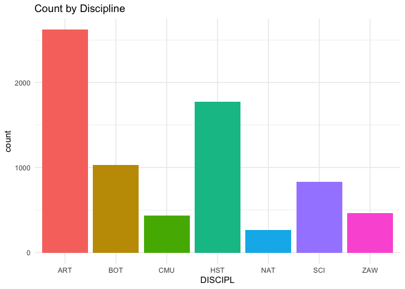<!-- -->

<br>

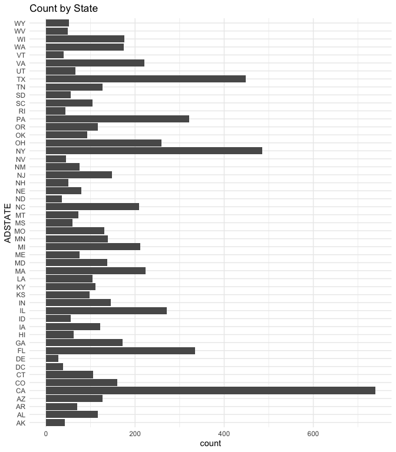<!-- -->

<br>

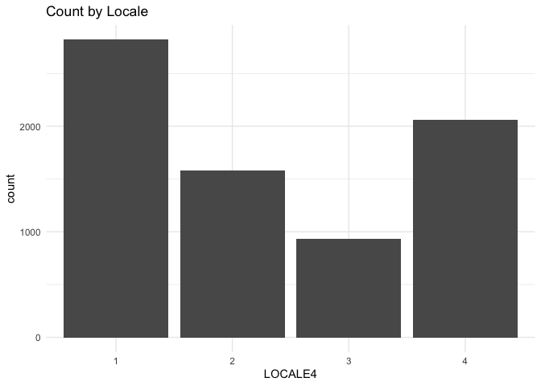<!-- -->

<br>

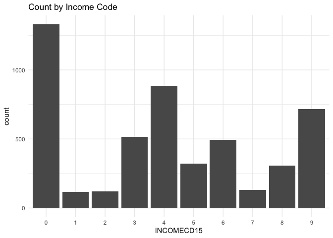<!-- -->

<br>

### Part 2

Institutions that received grants.


```r
data <- data_joined %>%
  filter(!is.na(COMMONNAME)) %>%    # remove awarded institutions not in the museum list
  replace_na(list(year = 9999,      # replace NAs with values for analysis
                  funds = 0
                  )
             ) %>%
  filter(year >= 2013)              # filter for last 10 years (2013-2022)

# filter for institutions that received grants
data_awarded <- data %>%
  filter(funds != 0)
```

<br>

How many grants did the IMLS award over the last 10 years?


```r
# count
data_awarded %>%
  summarize(total_count = n())
```

```
## # A tibble: 1 × 1
##   total_count
##         <int>
## 1         628
```

```r
# plot of count each year
data_awarded %>%
  group_by(year) %>%
  count() %>%
  ggplot(aes(x = year,
             y = n
             )
         ) +
  geom_line()
```

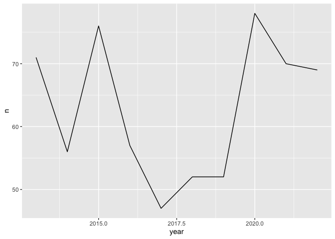<!-- -->

<br>

What's the total value of those grants?


```r
# total
data_awarded %>%
  summarize(total = sum(funds))
```

```
## # A tibble: 1 × 1
##       total
##       <dbl>
## 1 101674483
```

```r
# plot of total by year
data_awarded %>%
  group_by(year) %>%
  summarize(funds = sum(funds)) %>%
  ggplot(aes(x = year,
             y = funds
             )
         ) +
  geom_line()
```

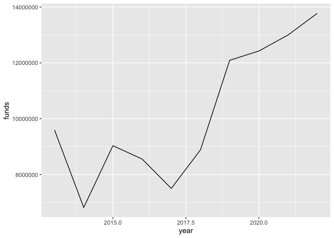<!-- -->

<br>

What was the average grant amount?


```r
data_awarded %>%
  summarize(average = mean(funds))
```

```
## # A tibble: 1 × 1
##   average
##     <dbl>
## 1 161902.
```

<br>

How many different institutions won grants?


```r
data_awarded %>%
  count(institution, sort = TRUE) %>%
  summarize(institutions = n())
```

```
## # A tibble: 1 × 1
##   institutions
##          <int>
## 1          254
```

<br>

Did any institutions win multiple grants?


```r
# filter for institutions that received more than 1 grant
data_awarded %>%
  count(institution, sort = TRUE) %>%
  filter(n > 1)
```

```
## # A tibble: 142 × 2
##    institution                            n
##    <chr>                              <int>
##  1 american museum of natural history    12
##  2 denver art museum                     11
##  3 long island children's museum          9
##  4 boston children's museum               8
##  5 children's museum of indianapolis      8
##  6 morton arboretum                       8
##  7 yerba buena center for the arts        8
##  8 baltimore museum of art                7
##  9 children's museum of pittsburgh        7
## 10 lincoln park zoo                       7
## # ℹ 132 more rows
```

```r
# plot of number of grants
data_awarded %>%
  count(institution) %>%
  ggplot(aes(x = n)) +
  geom_bar()
```

<!-- -->

<br>

By discipline (total value of grants).


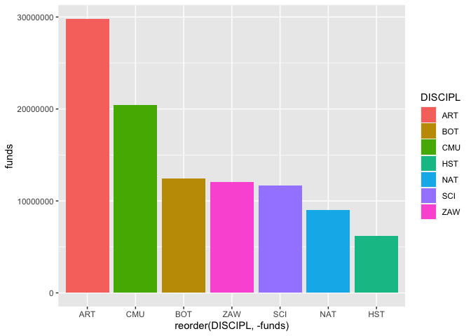<!-- -->

<br>


<br>

By discipline (average grant value).


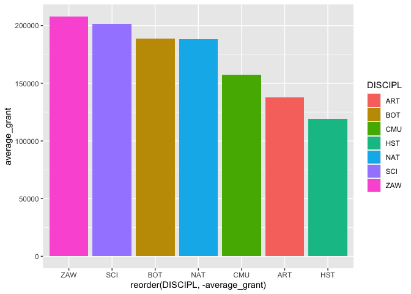<!-- -->

<br>

By state (total value of grants).


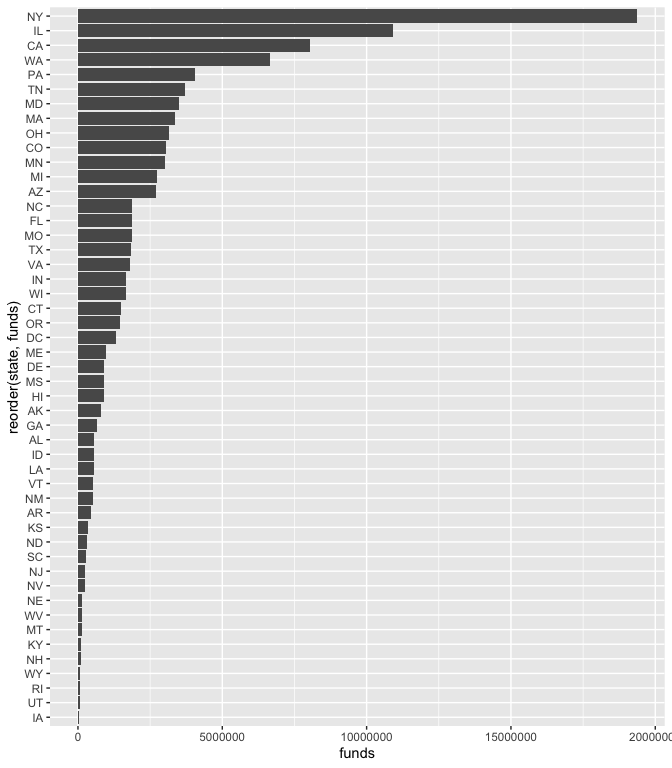<!-- -->

<br>


<br>

By state (average grant value).


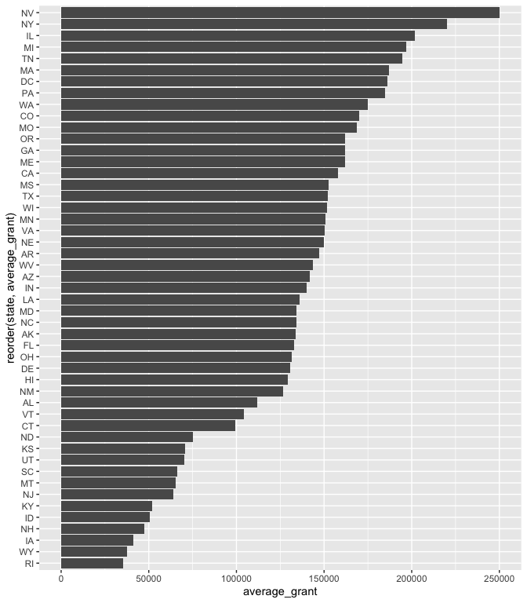<!-- -->

<br>

By locale category, i.e. city, suburb, town, rural (total value of grants).


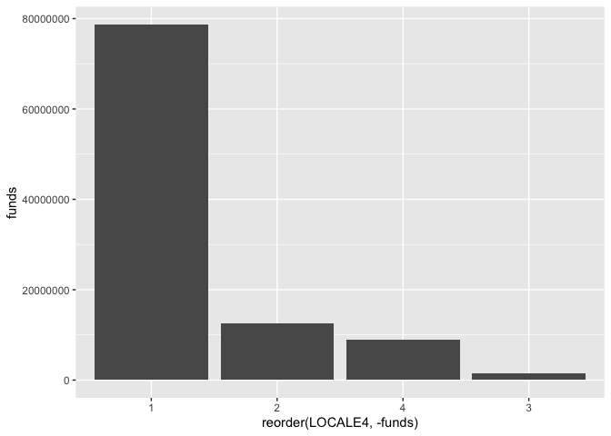<!-- -->

<br>


<br>

By locale category (average grant value).


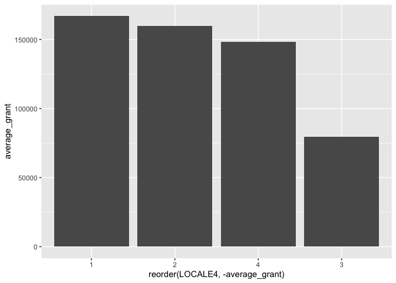<!-- -->

<br>

By IRS income category (total value of grants). 92 (15%) awarded institutions are missing values for this variable. Those institutions are not included in the graph below.


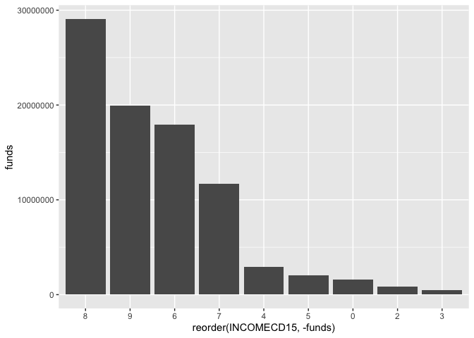<!-- -->

<br>


<br>

By IRS income category (average grant value).


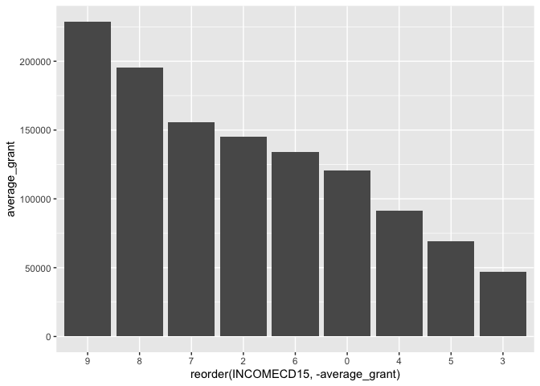<!-- -->

<br>

### Part 4

Institutions that did not receive any grants.


```r
data_not_awarded <- data %>%
  filter(funds == 0)
```

<br>

How many institutions did not win an award over the last 10 years?


```r
data_not_awarded %>%
  nrow()
```

```
## [1] 6726
```

<br>

By discipline.


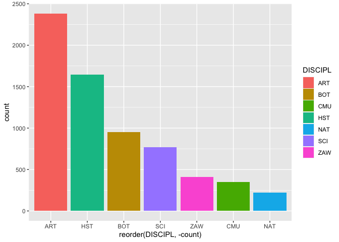<!-- -->

<br>

By state.


<!-- -->

<br>

By locale category. 30 (0.4%) institutions are missing values for this variable. Those institutions are not included in the graph below.


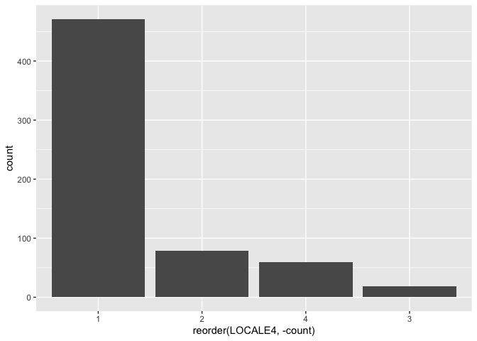<!-- -->

<br>

By income. 2,330 (35%) institutions are missing values for this variable. Those institutions are not included in the graph below.


<!-- -->

<br>

### Part 5

Correlation to other socio-economic criteria.

-   Use zip codes to compare to low-income areas (census bureau?)

<br>

### Part 6

Call to action.

-   Access to museums improve outcomes

-   IMLS should direct more funding to areas that need it

-   People can donate to the least likely museums

<br>


